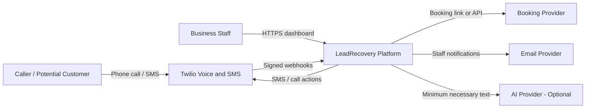
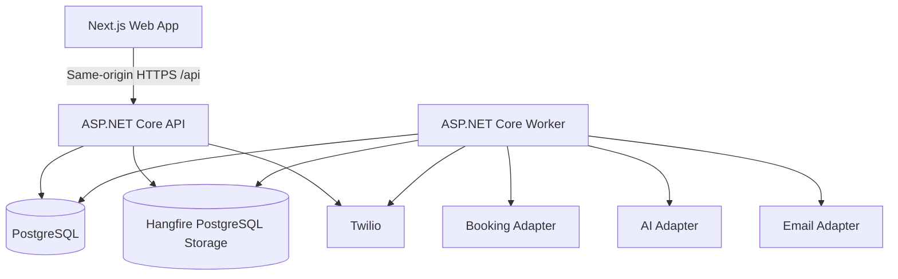
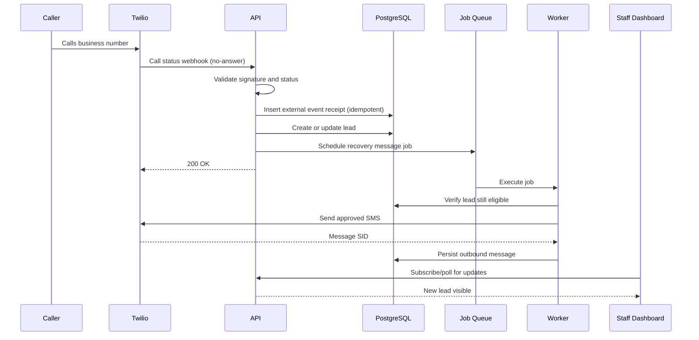
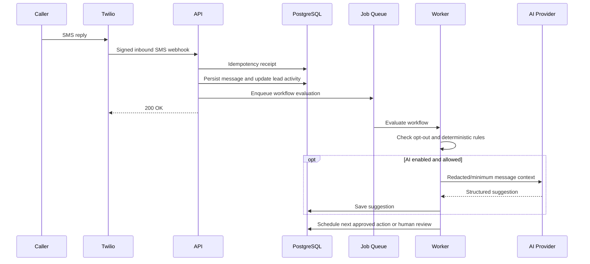
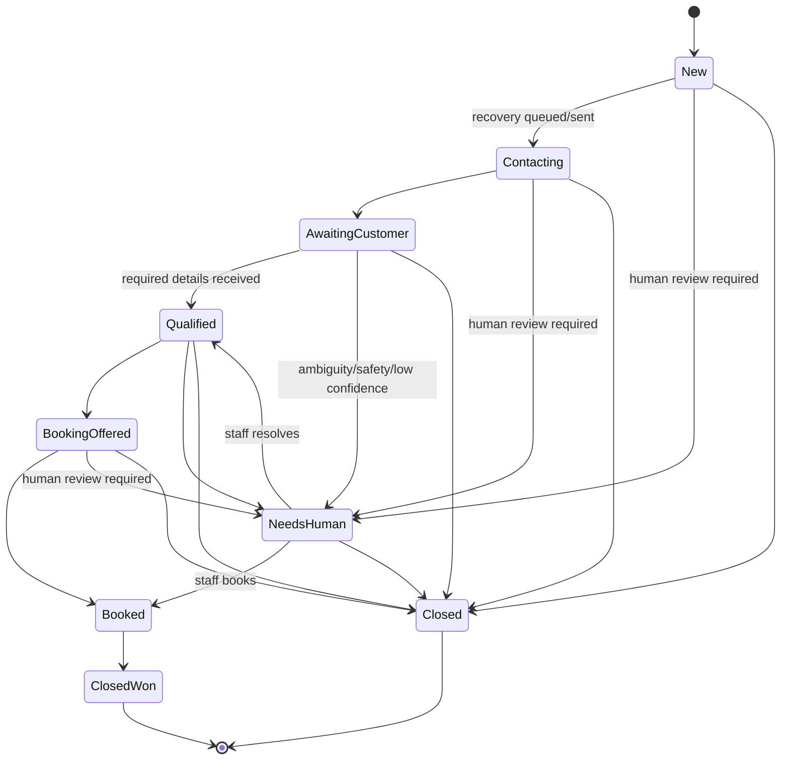
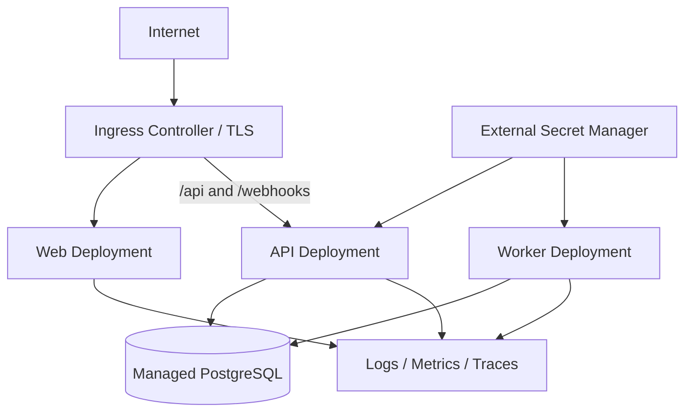

# LeadRecovery - Complete Codex Implementation Specification
> Generated from the modular repository documentation by eng/Sync-MasterSpecification.ps1. Edit the source files, not this file.

---

<!-- SOURCE: README.md -->

# Lead Recovery Platform - Codex Documentation Package

## What this package is

This repository documentation defines a complete, implementation-ready plan for a **C# / ASP.NET Core lead-recovery platform** for Ontario home-service businesses. The first commercial use case is missed-call recovery for plumbing companies, followed by lead qualification, booking, quote follow-up, and staff handoff.

The recommended business strategy is service-first:

1. Build a reliable demonstration.
2. Sell a small fixed-scope pilot.
3. Install the same workflow for several paying clients.
4. Standardize recurring components.
5. Consider a niche micro-SaaS only after repeated paid validation.

The system intentionally uses **C# as the production backend** and includes **Docker and Kubernetes** as real deployment capabilities. Kubernetes is not allowed to block the first working MVP or first pilot.

## Current implementation status

Milestones 0 through 10 are complete. LR-0101 through LR-1003 are implemented.
The modular monolith now includes the PostgreSQL domain and tenant foundation,
secure Identity cookie sessions, signed Twilio call/SMS ingestion,
PostgreSQL-backed Hangfire recovery and manual-message execution, immediate
opt-out suppression, deterministic tenant-configured qualification and
follow-up workflows, approved booking links, business-hours scheduling, and
the operational Next.js dashboard. Staff can filter
the tenant inbox, inspect the ordered call/SMS/system/note timeline, assign and
transition Leads, send idempotent manual SMS, and pause or resume eligible
automation. All browser writes use CSRF and role authorization; Lead writes use
opaque optimistic-concurrency tokens and return the latest safe representation
on conflicts. Unit, PostgreSQL integration, performance, and Playwright tests
cover these flows without enabling live SMS.

LR-0801 adds JSON structured logging, server-derived correlation IDs, durable
W3C trace propagation from provider webhooks through scheduled jobs to Twilio
or OpenAI calls, and opt-in OTLP trace/metric export. Paid-provider metrics are
tenant-scoped using opaque server-derived IDs, while tests prevent message,
contact, credential, or other PII values from entering logs and metric labels.

LR-0802 adds fail-closed global and tenant automation controls. The Worker
cancels queued automated recovery, qualification, booking, follow-up, and AI
analysis work while preserving manual staff SMS, signed inbound SMS capture,
delivery callbacks, authentication, and the Lead dashboard. Owner and Manager
members can pause or resume their tenant from the workspace header; every
change uses CSRF, optimistic concurrency, a fixed reason code, and redacted
audit data.

LR-0803 adds an opt-in per-tenant operational-data policy and a PostgreSQL/
Hangfire retention job. It defaults to disabled dry-run mode, processes only
terminal Leads older than the tenant cutoff, records PII-free count manifests,
and requires an explicit backup acknowledgement before destructive mode.
LR-0804 adds independently partitioned login, manual-message, and provider-
webhook limits plus restrictive security headers on every API response.

LR-0901 adds multi-stage, digest-pinned, non-root production images for the
API, worker, and standalone Next.js dashboard, with OCI metadata and health
checks. Compose now runs PostgreSQL, a one-shot migration container, API,
worker, and web with dependency health gates and safe provider defaults.
LR-0902 adds migration-first Kustomize overlays for local, staging, and
production; probes, resources, secret references, ingress, network policies,
dedicated ServiceAccounts, persisted data-protection keys, disruption budgets,
and production API autoscaling. A real local cluster validated migration,
readiness, restart recovery, and rolling replacement.
LR-0903 adds SHA-pinned GitHub Actions PR gates for application, OpenAPI,
dependency, secret, deployment, browser, and container-image quality. Semantic
release tags publish GHCR images with SBOM/provenance attestations, reject High
or Critical findings, promote the same immutable digests through staging and a
separately dispatched protected production workflow, and retain a manual
compatibility-gated rollback path that never reverses database migrations
automatically.

The implemented dashboard now uses one responsive, high-contrast workspace
system across login, inbox, and Lead detail. Human-readable workflow labels,
attention-first queue rows, clearer loading/empty/error feedback, consistent
44-pixel controls, skip navigation, reduced-motion support, and mobile overflow
coverage improve daily use without adding a component-library dependency or
changing an API/workflow contract.

LR-1001 adds a schema-versioned, validated operator onboarding plan for
business, phone, hours, deterministic workflow, booking, approved templates,
and initial users. Passwords stay in environment variables, activation is a
serializable all-or-nothing transaction, and automation defaults off until the
post-activation checklist is approved. LR-1002 adds the opt-in fictional Alpha
Plumbing demo, a real one-minute browser tour, screenshots, case-study README,
and one-command duplicate/STOP proof. LR-1003 adds a bounded tenant-scoped pilot
dashboard plus JSON/CSV export with published baselines and explicit
operational—not revenue or causal—interpretation.

Milestone 7 adds a provider-neutral analysis contract, independent strict
schema validation, and an optional OpenAI Responses API adapter. Eligible
inbound replies now create coalesced, durable `AnalyzeLead` work only when AI
is explicitly enabled and the active workflow exposes an approved category
question. The Worker sends a bounded, redacted transcript, persists immutable
validated suggestions, and routes provider or validation failures to
`NeedsHuman` without interrupting the committed deterministic workflow.
Tenant-scoped accept, correct, and reject controls retain low-confidence
labels, optimistic review concurrency, and redacted audit history. Suggested
replies remain visibly unsent drafts; analysis and review never send a customer
message or automatically apply a suggestion.

The currently implemented browser and health contract is:

- `GET /health/live` reports whether the process is running;
- `GET /health/ready` reports whether registered readiness checks pass;
- `GET /api/v1/auth/csrf`, `POST /api/v1/auth/login`,
  `GET /api/v1/auth/me`, and `POST /api/v1/auth/logout` manage the browser
  session;
- `GET /api/v1/automation` exposes effective global/tenant state to tenant
  members, while `POST /api/v1/automation/tenant` lets Owner and Manager
  members pause or resume tenant automation with CSRF and concurrency checks;
- `GET /api/v1/leads`, `GET /api/v1/leads/assignees`, and
  `GET /api/v1/leads/{leadId}` provide the filtered inbox, eligible tenant
  assignees, ordered timeline, structured qualification answers, approved
  booking destination, pending actions, and allowed transitions;
- Lead detail also projects immutable AI suggestions and separate staff review
  values; accept/edit/reject routes use CSRF, operator roles, tenant scope, and
  an opaque analysis version without sending customer content;
- lead assignment, transition, note, manual-message, pause, and resume endpoints
  are CSRF-protected and restricted to Owner, Manager, and Staff memberships;
- booking-link queue and pending-action cancellation endpoints use the same
  tenant, role, CSRF, and concurrency controls;
- `POST /api/v1/webhooks/twilio/call-status` accepts only correctly signed
  form callbacks and records recovery intent;
- `POST /api/v1/webhooks/twilio/sms/inbound` and
  `POST /api/v1/webhooks/twilio/sms/status` validate signed callbacks, persist
  inbound activity once, apply opt-out suppression, and update delivery state;
- the worker executes due recovery, qualification, booking, follow-up,
  manual-message, optional lead-analysis, and enabled tenant-retention work
  through PostgreSQL-backed Hangfire,
  using the deterministic fake SMS provider unless real delivery is explicitly
  enabled.
- `GET /api/v1/reports/pilot` and `GET /api/v1/reports/pilot.csv` provide the
  authenticated tenant member with the same bounded operational pilot fields
  as JSON or CSV; the Next.js view is `/reports/pilot`.

## Pinned foundation versions

| Component | Version | Current use |
|---|---:|---|
| .NET SDK | 10.0.301 | Builds all backend projects |
| ASP.NET Core packages | 10.0.9 | Centrally locked application package baseline |
| C# | 14.0 | Backend language version |
| PostgreSQL | 18.4 | Local database container |
| Entity Framework Core and tools | 10.0.9 | Persistence and migrations |
| Microsoft.Extensions.Http | 10.0.9 | Typed HTTP client for optional analysis |
| Npgsql EF Core provider | 10.0.2 | PostgreSQL EF Core provider |
| libphonenumber-csharp | 9.0.34 | E.164 phone parsing and validation adapter |
| Twilio .NET SDK | 7.14.9 | Webhook signature validation and gated outbound adapter |
| Hangfire ASP.NET Core | 1.8.23 | Worker server and retry policy |
| Hangfire PostgreSQL | 1.21.1 | Durable background-job storage |
| Testcontainers PostgreSQL | 4.13.0 | Isolated PostgreSQL integration tests |
| xUnit v3 Microsoft Testing Platform package | 3.2.2 | Backend test runner |
| Node.js | 24.18.0 | Frontend, container, and Playwright runtime |
| pnpm | 11.10.0 | Locked frontend workspace package manager |
| Next.js | 16.2.11 | Same-origin browser shell |
| React | 19.2.7 | Browser UI runtime |
| TypeScript | 6.0.3 | Strict frontend type checking |
| Playwright | 1.61.1 | Browser acceptance tests |
| FFmpeg | 8.1.2 | Optional local WebM-to-H.264 demo-media conversion and inspection |
| Redocly CLI | 2.40.0 | OpenAPI pull-request validation |
| actionlint | 1.7.12 | Checksum-verified workflow syntax validation |
| Trivy / Trivy Action | 0.70.0 / 0.36.0 | Secret and High/Critical release-image gates |
| CI kubectl | 1.36.2 | Kustomize render and deployment automation |
| Default OpenAI analysis model | gpt-5.6-sol | Operator-overridable structured analysis default |

## Local development

Prerequisites are Git, Docker Desktop with Compose, the .NET SDK selected by
`global.json`, Node.js from `.node-version`, and pnpm from `package.json`.

Create a local environment file and replace the example database password:

```powershell
Copy-Item templates/.env.example .env
$env:ConnectionStrings__Database = 'Host=localhost;Port=5432;Database=leadrecovery;Username=leadrecovery;Password=<same-local-password>'
```

If Docker Desktop is running but the default Windows Docker context still
points at the inactive `docker_engine` pipe, select its Linux context for the
current shell with `$env:DOCKER_CONTEXT = 'desktop-linux'`.
Testcontainers also accepts that Docker context. Docker 24 supports API 1.43;
the integration fixture uses 1.43 when no `DOCKER_API_VERSION` override exists,
which remains backward-compatible with newer daemons.

Start PostgreSQL and verify the backend foundation:

```powershell
docker compose up -d postgres
dotnet tool restore
dotnet restore LeadRecovery.sln --locked-mode
dotnet ef database update --project src/LeadRecovery.Infrastructure --startup-project src/LeadRecovery.Api
dotnet format LeadRecovery.sln --verify-no-changes --no-restore
dotnet build LeadRecovery.sln --configuration Release --no-restore
dotnet test LeadRecovery.sln --configuration Release --no-build
dotnet run --project src/LeadRecovery.Api
```

To build and run the complete production-shaped local container stack instead,
follow `deploy/docker/README.md`. Kubernetes prerequisites and the mandatory
migration-first order are documented in `deploy/kubernetes/README.md`.

For the authenticated demo, fill the `DemoSeed__*` values documented in
`templates/.env.example`, enable the demo seed only in a disposable local
database, and start the frontend in a second shell:

```powershell
corepack enable
pnpm install --frozen-lockfile
$env:API_BASE_URL = 'http://localhost:8080'
pnpm frontend:dev
```

The complete pilot handoff starts at [`docs/pilot/README.md`](docs/pilot/README.md).
Use [`docs/pilot/ONBOARDING.md`](docs/pilot/ONBOARDING.md) for no-code tenant
activation, [`docs/pilot/DEMO.md`](docs/pilot/DEMO.md) for the reproducible
two-minute flow and paced MP4, and [`docs/pilot/MEASUREMENT.md`](docs/pilot/MEASUREMENT.md)
for report definitions and success criteria.

The browser uses the Next.js `/api` rewrite so the session and antiforgery
cookies remain same-origin. Do not expose the API under a separate browser
origin or let the client supply `TenantId`.

To exercise the Twilio webhook endpoints, set `TWILIO_AUTH_TOKEN` and the
exact public application base in `TWILIO_WEBHOOK_BASE_URL`. The latter is used
to reconstruct the signed public URL behind a trusted proxy. Leave both unset
when the webhooks are not enabled; the endpoints then fail closed with `503`.

The worker is safe by default: `SMS_PROVIDER=fake` produces a deterministic
provider SID without network access. A live Twilio request is possible only
when `SMS_PROVIDER=twilio` and `ALLOW_REAL_SMS=true` are both set and the
Twilio account SID/auth token are present. Keep the fake defaults for automated
tests and local workflow development.

AI analysis stays disabled by default. Set `AI_ENABLED=true` consistently for
both the API and Worker, provide `OPENAI_API_KEY`, an explicit `AI_MODEL`
(default `gpt-5.6-sol`), and the bounded timeout/retry settings from
`templates/.env.example`. `AI_CATEGORY_QUESTION_KEY` selects the active
workflow Choice question whose values form the tenant-approved category
snapshot; it defaults to `service` and fails closed when that question is
absent or invalid. Eligible inbound replies then create durable analysis work.
Provider failure routes the Lead to staff without undoing deterministic
qualification, and no analysis result sends customer-facing content.

Automation also fails closed by default. Set `AUTOMATION_GLOBAL_ENABLED=true`
for both the API and Worker only when automated sends and analysis should run.
Setting it to `false` in both processes and restarting them activates the
platform kill switch and cancels queued automated actions; manual staff SMS,
inbound capture, delivery callbacks, and dashboard access remain available.
Tenant Owner/Manager controls are dynamic and do not require a restart.

Retention is independently disabled by default. First configure an opt-in
tenant policy, then set `RETENTION_ENABLED=true`, keep
`RETENTION_MODE=dry-run`, and review `Retention.DryRun` audit manifests. Before
changing the Worker to `RETENTION_MODE=delete`, verify a current PostgreSQL
backup or PITR recovery point, rehearse restore as required by the environment,
and set `RETENTION_BACKUP_CONFIRMED=true`. That flag records operator intent; it
does not create or validate a backup. Deletion has no application-level undo.
`RETENTION_BATCH_SIZE` defaults to 100 and `RETENTION_CRON` defaults to 02:00
UTC daily. See Runbook F in `docs/10_OBSERVABILITY_OPERATIONS.md`.

The fictional demo seed includes one pending low-confidence analysis so the
LR-0702 review workflow can be demonstrated without enabling AI or providing an
API key.

With the API running, check `http://localhost:8080/health/live` and
`http://localhost:8080/health/ready`. Start the worker separately after setting
the same database connection and webhook base URL:

```powershell
$env:SMS_PROVIDER = 'fake'
$env:ALLOW_REAL_SMS = 'false'
dotnet run --project src/LeadRecovery.Worker
```

Stop local services without deleting data:

```powershell
docker compose down
```

To intentionally reset the local database, use `docker compose down --volumes`.
That command permanently removes the Compose-managed local PostgreSQL volume.
For a disposable development database, the EF migration can instead be rolled
back with:

```powershell
dotnet ef database update 0 --project src/LeadRecovery.Infrastructure --startup-project src/LeadRecovery.Api
```

Do not use either reset procedure on a database containing data that must be
retained.

## Start here

For Codex or another coding agent:

1. Place this package at the root of the implementation repository.
2. Ensure `AGENTS.md` remains at the repository root.
3. Give the agent `CODEX_START_HERE.md` as its first task context.
4. Ask it to execute only one milestone or issue at a time.
5. Require tests, documentation updates, and a summary after every task.

For a single-file upload, use:

- `CODEX_MASTER_IMPLEMENTATION_SPEC.md`

For repository-based work, use the modular files under `docs/`.

## Core product

**Working name:** LeadRecovery

**Initial customer:** Ontario plumbing companies with approximately 3-20 employees.

**Initial outcome:** When a business misses a call, the caller receives a prompt SMS, can provide job details, receives a booking or callback path, and appears as a structured lead in the staff dashboard.

**Commercial promise:** Fewer missed opportunities, faster response time, less office administration.

## Documentation map

| File | Purpose |
|---|---|
| `AGENTS.md` | Permanent instructions for Codex and coding agents |
| `CODEX_START_HERE.md` | First prompt and execution protocol |
| `CODEX_MASTER_IMPLEMENTATION_SPEC.md` | Complete combined specification |
| `CODEX_PROMPT_SEQUENCE.md` | Ready-to-use prompts for each build phase |
| `docs/01_PRODUCT_REQUIREMENTS.md` | Scope, users, workflows, requirements |
| `docs/02_SYSTEM_ARCHITECTURE.md` | Architecture, components, patterns, decisions |
| `docs/03_DOMAIN_AND_DATABASE.md` | Entities, states, constraints, schema |
| `docs/04_API_AND_INTEGRATIONS.md` | API, Twilio, booking, AI contracts |
| `docs/05_FRONTEND_UX.md` | Dashboard screens, behavior, accessibility |
| `docs/06_AI_GUARDRAILS.md` | Safe AI use, structured outputs, fallbacks |
| `docs/07_SECURITY_PRIVACY.md` | Security controls, privacy, tenant isolation |
| `docs/08_TESTING_QUALITY.md` | Test pyramid, scenarios, release gates |
| `docs/09_DEVOPS_KUBERNETES.md` | Docker, Kubernetes, CI/CD, environments |
| `docs/10_OBSERVABILITY_OPERATIONS.md` | Logs, metrics, alerts, support runbooks |
| `docs/11_TIMELINE_AND_MILESTONES.md` | Detailed implementation timeline |
| `docs/12_BACKLOG_AND_ACCEPTANCE.md` | Epics, stories, acceptance criteria |
| `docs/13_PILOT_AND_VALIDATION.md` | Demo, pilot onboarding, market validation |
| `docs/14_SAAS_EVOLUTION.md` | Productization and later SaaS roadmap |
| `docs/15_IMPLEMENTATION_CONFORMANCE.md` | Audited current surface, evidence, and external readiness gates |
| `docs/decisions/` | Accepted architecture decision records |
| `api/openapi.yaml` | Exact implemented versioned API contract |
| `database/schema.sql` | Reference relational schema |
| `CHANGELOG.md` | User-visible and repository-level changes |
| `templates/.env.example` | Required environment variables |
| `templates/definition-of-done.md` | Completion checklist |
| `templates/pull-request-template.md` | Pull request quality template |

## Baseline delivery timeline

The baseline assumes **20-25 focused hours per week for 10 weeks**. A full-time developer can compress it, but the order of work should remain the same.

- Weeks 1-2: foundation, domain, persistence, authentication
- Weeks 3-4: Twilio calls/SMS, leads, background jobs
- Weeks 5-6: dashboard, booking, follow-ups, AI summaries
- Weeks 7-8: security, testing, observability, deployment
- Week 9: Kubernetes and CI/CD demonstration
- Week 10: pilot readiness, documentation, sales demo

## Non-negotiable product principles

- Business outcomes before technical novelty.
- Modular monolith before microservices.
- Deterministic workflows before autonomous agents.
- Human override for every automation.
- No secrets in source control.
- Every external webhook is authenticated and idempotent.
- Every tenant query is tenant-scoped.
- No production release without automated tests and a rollback path.
- Kubernetes is a deployment option, not the product.

---

<!-- SOURCE: AGENTS.md -->

# AGENTS.md - Repository Instructions for Codex

## Mission

Build and maintain the LeadRecovery platform according to the specifications in this repository. The product helps home-service businesses recover missed callers, qualify leads, schedule follow-up, and give staff a reliable dashboard.

## Required reading order

Before changing code, read:

1. `README.md`
2. `docs/01_PRODUCT_REQUIREMENTS.md`
3. `docs/02_SYSTEM_ARCHITECTURE.md`
4. The document relevant to the assigned task
5. `templates/definition-of-done.md`

When requirements conflict, stop and report the conflict. Do not silently choose a new product direction.

## Architecture rules

- Start as a **modular monolith**, not microservices.
- Backend: C# and ASP.NET Core on the latest supported .NET LTS chosen at repository initialization.
- Persistence: PostgreSQL through Entity Framework Core migrations.
- Frontend: React/Next.js with TypeScript.
- Background work: Hangfire with PostgreSQL-backed storage unless an approved architecture decision changes it.
- Integrations: Twilio, booking provider, email provider, and optional OpenAI analysis.
- Local orchestration: Docker Compose.
- Portfolio/cloud deployment: Kubernetes manifests or Helm after the Docker deployment works.
- Shared database multi-tenancy with mandatory `TenantId` scoping.

## Coding rules

- Use nullable reference types.
- Treat compiler warnings as errors in CI.
- Use asynchronous I/O and pass `CancellationToken` through application boundaries.
- Keep controllers thin. Business logic belongs in application services or domain policies.
- Validate all external input.
- Use idempotency for webhook processing.
- Never log secrets, access tokens, full authentication cookies, or unnecessary message content.
- No hard-coded credentials, phone numbers, tenant IDs, URLs, or pricing.
- Prefer explicit types and readable code over clever abstractions.
- Do not introduce a dependency without explaining why it is needed.
- Do not add a microservice, message broker, service mesh, Redis, or event-sourcing framework unless a documented requirement justifies it.

## Testing rules

For every behavior change:

1. Add or update unit tests.
2. Add integration tests when persistence, authentication, webhooks, or external adapters are involved.
3. Run formatting, build, and all relevant tests.
4. Report the exact commands and outcomes.

Critical flows require end-to-end coverage:

- missed call -> lead creation -> automatic SMS
- inbound SMS -> message persisted -> lead updated
- staff closes or books lead -> scheduled follow-ups stop
- opt-out -> no further automated messages
- duplicate webhook -> no duplicate lead or message
- cross-tenant access -> denied

## Security rules

- Validate Twilio signatures.
- Require HTTPS outside local development.
- Store secrets in environment variables or a secret manager.
- Use secure, HttpOnly cookies for browser sessions when practical.
- Protect state-changing browser requests against CSRF.
- Enforce tenant authorization in both application logic and data access.
- Redact sensitive values in logs.
- Apply least privilege to Kubernetes service accounts and cloud identities.

## AI rules

AI is an optional assistant, not the workflow controller.

- Use structured JSON output with a versioned schema.
- AI may categorize, summarize, and draft.
- AI may not promise prices, diagnose trade problems, guarantee arrival times, or close a lead without business rules or staff action.
- Low-confidence or safety-sensitive results must be routed to human review.
- The deterministic workflow must continue if the AI provider is unavailable.

## Task execution protocol

For each assigned task:

1. Restate the task and identify affected components.
2. List assumptions and open questions.
3. Propose a small implementation plan.
4. Make the smallest coherent change.
5. Add tests.
6. Run validation commands.
7. Update relevant documentation and changelog.
8. Return a concise summary, files changed, tests run, risks, and next recommended issue.

Do not implement future milestones unless explicitly asked.

## Definition of done

A task is complete only when it meets `templates/definition-of-done.md` and its acceptance criteria in `docs/12_BACKLOG_AND_ACCEPTANCE.md`.

---

<!-- SOURCE: CODEX_START_HERE.md -->

# Codex Start Here

You are implementing the LeadRecovery platform. Treat the repository documentation as the source of truth.

## First assignment

Do not write product features immediately. Begin with a repository assessment and implementation plan.

### Step 1 - Read

Read:

- `AGENTS.md`
- `README.md`
- `docs/01_PRODUCT_REQUIREMENTS.md`
- `docs/02_SYSTEM_ARCHITECTURE.md`
- `docs/11_TIMELINE_AND_MILESTONES.md`
- `docs/12_BACKLOG_AND_ACCEPTANCE.md`

### Step 2 - Report

Return:

1. Your understanding of the product in no more than 12 bullets.
2. The proposed repository structure.
3. The technology versions you propose to pin and why.
4. Any contradictions or missing decisions.
5. A phase-by-phase implementation plan.
6. The exact scope of Milestone 0 and Milestone 1.
7. Commands you expect to use for build, tests, local infrastructure, and formatting.

### Step 3 - Wait

Do not generate the entire application in one response. Wait for approval to begin Milestone 0.

## Standard task prompt

For later work, use this form:

> Implement issue `[ID]` from `docs/12_BACKLOG_AND_ACCEPTANCE.md`. Read all linked requirements first. Provide a short plan, implement only that issue, add tests, run all required validation, update documentation if needed, and report files changed plus remaining risks. Do not begin the next issue.

## Required quality

Every implementation must be reviewable by a human developer. Fast generation is not more important than correctness, security, testability, or clear documentation.

---

<!-- SOURCE: docs/01_PRODUCT_REQUIREMENTS.md -->

# 01 - Product Requirements

## 1. Product summary

LeadRecovery is a business workflow platform for home-service companies. Its first purpose is to recover callers who would otherwise be lost when staff cannot answer the phone.

The initial release is not a general CRM and not an autonomous AI receptionist. It is a narrow, reliable workflow:

1. A potential customer calls the business.
2. The call is not answered or is marked busy/failed.
3. The system creates or updates a lead.
4. The system sends a pre-approved SMS.
5. The caller replies with job details.
6. The system records the conversation and optionally categorizes it.
7. The caller receives a booking link or callback confirmation.
8. Staff see the lead, take over, assign it, book it, or close it.
9. Follow-ups stop when the lead is booked, closed, or opted out.

## 2. Product goals

### MVP goals

- Demonstrate missed-call recovery end to end.
- Reduce the time from missed call to first response to less than one minute in normal operation.
- Give office staff one view of leads and message history.
- Support manual takeover at any point.
- Prevent duplicate processing from repeated webhooks.
- Operate without AI if the AI provider is unavailable.
- Be deployable locally with Docker Compose.
- Be deployable to Kubernetes for portfolio and scaling demonstration.
- Be sufficiently configurable to pilot with a real Ontario plumbing company.

### Business goals

- Create a two-minute sales demonstration.
- Support a fixed-scope paid pilot.
- Make the core workflow reusable across several businesses.
- Gather evidence for later productization.

## 3. Non-goals for MVP

The MVP must not become:

- a full CRM replacement;
- a field-service dispatch platform;
- an invoicing or payment processor;
- a fully autonomous voice agent;
- a native mobile application;
- a multi-region enterprise platform;
- a custom machine-learning training project;
- a marketplace for contractors;
- an advanced analytics product;
- a generic chatbot builder.

## 4. Primary users

### 4.1 Business owner

Needs to know whether missed leads are being recovered and whether the service creates booked work.

Key actions:

- view lead pipeline;
- review response-time metrics;
- configure business hours, messages, and booking URL;
- review audit history;
- manage staff access.

### 4.2 Office manager or dispatcher

The main daily user.

Key actions:

- view new and urgent leads;
- read call/SMS history;
- assign leads;
- send a manual response;
- stop automation;
- mark booked, won, lost, or spam;
- correct AI-generated categorization or summary.

### 4.3 Technician or limited staff user

May receive assigned-lead notifications and view only relevant information.

### 4.4 Platform administrator

Manages tenant onboarding and support. This role is internal and must not have unrestricted access without explicit support authorization and audit logging.

### 4.5 Caller/customer

Does not create an account. Interacts through phone, SMS, and booking link. Must be able to stop messages.

## 5. Initial customer profile

The first target is an Ontario plumbing company with:

- 3-20 employees;
- an existing business phone number or willingness to use/forward through Twilio;
- regular inbound calls;
- no internal software-development team;
- a website and basic booking or callback process;
- a clear cost when leads receive slow responses.

## 6. Core use cases

### UC-01 Recover a missed call

**Trigger:** Twilio reports a call as no-answer, busy, failed, or another configured recoverable status.

**Success:** One lead is created or updated and one initial recovery message is queued/sent within the configured delay.

**Rules:**

- Duplicate status callbacks must not create duplicate leads or SMS messages.
- A caller who has opted out must not receive an automated SMS.
- A configurable cooldown prevents repeated recovery texts for repeated calls in a short period.
- Staff can disable automation globally or per lead.

### UC-02 Receive and process an SMS reply

**Trigger:** Twilio sends an inbound SMS webhook.

**Success:** The message is persisted, associated with the correct tenant/lead, visible in the dashboard, and the workflow advances.

**Rules:**

- STOP and equivalent opt-out keywords immediately suppress future automated messages.
- Unknown numbers may create a lead only if the tenant configuration permits it.
- Media messages are out of MVP scope unless explicitly enabled later.

### UC-03 Qualify a lead

The system asks a small, pre-approved sequence of questions, for example:

- What service do you need?
- What city or postal area is the property in?
- Is this urgent or actively causing damage?
- Would you like a booking link or a callback?

Question order is deterministic. AI may summarize answers but may not control all branching without rules.

Milestone 6 stores the ordered questions in one active versioned tenant
workflow. Required-text and approved-choice answers are evaluated without AI
and persisted as structured qualification answers. Unknown or multi-match
responses move the Lead to `NeedsHuman`, set `CriticalReview`, cancel pending
automation, and create immediate or business-hours-aligned review audit data
according to tenant policy.

### UC-04 Book or request callback

The system sends a tenant-configured booking URL or records a callback request. Booking confirmation may be manual in MVP unless a calendar integration is configured.

The implemented MVP accepts only an absolute HTTPS booking URL without
embedded credentials. Owner, Manager, or Staff can queue that approved link
for a qualified Lead and manually mark the Lead booked; no calendar dependency
is required.

### UC-05 Staff takeover

A staff user may pause automation, send a manual message, assign the lead, and set the next action.

### UC-06 Follow up

If the customer has not replied or booked, scheduled messages may be sent according to a tenant-approved cadence.

Default pilot cadence:

- initial text: within 30-60 seconds after confirmed missed call;
- follow-up 1: after 2 hours during permitted hours;
- follow-up 2: next business morning;
- then stop unless tenant policy explicitly allows another step.

The implemented tenant workflow allows zero through three uniquely ordered
follow-ups. Every action is moved into the next permitted tenant-timezone
window and re-checks tenant automation, Lead state, opt-out, customer activity,
workflow stage, and approved template at execution.

### UC-07 Close a lead

`Booked` and `ClosedWon` are explicit lead statuses, not close reasons. Booking
stops automated follow-ups, while a later staff-confirmed win may transition a
booked lead to `ClosedWon`.

Reasons for transitioning a lead to `Closed`:

- Lost - no response
- Lost - out of area
- Lost - unavailable service
- Duplicate
- Spam
- Opted out

Closure cancels pending automated follow-ups.

## 7. Functional requirements

### FR-001 Tenant configuration

Each tenant must have:

- business name;
- timezone;
- business hours;
- phone/SMS configuration;
- booking URL;
- approved message templates;
- follow-up cadence;
- allowed service categories;
- permitted service area;
- notification recipients;
- retention settings;
- automation enable/disable control.

Current pilot boundary: validated onboarding stores the business identity,
timezone, phone policy, workflow hours/questions/follow-ups, booking URL,
approved templates, initial users, automation default, and opt-in retention.
Service-area and external notification-recipient settings remain operational
pilot inputs until their settings/notification backlog work is approved.

### FR-002 Lead management

The system must support:

- lead list with filters;
- lead detail view;
- assignment;
- status transitions;
- urgency;
- category;
- conversation timeline;
- internal notes;
- automation state;
- audit history.

### FR-003 Messaging

- outbound templated SMS;
- inbound SMS processing;
- delivery status callbacks;
- retry policy for temporary failures;
- explicit failure state for permanent errors;
- manual staff message;
- opt-out handling;
- business-hours restrictions.

### FR-004 Authentication and authorization

- tenant users authenticate securely;
- roles: Owner, Manager, Staff, ReadOnly, PlatformAdmin;
- users can access only their tenant unless a support workflow explicitly grants temporary access;
- sensitive administration actions are audited.

### FR-005 Background jobs

- initial recovery job;
- follow-up jobs;
- notification jobs;
- stale-lead checks;
- cleanup/retention jobs;
- retries with bounded backoff;
- cancellation when workflow state changes.

### FR-006 AI assistance

Optional features:

- category suggestion;
- urgency suggestion;
- conversation summary;
- suggested staff response;
- extraction of city/postal area and requested service.

All AI output must be structured, versioned, confidence-scored, and editable by staff.

Milestone 7 implements the optional provider-neutral request/result contract,
version 1.0 strict local validator, OpenAI Responses API adapter, durable
workflow invocation, immutable suggestion persistence, and authorized staff
accept/edit/reject review. Analysis is explicitly enabled, uses the active
workflow's approved category snapshot and bounded redacted recent context, and
never controls deterministic qualification or sends a suggested reply.
Provider/validation failure is recorded once and may route the Lead to
`NeedsHuman`; the already committed deterministic workflow remains available.

### FR-007 Reporting

MVP metrics:

- missed calls detected;
- recovery SMS sent;
- customer reply rate;
- average first-response time;
- leads booked;
- leads closed;
- automation failures;
- opt-out rate.

Metrics must be clearly labeled as operational indicators, not guaranteed revenue attribution.

### FR-008 Audit trail

Audit events include:

- lead status changes;
- assignment changes;
- manual messages;
- automation pause/resume;
- template/configuration changes;
- user/role changes;
- support access;
- AI suggestion accepted or edited.

## 8. Non-functional requirements

### Reliability

- Webhook acknowledgement target: under 2 seconds, with work queued when needed.
- Duplicate external events must be safely ignored.
- Core workflow must continue when AI is down.
- Failed outbound messages must be visible and retryable when appropriate.

### Performance

- Dashboard lead list p95 response target: under 500 ms for pilot-scale data.
- Lead detail p95 response target: under 700 ms.
- Staff dashboard should update within 5 seconds after a new inbound message.

### Availability

Pilot target: 99.5% monthly availability excluding scheduled maintenance. This is a target, not an SLA until contracts define it.

### Security

- HTTPS in non-local environments;
- signature validation for Twilio webhooks;
- least-privilege authorization;
- encrypted transport and managed-database encryption at rest;
- secret-manager integration;
- dependency and container scanning;
- tenant isolation tests.

### Privacy

- collect only information needed for lead handling;
- provide configurable retention;
- support deletion/export requests at tenant level;
- do not use customer message content to train models;
- send only the minimum necessary text to an AI provider;
- maintain data-processing documentation for pilots.

Operational Lead-graph retention is implemented with audited dry-run/delete
controls. A complete legal tenant export/deletion request workflow remains a
SaaS-readiness item and must not be inferred from that narrower retention job.

### Accessibility

The dashboard should target WCAG 2.2 AA practices:

- keyboard navigation;
- visible focus;
- semantic labels;
- adequate contrast;
- status not conveyed by color alone;
- accessible validation and alerts.

### Cost control

Pilot infrastructure must be supportable at low volume. Every paid external call should be observable by tenant and type.

## 9. Success criteria for the portfolio demo

The demo is complete when it can show:

1. A test call is missed.
2. A lead is created once.
3. An SMS arrives automatically.
4. The caller replies.
5. The reply appears in the dashboard.
6. The lead receives category/urgency suggestions.
7. Staff marks the lead Booked.
8. Scheduled follow-ups are cancelled.
9. A duplicate webhook does not duplicate data.
10. STOP prevents further automated messages.

## 10. Success criteria for the first pilot

- A real tenant is configured without code changes.
- At least one staff user can operate the dashboard.
- Webhook failures and message failures generate an alert.
- A documented rollback or disable switch exists.
- The tenant approves all outbound message templates.
- The pilot has defined measurements and a support contact.

The application emits the failure logs, metrics, and durable states needed for
alerts. A real pilot must configure and test the hosted alert receiver and
on-call destination; local automated tests cannot claim that external routing.

---

<!-- SOURCE: docs/02_SYSTEM_ARCHITECTURE.md -->

# 02 - System Architecture

## 1. Architecture strategy

The first release is a **modular monolith** with separate deployable processes for the API, background worker, and web frontend. This balances simplicity, testability, and realistic cloud-native deployment.

Do not start with independent microservices. The product does not yet have the traffic, team size, or domain stability to justify distributed-system complexity.

## 2. System context



## 3. Logical component architecture



## 4. Deployable units

### 4.1 LeadRecovery.Api

Responsibilities:

- browser API;
- authentication and authorization;
- Twilio webhook endpoints;
- lead, message, configuration, and reporting endpoints;
- health endpoints;
- enqueue background jobs;
- real-time update hub or server-sent events.

Must not contain long-running work.

### 4.2 LeadRecovery.Worker

Responsibilities:

- execute Hangfire jobs;
- send recovery and follow-up messages;
- call AI analysis adapter;
- represent urgent staff work in the inbox/audit trail; send external staff
  notifications only after the deferred notification adapter is approved;
- process retention jobs;
- retry transient failures;
- emit operational metrics.

### 4.3 LeadRecovery.Web

Responsibilities:

- login;
- lead inbox;
- lead detail/conversation;
- configuration;
- users and roles;
- operational metrics;
- accessible error and loading states.

The Milestone 2 shell is a Next.js App Router application deployed on the same
browser origin as `/api`. Next.js rewrites `/api/*` to the ASP.NET Core host;
the browser never receives an API origin or a bearer token. Server components
forward only the incoming session cookie for authenticated rendering. The
current UI implements login, logout, session display, the filtered Lead inbox,
Lead detail/timeline, assignment, transitions, manual messaging, notes, and
pause/resume controls. Browser mutations remain same-origin, role-authorized,
CSRF-protected, tenant-scoped, and concurrency-aware.

ASP.NET Core Identity owns passwords, lockout, security stamps, and the
application cookie. A `TenantMembership` joins one user to one tenant role. The
session contains a server-issued tenant claim, but the API revalidates the
user, security stamp, membership, role, and tenant status on every request.
Until tenant switching is designed, login succeeds only when exactly one
Trial/Active membership is available; multiple active memberships fail closed.

Milestone 3 maps the anonymous Twilio call-status endpoint through an API
adapter into a provider-neutral application event. The adapter validates the
signature against a configured canonical public URL before parsing business
fields. The application then uses a trusted server-derived tenant execution
scope, while Infrastructure commits the receipt, lead, pending scheduled
action, and audit event in one serializable PostgreSQL transaction. No outbound
provider call or background execution occurs in the API request.

Milestone 4 keeps that API/worker separation. The Worker polls durable due
actions, enqueues only opaque identifiers into PostgreSQL-backed Hangfire, and
executes provider calls after a second eligibility transaction. Signed inbound
and status webhooks remain in the API and commit receipts plus business state
before returning. The default sender is an in-process fake; live Twilio access
requires two explicit configuration gates.

LR-0701 adds a provider-neutral Application analysis interface and strict
validator plus an optional Infrastructure OpenAI Responses API adapter.
Provider translation, bounded retry/timeout, minimum-data redaction, and
response-envelope handling remain outside Domain and Application.

LR-0702 adds tenant-filtered `AiAnalysis` persistence and a staff-only review
use case to the existing Lead dashboard module. Original suggestions remain
immutable; accepted or corrected values and reviewer metadata are stored
separately behind an opaque concurrency version. Accept/edit/reject writes are
CSRF-protected and audited, but enqueue no customer work.

LR-0703 schedules a tenant-owned `AnalyzeLead` action after eligible inbound
SMS processing commits its deterministic result. API and Worker configuration
must explicitly enable analysis, and the active workflow must expose the
configured Choice question used as the allowed-category snapshot. The Worker
builds at most eight relevant turns, hashes the canonical request, invokes the
provider once at job level, and persists either one `AiAnalysis` or a bounded
failure audit. Pending analysis for older inbound context is coalesced. A
provider or validation failure may move an active Lead to `NeedsHuman`, creates
no customer Message, and cannot roll back the inbound or qualification work.

LR-0804 hardens the API boundary with three independent rate-limit policies:
IP login, authenticated tenant/user manual SMS, and path/source Twilio token
buckets. Authentication runs before rate partitioning for staff sends. A
response middleware supplies strict JSON-API security headers on health,
browser, webhook, error, and throttled responses; production retains HSTS and
HTTPS redirection. Rate limiting does not replace webhook signatures, request
size limits, CSRF, authorization, or durable idempotency.

### 4.4 PostgreSQL

Primary system of record for:

- tenants and users;
- leads and conversations;
- external event receipts;
- jobs metadata when using Hangfire PostgreSQL storage;
- audit logs;
- configuration;
- AI analysis results.

Use a managed database in production. Do not place production PostgreSQL inside Kubernetes for the initial release.

## 5. Solution/project structure

```text
LeadRecovery.sln
global.json
Directory.Build.props
Directory.Packages.props
dotnet-tools.json
compose.yaml
.github/
  workflows/
    ci.yml
src/
  LeadRecovery.Api/
  LeadRecovery.Worker/
  LeadRecovery.Domain/
    Common/
    Tenancy/
    Leads/
    Conversations/
    Automations/
  LeadRecovery.Application/
  LeadRecovery.Infrastructure/
  LeadRecovery.Contracts/
  LeadRecovery.Web/       # reserved in M0; Next.js is initialized in M2
tests/
  LeadRecovery.Domain.Tests/
  LeadRecovery.Application.Tests/
  LeadRecovery.IntegrationTests/
  LeadRecovery.ArchitectureTests/
  LeadRecovery.E2E/
deploy/
  docker/
  kubernetes/
    base/
    overlays/
      local/
      staging/
      production/
  helm/              # optional after base manifests work
docs/
  decisions/
eng/
```

The business modules remain folders inside the layered projects. They are not
independent deployables or separate databases. Project dependencies are:

- Domain references no other project;
- Application references Domain;
- Contracts does not reference Domain or Infrastructure;
- Infrastructure references Application and Domain;
- API references Application, Infrastructure, and Contracts;
- Worker references Application and Infrastructure;
- Web communicates through HTTP contracts only.

## 6. Layer responsibilities

### Domain

Contains:

- entities;
- value objects;
- enums;
- domain policies;
- state-transition rules;
- domain events that remain in-process initially.

Must not reference Entity Framework, Twilio, OpenAI, HTTP, or UI packages.

### Application

Contains:

- commands and queries;
- use-case services;
- validation;
- interfaces for persistence and external systems;
- authorization policies independent of transport;
- transaction boundaries.

### Infrastructure

Contains:

- EF Core DbContext and mappings;
- repository/query implementations;
- Twilio adapter;
- future email notification adapter;
- booking adapter;
- AI adapter;
- clock and ID implementations;
- Hangfire configuration;
- observability exporters.

### Contracts

Contains stable request/response DTOs and versioned integration schemas. Domain entities must not be returned directly over the API.

### API

Contains controllers/minimal endpoints, authentication wiring, middleware, health endpoints, and webhook translation.

## 7. Key architecture decisions

Accepted, authoritative decisions are recorded under `docs/decisions/`:

- ADR-0001: modular monolith and project dependency boundaries;
- ADR-0002: pinned technology baseline;
- ADR-0003: tenant isolation and database-enforced tenant relationships;
- ADR-0004: transactional scheduled actions and background dispatch;
- ADR-0005: API contract and optimistic concurrency;
- ADR-0006: lead lifecycle, close reasons, and webhook event identity;
- ADR-0007: tenant context and tenant configuration concurrency;
- ADR-0008: customer phone normalization and tenant-scoped identity;
- ADR-0009: conversation and message lifecycle, identity, and limits;
- ADR-0010: scheduled actions, durable cancellation, and external receipts;
- ADR-0011: Identity, tenant memberships, and same-origin browser sessions.
- ADR-0012: Twilio call-status ingestion and recovery routing;
- ADR-0013: SMS worker and webhook lifecycle;
- ADR-0014: operational dashboard and manual SMS;
- ADR-0015: deterministic qualification, booking, and follow-up;
- ADR-0016: structured lead-analysis adapter;
- ADR-0017: human-reviewed AI analysis;
- ADR-0018: AI workflow invocation and fallback.

The platform also uses same-origin browser deployment where practical,
deterministic workflow rules with AI limited to assistance, and application
interfaces around Twilio, AI, booking, and email providers.

## 8. Modules

Suggested modules inside the monolith:

- Identity
- Tenancy
- Leads
- Conversations
- Automations
- Integrations
- Notifications (future external-delivery module)
- Reporting
- Audit
- Administration

Each module should expose application-level services rather than allowing arbitrary cross-module DbContext access.

## 9. Missed-call sequence



## 10. Inbound-message sequence



## 11. Lead state machine



State transitions must be validated in the domain layer. Direct arbitrary
status updates are prohibited. Every pre-booking active state may route to
`NeedsHuman` or close unsuccessfully with a documented reason. `Closed` and
`ClosedWon` are terminal in LR-0201; reopening is deferred until an application
use case can require and persist its audit event.

## 12. Transaction and consistency model

- Accept webhook quickly.
- Within one database transaction, record the external event receipt,
  create/update the lead, and persist a `ScheduledAction` when future work is
  required.
- `ScheduledAction` is the durable application intent. Hangfire is notified
  only after commit, and a dispatcher reconciles pending actions so a failed
  enqueue cannot lose work.
- Hangfire jobs carry the scheduled-action ID. The worker reloads the action and
  lead, checks eligibility and idempotency, and only then performs an external
  side effect.
- External sends are at-least-once attempts; idempotency keys prevent duplicate business effects.
- Do not assume exactly-once delivery from Twilio, Kubernetes, or job runners.

Milestone 6 extends this model with a single active, versioned
`WorkflowDefinition` per tenant. Its validated JSON policies define ordered
qualification questions, one local-time window per configured day, an urgent
human-review after-hours choice, and at most three follow-ups. Qualification,
booking, and follow-up work all remain `ScheduledAction` records; the Worker
revalidates the active workflow, tenant/Lead/customer eligibility, stage,
customer activity baseline, and approved active template before sending.

Business-hour conversion uses the tenant's `TimezoneId`. Invalid local times
during a spring-forward gap advance to the first valid minute. Ambiguous local
times choose the larger UTC offset, producing the earliest matching instant.
Urgent human review is durable dashboard/audit work and may bypass ordinary
send hours when the tenant policy allows it.

Milestone 7 reuses the same durable-intent boundary for `AnalyzeLead`. The
inbound transaction snapshots the active workflow/version, source message,
category-question key, and allowed categories into the action. Preparation
locks and starts the action before the provider call. Completion locks it
again to persist the validated result or terminal failure. Hangfire performs no
job retry for analysis; the adapter alone may perform zero through two bounded
transient retries. If a running lease expires, reconciliation records fallback
without calling the provider again.

LR-0204 introduced the durable `ScheduledAction` record and the
`ExternalEventReceipt` system ledger without dispatching work or calling a
provider. Milestones 4 through 6 now dispatch and reconcile that intent through
PostgreSQL-backed Hangfire. Booking uses the same scoped EF context to persist
the Lead transition and cancel only its pending automated actions in one
transaction.

LR-0802 places a fail-closed runtime policy at every automated scheduling and
execution boundary. `AUTOMATION_GLOBAL_ENABLED` must be true in both API and
Worker for automated recovery, qualification, booking, follow-up, or analysis
work to run. `Tenant.AutomationEnabled` is the dynamic tenant switch. Disabling
either switch prevents new automated intent; the Worker and tenant mutation
also cancel queued automated action types. Manual staff SMS is deliberately
outside this switch, while inbound callbacks and tenant dashboard reads remain
available. Global state is process configuration and requires coordinated API
and Worker restart; tenant state is transactional PostgreSQL data.

LR-0803 uses the Worker/Hangfire maintenance queue for one recurring retention
job. It enumerates opt-in tenant policies, begins exactly one trusted tenant
scope per batch, and selects bounded old terminal-Lead graphs under the EF
filter plus explicit TenantId predicates. Dry-run and delete both append a
PII-free count manifest; deletion and that manifest commit together. Customer
consent/opt-out state, audit evidence, and external idempotency receipts are
outside this operational-data deletion boundary.

## 13. Caching

Do not add distributed caching in MVP. Optimize indexed database queries first. Short-lived in-memory caching may be used only for non-sensitive, non-tenant-confusing reference data.

## 14. Real-time updates

Preferred order:

1. Simple polling every 5-10 seconds for earliest MVP.
2. SignalR when core flow is stable.

Do not let real-time infrastructure delay the demo.

## 15. Scaling approach

Initial scale target:

- up to 50 tenants;
- up to 20 staff users per tenant;
- up to 10,000 leads per tenant per year;
- burst of 20 webhook requests per second;
- background-job concurrency configurable per environment.

Scale API and worker replicas independently. PostgreSQL remains the likely first bottleneck and must use appropriate indexes and connection pooling.

---

<!-- SOURCE: docs/03_DOMAIN_AND_DATABASE.md -->

# 03 - Domain Model and Database

## 1. Domain principles

- Every tenant-owned record carries `TenantId`.
- External identifiers are stored with provider name and are unique within the correct scope.
- All timestamps are stored in UTC.
- Display and scheduling use the tenant timezone.
- Customer phone numbers are validated and normalized to canonical E.164 before
  persistence. Invalid or unknown numbers are rejected explicitly.
- State changes are explicit and auditable.
- Soft deletion is used only where business or retention rules require it; otherwise archive/close states are preferred.

## 2. Core entities

### Tenant

Represents one business customer.

Key fields:

- `Id`
- `Name`
- `Slug`
- `TimezoneId`
- `Status` - Trial, Active, Suspended, Closed
- `AutomationEnabled`
- `DataRetentionEnabled` opt-in, false by default
- `DataRetentionDays` from 30 through 3,650, default 365
- `Version` application-managed `bigint` concurrency token
- `CreatedAtUtc`
- `UpdatedAtUtc`

### TenantPhoneNumber

Maps a Twilio number or verified business number to a tenant.

- `Id`
- `TenantId`
- `Provider`
- `PhoneNumberE164`
- `ProviderNumberSid`
- `InboundSmsEnabled`
- `MissedCallRecoveryEnabled`
- `IsPrimary`
- `RecoverableCallStatuses` non-empty normalized provider status set
- `InitialDelaySeconds` from 0 through 3,600
- `RecoveryCooldownSeconds` from 1 through 86,400

Unique: `(Provider, ProviderNumberSid)`, `(Provider, PhoneNumberE164)`, and
`(TenantId, PhoneNumberE164)`. Global provider/phone uniqueness guarantees that
one destination cannot route to multiple tenants. In Milestone 3 this entity is
the narrow tenant-specific recovery-policy boundary; a later settings milestone
may move timing and status configuration into a versioned workflow definition.

### User

Implemented with ASP.NET Core Identity using a `Guid` primary key.

- `Id`
- `DisplayName`
- normalized username and email fields managed by Identity
- password hash, security stamp, lockout, and other Identity security fields
- `IsActive`
- `CreatedAtUtc`

### TenantMembership

- `Id`
- `TenantId`
- `UserId`
- `Role` - Owner, Manager, Staff, ReadOnly
- `CreatedAtUtc`

Unique: `(TenantId, UserId)`. A membership row is the grant; removing it
revokes that tenant grant. User-wide disablement uses `User.IsActive`, while
tenant-wide suspension uses `Tenant.Status`. The cookie validator checks all
three on every request. Milestone 2 supports exactly one Trial/Active membership
per login and fails closed when a user has zero or multiple active memberships;
tenant switching requires a later explicit design.

### Lead

- `Id`
- `TenantId`
- `CustomerId` nullable
- `PrimaryPhoneE164`
- `DisplayName` nullable
- `Source` - MissedCall, InboundSms, WebForm, Manual, Import
- `Status`
- `Urgency`
- `ServiceCategoryId` nullable
- `AssignedUserId` nullable
- `AutomationState` - Active, Paused, Completed, Suppressed
- `LastCustomerActivityAtUtc`
- `LastBusinessActivityAtUtc`
- `BookedAtUtc` nullable
- `ClosedAtUtc` nullable
- `CloseReason` nullable
- `Version` application-managed `bigint` concurrency token, exposed through APIs
  as an opaque base64 value
- audit timestamps

LR-0201 implements this aggregate and its lifecycle policy in the domain layer.
LR-0203 adds Lead persistence as the required tenant-owned parent for
Conversation and Message. Lead uses the same server-derived tenant read/write
guards as those child records and an application-managed concurrency version.
When `AssignedUserId` is present, `(TenantId, AssignedUserId)` must reference a
membership in the same tenant.

Milestone 5 adds explicit aggregate methods for same-tenant assignment,
unassignment, urgency changes, user pause, and user resume. Assignment target
validity is checked in persistence against the active tenant membership;
pause/resume state and terminal-Lead restrictions remain domain rules.

Indexes:

- `(TenantId, Status, CreatedAtUtc desc)`
- `(TenantId, PrimaryPhoneE164, CreatedAtUtc desc)`
- `(TenantId, AssignedUserId, Status)`
- `(TenantId, Urgency, Status)`

### Customer

Optional normalized contact record.

- `Id`
- `TenantId`
- `PhoneE164` required, maximum 16 characters
- `Name` nullable, maximum 200 characters
- `Email` nullable, maximum 320 characters
- `City` nullable, maximum 100 characters
- `PostalCode` nullable, maximum 20 characters
- `SmsConsentBasis` nullable, maximum 100 characters
- `OptedOutAtUtc` nullable
- `CreatedAtUtc`

Unique: `(TenantId, PhoneE164)`.

LR-0202 implements Customer persistence and a creation use case that derives
`TenantId` from the active server context. The application depends on a phone
normalization interface; Infrastructure implements it with
`libphonenumber-csharp` and stores only canonical E.164 values. Customer reads
use an EF tenant query filter, and writes reject missing or mismatched tenant
context. LR-0203 and LR-0204 apply equivalent persistence controls to the other
tenant-owned Milestone 1 entities. LR-0103 and the later feature API tests now
complete LR-0102's endpoint-level proof: browser input cannot override the
server-derived TenantId, and cross-tenant identifiers fail without disclosure.

### CallEvent

This is a conceptual later model, not a table in the current schema. The MVP
stores opaque provider-event identity in `ExternalEventReceipt`, Lead activity
on the Lead, and a redacted call outcome in `AuditEvent`; it deliberately does
not persist raw call payloads or a separate call-history record.

- `Id`
- `TenantId`
- `LeadId` nullable until linked
- `Provider`
- `ProviderCallSid`
- `FromPhoneE164`
- `ToPhoneE164`
- `Status`
- `Direction`
- `StartedAtUtc`
- `EndedAtUtc` nullable
- `DurationSeconds` nullable
- `RawPayloadHash`
- `ReceivedAtUtc`

Unique: `(Provider, ProviderCallSid, Status, ReceivedAtUtc bucket)` or a provider-event key. The exact idempotency strategy must account for Twilio sending multiple legitimate status updates for one call.

### Conversation

- `Id`
- `TenantId`
- `LeadId`
- `Channel` - Sms
- `Status` - Open, Closed
- `CreatedAtUtc`
- `ClosedAtUtc` nullable

Conversations start `Open`, may transition once to `Closed`, and cannot reopen
without a future explicit audited use case.

### Message

- `Id`
- `TenantId`
- `LeadId`
- `ConversationId`
- `Direction` - Inbound, Outbound
- `Kind` - Automated, Manual, System
- `Provider` maximum 50 characters
- `ProviderMessageSid` nullable until sent, maximum 100 characters
- `ClientIdempotencyKey` required, maximum 200 characters
- `Body` required, maximum 1,600 characters
- `Status` - Queued, Sent, Delivered, Failed, Received, Suppressed
- `FailureCode` nullable, maximum 100 characters
- `FailureDescription` nullable, maximum 500 characters
- `SentByUserId` nullable
- `TemplateId` nullable
- `CreatedAtUtc`
- `SentAtUtc` nullable
- `DeliveredAtUtc` nullable

Unique: `(Provider, ProviderMessageSid)` when not null; `(TenantId, ClientIdempotencyKey)`.

Inbound messages begin in terminal `Received`. Outbound messages begin
`Queued`; allowed transitions are `Queued -> Sent -> Delivered`,
`Queued/Sent -> Failed`, and `Queued -> Suppressed`. `Delivered`, `Failed`, and
`Suppressed` are terminal. A client idempotency key is required for every
message; inbound adapters derive an opaque server-controlled key rather than
trusting tenant or provider input as authority. Message bodies preserve their
content but reject empty input and content longer than the provider-supported
1,600-character ceiling.

LR-0203 persists inbound and outbound records without calling a provider. Lead,
Conversation, and Message reads are tenant-filtered; their writes reject missing
or mismatched tenant context; and compound foreign keys prevent cross-tenant
relationships. Provider calls and idempotent callback handlers remain in later
Twilio and worker issues.

### MessageTemplate

- `Id`
- `TenantId`
- `Name`
- `Purpose`
- `Body`
- `Version`
- `IsApproved`
- `IsActive`
- `CreatedByUserId`
- `ApprovedByUserId` nullable
- `CreatedAtUtc`
- `ApprovedAtUtc` nullable

Templates are immutable after approval; edits create a new version.

LR-0402 persists this aggregate with tenant read/write guards, a compound
tenant identity used by Message, and a filtered unique index that permits only
one active template per `(TenantId, Purpose)`. Activation is rejected until the
template is approved. Initial recovery execution requires the active approved
`InitialMissedCallRecovery` purpose and stores its ID on the outbound Message.

### LeadNote

- `Id`
- `TenantId`
- `LeadId`
- `AuthorUserId`
- `Body` required, maximum 2,000 characters
- `CreatedAtUtc`

Milestone 5 persists internal notes as plain text. Compound foreign keys bind
the note to a Lead and author membership in the same tenant. Reads and writes
use the tenant query/write guards, and `(TenantId, LeadId, CreatedAtUtc)`
supports ordered timeline projection. Notes never execute as HTML.

### WorkflowDefinition

MVP can use configuration rather than a general visual workflow engine.

- `Id`
- `TenantId`
- `Name`
- `Version`
- `IsActive`
- `BookingUrl` - absolute HTTPS without embedded credentials
- `FollowUpPolicyJson`
- `BusinessHoursPolicyJson`
- `QualificationPolicyJson`
- audit timestamps

Milestone 6 persists one active workflow per tenant through a filtered unique
index and retains unique `(TenantId, Version)` history. Construction validates
one through ten unique ordered questions, at least one business-hours window,
one window per day, and at most three follow-ups with unique sequence numbers
and template purposes. JSON is a persistence format for validated policy, not
an untrusted dynamic execution language.

### QualificationAnswer

- `Id`
- `TenantId`
- `LeadId`
- `SourceMessageId`
- `QuestionKey`
- `Value` nullable when unresolved
- `Outcome` - Accepted, Unknown, Ambiguous
- `CreatedAtUtc`

Unique constraints on `(TenantId, LeadId, QuestionKey)` and
`(TenantId, SourceMessageId)` prevent duplicate structured capture. Compound
foreign keys bind the answer, Lead, and source Message to the same tenant.

### ScheduledAction

- `Id`
- `TenantId`
- `LeadId`
- `ActionType` maximum 100 characters
- `ScheduledForUtc`
- `Status` - Pending, Running, Completed, Cancelled, Failed
- `AttemptCount`
- `IdempotencyKey` maximum 200 characters
- `PayloadJson` required JSON object, maximum 16,384 characters
- `LastError` nullable, maximum 1,000 characters
- audit timestamps

Unique: `(TenantId, IdempotencyKey)`.

Actions start `Pending`. Allowed transitions are `Pending -> Running`,
`Pending -> Cancelled`, `Running -> Completed`, `Running -> Failed`, and
`Running -> Pending` for a retry with a new due time at or after the retry
decision. A Pending action may also be deferred to a future permitted window
without consuming an attempt. Starting an attempt increments `AttemptCount`.
Completed, Failed, and Cancelled are terminal. The due-work index is `(Status, ScheduledForUtc)`; a
separate `(TenantId, LeadId, Status)` index supports deterministic cancellation.

Milestone 6 uses action types `SendQualificationQuestion`, `SendBookingLink`,
and `SendFollowUpSms`. Idempotency keys include Lead, workflow version, stage,
and sequence as applicable. The booking transition cancels that Lead's pending
automated actions; running and terminal actions are not rewritten.

LR-0703 adds `AnalyzeLead`. Its JSON payload snapshots the source inbound
Message, analysis schema, active workflow identity/version, category-question
key, and allowed categories. A newer inbound reply cancels older Pending
analysis actions for the Lead. The Worker permits one provider invocation per
action at job level; Completed, Failed, and Cancelled remain terminal.

### ExternalEventReceipt

The integration/system idempotency ledger. It is not ordinary tenant-owned
business data because a receipt may need to be recorded before a tenant can be
resolved. When an event maps to a tenant, `TenantId` is recorded and remains
immutable. This entity is never exposed through tenant browser APIs.

- `Id`
- `TenantId` nullable
- `Provider` maximum 50 characters
- `EventType` maximum 100 characters
- `ExternalEventId` maximum 200 characters
- `PayloadHash` maximum 128 characters
- `ReceivedAtUtc`
- `ProcessedAtUtc` nullable
- `ProcessingResult` nullable, maximum 500 characters

Unique: `(Provider, EventType, ExternalEventId)`.

`ExternalEventId` is an opaque adapter-generated value. Provider adapters must
distinguish legitimate status progressions from duplicate delivery; a provider
SID by itself is not necessarily sufficient.

LR-0204 permits unresolved receipts to be saved without a request tenant
context. A non-empty TenantId may be assigned once after resolution and cannot
then be cleared or changed. Processing may be recorded once at or after receipt.
The ledger has no tenant query filter and is not exposed through browser APIs;
later integration handlers must authorize its system-level access explicitly.

### AiAnalysis

- `Id`
- `TenantId`
- `LeadId`
- `SchemaVersion`
- `Provider`
- `ModelReference`
- `InputHash`
- `AllowedCategoriesJson`
- `CategorySuggestion`
- `UrgencySuggestion`
- `Summary`
- optional extracted city, postal code, and callback window
- optional `SuggestedReply`
- `Confidence`
- `RequiresHumanReview`
- `ReasonCodesJson`
- `RawStructuredOutputJson`
- `ReviewStatus` - Pending, Accepted, Edited, Rejected
- separate reviewed category, urgency, summary, extracted fields, and suggested
  reply, nullable until accepted or edited
- `CorrectionReason` nullable
- `ReviewedByUserId` nullable
- `ReviewedAtUtc` nullable
- `Version` application-managed `bigint` concurrency token
- `CreatedAtUtc`

Do not store hidden chain-of-thought or unnecessary provider metadata.

LR-0702 persists this tenant-owned record. Original suggestion fields and the
validated structured JSON are immutable; a one-way
`Pending -> Accepted|Edited|Rejected` review stores staff values separately.
`(TenantId, LeadId, SchemaVersion, InputHash)` prevents duplicate analysis of
the same input and schema, while compound Lead and reviewer-membership foreign
keys enforce tenant ownership. The dashboard exposes `Version` as an opaque
review token. LR-0703 computes the hash from the canonical bounded request,
persists the record only after successful validation, and records failure on
the associated action instead of creating an invalid analysis. No schema
migration is required beyond the LR-0702 `AiAnalysis` storage.

### AuditEvent

- `Id`
- `TenantId` nullable for platform-level events
- `ActorType` - User, System, Integration, Support
- `ActorId`
- `Action`
- `EntityType`
- `EntityId`
- `BeforeJson` nullable, redacted
- `AfterJson` nullable, redacted
- `CorrelationId`
- `CreatedAtUtc`

Milestone 2 persists this append-oriented foundation and records successful
login and logout events with correlation IDs. It is not exposed through tenant
browser APIs. Redacted before/after JSON is available for later audited domain
changes; secrets and session material are prohibited.

Milestone 3 records redacted call-status outcomes and scheduled-recovery
decisions. It never stores the Twilio auth token, request signature, raw form
payload, or phone number in audit JSON.

### Notification

This is a planned entity for a future email/in-app notification adapter. The
current human-handoff implementation uses `LeadStatus.NeedsHuman`,
`LeadUrgency.CriticalReview`, visible inbox prioritization, and redacted audit
events. No Notification table or external email send is currently claimed.

- `Id`
- `TenantId`
- `UserId` nullable
- `LeadId` nullable
- `Channel`
- `Type`
- `Status`
- `DestinationMasked`
- `CreatedAtUtc`
- `SentAtUtc` nullable

## 3. Enums

### LeadStatus

```text
New
Contacting
AwaitingCustomer
Qualified
BookingOffered
NeedsHuman
Booked
Closed
ClosedWon
```

### LeadUrgency

```text
Unknown
Low
Normal
High
CriticalReview
```

`CriticalReview` means urgent human attention. It does not authorize the system to provide technical emergency instructions.

### AutomationState

```text
Active
PausedByUser
PausedBySystem
Completed
SuppressedOptOut
SuppressedPolicy
```

## 4. State-transition rules

Examples:

- `New -> Contacting` only when a recovery action is queued or sent.
- `AwaitingCustomer -> Qualified` only when minimum required fields are present or staff overrides with a reason.
- Any pre-booking active state may move to `NeedsHuman`.
- Any pre-booking active state, including `NeedsHuman`, may move to `Closed`
  with a documented close reason.
- `Booked` cancels pending follow-ups and sets automation to completed.
- `Booked -> ClosedWon` records a later staff-confirmed win.
- `Closed` requires one of the documented loss, duplicate, spam, or opt-out
  reasons. `Booked` and `Won` are statuses and are not close reasons.
- `SuppressedOptOut` prevents all non-essential automated SMS.
- `Closed` and `ClosedWon` are terminal for LR-0201. Reopening is deferred until
  an application use case can require and persist an audit event.
- Message delivery states follow the LR-0203 policy: only queued outbound
  messages can be sent or suppressed; sent messages can be delivered; queued or
  sent messages can fail; final and inbound-received states cannot transition.
- Scheduled actions follow the LR-0204 transition graph; only Pending actions
  can start or cancel, only Running actions can retry, complete, or fail, and
  terminal states cannot transition.

## 5. Tenant isolation

Required implementation controls:

1. Resolve tenant context from authenticated membership, not request body.
2. Resolve webhook tenant from the destination provider number mapping.
3. Apply global query filters to tenant-owned EF entities.
4. For administrative background jobs, pass and validate TenantId explicitly.
5. Use compound `(TenantId, Id)` keys and foreign keys for relationships between
   tenant-owned entities so the database also rejects cross-tenant links.
6. Run integration tests that attempt cross-tenant access for every sensitive endpoint family.

The implemented browser lead queries derive TenantId from the validated session
membership, apply the EF tenant filter, ignore client tenant headers, and map a
cross-tenant lead identifier to not-found without revealing that it exists.

## 6. Concurrency

- Use application-managed `bigint Version` concurrency tokens on `Lead` and
  `Tenant`. Increment the token whenever the corresponding aggregate is
  updated.
- Return HTTP 409 when a staff update conflicts.
- Make webhook handlers and job handlers idempotent.
- Use database transactions for state transition plus scheduled-action cancellation.

## 7. Retention

Suggested pilot defaults, configurable by contract:

- operational lead/message data: 12 months;
- audit data: 24 months;
- failed webhook payload metadata: 90 days;
- raw payload body: avoid storing unless needed for troubleshooting, and then redact and expire quickly;
- application logs: 30-90 days depending on environment.

Retention must be implemented through scheduled jobs with dry-run reporting before deletion.

LR-0803 applies the operational Lead/message default through an opt-in tenant
policy. The Worker defaults to disabled `dry-run`; enabled runs select only
`Closed`/`ClosedWon` Leads whose `ClosedAtUtc` precedes the tenant cutoff, in
batches of at most 1,000. A batch deletes the selected Leads and their
conversations, messages, notes, qualification answers, scheduled actions, and
AI analyses transactionally with a PII-free count manifest. Customer consent/
opt-out state, AuditEvents, and ExternalEventReceipts remain because they have
separate safety, compliance, and idempotency purposes. Their future expiry
requires a separate accepted policy.

Every batch begins a trusted scope for exactly the policy TenantId and retains
both EF query filters and explicit TenantId predicates. Policy changes or a
scope mismatch fail before mutation. `delete` mode additionally requires an
operator backup acknowledgement; deleted content can be recovered only from a
database backup or point-in-time restore.

## 8. Migration strategy

- EF Core migrations are committed to source control.
- Production migrations run as an explicit deployment job, not automatically from every API replica.
- Every destructive migration requires backup and rollback planning.
- Backward-compatible expand/migrate/contract patterns are preferred after real clients exist.

---

<!-- SOURCE: docs/04_API_AND_INTEGRATIONS.md -->

# 04 - API and Integration Contracts

## 1. API conventions

Base path: `/api/v1`

- JSON request/response bodies.
- Problem Details for errors.
- Correlation ID returned in `X-Correlation-ID`.
- UTC ISO-8601 timestamps.
- Pagination with `pageSize` and opaque `cursor` for growing lists; offset pagination is acceptable for the first pilot if documented.
- Idempotency key supported for manual outbound-message requests.
- Browser API uses secure session authentication.
- Webhooks use provider-specific signature validation, not browser authentication.

## 2. Error shape

```json
{
  "type": "https://docs.example.com/errors/validation",
  "title": "Validation failed",
  "status": 400,
  "detail": "One or more fields are invalid.",
  "instance": "/api/v1/leads/123",
  "correlationId": "01J...",
  "errors": {
    "status": ["Transition from ClosedWon to AwaitingCustomer is not allowed."]
  }
}
```

## 3. Authentication endpoints

- `GET /api/v1/auth/csrf` issues an antiforgery request token and stores the
  paired HttpOnly SameSite=Strict cookie;
- `POST /api/v1/auth/login` requires `X-CSRF-TOKEN`, applies generic credential
  failure responses, Identity lockout, and an IP fixed-window rate limit;
- `GET /api/v1/auth/me` returns the validated user, tenant, and role session;
- `POST /api/v1/auth/logout` requires `X-CSRF-TOKEN`, rotates the Identity
  security stamp, clears the cookie, and invalidates replay of all previously
  issued cookies for that user.

The browser uses a non-persistent, HttpOnly, SameSite=Strict application cookie
with an eight-hour sliding lifetime. It is always Secure outside Development;
production defaults to a `__Host-` cookie and persists data-protection keys from
configured storage. The browser and `/api` share one origin through the Next.js
rewrite. TenantId is never accepted from request bodies, query strings, or
headers as authority. Password reset, refresh, tenant switching, and
PlatformAdmin support grants are deferred and are not advertised by the
implemented OpenAPI contract.

### 3.1 Automation control endpoints

- `GET /api/v1/automation` returns global, tenant, and effective automation
  state plus an opaque tenant row version to every authenticated tenant member.
- `POST /api/v1/automation/tenant` requires Owner or Manager role,
  `X-CSRF-TOKEN`, the current opaque row version, the desired state, and a fixed
  reason code. Disable reasons are `TenantRequest`, `OperationalIncident`, or
  `PlannedMaintenance`; enable reasons are `TenantRequest`, `IncidentResolved`,
  or `MaintenanceComplete`.

The write returns the refreshed state and number of queued automated actions
cancelled. A stale version returns `409` with the current safe state. TenantId
and actor identity are derived from the authenticated session. The endpoint
never controls manual staff SMS, inbound capture, delivery callbacks, or
dashboard availability.

## 4. Lead endpoints

### List leads

`GET /api/v1/leads?pageSize=25&cursor=...`

The Milestone 5 endpoint returns tenant-scoped summary fields with assignment,
last activity, unread state, automation state, and opaque row version.
`pageSize` is 1 through 100 and `cursor` is an opaque encoded offset. Optional
`status`, `urgency`, `assignment=all|unassigned|mine`, and `assignedUserId`
filters are applied before paging. Human-review and urgent work sort first.

### Get lead

`GET /api/v1/leads/{leadId}`

The Milestone 5 endpoint returns the inbox summary plus a consistently ordered
plain-text timeline of call, SMS, system, and internal-note events; pending or
running actions; active tenant assignees; and domain-allowed transitions. It
returns `404` for an unknown ID and for an ID owned by another tenant. Polling
and conflict-refresh behavior are defined in the frontend specification.
LR-0702 also returns tenant-scoped AI suggestions, original confidence/review
flags, separate staff-reviewed values, reviewer metadata, and an opaque review
version.

The dashboard write endpoints below are implemented and included in
`api/openapi.yaml`. They require an authenticated Owner, Manager, or Staff
membership and `X-CSRF-TOKEN`; ReadOnly receives `403`.

### Update lead status

`POST /api/v1/leads/{leadId}/transitions`

```json
{
  "targetStatus": "Booked",
  "reason": "Customer selected 2:00 PM appointment",
  "expectedRowVersion": "base64-version"
}
```

`expectedRowVersion` is an opaque base64 representation of the
application-managed `bigint` concurrency version. Do not expose arbitrary
patching of domain status.

### Assign lead

`POST /api/v1/leads/{leadId}/assignment`

The request carries nullable `assignedUserId` plus `expectedRowVersion`. The
target must be an active membership of the authenticated tenant; null unassigns.

### Pause automation

`POST /api/v1/leads/{leadId}/automation/pause`

### Resume automation

`POST /api/v1/leads/{leadId}/automation/resume`

### Add internal note

`POST /api/v1/leads/{leadId}/notes`

### Review an AI suggestion

- `POST /api/v1/leads/{leadId}/ai-analyses/{analysisId}/accept`
- `POST /api/v1/leads/{leadId}/ai-analyses/{analysisId}/edit`
- `POST /api/v1/leads/{leadId}/ai-analyses/{analysisId}/reject`

LR-0702 routes require Owner, Manager, or Staff authorization, CSRF, Lead and
analysis ownership in the active tenant, and the current opaque analysis row
version. An edit accepts only the analysis category snapshot or `Unknown`, a
defined urgency, bounded summary/extracted/draft fields, and an optional
correction reason. Reviews are terminal and return the refreshed Lead detail.
They persist staff guidance and a redacted audit event only; they never create
a customer Message or ScheduledAction.

Assignment, transitions, pause, and resume return `409` with the current safe
Lead representation when the opaque expected row version is stale. Pause
cancels pending automated actions. Resume may recreate one future initial
recovery action only when the missed-call Lead and tenant remain eligible.

## 5. Message endpoints

- `GET /api/v1/leads/{leadId}/messages`
- `POST /api/v1/leads/{leadId}/messages`

Message state is returned in the lead timeline. A separate
`GET /api/v1/messages/{messageId}/status` route remains a future contract and is
not included in the Milestone 5 OpenAPI document.

Manual send request:

```json
{
  "body": "Thanks. A team member will call you shortly.",
  "idempotencyKey": "ui-01J..."
}
```

Server rules:

- verify user permission;
- verify tenant ownership;
- verify customer not opted out unless message is legally/operationally permitted;
- apply length and content validation;
- persist queued record before provider call;
- update delivery state asynchronously.

Milestone 5 queues manual messages as durable `Message` plus `SendManualSms`
ScheduledAction records before returning. The Worker resolves phone and body
from tenant-scoped persistence, re-checks opt-out and Lead policy, and uses the
same fake-by-default/live-explicitly-gated provider path as automated recovery.

## 6. Tenant configuration endpoints

The routes below are the planned self-service administration contract, not
current API routes. The current pilot uses the validated operator onboarding
command for business, phone, workflow, template, and initial-user setup. Only
the implemented `GET /api/v1/automation` and
`POST /api/v1/automation/tenant` controls are browser-editable today.

- `GET /api/v1/settings/business`
- `PUT /api/v1/settings/business`
- `GET /api/v1/settings/messages`
- `POST /api/v1/settings/messages`
- `POST /api/v1/settings/messages/{id}/approve`
- `GET /api/v1/settings/automation`
- `PUT /api/v1/settings/automation`
- `GET /api/v1/settings/integrations`

Only Owner/Manager roles may edit configuration. Approval may require Owner depending on pilot contract.

## 7. Reporting endpoints

Current bounded pilot reporting is implemented at:

- `GET /api/v1/reports/pilot`
- `GET /api/v1/reports/pilot.csv`

The broader analytics routes below are future contracts and are intentionally
absent from the current OpenAPI document and application:

- `GET /api/v1/reports/overview?from=...&to=...`
- `GET /api/v1/reports/funnel?from=...&to=...`
- `GET /api/v1/reports/failures?from=...&to=...`

## 8. Twilio integration

### 8.1 Webhook endpoints

- `POST /api/v1/webhooks/twilio/call-status`
- `POST /api/v1/webhooks/twilio/sms/inbound`
- `POST /api/v1/webhooks/twilio/sms/status`

`POST /api/v1/webhooks/twilio/voice` is reserved for a future TwiML/voice
interaction and is not a current route. Missed-call recovery uses the
implemented call-status callback.

Milestone 3 implements
`POST /api/v1/webhooks/twilio/call-status`. It accepts
`application/x-www-form-urlencoded` callbacks containing `CallSid`,
`CallStatus`, `From`, and `To` (with `Caller`/`Called` compatibility). A valid
callback returns `204` after durable processing; duplicate, unknown,
non-recoverable, cooldown, and inactive-tenant outcomes are also acknowledged
with `204`. Malformed signed input returns `400`, an invalid or missing
signature returns `403`, and missing validator/canonical-URL configuration
returns `503`.

Milestone 4 implements `POST /api/v1/webhooks/twilio/sms/inbound` and
`POST /api/v1/webhooks/twilio/sms/status` with the same signature and canonical
URL rules. Inbound events require `MessageSid`, `From`, `To`, and a non-empty
body of at most 1,600 characters. Delivery events require `MessageSid` and
`MessageStatus`, with optional `ErrorCode`. Accepted, duplicate, unknown, and
non-actionable signed callbacks return `204`; malformed, unsigned, and
unconfigured outcomes remain `400`, `403`, and `503` respectively.

### 8.2 Required controls

- Validate Twilio signature against the exact public URL and form values.
- Support proxy/ingress forwarded headers safely so signature validation uses the canonical URL.
- Reject invalid signatures with 403.
- Return 2xx quickly after durable receipt.
- Use provider SID plus event type for idempotency.
- Never trust tenant ID from webhook form fields.
- Resolve tenant through the called/messaged Twilio number.

The implemented canonical URL is built from the operator-controlled
`TWILIO_WEBHOOK_BASE_URL` plus the request path and query. Arbitrary forwarded
headers are not trusted. The base must use HTTPS outside Development. Unknown
destinations create only a system receipt and redacted audit event for replay
control; they create no tenant lead or scheduled action.

### 8.3 Recoverable call statuses

Tenant-configurable set, initially:

- no-answer
- busy
- failed

`completed` is not automatically recoverable without additional rules because a completed call may have been answered.

### 8.4 Initial recovery template

Example only; tenant must approve final copy:

> Hi, this is {{BusinessName}}. Sorry we missed your call. What service do you need help with? Reply STOP to stop messages.

### 8.5 Inbound opt-out

Normalize and detect provider-supported opt-out words. Set customer and lead suppression state immediately. Cancel pending SMS jobs. Record audit event.

The implemented STOP family is `STOP`, `STOPALL`, `UNSUBSCRIBE`, `CANCEL`,
`END`, and `QUIT`, matched case-insensitively after trimming. The inbound
message, customer opt-out, lead suppression, pending-action cancellation,
receipt, and redacted dashboard audit activity commit atomically.

### 8.6 Delivery callbacks

Update message state for queued, sent, delivered, undelivered, or failed. Permanent failures are not retried blindly.

The worker persists a queued message before the provider call and re-checks the
tenant, phone route, lead state, customer opt-out, and approved active template
inside a serializable transaction. Transient provider/network failures return
the action to Pending and are retried by Hangfire; provider rejections are
terminal and visible on the Message. Duplicate jobs reuse the tenant-scoped
message idempotency key. An expired Running lease is returned to Pending after
five minutes so a worker restart does not strand work.

## 9. Booking integration

MVP level 1:

- tenant-configured booking URL sent by SMS;
- staff manually marks Booked.

Level 2:

- webhook from Calendly/Cal.com or provider adapter;
- match booking to lead using a signed correlation token or phone/email;
- transition to Booked and cancel follow-ups.

Never place sensitive lead data directly in an unsigned query string.

Milestone 6 implements level 1. `POST /api/v1/leads/{leadId}/booking-link`
requires a DashboardOperator session, CSRF token, and current opaque Lead
version. It accepts no caller-provided URL: the Worker renders only the active
workflow's validated HTTPS `BookingUrl` through an approved active
`BookingLink` template. The tenant/workflow/Lead/stage idempotency key and
persisted Message identity prevent a repeat send. Staff use the existing
transition endpoint to mark `Booked`, which atomically cancels pending
automated actions.

`POST /api/v1/leads/{leadId}/scheduled-actions/{actionId}/cancel` lets a
DashboardOperator cancel a visible Pending action owned by the same tenant and
Lead. Cross-tenant identifiers remain indistinguishable from missing records.

## 10. Email integration

Use for staff notifications, not customer marketing in MVP.

Notification types:

- urgent/needs-human lead;
- automation failure;
- integration disconnected;
- daily operational summary.

## 11. AI provider integration

Application interface:

```csharp
public interface ILeadAnalysisService
{
    Task<LeadAnalysisResult> AnalyzeAsync(
        LeadAnalysisRequest request,
        CancellationToken cancellationToken);
}
```

Input should include only:

- approved service categories;
- tenant service area rules where needed;
- recent relevant customer messages;
- deterministic safety instructions;
- schema version.

Output must conform to the schema in `docs/06_AI_GUARDRAILS.md`.

LR-0701 implements this interface in Application and an optional OpenAI
Responses API adapter in Infrastructure. Provider requests use strict
`text.format` JSON Schema, `store: false`, a bounded output size, and no tools.
The provider receives approved categories, optional redacted service-area
guidance, and at most eight recent redacted conversation turns (1,200
characters each and 6,000 total). Raw TenantId, names, notes, authentication
data, and provider metadata are not explicit input fields; email addresses and
phone-like values are masked. A SHA-256-derived tenant safety identifier is
sent instead of the raw tenant ID.

Every attempt has a configured 1-30 second timeout. Network failures and HTTP
408, 409, 429, and 5xx responses receive at most two bounded exponential-delay
retries. Refusal, non-transient HTTP failure, an invalid provider envelope, or
locally schema-invalid output returns a typed failure with no suggestion.
LR-0703 invokes this adapter from the Worker's `analysis` queue for an eligible
durable `AnalyzeLead` action. One application execution surrounds the adapter's
bounded internal retries; Hangfire retry is disabled for this job. Validated
output is deduplicated by schema version and canonical input hash before
`AiAnalysis` persistence. Failure is terminal for the action and may route the
Lead to `NeedsHuman`; it creates neither an error SMS nor any other customer
Message. Suggested replies are never sent by analysis or review routes.

## 12. Webhook idempotency algorithm

1. Validate signature.
2. Derive an opaque external event key that distinguishes legitimate provider
   status progressions from duplicate delivery; a provider SID alone may be
   insufficient.
3. Begin transaction.
4. Insert `ExternalEventReceipt` with unique key.
5. If unique conflict, return 200 because event was already accepted.
6. Translate payload into internal command.
7. Apply state changes and write outbox/scheduled action.
8. Commit.
9. Return 200.
10. Process external side effects asynchronously.

For call-status callbacks, `ExternalEventId` is a SHA-256 identity over Call SID
plus normalized status and `PayloadHash` covers deterministically ordered form
fields. One serializable transaction contains receipt insertion, route outcome,
lead update/creation, pending action, and audit. `SendInitialRecoverySms` remains
durable intent until Milestone 4 adds worker execution.

## 13. Rate limiting

Apply separate policies:

- browser login endpoints;
- manual message sends;
- public webhook endpoints, with enough burst tolerance for provider retries;
- platform-admin endpoints.

Rate limiting must not cause silent data loss. Provider retries should receive appropriate status codes.

## 14. OpenAPI

The initial skeleton is in `api/openapi.yaml`. Codex must keep it aligned with implementation or generate it from annotated endpoints and commit a verified export.

---

<!-- SOURCE: docs/05_FRONTEND_UX.md -->

# 05 - Frontend and UX Specification

## 1. UX objective

The dashboard must help a busy office manager answer three questions immediately:

1. Which leads need attention now?
2. What has already been said or sent?
3. What action should I take next?

The product should feel like an operational inbox, not a complex CRM.

## 2. Information architecture

Primary navigation:

- Inbox
- All Leads
- Reports
- Settings
- Users
- System Status (Owner/Manager)

For the current pilot, Inbox and All Leads are one filterable `/leads`
workspace, Reports is `/reports/pilot`, and tenant automation control is in the
shared workspace header. Settings, user administration, password recovery, and
a separate System Status screen are later productized-service surfaces; their
absence is intentional and no dead navigation is shown. A trusted operator
uses the validated onboarding command for initial configuration and users.

## 3. Core screens

### 3.1 Login

Requirements:

- email and password;
- forgot password;
- clear error messages without revealing account existence unnecessarily;
- accessible labels and focus order;
- rate-limit feedback.

Milestone 2 implements the email/password form with accessible labels, disabled
submitting state, generic credential errors, explicit rate-limit feedback, and
same-origin CSRF initialization. Forgot/reset password is intentionally deferred
with its API workflow; no dead control is shown.

### 3.2 Lead inbox

Default filters:

- Needs Human
- New
- Urgent
- Unassigned

Columns/cards:

- customer name or phone;
- service category;
- urgency;
- source;
- status;
- assigned user;
- age since last customer activity;
- automation indicator;
- unread indicator.

Actions:

- open lead;
- assign to self;
- mark spam;
- bulk actions are out of MVP scope except safe assignment/filter operations.

Milestone 5 completes the operational slice: tenant-scoped status, urgency,
assignment, and exact-user filters; lead navigation; assignment; unread and
automation indicators; loading/empty/retry states; and manual refresh plus
ten-second polling. Semantic labels, ordinary selects, visible focus, and
44-pixel action targets support keyboard use. A PostgreSQL integration
acceptance test measures the filtered endpoint with 10,000 tenant Leads.

### 3.3 Lead detail

Desktop layout:

```text
+--------------------------------------------------------------+
| Customer / Status / Urgency / Assignment / Automation        |
+-------------------------------+------------------------------+
| Conversation timeline         | Lead details                 |
| SMS bubbles, call events,      | service, location, source,   |
| system events                  | booking, summary, notes      |
|                               |                              |
| Message composer              | Next actions                 |
+-------------------------------+------------------------------+
```

Required controls:

- send manual SMS;
- pause/resume automation;
- assign;
- transition status;
- edit category and urgency;
- accept/edit AI summary;
- add note;
- copy phone number;
- open booking link;
- view pending follow-ups and cancel them.

Milestone 5 implemented the controls owned by LR-0501 through LR-0505: manual
SMS, pause/resume, assignment, domain-allowed transitions, internal notes, copy
phone, and pending-action display. Milestone 6 adds structured qualification
answers and the current unanswered prompt, the approved booking destination,
booking-link queueing for active Qualified Leads, and cancellation buttons for
Pending actions. Marking `Booked` removes pending automated follow-ups from the
view after the server transaction. Direct Lead category/urgency editing remains
a later issue.

A pre-LR-0702 visual and usability refresh applies one tokenized interface
system to login, inbox, and Lead detail without adding new product navigation or
changing workflow behavior. The refresh prioritizes human-review/unread rows,
replaces raw enum values with staff-readable labels, provides explicit polling
and mutation feedback, separates inbound/outbound timeline messages, and adds
consistent global error, not-found, empty, and skeleton states. Desktop, tablet,
and 390-pixel mobile layouts preserve essential controls without horizontal
overflow; visible controls meet the 44 CSS-pixel target, focus treatment uses a
high-contrast outline, and reduced-motion and increased-contrast preferences
are respected.

LR-0802 adds a compact, high-contrast automation status to the shared workspace
header. Every role can see `Automation on`, `Tenant paused`, `Platform paused`,
or the fail-safe unknown state. Owner and Manager members can open the control,
review its impact, and pause or resume tenant automation; Staff and ReadOnly
members receive status-only presentation. Mutation feedback reports cancelled
queued work, concurrency conflicts trigger a fresh status read, and the copy
explicitly confirms that inbound capture, the dashboard, and manual staff
messages remain available.

LR-0702 adds a prominent responsive review card before the conversation/action
grid whenever analyses exist. It always says that content is AI-generated,
shows confidence as a percentage plus text, and gives sub-65% suggestions a
human-review warning that is not color-only. Owner, Manager, and Staff may
accept, edit all structured staff-facing values, optionally explain a
correction, or reject. ReadOnly users can inspect the result without controls.
The suggested reply is labeled as an unsent draft, and the review footer states
that no review action sends or schedules customer communication.

### 3.4 Settings - Business

Planned self-service screen; operator-managed during the current pilot.

- business name;
- timezone;
- business hours;
- service area;
- booking URL;
- notification recipients.

### 3.5 Settings - Message templates

Planned self-service screen; templates are versioned, approved, and activated
transactionally by the current onboarding command.

- list versions;
- preview substitutions;
- create draft;
- approve/activate;
- test-send to an authorized test number;
- character/segment estimate;
- required opt-out language warning.

### 3.6 Settings - Automation

Planned full settings screen. The current workspace header exposes the safe
tenant pause/resume subset to Owner and Manager users.

- global enable/disable;
- recoverable call statuses;
- cooldown period;
- initial delay;
- follow-up schedule;
- after-hours behavior;
- qualification questions;
- AI feature toggles.

### 3.7 Reports

The current `/reports/pilot` screen implements the bounded operational metrics
defined in `docs/pilot/MEASUREMENT.md` and matching JSON/CSV exports. The
broader dashboard card set below remains a future analytics surface.

MVP cards:

- missed calls;
- recovery messages;
- reply rate;
- median response time;
- booked leads;
- needs-human backlog;
- failed messages.

Include date range and timezone note.

## 4. Visual priority

- Urgent human-review leads appear first.
- Red is reserved for failures or critical attention, not ordinary status.
- Automation state must include text/icon, not color only.
- Failed outbound messages display a clear reason and safe retry option.

## 5. Responsive behavior

The dashboard must work on laptop and tablet. Mobile web should support lead viewing and essential actions but need not provide full configuration editing in MVP.

## 6. Accessibility requirements

- semantic HTML;
- keyboard-accessible navigation and dialogs;
- focus returns correctly after modal close;
- ARIA live region for new-message/update notification where appropriate;
- no inaccessible custom select controls;
- form errors linked to fields;
- minimum 44x44 CSS pixel touch targets for primary actions;
- timestamps readable by screen readers;
- charts have text summaries.

## 7. Loading and error states

Every screen must define:

- initial loading;
- empty state;
- permission denied;
- recoverable network error;
- stale update/concurrency conflict;
- partial integration failure.

Example concurrency message:

> This lead changed while you were viewing it. Review the latest status before trying again.

## 8. Frontend technical approach

- Next.js with TypeScript.
- Server/client boundaries chosen deliberately; do not expose secrets to browser bundles.
- API client generated from OpenAPI or strongly typed manually.
- TanStack Query or equivalent for server state.
- React Hook Form plus schema validation for forms.
- Component library allowed, but accessibility must be verified.
- Use a small design-token set rather than ad hoc styles.

## 9. Real-time strategy

MVP may poll lead counts and open conversations every 5-10 seconds. SignalR can replace polling after core flows are stable.

The implemented inbox polls every ten seconds and an open Lead every eight.
Composer and note drafts remain local state. If new activity arrives while the
message composer has focus, an ARIA-live notification appears without replacing
the draft.

When a new message arrives:

- inbox count updates;
- open lead timeline updates;
- staff typing must not be silently overwritten;
- provide a visible "new activity" indicator if auto-scroll would be disruptive.

## 10. Demo mode

Provide a safe demo seed mode with fictional data. It must never send real SMS unless a specific environment flag and approved test number are configured.

Demo data should show:

- one urgent plumbing lead;
- one normal booking request;
- one opted-out contact;
- one failed message;
- one booked lead;
- one duplicate webhook handled successfully.

---

<!-- SOURCE: docs/06_AI_GUARDRAILS.md -->

# 06 - AI Design and Guardrails

## 1. Principle

AI improves staff efficiency but does not own the workflow. The system must remain useful and safe when AI is disabled, delayed, unavailable, or wrong.

## 2. Allowed AI functions

- classify a requested service into the tenant's approved categories;
- suggest urgency based on explicit tenant-approved criteria;
- summarize conversation content for staff;
- extract structured fields such as city, postal prefix, and preferred callback time;
- draft a staff response for human review;
- flag ambiguity or possible safety-sensitive language.

## 3. Prohibited autonomous actions

AI must not independently:

- quote or promise prices;
- diagnose plumbing, electrical, HVAC, or other technical problems;
- instruct a caller to perform dangerous repairs;
- guarantee arrival or completion times;
- accept contractual terms;
- reject a lead solely from model output;
- send unrestricted free-form messages;
- change tenant configuration;
- delete data;
- close a lead as won/lost without rules or staff action.

## 4. Structured output schema

```json
{
  "schemaVersion": "1.0",
  "serviceCategory": "LeakRepair",
  "urgency": "High",
  "summary": "Customer reports an active leak in the basement and requests a callback.",
  "extracted": {
    "city": "Mississauga",
    "postalCode": null,
    "preferredCallbackWindow": "As soon as possible"
  },
  "confidence": 0.87,
  "requiresHumanReview": true,
  "reasonCodes": ["ACTIVE_PROPERTY_DAMAGE", "TIME_SENSITIVE"],
  "suggestedReply": "Thanks for the details. A team member will review this and contact you shortly."
}
```

The API must validate this schema. Invalid output is discarded and logged as a provider failure, not passed through.

LR-0701 validates the exact property set again after provider-side strict
schema generation. It rejects missing, duplicate, or additional properties;
unapproved categories; undefined urgency values; confidence outside 0-1;
invalid or duplicate reason codes; blank or over-limit strings; refusals; and
malformed provider envelopes. Medium/low confidence and known safety-sensitive
reason codes force `requiresHumanReview=true` even if the provider returned
false. A failure result never carries a suggestion.

## 5. Confidence policy

Suggested baseline:

- `>= 0.85` and no safety reason: display suggestion normally;
- `0.65-0.84`: display with review badge;
- `< 0.65`: do not automatically apply category/urgency;
- any safety-sensitive reason code: require human review regardless of confidence.

Model confidence is not statistically guaranteed. Treat it as an operational hint and monitor correction rates.

## 6. Prompt design

System prompt requirements:

- state that the model is an internal classification assistant;
- list allowed categories;
- define urgency labels;
- forbid diagnosis and promises;
- require structured output only;
- instruct model to choose `Unknown` when evidence is insufficient;
- require `requiresHumanReview=true` for ambiguous or safety-sensitive content;
- prohibit adding facts not present in messages.

## 7. Data minimization

Before sending to AI:

- remove unrelated historical messages;
- avoid sending full names where not needed;
- mask phone numbers and email addresses;
- omit internal notes unless specifically required;
- omit authentication, payment, and secret data;
- include only the minimum recent conversation context.

## 8. Model/provider abstraction

The application stores a logical capability configuration, not provider-specific business logic.

```csharp
public sealed record LeadAnalysisRequest(
    Guid TenantId,
    IReadOnlyList<string> AllowedCategories,
    IReadOnlyList<ConversationTurn> Turns,
    string SchemaVersion);
```

Provider-specific adapters translate the request and response.

The LR-0701 OpenAI adapter uses the Responses API with strict `json_schema`
output and `store: false`. Its default model is `gpt-5.6-sol`, configurable by
operators for later evaluation. Application and Domain contain no OpenAI or
HTTP references.

## 9. Fallback behavior

If AI fails:

- the inbound message is still stored;
- lead activity is updated;
- deterministic qualification continues;
- the lead can be flagged `NeedsHuman`;
- no customer-facing error mentions AI;
- retry only transient failures with bounded attempts;
- avoid duplicate analysis using input hash and schema version.

LR-0701 bounds each attempt to 1-30 seconds, retries only network/408/409/429/
5xx failures, permits at most two retries, and caps a provider response at 64
KiB. LR-0703 schedules analysis only after deterministic inbound processing has
been persisted. It coalesces older Pending work, disables Hangfire retries for
the analysis job, and suppresses a second provider call after lease recovery.
The canonical request hash and schema version deduplicate successful output.
A typed provider/validation failure terminally fails the action, records only a
bounded redacted code, and routes an eligible Lead to `NeedsHuman`; it does not
create a customer Message. The deterministic qualification result remains
committed and usable whether analysis succeeds, fails, or is disabled.

## 10. Human review

The UI must allow staff to:

- accept suggestion;
- edit category, urgency, summary;
- reject suggestion;
- see that content was AI-generated;
- optionally provide a correction reason.

Corrections are used for product evaluation, not model training unless a separate consented process is created.

LR-0702 implements this review as a one-way staff decision while retaining the
immutable original output. Low confidence below `0.65` is prominently labeled
and never applied automatically. Audits record the decision and corrected field
names without copying summaries, extracted customer data, draft replies, or
correction text. Review routes create no customer-facing action.

## 11. Evaluation set

Create a fictional test set with at least 100 messages covering:

- routine leak;
- clogged drain;
- no hot water;
- out-of-area request;
- unclear request;
- price-only question;
- spam;
- opt-out;
- urgent property damage language;
- messages in informal English;
- typographical errors;
- multiple issues in one message.

Measure:

- category agreement with human label;
- urgency agreement;
- false safe/unsafe rates;
- unsupported facts in summary;
- JSON schema failure rate;
- latency and cost.

No AI feature is production-ready until the evaluation and fallback tests pass agreed thresholds.

Implementation readiness note (2026-07-29): provider-contract, strict-schema,
redaction, fallback, persistence, and human-review tests are automated, but the
required 100-message human-labelled evaluation and agreed quality thresholds
have not been executed. AI therefore remains disabled by default and is not a
pilot production gate until that separate evaluation evidence is recorded.

## 12. Customer-facing generation

For MVP, customer-facing automated messages should come from approved templates with bounded substitutions. AI-generated customer replies may be introduced later only with human approval or a strict retrieval/template framework.

---

<!-- SOURCE: docs/07_SECURITY_PRIVACY.md -->

# 07 - Security, Privacy, and Compliance Design

## 1. Security objectives

Protect:

- tenant isolation;
- staff accounts;
- customer contact information and message content;
- Twilio, AI, email, and database credentials;
- integrity of automated messages;
- availability of the missed-call workflow;
- auditability of staff and support actions.

## 2. Threat model summary

Primary threats:

- forged webhooks;
- account takeover;
- cross-tenant data access;
- secret leakage;
- SMS abuse or unauthorized sends;
- injection through message content;
- prompt injection into AI analysis;
- duplicate/replayed webhooks;
- vulnerable dependencies or container images;
- excessive platform-admin access;
- data retained longer than necessary.

## 3. Authentication

- Use ASP.NET Core Identity or a well-supported identity provider.
- Passwords use platform-standard adaptive hashing.
- Require verified email before production access.
- Support MFA for Owners and PlatformAdmins before pilot expansion.
- Secure cookies: HttpOnly, Secure, SameSite appropriate to same-origin architecture.
- Session revocation on password reset and role removal.
- Login rate limiting and lockout controls.

## 4. Authorization

Roles:

- Owner
- Manager
- Staff
- ReadOnly
- PlatformAdmin

Owner, Manager, Staff, and ReadOnly are tenant membership roles. PlatformAdmin
is deliberately not a tenant role and is not implemented in Milestone 2; later
support access requires a separate time-bounded, audited grant model.

Authorization must check:

1. authenticated user;
2. active tenant membership;
3. required role/policy;
4. entity TenantId;
5. any special support-access grant.

Never rely only on UI hiding.

Milestone 2 uses ASP.NET Core Identity password hashing, unique normalized
emails, a 12-character complexity baseline, five-attempt/15-minute lockout,
generic authentication failures, and a separate five-attempt-per-minute IP
rate limit by default. Browser sessions are non-persistent HttpOnly
SameSite=Strict cookies. Production requires HTTPS and Secure `__Host-` cookies,
and data-protection keys must be persisted to protected shared storage.
Security stamps, users, exact membership roles, and Trial/Active tenant status
are revalidated for every request. Logout rotates the security stamp before
clearing the cookie, so replayed cookies are rejected immediately.

Login and logout require an antiforgery token returned by the same-origin CSRF
endpoint and sent in `X-CSRF-TOKEN`. The token cookie is HttpOnly,
SameSite=Strict, and Secure outside Development. Authentication redirects are
disabled for APIs: missing authentication returns `401`, insufficient role
returns `403`, and a cross-tenant entity lookup returns `404` without revealing
existence.

## 5. Tenant isolation controls

- active TenantId is server-derived;
- EF query filters plus explicit authorization checks;
- tenant-scoped unique keys;
- no mass assignment of TenantId;
- cross-tenant tests in CI;
- reports aggregate only within tenant unless a separate platform metric pipeline uses de-identified data.

LR-0202 applies these controls to Customer persistence: the server-derived
tenant context supplies ownership, EF filters reads, the save pipeline rejects
missing or mismatched tenant authority, and PostgreSQL enforces canonical-phone
uniqueness within each tenant. Equivalent guards must be added for each later
tenant-owned mapping under LR-0102.

LR-0203 extends the same controls to Lead, Conversation, and Message. Compound
tenant foreign keys reject cross-tenant relationships, client idempotency keys
are unique only within their tenant, and provider message identity is unique in
provider scope. Message bodies are never included in informational logs by this
slice.

LR-0204 extends tenant filters, write guards, compound Lead ownership, and
tenant-scoped idempotency to ScheduledAction. ExternalEventReceipt is a
system-level integration ledger instead: it may be written before tenant
resolution, is never exposed through tenant browser APIs, and permits TenantId
to move only from null to one resolved non-empty value. PostgreSQL uniqueness on
the full opaque provider-event identity prevents exact replay without
collapsing legitimate provider status progressions.

LR-0103 resolves browser tenant authority from the validated membership stored
in the session. Client-supplied tenant headers are ignored, lead list/detail
queries execute under the EF tenant filter, and integration plus Playwright
tests exercise cross-tenant denial in CI.

LR-0501 through LR-0505 keep TenantMember reads separate from the
Owner/Manager/Staff DashboardOperator mutation policy. Every dashboard write
validates antiforgery, derives actor and tenant from the session, re-checks
entity ownership in filtered persistence, and records a redacted audit event.
Manual SMS uses a per-user fixed-window rate limit and enforces opt-out both
when queued and immediately before provider execution. ReadOnly users receive
`403`; cross-tenant identifiers remain indistinguishable from missing records.

LR-0803 retention runs use an explicit trusted tenant scope plus filtered and
explicitly tenant-predicated queries. A tenant's retention days cannot select
another tenant's records. The redacted audit manifest contains only policy,
cutoff, mode, and aggregate counts; it contains no phone number, message body,
name, email, or provider payload.

LR-0804 keeps independent quotas for login (IP fixed window), manual SMS
(tenant plus authenticated user fixed window), and each provider webhook path
(source-address token bucket). Defaults are five logins/minute, ten manual
messages/minute, and a webhook capacity/refill of 200/40 per second. Rejections
return `429` and `Retry-After` when available. Authentication precedes the
manual-message partition so unrelated signed-in staff do not share an IP-only
quota.

## 6. Webhook security

- validate Twilio signatures;
- use canonical public URL handling behind ingress;
- reject malformed payloads;
- persist idempotency receipt;
- limit accepted content length;
- acknowledge only after durable receipt;
- record correlation ID and provider SID;
- do not log full payload by default.

Milestone 3 uses the official pinned Twilio request validator and an
operator-configured canonical base URL rather than trusting inbound forwarded
headers. Validation happens before phone normalization or persistence. The auth
token is held only by the validator instance and is never passed to logging;
signatures, raw form values, and unmasked phone numbers are also excluded from
application logs and audit JSON. The public endpoint fails closed when either
the auth token or canonical URL is absent.

Milestone 4 applies the same validation-before-persistence rule to inbound SMS
and delivery callbacks. Message bodies are stored as required product data but
never included in structured logs or audit JSON. A live outbound provider is
disabled unless both the explicit provider selection and `ALLOW_REAL_SMS`
safety gate are enabled; automated tests always use the in-process fake.

The webhook token bucket permits a 200-request retry burst and replenishes 40
requests per second independently for each path/source partition. It supplies
availability backpressure without replacing signature verification, request
size limits, durable idempotency, or fail-closed provider configuration.

## 7. Input and output security

- server-side validation for all requests;
- parameterized queries through EF Core;
- output encoding in frontend;
- sanitize any rich text or avoid it entirely;
- treat SMS content as untrusted input;
- AI output is untrusted and schema-validated;
- prevent CSV formula injection in exports;
- limit file uploads because they are out of MVP scope.

LR-0701 sends only approved categories, optional service-area guidance, and a
bounded recent conversation window to the AI adapter. Email and phone-like
values are masked, response storage is disabled in the provider request, and a
hashed tenant safety identifier replaces raw TenantId. Provider logs contain
only provider/model, attempt count, and bounded outcome; they exclude keys,
request/response bodies, and contact details. Strict local validation treats
every provider response as untrusted.

LR-0702 stores analyses behind the same tenant query/write guards and compound
Lead ownership as other tenant records. Owner, Manager, and Staff reviews
require CSRF and current membership; ReadOnly receives `403`, and cross-tenant
Lead or analysis IDs return `404`. Reviewer identity is bound to a same-tenant
membership. Review audits contain status and corrected field names only, not
customer summary/extracted content, suggested replies, or correction text.

LR-0703 snapshots only tenant-approved categories and uses at most eight
sent/delivered/received turns ending at the triggering inbound Message. It does
not include notes, credentials, provider metadata, or unrelated Lead history.
Action and audit failures store normalized bounded codes rather than provider
bodies or conversation content. Preparation and completion re-check tenant,
Lead, customer opt-out, workflow version, source Message, and automation state;
invalid or stale work fails closed without a provider call or customer send.

LR-0802 treats missing global configuration as automation disabled. The tenant
switch is restricted to Owner and Manager memberships, requires antiforgery
validation, and uses an opaque application-managed concurrency token. Clients
choose only fixed direction-appropriate reason codes; audit and telemetry data
contain opaque IDs, reason enums, scope, and cancellation counts rather than
message bodies, phone numbers, credentials, or arbitrary operator text. The
switch cannot weaken signed inbound webhook validation or opt-out enforcement.

## 8. Secrets management

Local development:

- `.env` or user-secrets, excluded from Git.

Staging/production:

- cloud secret manager or sealed external secret integration;
- Kubernetes Secrets only as delivery objects, encrypted at rest where supported;
- rotate credentials;
- separate credentials by environment;
- no secret values in Helm values committed to Git.

## 9. Encryption

- TLS for all external traffic;
- managed PostgreSQL encryption at rest;
- encrypted backups;
- optional application-level encryption for especially sensitive configuration values;
- do not create custom cryptography.

The API applies a strict JSON-service Content Security Policy, frame denial,
MIME-sniffing prevention, no-referrer policy, restrictive Permissions Policy,
and cross-domain-policy denial to every response. Production additionally uses
HSTS and HTTPS redirection. The separately deployed Next.js document response
must maintain its own frontend-appropriate CSP.

## 10. Logging and privacy

Never log:

- passwords;
- session cookies;
- bearer tokens;
- Twilio auth token;
- AI API key;
- full database connection strings;
- full message bodies at info level;
- unmasked phone numbers unless a restricted diagnostic mode is explicitly enabled.

Use structured fields such as:

- tenant ID;
- lead ID;
- message ID;
- provider SID hash or masked form;
- outcome;
- duration;
- correlation ID.

## 11. SMS consent and opt-out design

The initial use case is a response to a caller who contacted the business. The system must still:

- use tenant-approved wording;
- identify the business;
- include opt-out handling;
- suppress future automated messages after opt-out;
- log the contact source and consent basis;
- separate operational recovery messages from marketing campaigns;
- avoid importing marketing lists in MVP.

Legal requirements can vary. Pilot contracts should require the tenant to approve messaging practices and obtain appropriate legal advice.

## 12. Privacy design

- privacy notice identifies the business and service providers;
- collect minimal lead data;
- provide configurable retention;
- support tenant export/deletion requests;
- use data-processing agreements with providers where required;
- document where data is stored;
- do not use customer content for unrelated analytics or model training;
- minimize AI-provider input.

## 13. Support access

Platform support access must be:

- disabled by default;
- granted for a reason and limited period;
- least privilege;
- visible to tenant Owner where appropriate;
- fully audited;
- revocable immediately.

## 14. Dependency and supply-chain security

CI must include:

- NuGet vulnerability audit;
- npm audit or equivalent;
- dependency update automation;
- secret scanning;
- static analysis;
- container image scanning;
- software bill of materials for release images when practical;
- pinned base-image tags or digests for production.

## 15. Kubernetes security baseline

- non-root containers;
- read-only root filesystem where practical;
- drop unnecessary Linux capabilities;
- resource requests and limits;
- separate service accounts;
- no default service-account token mounting unless needed;
- NetworkPolicies in staging/production when supported;
- PodDisruptionBudget for multiple replicas;
- restricted ingress;
- namespace separation by environment;
- no public database service.

## 16. Incident response basics

Maintain runbooks for:

- leaked provider credential;
- unauthorized login;
- suspected cross-tenant exposure;
- unintended SMS broadcast;
- webhook outage;
- database restore;
- AI provider sending invalid output.

Every incident record includes time, scope, containment, remediation, customer communication decision, and preventive action.

---

<!-- SOURCE: docs/08_TESTING_QUALITY.md -->

# 08 - Testing and Quality Strategy

## 1. Quality principle

The product controls customer communication and stores personal information. A visually working demo is not enough. Critical behavior must be repeatable, observable, and testable.

## 2. Test pyramid

### Unit tests

Focus on:

- lead state transitions;
- follow-up eligibility;
- business-hours calculation;
- cooldown rules;
- opt-out detection;
- phone normalization;
- conversation closure and message delivery-state transitions;
- message body limits and identifier invariants;
- scheduled-action transition matrix, retry timing, and terminal states;
- external-receipt tenant assignment and processing invariants;
- template rendering;
- AI-result validation;
- authorization policies;
- retry classification.

### Application tests

Test use cases with fakes:

- process missed call;
- process inbound SMS;
- queue/send recovery message;
- pause and resume automation;
- book/close lead;
- apply AI suggestion;
- cancel pending actions.

### Integration tests

Use real PostgreSQL through Testcontainers.

Test:

- EF mappings and migrations;
- tenant filters;
- transactions;
- unique/idempotency constraints;
- compound tenant foreign keys and tenant-owned write guards;
- scheduled-action tenant filtering, due/idempotency indexes, booking
  cancellation, and external-receipt identity/tenant immutability;
- Hangfire persistence where practical;
- authentication and cookies;
- API endpoints;
- webhook signature validation.

LR-0103 integration coverage uses the real PostgreSQL migration and API host to
verify Owner/Staff login, HttpOnly/SameSite/Secure cookie attributes, required
CSRF for login/logout, immediate logout-cookie replay rejection, audit rows,
generic invalid/suspended login failure, `401` for anonymous access, Owner-only
policy behavior, ignored tenant-header spoofing, and list/detail cross-tenant
denial.

LR-0301 through LR-0303 coverage uses an official-shaped Twilio form fixture,
independently computes the provider signature, and signs the configured public
URL while the test client uses its internal host. PostgreSQL integration tests
verify valid recovery creation, invalid-signature `403` with no receipt,
duplicate replay, cooldown, unknown-number acknowledgement without tenant
business data, and suspended-tenant suppression. Unit tests cover tenant-phone
policy normalization, lead activity updates, use-case scheduling, cooldown,
audit, metrics, and duplicate short-circuiting. No test uses a live provider or
sends SMS.

LR-0401 through LR-0405 add unit coverage for template approval, customer
opt-out, provider payload coordination, and transient retry signaling. The
PostgreSQL suite independently signs inbound and delivery forms and verifies
approved-template sending, duplicate-job suppression, STOP cancellation and
future-send blocking, permanent delivery failure visibility, callback
idempotency, and invalid-signature rejection. One integration test starts a
real Hangfire server with PostgreSQL storage and proves the queued worker job
reaches Completed. Every automated path uses the deterministic fake sender.

### Contract tests

- Twilio form payload fixtures;
- AI structured JSON fixtures;
- booking webhook fixtures;
- OpenAPI schema checks.

### End-to-end tests

Use Playwright for browser flows and a fake Twilio adapter by default.

Critical E2E scenarios:

1. Missed call creates one lead and one outbound message.
2. Duplicate missed-call callback creates no duplicate.
3. Inbound reply appears in timeline.
4. Staff pauses automation.
5. Staff sends a manual message.
6. Staff books lead and pending follow-ups are cancelled.
7. STOP suppresses automation.
8. User from Tenant A cannot view Tenant B lead.
9. Failed provider send appears in UI.
10. AI outage does not stop deterministic workflow.

The Milestone 2 Playwright slice signs into a seeded second tenant, captures a
lead identifier, signs out, signs into the first tenant, verifies the visible
lead sets, and confirms the second tenant's identifier returns `404`. CI builds
the production frontend, applies all migrations to isolated PostgreSQL, starts
the real API and Next.js shell, and runs this test in Chromium. Later prompts
add the remaining critical E2E scenarios as their provider and workflow
features become available.

Milestone 5 adds PostgreSQL integration coverage for CSRF-required dashboard
mutations, ReadOnly denial, active-member assignment, stale opaque row-version
conflicts, transition and pause audit rows, pending-action cancellation,
manual-message idempotency, fake-provider Worker completion, and opt-out
blocking. A 10,000-Lead tenant test measures ten warmed filtered HTTP reads and
requires p95 below 500 ms. Playwright verifies labeled filters and keyboard
focus, detail/timeline rendering, latest-state conflict recovery, pause state,
notes, manual SMS queue visibility, and cross-tenant denial.

Milestone 6 adds domain tests for workflow and structured-answer invariants;
unit tests for deterministic exact, single-match, ambiguous, and unknown
qualification outcomes; and tenant-timezone scheduler tests spanning both
Toronto DST changes. PostgreSQL tests apply the migration and verify structured
answer capture, urgent human routing, business-stage cancellation, approved
booking rendering once, the three-follow-up maximum, execution-time closure
suppression, CSRF, action cancellation, and cross-tenant denial. Playwright
extends the office flow through queueing the approved booking link and marking
the Lead booked, after which its pending automated booking action disappears.

LR-0701 adds application unit coverage for request bounds, exact schema
validation, approved-category enforcement, additional-property rejection, and
confidence/safety review policy. Fake-HTTP provider contract tests inspect the
strict Responses API request, `store: false`, recent-context limits, phone/email
masking, raw-tenant omission, transient retry cap, timeout, refusal, and invalid
output. No test calls a live AI provider or needs an API key.

LR-0702 adds domain coverage for immutable suggestions and terminal
accept/edit/reject transitions; Application validation coverage; and real
PostgreSQL/API tests for migration constraints, CSRF, operator authorization,
cross-tenant denial, optimistic review concurrency, redacted correction audit,
and the absence of Message/ScheduledAction side effects. Playwright verifies
the AI label, low-confidence warning, unsent-draft guardrail, staff correction,
and visible audited timeline result using fictional seed data.

LR-0703 adds Application tests for canonical input hashing, strict scheduled
payload parsing, ignored work, and one-call typed failure completion. Real
PostgreSQL integration tests independently sign inbound SMS requests and prove
that deterministic qualification commits before analysis; a provider outage
routes the Lead to `NeedsHuman`, records one terminal failed action, emits no
customer Message, and is ignored on duplicate execution. Success persists one
validated analysis without applying it, while consecutive inbound replies
cancel older Pending analysis work. Tests use an unavailable or in-process fake
provider and never call a live AI service.

LR-0803 adds domain bounds and Application orchestration coverage plus real
PostgreSQL proof that dry-run preserves data, delete mode removes only eligible
terminal Leads for the active policy tenant, recent and cross-tenant Leads
remain, and both modes append PII-free audit manifests. Runtime-option tests
require an explicit backup acknowledgement for destructive mode.

LR-0804 adds configured low-quota API hosts that prove login IP and authenticated
manual-send limits return `429`/`Retry-After`, verifies the API security-header
set, and submits 25 valid signed duplicate provider callbacks without a rate-
limit rejection or duplicate business effect.

## 3. Test environments

### Local

- Docker Compose PostgreSQL;
- fake providers or provider test credentials;
- seeded fictional data;
- no real sends by default.

The integration fixture starts Testcontainers by default. Environments where
Docker is unavailable may point
`LEADRECOVERY_TEST_DATABASE_CONNECTION_STRING` at a fresh disposable PostgreSQL
database; the fixture still applies migrations and runs the identical suite.
Never point this override at a shared or persistent database.

Safe local validation keeps real delivery disabled:

```powershell
$env:SMS_PROVIDER = 'fake'
$env:ALLOW_REAL_SMS = 'false'
dotnet test tests/LeadRecovery.Domain.Tests --no-build
dotnet test tests/LeadRecovery.Application.Tests --no-build
dotnet test tests/LeadRecovery.ArchitectureTests --no-build
dotnet test tests/LeadRecovery.IntegrationTests --no-build
```

The integration project may use its default disposable Testcontainer or the
documented fresh `LEADRECOVERY_TEST_DATABASE_CONNECTION_STRING` override. It
must never run against a shared or persistent database.

### CI

- isolated PostgreSQL container;
- fake external adapters;
- deterministic clock;
- no production secrets;
- parallel test safety.

### Staging

- dedicated Twilio test number/account configuration;
- allowlist of test destination numbers;
- realistic ingress and TLS;
- managed database;
- AI enabled only if test-data policy permits.

## 4. Test data

Use fictional names and numbers reserved for testing. Never copy real pilot messages into public fixtures.

Seed tenants:

- Alpha Plumbing - normal configuration;
- Beta HVAC - separate tenant for isolation tests;
- Suspended Tenant - access denial tests.

## 5. Time testing

Inject `TimeProvider` or an application clock. Test:

- tenant timezones;
- daylight-saving changes;
- after-hours scheduling;
- next-business-day follow-up;
- jobs delayed across midnight;
- cancellation before execution.

## 6. Idempotency tests

For each webhook type:

- same payload twice;
- same provider SID with different legitimate status;
- out-of-order status callbacks;
- replay after job completed;
- concurrent duplicate delivery.

Expected result: no duplicate business action.

## 7. Security tests

- invalid Twilio signature -> 403;
- missing CSRF token on protected browser mutation -> rejected;
- unauthorized role -> 403;
- cross-tenant ID enumeration -> 404/403 without data leak;
- SQL/script payload in SMS -> safely displayed as text;
- expired session -> reauthentication;
- secret patterns absent from logs;
- rate limits function without data loss.

The dashboard Playwright suite also verifies skip-link keyboard focus, 44-pixel
mobile filter and Lead-action targets, and absence of horizontal overflow at a
390-pixel viewport. Its timeline assertions are scoped and count-based so a
repeat run against a disposable seeded database still proves that a new note or
manual message appeared.

## 8. Performance tests

Before pilot:

- 20 webhook requests/second for 2 minutes;
- 100 concurrent dashboard reads;
- 10,000 leads in one tenant;
- background worker processing 1,000 scheduled actions in a controlled test.

Current automated evidence includes the 10,000-Lead tenant dashboard p95 gate,
normal provider retry-burst coverage, bounded job queries, and restart/idempotency
integration tests. The two-minute webhook load, 100-concurrent-read run, and
1,000-action controlled worker run require environment telemetry and remain
explicit pre-pilot staging gates; they are not represented as completed by the
unit/integration suite.

Measure:

- p50/p95/p99 latency;
- error rate;
- DB connections;
- job lag;
- CPU/memory;
- duplicate rate.

## 9. Resilience tests

- Twilio adapter temporary timeout;
- permanent invalid-number error;
- database restart;
- worker restart mid-job;
- API replica restart;
- AI timeout/invalid JSON;
- email provider outage;
- booking webhook duplicate.

## 10. Code-quality gates

CI blocks merge when:

- formatting fails;
- build fails;
- tests fail;
- coverage drops below agreed thresholds for core projects;
- vulnerability scan finds unapproved high/critical issue;
- secret scanner finds a credential;
- OpenAPI breaking change is unreviewed;
- architecture test detects forbidden dependency.

Suggested initial coverage goals:

- Domain: 90% lines/branches for state rules;
- Application: 80% meaningful coverage;
- Overall backend: 70% minimum, with critical flows fully covered.

Coverage is not a substitute for scenario quality.

## 11. Manual release checklist

- run demo flow end to end;
- verify test number allowlist in staging;
- verify message templates;
- verify opt-out;
- inspect health dashboard;
- verify migration plan and backup;
- verify rollback image/tag;
- confirm no debug logging or test bypasses;
- confirm environment banner;
- obtain approval for production send.

## 12. Definition of done

Use `templates/definition-of-done.md` for every issue and milestone.

---

<!-- SOURCE: docs/09_DEVOPS_KUBERNETES.md -->

# 09 - DevOps, Docker, Kubernetes, and CI/CD

## 1. Deployment principle

The business workflow must work before Kubernetes is introduced. Development order:

1. Run application directly.
2. Run dependencies with Docker Compose.
3. Containerize API, worker, and frontend.
4. Deploy to a simple staging environment.
5. Add Kubernetes deployment as a production/portfolio capability.

Kubernetes is not a reason to split the modular monolith into microservices.

## 2. Environments

### Local

- API and worker from IDE or containers;
- frontend dev server;
- PostgreSQL in Docker;
- fake external providers by default;
- optional tunnel for verified Twilio testing.

### CI

- ephemeral build/test environment;
- PostgreSQL Testcontainer;
- no live provider calls.

### Staging

- public HTTPS;
- dedicated provider test credentials;
- fictional/test data;
- managed PostgreSQL;
- one or two replicas;
- full observability.

### Production/Pilot

- isolated namespace/project;
- managed PostgreSQL;
- secret manager;
- backups;
- alerting;
- approved real provider credentials;
- rollback process.

## 3. Container images

Images:

- `leadrecovery-api`
- `leadrecovery-worker`
- `leadrecovery-web`

Requirements:

- multi-stage builds;
- non-root runtime user;
- minimal supported base image;
- no SDK in runtime image;
- health endpoint;
- reproducible version label;
- image scan;
- immutable release tag plus commit SHA.

## 4. Docker Compose

Local services:

```yaml
services:
  postgres:
    image: postgres
    environment:
      POSTGRES_DB: leadrecovery
      POSTGRES_USER: leadrecovery
      POSTGRES_PASSWORD: local-only-password
    ports:
      - "5432:5432"
    volumes:
      - pgdata:/var/lib/postgresql/data

  api:
    build:
      context: .
      dockerfile: deploy/docker/api.Dockerfile
    environment:
      ASPNETCORE_ENVIRONMENT: Development
    depends_on:
      postgres:
        condition: service_healthy

  worker:
    build:
      context: .
      dockerfile: deploy/docker/worker.Dockerfile
    depends_on:
      postgres:
        condition: service_healthy

  web:
    build:
      context: .
      dockerfile: deploy/docker/web.Dockerfile

volumes:
  pgdata:
```

The committed file must use environment substitution and must not contain real secrets.

The production-shaped Compose file passes shared automation and AI switches to
both API and Worker, forwards the Worker's bounded AI/retention/job/telemetry
settings, and forwards the API's authentication/rate-limit/telemetry settings.
The fictional demo-seed values are API-only and opt in explicitly. Deployment
artifact tests prevent the shared safety switches from drifting between hosts.

## 5. Kubernetes architecture



## 6. Kubernetes resources

Required base manifests:

- Namespace
- ConfigMap
- Secret references
- API Deployment and Service
- Worker Deployment
- Web Deployment and Service
- Ingress
- ServiceAccounts
- NetworkPolicies where supported
- PodDisruptionBudget for API/web when replicas >1
- HorizontalPodAutoscaler for API after metrics are available
- migration Job

### API probes

- `/health/live` - process is alive; no expensive dependency checks.
- `/health/ready` - database and required startup dependencies are ready.

### Worker health

Expose an internal health endpoint or use process/liveness plus a job-heartbeat metric. Readiness should indicate it can access job storage/database.

## 7. Resource baseline

Initial staging values, to be load-tested:

API:

- request: 100m CPU, 256Mi memory;
- limit: 500m CPU, 512Mi memory;
- replicas: 2 in production, 1 in staging.

Worker:

- request: 100m CPU, 256Mi memory;
- limit: 750m CPU, 768Mi memory;
- replicas: 1 initially, scale by job lag.

Web:

- request: 50m CPU, 128Mi memory;
- limit: 300m CPU, 384Mi memory.

These are starting points, not guarantees.

## 8. Configuration

Non-secret ConfigMap values:

- environment name;
- log level;
- feature flags;
- allowed origins if needed;
- default job concurrency;
- telemetry endpoint names;
- public application URL.
- AI enable/provider/model selection and bounded timeout/retry/output settings.
- login/manual-message/provider-webhook rate-limit capacities;
- retention enabled/mode/batch/UTC cron and explicit backup acknowledgement.

Secrets:

- database connection string;
- cookie/data-protection keys or external key store;
- Twilio credentials;
- AI API key;
- email provider key;
- booking webhook secret.

## 9. Data protection keys

If ASP.NET Core cookie/data-protection keys are used across replicas, persist them in a secure shared store. Do not allow each pod to generate unrelated ephemeral keys.

## 10. Migrations

Use a Kubernetes Job or deployment pipeline step:

1. backup/confirm recovery point;
2. run migration image/command once;
3. verify migration;
4. deploy compatible application version.

Do not run migrations automatically from every API pod.

## 11. CI pipeline

On pull request:

1. restore dependencies;
2. format/lint;
3. compile with warnings as errors;
4. run unit tests;
5. run integration tests;
6. validate OpenAPI;
7. scan secrets/dependencies;
8. build containers without pushing;
9. scan images.

## 12. CD pipeline

On approved merge/tag:

1. create version;
2. build images;
3. push immutable tags;
4. generate SBOM where supported;
5. deploy to staging;
6. run smoke/E2E tests;
7. require manual approval for pilot production;
8. run migration job;
9. deploy with rolling update;
10. verify health and key metrics;
11. retain rollback version.

## 13. GitHub Actions conceptual workflow

```text
pull_request
  -> dotnet format check
  -> dotnet build
  -> dotnet test
  -> frontend lint/test/build
  -> integration tests
  -> container build and scan

release tag
  -> build/push images
  -> deploy staging
  -> smoke tests
  -> approval
  -> migrate production
  -> deploy production
  -> verify and notify
```

## 14. Rollback

Application rollback:

- redeploy previous immutable image tag;
- confirm database migration compatibility.

Feature rollback:

- disable automation or AI through feature flag/config;
- keep manual lead dashboard available.

Integration rollback:

- disable outbound sends;
- revert Twilio webhook routing if necessary;
- notify tenant.

## 15. Kubernetes portfolio demonstration

The portfolio demo should show:

- three deployable workloads;
- ingress path routing;
- health probes;
- two API replicas;
- rolling update;
- pod restart recovery;
- secrets not stored in Git;
- migration job;
- logs and traces;
- HPA configuration or documented scaling test.

Do not claim production scale without load-test evidence.

## 16. Implemented Milestone 9 baseline

The committed implementation is under `deploy/docker` and
`deploy/kubernetes`; their READMEs are the operational source of truth.

- API, worker, and standalone Next.js images are multi-stage, digest-pinned,
  non-root, health-checked, and labeled with build version/revision/time.
- Root Compose runs PostgreSQL, a one-shot migration container, API, worker,
  and web in dependency-safe order with fake/disabled provider defaults.
- The API image accepts `--migrate`; regular replicas never apply migrations.
- API and worker expose separate live and database-ready checks.
- Kustomize provides reusable foundation/workload bases, separate migration
  bases, and local/staging/production overlays.
- Workloads use read-only roots, dropped capabilities, no privilege escalation,
  dedicated tokenless ServiceAccounts, probes, resources, and restricted pod
  security. Ingress and NetworkPolicies limit inbound application paths.
- Local/staging use one API replica and portable RWO key storage. Production
  uses two API/web replicas, PDBs, API HPA, and requires an environment-provided
  RWX `shared-rwx` StorageClass for shared cookie keys.
- PostgreSQL and all secrets remain external. The manifests contain only
  ConfigMap values and Secret key references.

On 2026-07-28 the Compose stack and an isolated Kubernetes 1.28 cluster passed
migration, readiness, pod-restart, and rolling-update validation. All environment
and migration overlays also passed server-side schema validation.

LR-0903 completes the release path:

- PR CI runs formatting, warning-as-error analyzers/build, unit/integration/E2E,
  frontend, OpenAPI, dependency, secret, deployment-policy, no-push container,
  and High/Critical image gates.
- External Actions use full commit SHAs. Dependabot covers Actions, NuGet, pnpm,
  Dockerfiles, and Compose.
- Semantic version tags reachable from `main` publish GHCR commit/version tags,
  SBOM/provenance attestations, and immutable digest outputs.
- A package-read-only job scans the published digests before any cluster
  environment is entered. The former LR-0901 Docker Scout exception is closed
  by this release gate.
- The same digest set deploys migration-first to staging, passes rollout, exact-
  image, web, and API smoke checks, then stops. A separate manually dispatched
  workflow validates that successful Release run and staging record before the
  digests can enter the protected `production` GitHub environment.
- Environment kubeconfigs are base64 GitHub secrets; public origins are GitHub
  variables. Cluster/database/TLS/application secrets remain external.
- Manual rollback accepts only prior digests plus a commit reachable from
  `main`, reuses the protected environment, requires schema-compatibility
  confirmation, and never reverses migrations automatically.

`eng/Test-CiCdArtifacts.ps1` enforces the workflow contract and proves that
rendering release A, release B, and A again restores the exact A manifest.
`deploy/kubernetes/README.md` is the operational release/rollback source of
truth. Repository administrators must still configure required CI checks,
environment values, and production reviewers before the first hosted release.

---

<!-- SOURCE: docs/10_OBSERVABILITY_OPERATIONS.md -->

# 10 - Observability and Operations

## 1. Objectives

Operators must be able to answer:

- Did we receive the provider webhook?
- Did it create/update the correct lead once?
- Was a recovery message queued, sent, and delivered?
- Are jobs delayed or failing?
- Is one tenant affected or the whole platform?
- Can automation be disabled safely?

## 2. Telemetry

Use OpenTelemetry-compatible instrumentation for:

- HTTP requests;
- EF Core/database calls;
- background jobs;
- external provider calls;
- custom workflow spans;
- trace propagation through queued work.

## 3. Structured logging

Common fields:

- timestamp;
- severity;
- service name and version;
- environment;
- correlation ID;
- trace/span ID;
- tenant ID;
- lead ID;
- job ID;
- provider event ID masked/hashed;
- outcome;
- duration.

Do not log full message content by default.

## 4. Metrics

### Platform

- API request count/error/latency;
- webhook request count/invalid signature rate;
- database latency and pool usage;
- job queue depth and oldest-job age;
- job success/failure/retry count;
- provider request latency/failure;
- pod CPU/memory/restarts.

### Business workflow

- missed calls detected;
- recovery messages queued/sent/delivered;
- inbound replies;
- opt-outs;
- leads needing human review;
- booked leads;
- average time to first response;
- automation suppressed count.

Business metrics must be tenant-scoped and access-controlled.

Milestone 4 emits fixed-cardinality counters from the
`LeadRecovery.Messaging.Sms` meter for outbound, inbound, and delivery outcomes.
Worker logs carry TenantId, ScheduledActionId, CorrelationId, and outcome in a
structured scope; they exclude phone numbers and message bodies. Milestone 5
projects durable Message, LeadNote, and redacted Lead AuditEvent records into
the polled tenant timeline. SignalR remains an optional later transport and is
not required for operational correctness.

Milestone 6 records redacted audit outcomes for booking queue/cancellation,
workflow deferral, suppression, provider completion, qualification result, and
the computed human-review timestamp. Payloads contain IDs, stages, enums, and
timestamps only; message bodies, phone numbers, and booking credentials are not
logged. Scheduled-action state and the Lead detail projection make every
pending workflow action visible and cancellable to authorized tenant staff.

LR-0701 emits structured provider success/failure logs with provider name,
model reference, attempt count, and a fixed bounded outcome. It never logs the
API key, prompt, conversation text, raw structured output, contact details, or
provider error body. LR-0703 analysis jobs add TenantId, ScheduledActionId,
CorrelationId, and a bounded workflow outcome to the existing structured
scope. Durable actions and redacted timeline audits expose created, failed,
cancelled, duplicate-skipped, and repeat-suppressed outcomes without message
content or input hashes. AI metrics and alerts remain LR-0801.

### LR-0801 implementation baseline

The API and Worker emit newline-delimited JSON console logs with UTC timestamps,
scopes, and W3C trace/span IDs. API requests receive a server-derived
`X-Correlation-ID`; untrusted client values are not reflected. Scheduled jobs
reuse that correlation ID in their structured scope. Phone numbers, email
addresses, message bodies, prompts, provider response bodies, API keys, and
authentication material are excluded from logs and telemetry tags.

The API creates W3C server spans for HTTP requests. A webhook-created
`ScheduledAction` stores a bounded correlation ID plus nullable `traceparent`
and `tracestate`. The Worker resumes the stored context as a consumer span and
creates child spans for real Twilio SMS sends and OpenAI analysis calls. The
three columns are nullable so actions queued before the LR-0801 migration keep
working; legacy Hangfire method signatures remain available during a rolling
deployment.

OpenTelemetry 1.17.0 exports traces and metrics over OTLP when
`OTEL_EXPORTER_OTLP_ENDPOINT` is an absolute HTTP or HTTPS collector URL. A
blank value disables network export while retaining JSON console logs. Both
processes attach service name, service version, and environment resources. Set
`LOG_LEVEL` to a named .NET log level to change the JSON console threshold; an
invalid value fails startup rather than silently changing visibility.

Exported instrumentation includes ASP.NET Core, `HttpClient`, runtime, Npgsql,
the existing Twilio webhook/SMS outcome meters, and the following bounded
operational instruments:

| Instrument | Type | Safe dimensions |
|---|---|---|
| `leadrecovery.jobs.executions` | counter | job type, outcome |
| `leadrecovery.jobs.duration` | histogram (seconds) | job type, outcome |
| `leadrecovery.jobs.queue_delay` | histogram (seconds) | job type |
| `leadrecovery.provider.requests` | counter | provider, operation, tenant ID, outcome |
| `leadrecovery.provider.duration` | histogram (seconds) | provider, operation, tenant ID, outcome |
| `leadrecovery.automation.actions_cancelled` | counter | automation scope, tenant ID |

The tenant dimension is a server-derived opaque GUID and is present only on
paid provider-call metrics, where cost attribution requires it. Do not add
Lead IDs, phone numbers, message text, URLs, provider SIDs, exception messages,
or other unbounded/customer-controlled values as metric labels.

Migration `AddScheduledActionTelemetryContext` is additive and requires no
downtime. Roll back application binaries before reversing it; dropping the
columns while new binaries are active will break scheduling, and reversing it
intentionally discards trace continuity for already queued work.

For an incident, begin with the response correlation ID, locate the matching
API JSON scope, then follow its trace through the scheduled-action consumer
span and provider child span. If OTLP export fails, workflows continue and the
JSON logs plus durable scheduled-action status remain the fallback evidence.

### LR-0802 kill-switch baseline

`AUTOMATION_GLOBAL_ENABLED` defaults to false and is read independently by the
API and Worker. Operators must set the same value in both processes. Global
disable is enforced on each dispatcher pass, cancels all pending automated
action types across tenants, and still permits manual staff SMS dispatch.
Tenant disable is a serializable Owner/Manager mutation of
`Tenant.AutomationEnabled`; it cancels that tenant's pending automated actions
in the same transaction and records a redacted audit. Every automated
scheduling and execution path rechecks global, tenant, Lead, and opt-out
eligibility. Inbound SMS/delivery callbacks and dashboard reads do not depend
on either automation switch.

### LR-0803/LR-0804 hardening baseline

Retention is a daily UTC Hangfire maintenance job, disabled by default. Each
enabled tenant batch logs only TenantId, mode, aggregate candidate/deletion
counts, and AuditEventId. The durable audit manifest records policy, cutoff,
mode, batch size, and aggregate child counts with
`containsPersonalData=false`; it never stores deleted contact or message data.

API abuse controls are independently observable through standard ASP.NET `429`
request telemetry. Defaults are five login attempts per IP/minute, ten manual
messages per tenant/user/minute, and 200 webhook burst tokens refilled at 40/s
per path/source. Limit changes require a load/retry test and must not remove
signature validation, idempotency, or provider request-size limits.

## 5. Alerts

Initial alerts:

- invalid webhook signatures spike;
- no webhooks received for an active tenant during expected high-volume period (informational, not always outage);
- message failure rate above threshold;
- job lag over 5 minutes;
- API 5xx rate above threshold;
- database unavailable;
- production pod crash loop;
- AI invalid-output rate above threshold;
- opt-out handling job failure;
- backup failure.

## 6. Dashboards

### Operations dashboard

- service health;
- traffic/error/latency;
- job health;
- provider failures;
- deployment version;
- tenant-impact breakdown.

### Tenant dashboard

- operational lead funnel;
- response time;
- messages and failures;
- needs-human backlog.

## 7. Runbooks

### Runbook A - Outbound SMS failures

1. Check provider status and error codes.
2. Confirm credentials and account balance/configuration.
3. Check whether failures are tenant-specific or global.
4. Pause retry storm if permanent failure.
5. Keep leads visible for manual callback.
6. Notify affected tenant if impact is material.
7. Record incident and root cause.

### Runbook B - Webhook signature failures

1. Check canonical URL and forwarded-header configuration.
2. Confirm secret rotation.
3. Compare ingress public URL with provider configuration.
4. Reject invalid requests; do not temporarily bypass validation in production.

### Runbook C - Worker backlog

1. Inspect oldest job and common error.
2. Scale worker if work is healthy but capacity-limited.
3. Pause problematic job type if poison messages exist.
4. Preserve ordering/idempotency.
5. Verify recovery after change.

### Runbook D - Disable automation

1. Choose scope. For one tenant, an Owner or Manager opens the workspace-header
   control and selects **Pause tenant automation**. For a platform incident,
   set `AUTOMATION_GLOBAL_ENABLED=false` for both API and Worker and restart or
   roll out both processes.
2. Confirm the header reports `Tenant paused` or `Platform paused`. Check the
   `leadrecovery.automation.actions_cancelled` metric and Worker JSON log count;
   pending automated recovery, qualification, booking, follow-up, and analysis
   actions must be `Cancelled`.
3. Confirm any pending `SendManualSms` action remains pending/dispatchable.
   Manual staff callbacks and messages are intentionally not kill-switched.
4. Send a signed inbound test SMS to a non-production test Lead. Confirm it is
   persisted once and appears in Lead detail while no new automated action is
   queued. Confirm the inbox and Lead detail remain readable.
5. Record the incident/maintenance reason and affected tenants. Do not bypass
   Twilio signature validation or opt-out enforcement.
6. To recover one tenant, select **Resume tenant automation** after the cause is
   resolved. To recover globally, set `AUTOMATION_GLOBAL_ENABLED=true` in both
   processes and restart/roll out both. Verify the effective header state and a
   controlled new test event; cancelled work is not silently recreated.

The PostgreSQL integration acceptance tests execute this runbook boundary:
tenant disable cancels queued automation, stale/unauthorized writes fail,
signed-persistence use cases continue inbound capture, dashboard reads remain
available, and global disable preserves a pending manual action.

### Runbook E - Suspected tenant data exposure

1. Disable affected access paths.
2. Preserve logs and evidence.
3. Identify records/users/time window.
4. Rotate credentials if needed.
5. Escalate to incident owner and legal/privacy process.
6. Do not delete evidence.

### Runbook F - Retention preview, execution, and restore warning

1. Confirm the target tenant policy is deliberately enabled and its retention
   days (30-3,650) match the contract. LR-0803 has no browser settings endpoint;
   use only the trusted provisioning/administration path.
2. Set the Worker to `RETENTION_ENABLED=true`, `RETENTION_MODE=dry-run`, the
   bounded `RETENTION_BATCH_SIZE`, and the intended UTC `RETENTION_CRON`. Leave
   `RETENTION_BACKUP_CONFIRMED=false`.
3. Review Worker counts and each tenant's `Retention.DryRun` AuditEvent. Confirm
   the cutoff and expected terminal-Lead volume. Investigate an unexpected
   count; do not proceed by raising the batch size.
4. Verify a current encrypted PostgreSQL backup or PITR recovery point and the
   environment restore procedure. Where the recovery policy requires it,
   complete a restore rehearsal. `RETENTION_BACKUP_CONFIRMED` cannot verify or
   create a backup.
5. Change to `RETENTION_MODE=delete` and set
   `RETENTION_BACKUP_CONFIRMED=true` only for the approved deployment. Confirm
   `Retention.Deleted` manifests and that recent/non-terminal/cross-tenant Leads,
   Customer opt-out state, AuditEvents, and ExternalEventReceipts remain.
6. Return to dry-run or disable after the approved window if continuous delete
   mode is not intended. Record the policy, reviewer, backup reference, counts,
   and deployment version outside customer-content logs.
7. There is no application-level undelete. If restoration is required, disable
   retention and customer writes, preserve evidence, select the approved backup/
   PITR point, and follow the database incident restore procedure. A database
   restore can roll back unrelated Leads, inbound callbacks, and sends, so
   reconcile provider events and idempotency state before resuming automation.

## 8. Backups and recovery

- automated managed-database backups;
- point-in-time recovery where available;
- quarterly restore test before multiple paying tenants;
- documented RPO/RTO targets;
- encrypted backup storage;
- backup monitoring alert.

Initial pilot targets:

- RPO: 24 hours maximum, preferably lower with managed PITR;
- RTO: 8 hours for pilot, to be improved before SLA commitments.

## 9. Support model

Pilot support should define:

- support hours;
- urgent issue channel;
- severity definitions;
- response targets;
- planned maintenance process;
- client responsibility for business message approval and phone routing.

## 10. Cost observability

Track by environment and, where possible, tenant:

- SMS segments;
- phone numbers;
- AI requests/tokens;
- email sends;
- database/storage;
- compute;
- log ingestion.

Set budget alerts before production pilot.

---

<!-- SOURCE: docs/11_TIMELINE_AND_MILESTONES.md -->

# 11 - Implementation Timeline and Milestones

## 1. Planning assumptions

Baseline:

- one developer;
- 20-25 focused hours per week;
- reasonable familiarity with C#, TypeScript, Git, and APIs;
- new learning required for ASP.NET Core production patterns, Twilio, Docker/Kubernetes, and deployment;
- 10-week portfolio/pilot-ready schedule.

Do not compress by deleting testing, security, or documentation. Compress by reducing features.

## 2. Milestones

### Milestone 0 - Repository and decisions (2-3 days)

Deliverables:

- solution/repository structure;
- pinned toolchain versions;
- architecture decision log;
- formatting and analyzers;
- CI skeleton;
- Docker Compose PostgreSQL;
- health endpoint skeleton;
- documentation links;
- reserved `LeadRecovery.Web` path without initializing the Next.js application.

Exit criteria:

- clean checkout builds;
- tests run;
- local database starts;
- no feature code beyond skeleton.

### Milestone 1 - Domain, database, and tenant context (Week 1)

Deliverables:

- Tenant, Lead, Customer, Conversation, Message, ScheduledAction, and
  ExternalEventReceipt models;
- EF mappings and initial migration;
- tenant context abstraction;
- lead state-transition policies;
- unit and integration tests;
- seed data.

Authentication, ASP.NET Core Identity, tenant membership, roles, and the actual
Next.js application remain Milestone 2 scope.

Exit criteria:

- migration applies to empty PostgreSQL;
- domain state tests pass;
- cross-tenant query test passes.

### Milestone 2 - Authentication and dashboard shell (Week 2)

Deliverables:

- user authentication;
- tenant membership and roles;
- same-origin frontend/API setup;
- login and lead-list shell;
- authorization policies;
- audit-event foundation.

Exit criteria:

- Owner and Staff test users can log in;
- Tenant A cannot view Tenant B;
- frontend shows seeded leads.

Implementation status (2026-07-14): complete for the Prompt 3 acceptance
slice. Identity, tenant membership roles, audited secure sessions,
authorization policies, tenant-scoped lead reads, opt-in fictional seed data,
the Next.js login/inbox shell, PostgreSQL integration tests, and Playwright
cross-tenant coverage are present. The shell does not complete LR-0501 or
LR-0502: filters, assignments, full lead detail/timeline, messaging, and other
dashboard operations remain Milestone 5.

### Milestone 3 - Twilio missed-call ingestion (Week 3)

Deliverables:

- Twilio adapter and signature validation;
- call-status webhook;
- provider-number to tenant mapping;
- idempotent event receipt;
- lead creation/update;
- recovery scheduled action;
- webhook fixtures/tests.

Exit criteria:

- valid simulated missed call creates one lead/action;
- invalid signature rejected;
- duplicate callback creates no duplicate.

Implementation status (2026-07-15): complete for LR-0301 through LR-0303.
The signed call-status adapter, canonical proxy URL handling, globally unique
provider-number routing, tenant-specific recovery policy, serializable receipt
and business transaction, cooldown, audit, metrics, migration, and fixture-led
PostgreSQL tests are implemented. Pending actions are not executed and no live
SMS is sent; those remain Milestone 4.

### Milestone 4 - SMS and background worker (Week 4)

Deliverables:

- Hangfire storage and worker;
- outbound recovery SMS;
- inbound SMS webhook;
- message persistence;
- delivery status handling;
- opt-out suppression;
- retry classification;
- provider fake for tests.

Exit criteria:

- demo number receives SMS;
- reply appears in database/UI;
- STOP cancels actions;
- worker restart does not duplicate send.

Implementation status (2026-07-15): complete for LR-0401 through LR-0405.
PostgreSQL-backed Hangfire execution, deterministic fake and explicitly gated
Twilio providers, approved-template sending, execution-time eligibility,
signed inbound/status callbacks, STOP-family suppression, delivery-state
mapping, stale-running recovery, audits, metrics, and duplicate-safe
PostgreSQL integration coverage are implemented. The dashboard UI that renders
the durable inbound activity remains Milestone 5.

### Milestone 5 - Operational dashboard (Week 5)

Deliverables:

- inbox filters;
- lead detail timeline;
- manual message;
- assignment;
- status transitions;
- pause/resume automation;
- pending-action display;
- concurrency handling.

Exit criteria:

- office workflow can be completed entirely through UI;
- accessibility smoke test passes;
- E2E happy path passes.

Implementation status (2026-07-15): complete for LR-0501 through LR-0505.
The authenticated dashboard now provides filtered and measured tenant inbox
reads, ordered plain-text activity, pending actions, assignment, allowed domain
transitions, durable manual SMS, notes, audited pause/resume, and explicit
loading/error/concurrency behavior. PostgreSQL integration and Playwright cover
CSRF, role denial, stale writes, opt-out, worker completion, keyboard focus,
and the end-to-end office flow. Qualification, booking-link behavior, and
follow-up cadence remain Milestone 6.

### Milestone 6 - Qualification, booking, and follow-up (Week 6)

Deliverables:

- deterministic qualification questions;
- booking URL flow;
- follow-up cadence;
- business-hours scheduler;
- cancellation on booked/closed;
- staff notifications.

Exit criteria:

- qualification flow works without AI;
- no follow-up sent outside configured hours;
- booking transition cancels remaining jobs.

Implementation status (2026-07-21): complete for LR-0601 through LR-0604.
One active versioned tenant policy drives deterministic qualification,
timezone-aware permitted windows, the approved HTTPS booking link, and a
maximum of three follow-ups. Unknown or ambiguous answers route to urgent human
review without AI. The Worker re-checks eligibility at execution; dashboard
operators can queue the booking link, cancel pending work, and mark a Lead
booked to cancel remaining automation. Unit, PostgreSQL, and Playwright tests
cover DST, idempotency, tenant isolation, closure/opt-out suppression, and the
office booking flow.

The original generic `staff notifications` deliverable is satisfied for the
MVP by urgent Needs Human/Critical Review inbox state and audit visibility.
External email notification delivery and its future Notification entity remain
deferred; LR-0601 through LR-0604 did not add or require an email adapter.

### Milestone 7 - AI assistance and safety (Week 7)

Deliverables:

- provider abstraction;
- structured analysis schema;
- category/urgency/summary suggestions;
- human review UI;
- evaluation fixtures;
- timeout/fallback behavior.

Exit criteria:

- invalid JSON never reaches UI as trusted data;
- AI outage leaves core workflow working;
- low-confidence output requires review.

Implementation status (2026-07-27): complete for LR-0701 through LR-0703.
Application defines the provider-neutral request/result and strict schema
validator. The optional Worker uses a bounded OpenAI Responses API adapter with
redacted recent input, `store: false`, local output validation, typed failures,
a per-attempt timeout, and at most two transient adapter retries. Eligible
inbound replies create coalesced durable analysis work, validated suggestions
are deduplicated and presented for staff review, and provider outage routes the
Lead to `NeedsHuman` without undoing deterministic workflow state or sending a
customer-facing AI message. Unit, PostgreSQL, API, and Playwright coverage prove
the provider, persistence, review, fallback, and no-autonomous-send boundaries.

The runtime acceptance slice is complete, but the 100-message human-labelled
quality evaluation in `docs/06_AI_GUARDRAILS.md` remains a separate production
readiness gate. AI stays disabled by default until that evidence and agreed
thresholds exist.

### Milestone 8 - Production hardening (Week 8)

Deliverables:

- observability;
- rate limiting;
- security headers;
- data retention job;
- performance tests;
- dependency/image scanning;
- runbooks;
- backup/restore documentation.

Exit criteria:

- release checklist passes;
- critical alerts configured in staging;
- security test suite passes.

Implementation status (2026-07-28): complete for LR-0801 through LR-0804.
API and Worker emit PII-safe JSON logs, W3C workflow traces, opt-in OTLP
telemetry, and bounded operational metrics. Global/tenant automation controls
fail closed while preserving staff and inbound work. Tenant retention is
preview-first, scoped, audited, backup-gated, and covered by a restore-warning
runbook. Independent login/manual/webhook limits and API security headers have
PostgreSQL/API retry-burst acceptance coverage. Container image scanning and
staging alert configuration remain Milestone 9 deployment work, not an
unimplemented Milestone 8 application behavior.

The 10,000-Lead p95 check is automated. The documented sustained webhook,
100-concurrent-read, and 1,000-action runs remain pre-pilot staging exercises
because their acceptance depends on environment CPU, memory, connections, and
telemetry rather than a portable unit-test result.

### Milestone 9 - Docker, Kubernetes, and CI/CD (Week 9)

Deliverables:

- production container images;
- Kubernetes base and overlays;
- ingress and TLS configuration;
- health probes;
- migration job;
- GitHub Actions CI/CD;
- rolling-update demonstration;
- rollback test.

Exit criteria:

- staging deployment from clean pipeline;
- pod restart does not lose workflow state;
- secrets absent from repository;
- previous version can be restored.

Implementation status (2026-07-28): complete for LR-0901 through LR-0903.
Production-shaped Compose images and a migration-first five-service stack were
validated end to end. Kubernetes local/staging/production and migration
overlays passed server-side schema validation; a local cluster demonstrated
successful migration, workload readiness, worker pod restart recovery, and an
API rolling replacement. SHA-pinned GitHub Actions now enforce application,
OpenAPI, dependency, secret, deployment-policy, and High/Critical image gates;
publish GHCR digests with SBOM/provenance; promote one immutable digest set
through scanned staging and a separately dispatched protected production
workflow; and provide a manual non-migrating, schema-confirmed rollback. An
isolated cluster verified digest-pinned A -> B -> A restoration, retained the
migration Job during rollback, and returned HTTP 200 from the API and web.
Hosted environments still require their documented external cluster, secret,
URL, recovery-point, and reviewer configuration.

### Milestone 10 - Pilot package and sales demo (Week 10)

Deliverables:

- fictional demo tenant;
- two-minute demo script/video plan;
- onboarding checklist;
- tenant configuration guide;
- pilot measurement plan;
- support and disable procedures;
- GitHub case-study README;
- architecture diagram and screenshots.

Exit criteria:

- another person can run the demo from documentation;
- pilot tenant can be configured without code changes;
- all known limitations documented.

Implementation status (2026-07-29): complete for LR-1001 through LR-1003.
Validated transactional operator onboarding, the fictional case-study/media
package, duplicate/STOP proof, and bounded tenant pilot report are present.
Real-provider, hosted-alert, full-load, and AI-quality evidence remain explicit
pre-pilot gates rather than claims made by the fictional demo.

## 3. First 14 days - daily plan

### Day 1

- create repository and solution;
- add `global.json`, editorconfig, analyzers;
- create projects and references;
- add basic CI build.

### Day 2

- Docker Compose PostgreSQL;
- configuration pattern;
- health endpoints;
- first architecture tests.

### Day 3

- implement Tenant and tenant context;
- create EF DbContext and base entity conventions.

### Day 4

- implement Lead entity and state transitions;
- write domain tests.

### Day 5

- implement Customer, Conversation, Message;
- add mappings and indexes.

### Day 6

- implement ScheduledAction and ExternalEventReceipt;
- initial migration;
- Testcontainers integration test.

### Day 7

- seed fictional tenants;
- review/refactor;
- update decisions and docs;
- milestone demonstration.

### Day 8

- configure Identity and TenantUser;
- create Owner/Staff roles;
- implement login endpoint/session.

### Day 9

- tenant authorization policies;
- cross-tenant endpoint tests;
- audit-event writer.

### Day 10

- initialize Next.js frontend;
- login screen;
- authenticated app shell.

### Day 11

- lead-list endpoint and typed frontend client;
- lead inbox UI with seed data.

### Day 12

- lead-detail endpoint;
- basic timeline UI.

### Day 13

- CSRF/session/security review;
- error/loading/permission states;
- E2E login and tenant-isolation tests.

### Day 14

- milestone review;
- fix defects;
- record short internal demo;
- prepare Twilio milestone.

## 4. Weekly time allocation

Suggested:

- 50% feature implementation;
- 20% automated testing;
- 10% architecture/documentation;
- 10% deployment/operations;
- 10% demo/customer validation.

During Weeks 1-4, do not spend more than 10% of build time on Kubernetes.

## 5. Scope-cut order if behind schedule

Cut in this order:

1. advanced reports;
2. SignalR, retain polling;
3. booking API integration, retain booking URL;
4. AI-generated reply drafts;
5. AI entirely, retain deterministic workflow;
6. multi-role refinements, retain Owner/Staff;
7. Helm, retain plain Kubernetes manifests.

Never cut:

- signature validation;
- idempotency;
- opt-out;
- tenant isolation;
- manual override;
- core tests;
- logs and kill switch.

---

<!-- SOURCE: docs/12_BACKLOG_AND_ACCEPTANCE.md -->

# 12 - Backlog, User Stories, and Acceptance Criteria

## How to use this backlog

Codex should implement one issue at a time. Each issue must meet its acceptance criteria and the repository definition of done.

## Epic E0 - Foundation

### LR-0001 Create solution structure

**Story:** As a developer, I need a clean solution structure so modules remain testable and dependencies are controlled.

**Acceptance:**

- solution contains Domain, Application, Infrastructure, Contracts, Api, Worker,
  and test projects;
- `src/LeadRecovery.Web` is reserved with documentation only; Next.js is not
  initialized before Milestone 2;
- project references follow architecture rules;
- architecture test prevents Domain from referencing Infrastructure/API;
- clean build succeeds.

### LR-0002 Configure code quality

**Acceptance:**

- nullable enabled;
- warnings as errors in CI;
- editorconfig committed;
- formatter command documented;
- analyzers enabled;
- CI runs format/build/test.

### LR-0003 Local PostgreSQL

**Acceptance:**

- Docker Compose starts PostgreSQL;
- health check exists;
- secrets come from local environment;
- README includes start/stop/reset commands.

## Epic E1 - Tenancy and identity

### LR-0101 Tenant entity and context

**Acceptance:**

- Tenant entity persisted;
- active tenant context server-derived;
- missing tenant fails closed;
- tenant configuration uses an application-managed concurrency version;
- unit/integration tests included.

### LR-0102 Tenant-scoped data access

**Acceptance:**

- tenant-owned entities include TenantId;
- query filter or equivalent applied;
- cross-tenant read/write tests fail safely;
- browser cannot override TenantId.

### LR-0103 Authentication and roles

**Acceptance:**

- Owner and Staff users can authenticate;
- secure cookie/session configuration;
- logout invalidates session;
- unauthorized access returns proper status;
- role policies tested.

Implemented in Prompt 3 with ASP.NET Core Identity, explicit
`TenantMembership`, Owner/Manager/Staff/ReadOnly tenant roles, per-request user
and membership validation, same-origin HttpOnly cookie sessions, CSRF,
lockout/rate limiting, security-stamp logout invalidation, and audit events.
Owner and Staff authentication plus Owner-only policy behavior are tested.
PlatformAdmin and tenant switching are intentionally deferred; login fails
closed if there is not exactly one Trial/Active membership.

## Epic E2 - Lead domain

### LR-0201 Lead aggregate

**Acceptance:**

- required fields and enums implemented;
- allowed transitions enforced;
- closure requires reason;
- Booked and ClosedWon are statuses, not close reasons;
- booking cancels automation through application use case;
- domain tests cover all transitions.

For LR-0201, every pre-booking active status may route to `NeedsHuman` or
`Closed`; closure requires a documented reason. `Closed` and `ClosedWon` remain
terminal until a later audited reopening use case is implemented. LR-0204 now
connects durable scheduled-action cancellation behind the booking use case.

### LR-0202 Customer and phone normalization

**Acceptance:**

- E.164 normalization adapter;
- tenant-scoped customer uniqueness;
- invalid/unknown numbers handled explicitly;
- no duplicate customer from equivalent formatting.

LR-0202 stores canonical E.164 phone identity behind an application interface,
derives customer ownership from server tenant context, and enforces
`(TenantId, PhoneE164)` uniqueness in PostgreSQL. Its Customer-specific query
and write guards were the first LR-0102 slice. LR-0203, LR-0204, LR-0103, and
the later authenticated feature endpoints now apply the equivalent query/write
and cross-tenant browser protections to all implemented tenant-owned models.

### LR-0203 Conversation and message model

**Acceptance:**

- inbound/outbound messages persisted;
- provider SID and client idempotency key constraints;
- delivery-state transitions validated;
- message body length policy enforced.

LR-0203 persists Lead as the required parent plus tenant-owned Conversation and
Message records. Inbound messages start `Received`; outbound messages follow
`Queued -> Sent -> Delivered`, may fail while queued or sent, and may be
suppressed while queued. Final states are terminal. The database enforces global
provider identity within a provider and tenant-scoped client idempotency, while
the domain enforces a 1,600-character body ceiling. No Twilio calls, webhook
handlers, Hangfire execution, authentication, or feature API endpoints are part
of this issue.

### LR-0204 Scheduled action and external receipt persistence

**Acceptance:**

- scheduled actions are tenant-scoped and uniquely idempotent within a tenant;
- due-action indexes and validated action status transitions are included;
- external event receipts enforce a unique opaque provider event key;
- a receipt may have a nullable immutable TenantId because tenant resolution can
  fail or occur after durable receipt;
- legitimate provider status progressions are not collapsed as duplicates;
- mappings, migrations, and PostgreSQL integration tests are included;
- no Twilio calls, Hangfire execution, or other external side effects are added.

LR-0204 stores tenant-owned ScheduledAction intent with explicit state
transitions, tenant-key uniqueness, due and cancellation indexes, and compound
Lead ownership. Booking now persists the Lead transition and cancels only its
Pending actions through one scoped EF transaction. ExternalEventReceipt is a
system ledger with a unique opaque `(Provider, EventType, ExternalEventId)` key;
TenantId is nullable until resolved and immutable afterward. Unit tests cover
the transition and receipt policies, and PostgreSQL tests cover migration,
tenant denial, uniqueness, status progression, and durable cancellation. This
issue does not dispatch scheduled work or call an external provider.

## Epic E3 - Twilio calls

### LR-0301 Twilio signature validator

**Acceptance:**

- valid fixture accepted;
- invalid fixture rejected 403;
- canonical URL works behind configured proxy;
- secret never logged.

### LR-0302 Provider number mapping

**Acceptance:**

- destination number resolves exactly one active tenant;
- unknown number rejected/acknowledged according to policy without creating data;
- suspended tenant cannot trigger sends.

### LR-0303 Process missed call

**Acceptance:**

- configured status creates/updates lead;
- scheduled recovery action created;
- duplicate event has no duplicate effect;
- cooldown prevents repeated texts;
- audit and metrics emitted.

Implementation status (2026-07-15): LR-0301, LR-0302, and LR-0303 are
complete. Signature validation uses the pinned official Twilio SDK and a
configured canonical public base URL. Provider destinations are globally unique
and tenant-owned; Trial/Active tenants require both global and number-level
automation enablement. Valid events are handled in one serializable transaction
with opaque receipt identity, lead create/update, pending recovery action,
redacted audit, and fixed-cardinality metrics. Duplicate, cooldown, unknown,
non-recoverable, and suspended outcomes are safely acknowledged without a
duplicate or prohibited business action. No outbound provider call or Hangfire
execution is included.

## Epic E4 - SMS and jobs

### LR-0401 Background job infrastructure

**Acceptance:**

- Hangfire uses PostgreSQL storage;
- worker processes job;
- retry policy distinguishes transient/permanent failure;
- job correlation fields logged;
- duplicate execution is safe.

### LR-0402 Send recovery SMS

**Acceptance:**

- uses approved active template;
- re-checks eligibility at execution time;
- opt-out/paused/booked lead suppresses send;
- message record persisted;
- provider response mapped;
- test adapter verifies payload.

### LR-0403 Process inbound SMS

**Acceptance:**

- signature validated;
- inbound message persisted once;
- associated lead updated;
- dashboard activity event emitted;
- unknown number policy tested.

### LR-0404 Opt-out

**Acceptance:**

- recognized opt-out updates customer/lead suppression;
- pending SMS actions cancelled;
- future automated send blocked;
- audit event created;
- E2E test passes.

### LR-0405 Delivery status callbacks

**Acceptance:**

- message status updated idempotently;
- permanent failure visible;
- no blind retry on invalid/unsubscribed number;
- metrics emitted.

Implementation note (2026-07-15): LR-0401 through LR-0405 are complete.
Hangfire 1.8.23 uses PostgreSQL storage through Hangfire.PostgreSql 1.21.1 in
the Worker process. Sends use an approved active tenant template, persist before
the provider call, re-check eligibility, and are duplicate-safe. Signed inbound
SMS and delivery callbacks use opaque receipts; STOP-family input suppresses
the customer/lead and cancels pending recovery work atomically. Provider
failures are classified before retry, outcomes are audited and metered, and a
real Hangfire PostgreSQL integration test proves worker execution.

## Epic E5 - Dashboard

### LR-0501 Lead inbox

**Acceptance:**

- authenticated tenant-scoped list;
- filters for status, urgency, assignment;
- empty/loading/error states;
- keyboard accessible;
- performance target with 10,000 seeded leads.

Prompt 3 provided only the minimum read-only authenticated shell needed to
prove LR-0103. Prompt 6 has now added status/urgency/assignment filters,
loading behavior, lead navigation, and the 10,000-Lead performance acceptance
required to complete LR-0501.

### LR-0502 Lead detail and timeline

**Acceptance:**

- call, SMS, system, and note events ordered consistently;
- no raw HTML execution;
- pending actions visible;
- latest data refresh behavior documented.

### LR-0503 Assignment and transitions

**Acceptance:**

- assign self/other authorized user;
- transition endpoint uses domain rules;
- optimistic concurrency conflict shown;
- audit event stored.

### LR-0504 Manual message

**Acceptance:**

- authorized staff only;
- opt-out and policy checked;
- idempotency key used;
- send/failure shown in timeline;
- manual messages labeled.

### LR-0505 Pause/resume automation

**Acceptance:**

- pause cancels/suppresses pending actions;
- resume creates only valid future actions;
- action is audited;
- UI state is obvious.

Implementation note (2026-07-15): LR-0501 through LR-0505 are complete. The
tenant inbox filters before paging and meets the 10,000-Lead p95 target in a
real PostgreSQL acceptance test. Detail projects call audit, SMS, system, and
tenant-owned note records into a stable plain-text timeline and exposes pending
work. Owner/Manager/Staff writes require CSRF, active membership, entity tenant
scope, domain transitions, and opaque Lead versions; stale writes return the
latest representation. Manual SMS is idempotently persisted before a
fake-by-default Worker send and re-checks opt-out at execution. Pause cancels
pending automated intent, while resume schedules only an eligible missed-call
recovery that was never sent. Playwright verifies filters, keyboard focus,
conflict recovery, notes, manual messaging, automation state, and tenant denial.

## Epic E6 - Qualification and booking

### LR-0601 Deterministic qualification

**Acceptance:**

- tenant-configured questions;
- answer collection updates structured fields;
- unknown/ambiguous response routes to human;
- no AI dependency.

### LR-0602 Business-hours scheduler

**Acceptance:**

- tenant timezone honored;
- DST tests pass;
- after-hours action moved to next permitted window;
- urgent human notification can follow separate policy.

### LR-0603 Booking link

**Acceptance:**

- approved URL only;
- link sent once per configured stage;
- staff can mark booked;
- booking cancels follow-ups.

### LR-0604 Follow-up cadence

**Acceptance:**

- actions scheduled from tenant policy;
- eligibility rechecked at execution;
- maximum number enforced;
- all actions visible/cancellable;
- no sends after closure/opt-out.

Implementation note (2026-07-21): LR-0601 through LR-0604 are complete. A
versioned tenant workflow validates ordered required-text/choice questions, an
absolute HTTPS booking URL, local business windows, urgent-review behavior,
and zero through three follow-ups. Inbound answers persist tenant-bound
structured values; unresolved responses route to `NeedsHuman` and
`CriticalReview`. Qualification, booking, and follow-up actions use durable
stage/version idempotency, move outside-hours work to the next permitted
window, and re-check workflow, tenant, Lead, opt-out, reply baseline, template,
and send-count eligibility at execution. Authorized dashboard operators can
queue/cancel visible actions, and booking or closure cancels remaining
automated work. No AI or calendar provider was added.

## Epic E7 - AI assistance

### LR-0701 Structured analysis adapter

**Acceptance:**

- provider interface implemented;
- strict schema validation;
- timeout and retry bounded;
- minimum data sent;
- invalid output creates failure, not trusted suggestion.

Implementation note (2026-07-21): complete. Application owns the version 1.0
provider-neutral contracts and an exact-property validator. Infrastructure
uses a typed HTTP client for strict OpenAI Responses API JSON Schema output,
disables provider storage, masks phone/email values, caps recent context and
response size, and returns failure without a suggestion for refusal or invalid
output. Timeout is 1-30 seconds per attempt and only transient network/HTTP
failures receive zero through two retries. The adapter remains disabled by
default; LR-0702 and LR-0703 integrate its validated result with persistence,
staff review, workflow invocation, and fallback without changing this boundary.

### LR-0702 Human review UI

**Acceptance:**

- AI label shown;
- accept/edit/reject;
- correction audited;
- low confidence clearly marked;
- customer-facing action not automatic.

Implementation note (2026-07-27): complete. Tenant-owned analyses preserve the
original validated structured output and input-hash/category snapshot while a
separate terminal review stores accepted or corrected values, rejection,
optional evaluation reason, reviewer, time, and opaque concurrency version.
The Lead detail UI explicitly labels AI content, marks low confidence, exposes
accept/edit/reject only to dashboard operators, and labels suggested replies as
unsent drafts. Review actions are CSRF-protected, tenant-scoped, and redacted in
audit; they create no Message or ScheduledAction. LR-0703 invokes and persists
analysis independently of review, so a review decision still has no autonomous
customer-facing side effect.

### LR-0703 AI fallback

**Acceptance:**

- provider unavailable scenario tested;
- deterministic workflow continues;
- lead can be flagged NeedsHuman;
- no repeated costly retry storm.

Implementation note (2026-07-27): complete. Each eligible inbound SMS commits
deterministic processing and a tenant-owned `AnalyzeLead` action in the same
transaction when AI is explicitly enabled and the active workflow supplies the
configured approved-category Choice question. New inbound context cancels
older Pending analyses. The Worker re-checks tenant, opt-out, Lead, workflow,
and source-message eligibility, hashes at most eight relevant turns, invokes
the provider once at job level, and persists at most one validated analysis per
Lead/schema/input hash. Hangfire retries are disabled; the adapter retains only
its zero-through-two bounded transient retries, and an expired lease cannot
call the provider again. Provider/validation failure terminally fails the
action, emits a redacted audit, routes an eligible Lead to `NeedsHuman`, and
creates no customer Message. PostgreSQL tests prove outage continuity,
duplicate suppression, pending-work coalescing, success persistence, and the
absence of autonomous customer action.

## Epic E8 - Operations and security

### LR-0801 Observability

**Acceptance:**

- structured logs and correlation IDs;
- traces across webhook -> job -> provider;
- core metrics exported;
- PII redaction test.

Implementation status (2026-07-27): complete. API and Worker JSON logs carry
server-derived correlation and W3C activity fields; durable scheduled actions
continue webhook traces into worker and paid-provider spans; OTLP exports core
HTTP, runtime, database, workflow, SMS, Twilio, and paid-provider metrics; and
unit/PostgreSQL tests enforce bounded context plus PII-safe logs and labels.

### LR-0802 Kill switch

**Acceptance:**

- global and tenant automation disable;
- queued sends suppressed/cancelled;
- inbound capture/dashboard remain available;
- runbook tested.

Implementation status (2026-07-28): complete. Global configuration and dynamic
tenant controls fail closed at scheduling and execution, cancel queued
automated sends/analysis while preserving manual staff SMS, and leave signed
inbound capture, delivery callbacks, authentication, and dashboard reads
available. Owner/Manager UI and API writes use CSRF, fixed reason codes,
optimistic concurrency, redacted audit/metric records, and PostgreSQL plus
Playwright acceptance coverage of the disable/recovery runbook.

### LR-0803 Retention job

**Acceptance:**

- dry-run mode;
- tenant policy applied;
- deletion archived/audited as required;
- no deletion across wrong tenant;
- restore/backup warning documented.

Implementation status (2026-07-28): complete. Tenant policies are opt-in and
bounded, the Worker schedules disabled-by-default dry-run/delete maintenance,
and destructive startup requires explicit backup acknowledgement. Terminal-
Lead batches delete only the active policy tenant's operational graph in one
transaction with a PII-free durable manifest. PostgreSQL tests cover preview,
deletion, policy cutoffs, cross-tenant mismatch, recent-record preservation,
and retained audit evidence; Runbook F documents backup/PITR recovery risk.

### LR-0804 Rate limiting/security headers

**Acceptance:**

- policies configured;
- tests for login/manual send;
- secure headers verified;
- provider webhooks not accidentally blocked under normal retry burst.

Implementation status (2026-07-28): complete. Login and manual sends use
independent configurable fixed windows partitioned by IP and authenticated
tenant/user respectively. Each Twilio path has a separate 200-token/40-per-
second source bucket. Rejections return `429` and `Retry-After`; all API
responses receive the documented CSP, frame, MIME, referrer, permissions, and
cross-domain headers. Integration tests cover both browser quotas, headers,
and a 25-request valid signed retry burst.

## Epic E9 - Deployment

### LR-0901 Production Docker images

**Acceptance:**

- multi-stage;
- non-root;
- health probes;
- image metadata/version;
- scan passes or exceptions documented.

Implementation status (2026-07-28): complete. API, worker, and standalone web
images use multi-stage Dockerfiles, verified immutable base digests, non-root
runtime users, OCI release labels, and health checks. Compose proves the
migration-first five-service stack. Docker Scout required an unavailable
separate account login, so the authenticated runtime-image scan remains an
explicit documented pre-release exception owned by LR-0903; locked .NET and
pnpm dependency audits remain mandatory compensating gates.

### LR-0902 Kubernetes base

**Acceptance:**

- API, worker, web deployments;
- services and ingress;
- config/secret references;
- probes and resources;
- migration job;
- deployment works in local/staging cluster.

Implementation status (2026-07-28): complete. Kustomize base plus local,
staging, and production overlays define all three Deployments/Services,
ingress/TLS references, ConfigMap/Secret references, dedicated ServiceAccounts,
restricted security contexts, probes, resources, persisted data-protection
keys, NetworkPolicies, a production HPA/PDBs, and separate migration overlays.
All overlays passed Kubernetes 1.28 server-side validation. An isolated kind
cluster completed migrations first, reached Ready for all workloads, recovered
a deleted worker pod, and completed a zero-unavailable API rolling update.

### LR-0903 CI/CD

**Acceptance:**

- PR pipeline quality gates;
- release images immutable;
- staging deploy and smoke test;
- production approval gate;
- rollback documented and tested.

Implementation status (2026-07-28): complete. PR CI now runs locked backend,
frontend, PostgreSQL browser, OpenAPI, dependency, secret, deployment-policy,
workflow-lint, no-push image-build, and High/Critical image-scan gates. External
Actions use full commit SHAs and Dependabot covers every dependency ecosystem.
Semantic release tags reachable from `main` publish GHCR version/SHA tags plus
SBOM/provenance, then scan and deploy the returned immutable digests to staging
and stop after its smoke test. A separate manual production promotion validates
the successful Release run and staging record, requires recovery-point/staging
confirmations, and derives the same digests from the retained artifact before
entering the production environment. Both environments use external kubeconfig
secrets and public-URL variables, apply migrations before workloads, verify
exact digests/rollouts, and smoke-test web/API paths. The manual protected
rollback accepts prior digests only, requires database
compatibility confirmation, skips migrations, and is covered by deterministic
A -> B -> A manifest restoration tests and the documented operator procedure.
An isolated cluster also deployed A migration-first, promoted B, restored all
three A digests without replacing the migration Job, and returned HTTP 200 from
the restored API and web.

## Epic E10 - Pilot readiness

### LR-1001 Tenant onboarding flow

**Acceptance:**

- configure business, phone, hours, templates, booking, users without code changes;
- validation prevents incomplete activation;
- onboarding checklist completed.

Implementation status (2026-07-29): complete. A schema-versioned JSON plan
configures the business, provider phone, business hours, deterministic workflow,
booking URL, approved templates, and initial users. A read-only validation mode
returns field errors before secret access. Passwords resolve only from named
environment variables, activation is serializable and rollback-safe, and the
Tenant remains Trial until every required record succeeds; automation defaults
off. The operator checklist and support/disable procedure are in
`docs/pilot/ONBOARDING.md`.

### LR-1002 Demo tenant and script

**Acceptance:**

- fictional data only;
- two-minute missed-call flow reproducible;
- duplicate and opt-out proof available;
- screenshots/README prepared.

Implementation status (2026-07-29): complete. The opt-in Alpha Plumbing seed
contains only fictional identities, numbers, messages, and outcomes, including
a delivered recovery thread and inbound reply. The GitHub case study, four real
UI screenshots, measured 57.12-second captioned MP4, under-two-minute live
script, isolated regeneration procedure, and named duplicate/STOP proof command
are under `docs/pilot/`.

### LR-1003 Pilot measurement

**Acceptance:**

- baseline fields defined;
- dashboard/report export available;
- success criteria agreed;
- no unsupported revenue claim.

Implementation status (2026-07-29): complete. Authenticated tenant members can
choose a bounded UTC date range, inspect the pilot report, and download the same
fields as CSV. The baseline, formulas, starter success criteria, attribution
owner, confounder log, and explicit operational-not-revenue limitation are
documented in `docs/pilot/MEASUREMENT.md`.

---

<!-- SOURCE: docs/13_PILOT_AND_VALIDATION.md -->

# 13 - Pilot, Demo, and Market Validation Plan

## Implementation status

Milestone 10 is complete as of 2026-07-29. The executable pilot package is:

- [`pilot/ONBOARDING.md`](pilot/ONBOARDING.md) for validated transactional activation and the completed operator checklist;
- [`pilot/README.md`](pilot/README.md) for the fictional GitHub case study, screenshots, limitations, and product tour;
- [`pilot/DEMO.md`](pilot/DEMO.md) for the under-two-minute live flow, 57.12-second paced MP4, and duplicate/STOP proof;
- [`pilot/MEASUREMENT.md`](pilot/MEASUREMENT.md) for baseline fields, report formulas, CSV export, and agreed success criteria.

The application supplies the tenant-scoped report at `/reports/pilot`; none of
its values are revenue estimates or causal claims.

## 1. Commercial positioning

Do not sell “AI software.” Sell a concrete operational result:

> We help plumbing businesses respond to missed callers automatically, collect the basic job details, and direct qualified customers to booking or a callback.

## 2. Initial offer

### Workflow audit

Deliverables:

- 30-minute workflow review;
- map of current call and follow-up process;
- list of lost-lead risks;
- one recommended pilot workflow;
- short recorded summary.

Suggested early price: C$149-C$249.

### Starter pilot

Deliverables:

- one phone number/workflow;
- missed-call SMS;
- up to three qualification questions;
- booking/callback path;
- lead dashboard;
- staff notifications;
- logs and manual override;
- 14-30 days of support;
- final results review.

Suggested first-client price: C$750-C$1,250 plus usage costs.

## 3. Two-minute demo script

1. Show fictional plumbing company dashboard with no active lead.
2. Call test Twilio number and do not answer.
3. Show automatic SMS received.
4. Reply: “There is water leaking under my kitchen sink in Mississauga.”
5. Show lead appear with category and urgency suggestion.
6. Show staff send or approve callback/booking message.
7. Mark lead Booked.
8. Show pending follow-up cancelled.
9. Briefly show audit trail and Kubernetes deployment diagram.

The demo should emphasize outcome and reliability, not YAML or model hype.

## 4. Validation before custom build

Ask prospects:

- How many calls are missed in a normal week?
- What happens after a missed call?
- How quickly does someone usually respond?
- How are quote follow-ups handled?
- Which tools already manage calls, CRM, and booking?
- What would one additional booked job per week be worth?
- What messaging would customers expect?
- What would make the business distrust automation?
- Who must approve messages and workflow changes?

## 5. Seven-day validation sprint

Day 1: choose plumbing as the niche and missed-call recovery as the only offer.

Day 2: prepare landing page and demo architecture.

Day 3: build/record a clickable or functional demo.

Day 4: create a list of 50 Ontario plumbing companies and 20 digital agencies/MSPs serving trades.

Day 5: send 30 targeted messages.

Day 6: send 30 more messages, five agency partnership messages, and three narrow freelance proposals.

Day 7: review replies and objections.

Pass signal after roughly 100 targeted contacts:

- 8-12 replies;
- 4-6 substantive conversations;
- at least one paid audit or clear pilot commitment.

If interest exists but nobody pays, narrow scope or lower risk rather than adding features.

## 6. Pilot onboarding checklist

- signed scope and responsibilities;
- tenant business details;
- approved users and roles;
- phone-routing design;
- test/production Twilio configuration;
- approved SMS templates;
- service categories and area;
- business hours and follow-up policy;
- booking/callback process;
- opt-out and consent process;
- support contacts;
- measurement baseline;
- launch date and rollback plan.

## 7. Pilot launch stages

### Stage A - Internal test

- test number only;
- fictional/test data;
- owner and office manager verify wording.

### Stage B - Limited live

- one number or time window;
- close monitoring;
- daily review;
- manual override ready.

### Stage C - Full pilot

- agreed hours and call flows;
- weekly results review;
- defects and requested changes logged separately.

## 8. Pilot metrics

Measure:

- total recoverable missed calls;
- recovery SMS sent/delivered;
- replies;
- qualified leads;
- booking/callback requests;
- booked leads where staff confirms attribution;
- median response time;
- manual interventions;
- failures;
- opt-outs;
- staff time saved estimate with method stated.

Do not claim all bookings were caused by the system without a reasonable attribution method.

## 9. Pilot exit review

Questions:

- Did customers reply?
- Did staff use the dashboard?
- Which questions caused confusion?
- Which integrations were actually required?
- What failed or needed manual work?
- Did the business want to keep paying?
- Which features repeated across prospects?

## 10. Case-study structure

- customer type, anonymized if needed;
- initial workflow and measurable problem;
- scope of pilot;
- architecture at a high level;
- safeguards;
- before/after operational metrics;
- limitations;
- testimonial with permission;
- next phase.

## 11. Agency white-label path

Target:

- web agencies;
- marketing firms serving trades;
- MSPs;
- CRM consultants;
- call-answering providers.

Offer:

- implementation under their brand;
- fixed technical scope;
- clear handoff and support boundaries;
- no direct solicitation of their client;
- reusable monthly capacity package after trust is established.

---

<!-- SOURCE: docs/14_SAAS_EVOLUTION.md -->

# 14 - Productization and SaaS Evolution

## 1. When not to build SaaS

Do not build a public self-service SaaS merely because the demo works. Continue service-led delivery until repeated paid evidence exists.

Minimum signals before SaaS investment:

- at least 3 paying clients with the same core problem;
- preferably 5 similar installations;
- repeated use of the same workflow and configuration;
- customers willing to pay recurring fees;
- known onboarding steps;
- known support burden;
- stable provider integration pattern;
- evidence that customization can be bounded.

## 2. Productization stages

### Stage 1 - Custom pilot

- one tenant;
- manual onboarding;
- configuration may require administrator action;
- narrow workflow.

### Stage 2 - Productized service

- reusable tenant configuration;
- standard packages;
- repeatable deployment;
- template library;
- monthly monitoring;
- onboarding checklist;
- limited supported integrations.

### Stage 3 - Managed multi-tenant platform

- self-service user invitations;
- tenant admin settings;
- usage metering;
- billing handled manually or through a simple subscription integration;
- standardized support.

### Stage 4 - Niche SaaS

- self-service trial/onboarding where economically justified;
- guided Twilio/phone connection;
- subscription billing;
- standard dashboards;
- documented integration marketplace strategy;
- stronger SLOs and support automation.

## 3. Feature gates for later phases

Potential later features:

- quote follow-up sequences;
- review requests;
- dormant-customer reactivation;
- web-form lead ingestion;
- CRM integrations;
- calendar booking webhooks;
- call transcription where consent and value justify it;
- multi-location support;
- agency partner dashboard;
- white-label branding;
- usage billing;
- template marketplace.

Each feature requires paid validation or strong operational evidence.

## 4. Architecture evolution triggers

### Add Redis when

- PostgreSQL-backed job/caching load becomes measurable bottleneck;
- real-time fan-out requires it;
- load tests justify operational complexity.

### Split a service when

- independent scaling or reliability is proven;
- deployment coupling causes material incidents;
- a separate team owns it;
- data boundaries are stable.

Possible future extraction order:

1. messaging/notification service;
2. integration webhook gateway;
3. reporting pipeline.

Do not split core lead workflow early.

### Add event streaming when

- durable event consumers multiply;
- analytics/reporting cannot be served safely from transactional DB;
- replay and independent processing provide real value.

## 5. Billing design later

Possible model:

- setup fee;
- monthly platform fee;
- included message allowance;
- usage overage;
- agency plan.

Before automated billing, understand provider pass-through costs, support time, and gross margin.

## 6. SaaS readiness checklist

- tenant isolation independently reviewed;
- onboarding can be completed without developer intervention;
- standard support documentation;
- automated backup/restore testing;
- incident response process;
- privacy terms and provider agreements;
- subscription lifecycle;
- usage metering accuracy;
- abuse prevention;
- cancellation/export/deletion flow;
- reliable migration process;
- product analytics separated from customer content.

## 7. Long-term portfolio narrative

The project demonstrates a credible progression:

1. Identify a measurable business problem.
2. Build a C# webhook-driven workflow.
3. Add reliable background processing and human control.
4. Containerize and deploy through Kubernetes.
5. Validate with real service businesses.
6. Extract a repeatable niche product only after evidence.

This is stronger than presenting Kubernetes or AI as disconnected technical exercises.

---

<!-- SOURCE: docs/15_IMPLEMENTATION_CONFORMANCE.md -->

# 15 - Implementation Conformance and Readiness

## 1. Purpose and scope

This document reconciles the product requirements, architecture, accepted
decisions, API contract, database reference, deployment assets, and executable
implementation as audited on 2026-07-29. The current product is a modular
monolith with separate API, Worker, and Next.js hosts over one PostgreSQL
database. It is a service-led pilot product, not a self-service SaaS.

`api/openapi.yaml` is the exact implemented HTTP surface. Product documents may
also describe future contracts; those are not current routes unless they appear
in OpenAPI and endpoint mapping tests.

## 2. Current end-to-end interactions

| Interaction | Current behavior and evidence boundary |
|---|---|
| Authentication and tenancy | Same-origin secure cookie and CSRF flow; one active tenant membership per session; role checks and server-derived TenantId; list/detail/mutation and persistence tests deny cross-tenant access. |
| Missed call recovery | Signed call-status callback resolves the configured destination, records one opaque receipt, creates/updates one Lead, and schedules one recovery intent under cooldown and automation policy. Duplicate delivery has no duplicate business effect. |
| Outbound recovery | Worker rechecks global, tenant, Lead, opt-out, number, and approved-template policy before a fake-by-default or explicitly gated Twilio call. Rendered templates allow only bounded BusinessName/BookingUrl substitutions. |
| Inbound SMS and STOP | Signed inbound callback persists one message and activity update. STOP-family input stores opt-out state, suppresses the Lead, and cancels pending automation transactionally. |
| Delivery lifecycle | Signed callbacks apply allowed Sent/Delivered/Failed progression idempotently and expose failure in the timeline. |
| Staff workspace | Accessible responsive inbox/detail/report routes provide filters, assignment, audited state transitions, notes, manual SMS, lead/tenant automation controls, pending-action cancellation, booking flow, conflict refresh, and role-aware human review. |
| Qualification and follow-up | Versioned tenant policy deterministically evaluates structured answers, schedules only inside tenant business hours, caps follow-ups at three, and rechecks reply/closure/booking/opt-out state at execution. |
| AI assistance | Optional and disabled by default. Bounded redacted input, strict versioned output, immutable suggestion, accept/edit/reject review, and outage fallback never control deterministic workflow or send customer content. |
| Operational controls | Platform and tenant kill switches fail closed without disabling inbound capture, dashboard access, delivery callbacks, or manual staff SMS. Retention is opt-in, dry-run first, tenant-scoped, audited, and deletion requires backup acknowledgement. |
| Pilot reporting | Authenticated tenant-scoped JSON, CSV, and UI share one bounded definition for operational—not revenue or causal—metrics. |
| Deployment | Multi-stage non-root images, migration-first Compose/Kustomize, external secrets/database, health probes, immutable-digest CI/CD, staging-before-production promotion, and non-migrating rollback are policy-tested. |

## 3. Corrections made by this audit

- Compose now passes `AUTOMATION_GLOBAL_ENABLED` and `AI_ENABLED` to both API
  and Worker, plus the documented host-specific settings. Previously the Worker
  could be enabled while the API silently remained disabled and scheduled no
  automated or AI work.
- Worker delivery callbacks now preserve a configured public path prefix and
  reject credential/query/fragment URLs plus non-HTTPS production bases.
- Template activation validates the fully substituted SMS length and supported
  placeholder set. Runtime processing also fails an invalid legacy template
  safely before creating or sending a Message.
- The Next.js document host now emits its own CSP, frame, MIME, referrer,
  permissions, and cross-domain security headers; API headers alone did not
  protect separately served HTML.
- The Worker's recent-dispatch suppression cache now expires entries after the
  execution lease instead of growing for the lifetime of the process.
- The committed OpenAPI contract now has stable operation IDs, warning-free
  linting, and an exact runtime route/method conformance test under ADR-0026.
- The standalone Next.js build now packages static assets into its runnable
  output, so local, browser-test, and container startup use the same artifact.
- Tenant onboarding can now validate and configure the existing opt-in
  retention policy instead of requiring a direct database edit.
- Current and future settings, reporting, voice, notification, and data models
  are now labelled explicitly throughout the source documentation.

## 4. Intentionally deferred product surfaces

These are not defects in the current LR-0001 through LR-1003 pilot scope:

- self-service business/template/integration settings and user invitations;
- stored service-area and notification-recipient settings; pilots must document
  those rules operationally until an approved settings/notification issue;
- forgot/reset password, tenant switching, and PlatformAdmin browser screens;
- a TwiML voice route, separate CallEvent history, or voice recording;
- direct calendar booking integration or booking webhooks; the current flow
  uses one approved HTTPS booking destination and staff confirmation;
- external email notifications and a Notification table; urgent work is
  represented in the operational inbox and audit trail;
- broad overview/funnel/failure analytics beyond the bounded pilot report;
- SignalR/live push, billing, usage metering, CRM integrations, and SaaS
  cancellation/export/deletion workflows.

These surfaces require a backlog issue and acceptance criteria before
implementation. Tenant operational retention is implemented; it is not a
substitute for a future legal tenant export/deletion workflow.

## 5. Evidence that cannot be claimed from a local automated audit

The repository proves behavior with fake/in-process providers and disposable
PostgreSQL. Before a real pilot, an operator must still record:

- real Twilio number routing, exact public callback signatures, carrier
  delivery, consent wording, allowed recipients, and rollback rehearsal;
- hosted TLS/ingress, managed database backup and restore, alert destinations,
  secrets, cluster credentials, and protected-environment reviewers;
- the sustained 20-webhook/second, 100-concurrent-read, and 1,000-action staging
  runs with p50/p95/p99, error, connection, lag, CPU, memory, and duplicate data;
- the human-labelled 100-message AI evaluation and agreed accuracy, safety,
  latency, and cost thresholds before enabling AI for production;
- accessibility review with assistive technology and the pilot business's
  approved templates, hours, support owner, measurement baseline, and privacy
  agreements.

Absence of those environment/provider results must not be reported as a
software test failure, but the product must remain disabled or fake-by-default
until the applicable gate is approved.

## 6. Audit validation commands

The repository definition of done uses the following evidence set:

```powershell
dotnet format LeadRecovery.sln --no-restore --verify-no-changes
dotnet build LeadRecovery.sln --configuration Release --no-restore --warnaserror
dotnet test LeadRecovery.sln --configuration Release --no-build
pnpm frontend:typecheck
$env:API_BASE_URL = 'http://127.0.0.1:8080'
pnpm frontend:build
pnpm openapi:lint
pnpm audit --audit-level high
./eng/Test-DeploymentArtifacts.ps1
./eng/Test-CiCdArtifacts.ps1
./eng/Invoke-DemoProof.ps1 -Configuration Release
pnpm e2e
```

Integration and browser commands require Docker and a fresh disposable
database. Live SMS and AI remain disabled for every automated command.

---

<!-- SOURCE: docs/decisions/README.md -->

# Architecture decision records

These records capture decisions that resolve ambiguity across the product,
architecture, API, database, and milestone documents. An accepted ADR takes
precedence over older explanatory text; the modular specifications must be
updated in the same change so they remain aligned.

| ADR | Decision | Status |
|---|---|---|
| [0001](0001-modular-monolith-and-project-boundaries.md) | Modular monolith and project boundaries | Accepted |
| [0002](0002-pinned-technology-baseline.md) | Pinned technology baseline | Accepted |
| [0003](0003-tenant-isolation.md) | Tenant isolation | Accepted |
| [0004](0004-transactional-background-work.md) | Transactional background work | Accepted |
| [0005](0005-api-contract-and-concurrency.md) | API contract and concurrency | Accepted |
| [0006](0006-lead-lifecycle-and-webhook-identity.md) | Lead lifecycle and webhook identity | Accepted |
| [0007](0007-tenant-context-and-concurrency.md) | Tenant context and concurrency | Accepted |
| [0008](0008-customer-phone-normalization.md) | Customer phone normalization and identity | Accepted |
| [0009](0009-conversation-and-message-lifecycle.md) | Conversation and message lifecycle | Accepted |
| [0010](0010-scheduled-actions-and-external-receipts.md) | Scheduled actions and external receipts | Accepted |
| [0011](0011-identity-membership-and-browser-session.md) | Identity, tenant membership, and browser session | Accepted |
| [0012](0012-twilio-call-status-ingestion.md) | Twilio call-status ingestion and recovery routing | Accepted |
| [0013](0013-sms-worker-and-webhook-lifecycle.md) | SMS worker and webhook lifecycle | Accepted |
| [0014](0014-operational-dashboard-and-manual-sms.md) | Operational dashboard and manual SMS | Accepted |
| [0015](0015-deterministic-qualification-booking-and-follow-up.md) | Deterministic qualification, booking, and follow-up | Accepted |
| [0016](0016-structured-lead-analysis-adapter.md) | Structured lead-analysis adapter | Accepted |
| [0017](0017-human-reviewed-ai-analysis.md) | Human-reviewed AI analysis | Accepted |
| [0018](0018-ai-workflow-invocation-and-fallback.md) | AI workflow invocation and fallback | Accepted |
| [0019](0019-observability-and-trace-propagation.md) | Observability and trace propagation | Accepted |
| [0020](0020-automation-kill-switch.md) | Automation kill-switch scope and recovery | Accepted |
| [0021](0021-tenant-operational-data-retention.md) | Tenant operational-data retention | Accepted |
| [0022](0022-api-rate-limits-and-security-headers.md) | API rate limits and security headers | Accepted |
| [0023](0023-production-images-and-kubernetes-rollout.md) | Production images and Kubernetes rollout | Accepted |
| [0024](0024-immutable-cicd-promotion-and-rollback.md) | Immutable CI/CD promotion and rollback | Accepted |
| [0025](0025-validated-onboarding-demo-and-pilot-reporting.md) | Validated onboarding, demo evidence, and pilot reporting | Accepted |
| [0026](0026-openapi-contract-conformance.md) | Committed OpenAPI contract and executable route conformance | Accepted |

Use the next sequential number for a new decision. Do not rewrite the outcome
of an accepted ADR; supersede it with a new record and link both records.

---

<!-- SOURCE: docs/decisions/0001-modular-monolith-and-project-boundaries.md -->

# ADR-0001: Modular monolith and project boundaries

- Status: Accepted
- Date: 2026-07-13

## Context

The product needs independently runnable API, worker, and browser processes,
but its business domains are not mature enough to justify network boundaries,
independent databases, or distributed transactions.

## Decision

Build one modular-monolith solution and one PostgreSQL database. Business
modules remain folders inside layered projects. The approved direct references
are:

```text
Domain <- Application <- Infrastructure
                  ^             ^
                  |             |
             API and Worker hosts
Contracts <------- API
```

More precisely:

- Domain and Contracts reference no source project;
- Application references Domain;
- Infrastructure references Application and Domain;
- API references Application, Infrastructure, and Contracts;
- Worker references Application and Infrastructure;
- Web uses HTTP contracts and does not reference backend projects.

Architecture tests inspect project references and fail when this graph changes
without an explicit architecture decision.

## Consequences

The API and worker can scale independently while sharing business and
persistence code. Cross-module operations can use database transactions. A
module is split into a service only after production evidence shows independent
scale, release, ownership, or reliability needs.

---

<!-- SOURCE: docs/decisions/0002-pinned-technology-baseline.md -->

# ADR-0002: Pinned technology baseline

- Status: Accepted
- Date: 2026-07-13

## Context

The specifications selected technology families but did not pin a reproducible
initial toolchain. Floating versions would make local and CI behavior diverge.

## Decision

Use this foundation baseline:

| Component | Pinned version |
|---|---:|
| .NET SDK | 10.0.301 |
| Target framework | net10.0 |
| ASP.NET Core and Microsoft extension packages | 10.0.9 |
| C# | 14.0 |
| PostgreSQL container | postgres:18.4-bookworm |
| Entity Framework Core and dotnet-ef | 10.0.9 |
| Npgsql Entity Framework Core provider | 10.0.2 |
| libphonenumber-csharp | 9.0.34 |
| Testcontainers.PostgreSql | 4.13.0 |
| xUnit v3 Microsoft Testing Platform package | 3.2.2 |
| Node.js | 24.18.0 |
| pnpm | 11.10.0 |
| Next.js | 16.2.11 |
| React and React DOM | 19.2.7 |
| TypeScript | 6.0.3 |

`global.json`, central package management, lock files, `.node-version`, and the
future frontend lock file enforce the applicable versions. The Node.js and
frontend versions are reserved in Milestone 0; Next.js packages are not
installed until Milestone 2.

LR-0101 introduces and centrally pins EF Core, its design-time tooling, the
Npgsql provider, and PostgreSQL Testcontainers. LR-0202 introduces
`libphonenumber-csharp` behind an Infrastructure adapter so domain and
application code do not depend on a third-party phone API. Hangfire and its
PostgreSQL provider are selected and pinned only when job execution is
introduced in Milestone 3. Deferring unused dependencies avoids speculative
packages.

## Consequences

Local development and CI use the same SDK and package graph. Changing a major
runtime, database, or framework version requires an ADR and full validation.
Patch updates may use a normal dependency change with passing quality gates.

Node.js was updated from the reserved but unpublished 24.17.0 image to the
published 24.18.0 patch during LR-0901. ADR-0023 records the container-specific
SDK/runtime images and immutable base digests.

---

<!-- SOURCE: docs/decisions/0003-tenant-isolation.md -->

# ADR-0003: Tenant isolation

- Status: Accepted
- Date: 2026-07-13

## Context

Shared-database multi-tenancy requires more than application query filters. A
globally valid primary key can still be paired with the wrong tenant unless the
database constrains the relationship.

Some provider webhooks arrive before their tenant can be resolved, so the
integration receipt ledger cannot always satisfy the same ownership rule as
business data.

## Decision

Every tenant-owned row has a non-null `TenantId`. Tenant-owned parent tables
expose a unique `(TenantId, Id)` key and tenant-owned relationships use compound
foreign keys over `(TenantId, ParentId)`. EF Core query filters are a defensive
default, not the only isolation control. Critical queries include explicit
tenant predicates and cross-tenant denial is covered by integration tests.

Browser requests never select authority by supplying a tenant ID. The active
tenant comes from the authenticated membership. Webhooks resolve tenancy from
verified provider configuration such as the destination number.

Before authentication is introduced, the HTTP tenant context recognizes only
the trusted tenant claim that the future authentication middleware will issue.
Headers, query values, route values, and request bodies are never tenant
authority. A missing, malformed, or empty claim throws and fails closed.

`ExternalEventReceipt` is an integration/system ledger rather than a browser-
visible tenant entity. Its `TenantId` is nullable until resolution and is
immutable once assigned. No tenant browser API exposes this ledger.

## Consequences

Accidental cross-tenant entity relationships are rejected by PostgreSQL.
Mappings and tests are slightly more verbose. System-ledger processing must
handle an unresolved tenant explicitly and fail closed before touching tenant
business data.

---

<!-- SOURCE: docs/decisions/0004-transactional-background-work.md -->

# ADR-0004: Transactional background work

- Status: Accepted
- Date: 2026-07-13

## Context

A PostgreSQL business transaction cannot safely promise atomic completion with
a separate Hangfire enqueue operation. Direct enqueue after a commit can fail,
while enqueue before commit can expose work whose business state later rolls
back.

## Decision

`ScheduledAction` is the durable application intent for deferred business work.
The transaction that changes a lead also creates or updates the corresponding
scheduled action. After commit, the application may notify Hangfire. A recurring
dispatcher also discovers pending due actions, so a notification failure cannot
lose work.

A Hangfire job carries only the scheduled-action ID and tenant context. Before
any external side effect, the worker reloads current state and verifies:

- the action is still pending and due;
- the lead remains eligible;
- automation and opt-out policies allow the action;
- the idempotency key has not already produced the business effect.

Status transitions and attempt records are persisted. External effects remain
at-least-once attempts and adapters use provider-supported idempotency where
available.

## Consequences

PostgreSQL remains the source of truth and Hangfire provides execution and
retry mechanics. No message broker, Redis, or distributed transaction is
required. Milestone 1 persists scheduled actions without running them;
Hangfire execution begins only in its assigned milestone.

---

<!-- SOURCE: docs/decisions/0005-api-contract-and-concurrency.md -->

# ADR-0005: API contract and optimistic concurrency

- Status: Accepted
- Date: 2026-07-13

## Context

The design package includes a hand-maintained OpenAPI skeleton, while the future
ASP.NET Core implementation can generate an exact description. The domain
documentation also used database-specific row-version wording that does not
match PostgreSQL.

## Decision

`api/openapi.yaml` is the design contract until an endpoint is implemented.
Annotated ASP.NET Core endpoints become the implementation source for those
operations, and CI compares a committed generated export with the application.
An intentional contract change updates endpoint annotations, the committed
export, affected clients, and documentation together.

Implementation amendment (2026-07-29): ADR-0026 replaces the unrealized
annotation/generated-export provenance with a committed authoritative OpenAPI
contract and exact executable route/method comparison. Schema changes remain a
single reviewed DTO, contract, client, test, and documentation change.

Lead optimistic concurrency uses an application-managed `bigint Version` that
is configured as an EF Core concurrency token and incremented on each update.
API requests and responses represent the value as an opaque base64 token named
`expectedRowVersion` or `rowVersion`. Clients compare and return the token; they
do not interpret its numeric value. A mismatch returns HTTP 409 Problem Details
with the current representation or a refetch instruction.

## Consequences

The contract cannot silently drift from implemented endpoints. Concurrency is
portable and explicit on PostgreSQL while preserving an opaque HTTP contract.
Milestone 0 keeps only the design skeleton because feature endpoints have not
been implemented.

---

<!-- SOURCE: docs/decisions/0006-lead-lifecycle-and-webhook-identity.md -->

# ADR-0006: Lead lifecycle and webhook identity

- Status: Accepted
- Date: 2026-07-13

## Context

The initial requirements mixed successful lifecycle states with reasons for
closing an unsuccessful lead. They also described provider IDs as idempotency
keys even though one provider object can legitimately emit several status
events.

## Decision

`Booked` and `ClosedWon` are lead statuses. They are not close reasons.
`Closed` is the terminal unsuccessful state and requires a documented reason in
the lost, duplicate, spam, or opt-out families. Booking stops pending follow-ups
and completes automation. A later staff-confirmed outcome moves `Booked` to
`ClosedWon`.

Every pre-booking active status may move to `NeedsHuman` when human review is
required, or to `Closed` with a documented unsuccessful close reason. `Closed`
and `ClosedWon` are terminal for LR-0201. Reopening is deferred until an
application use case can require and persist an audit event. Booking invokes a
pending-automation cancellation port in the application layer; LR-0204 provides
the durable ScheduledAction implementation behind that port.

`ExternalEventReceipt.ExternalEventId` is an opaque value created by the
provider adapter. The unique key is `(Provider, EventType, ExternalEventId)`.
The adapter must include enough event identity to distinguish legitimate state
progression from redelivery; a call SID or message SID alone is insufficient
when the provider emits multiple event states for that object.

## Consequences

Reporting separates recovered/booked/won leads from lost leads without
overloading close reasons. Duplicate delivery has no duplicate business effect,
while legitimate provider status updates are not incorrectly discarded.

---

<!-- SOURCE: docs/decisions/0007-tenant-context-and-concurrency.md -->

# ADR-0007: Tenant context and concurrency

- Status: Accepted
- Date: 2026-07-13

## Context

The domain specification requires optimistic concurrency for tenant
configuration, but the original Tenant field list and reference schema omitted
a concurrency value. Authentication is deliberately deferred to Milestone 2,
while LR-0101 still requires a server-derived tenant context that fails closed.

## Decision

`Tenant.Version` is an application-managed PostgreSQL `bigint` concurrency
token. It starts at zero and is incremented by the persistence layer whenever a
tenant update is saved. EF Core includes the original value in update
predicates, so stale writes raise a concurrency exception. A future tenant
configuration API will expose this value as the same opaque base64 token pattern
defined for leads in ADR-0005.

The HTTP tenant context reads only the trusted `leadrecovery:tenant_id` claim.
Authentication middleware will issue that claim from validated tenant
membership in Milestone 2. Until then, any tenant-dependent operation without a
valid claim throws `TenantContextUnavailableException`. Request headers, query
strings, route values, and bodies do not initialize tenant authority.

## Consequences

Concurrent tenant configuration updates cannot silently overwrite each other.
The tenant context can be wired and tested before authentication without
introducing an insecure development bypass. Authentication and membership
remain outside LR-0101.

---

<!-- SOURCE: docs/decisions/0008-customer-phone-normalization.md -->

# ADR-0008: Customer phone normalization and identity

- Status: Accepted
- Date: 2026-07-13

## Context

LR-0202 requires equivalent phone formats to resolve to one customer within a
tenant while invalid or unknown numbers fail explicitly. Hand-written parsing
rules are incomplete and age poorly as numbering plans change. Phone numbers
also identify tenant-owned personal records, so request-supplied tenant IDs and
global uniqueness are both unsafe.

## Decision

Application code depends on `IPhoneNumberNormalizer`, which returns either a
canonical E.164 value or a typed failure. Infrastructure implements the port
with the centrally pinned `libphonenumber-csharp` package. International input
may omit a default region; national input requires a supported region. The
adapter rejects parse failures, impossible numbers, and invalid numbers before
persistence.

Customer creation derives `TenantId` only from the active server context. The
database stores canonical `PhoneE164` values and enforces a unique
`(TenantId, PhoneE164)` index, so equivalent formatting cannot create duplicate
customers inside one tenant while the same person may contact multiple tenant
businesses independently. Customer reads use a tenant query filter and the save
pipeline rejects missing, mismatched, or changed tenant ownership.

No raw phone input is logged by this workflow. The normalization dependency is
kept out of Domain and Application so it can be upgraded or replaced without
changing business policies.

## Consequences

Customer identity is deterministic within each tenant and invalid phone input
has an explicit application result. Callers must provide a default region for
national-format input. Numbering-plan behavior follows the pinned metadata and
requires normal dependency updates over time. LR-0102 remains open to extend
the same tenant query/write protections to the other tenant-owned entities as
their persistence is implemented.

Implementation follow-up (2026-07-29): the final sentence records the state at
ADR acceptance. LR-0203, LR-0204, LR-0103, and later authenticated feature
endpoints subsequently completed the equivalent LR-0102 protections.

---

<!-- SOURCE: docs/decisions/0009-conversation-and-message-lifecycle.md -->

# ADR-0009: Conversation and message lifecycle

- Status: Accepted
- Date: 2026-07-14

## Context

LR-0203 requires inbound and outbound persistence, delivery-state validation,
provider and client idempotency constraints, and a body-length policy. The
earlier specification listed fields and statuses but did not define the exact
transition graph or length. Conversation and Message also require a persisted
Lead parent so PostgreSQL can enforce tenant-safe relationships.

## Decision

Conversations start `Open`, may transition once to `Closed`, and do not reopen
without a future explicit audited use case.

Inbound messages start and remain `Received`. Outbound messages start `Queued`.
The allowed outbound transitions are `Queued -> Sent -> Delivered`,
`Queued/Sent -> Failed`, and `Queued -> Suppressed`. `Received`, `Delivered`,
`Failed`, and `Suppressed` are terminal. Future callback handlers make repeated
events idempotent by comparing the persisted state and event identity before
invoking a transition; the aggregate rejects impossible regressions.

Every message has a required opaque `ClientIdempotencyKey`, unique within its
tenant. An inbound adapter derives this server-side; browser or webhook fields
never select tenant authority. `(Provider, ProviderMessageSid)` is globally
unique when the SID is present because the provider defines that identity
scope. Provider SIDs remain nullable for outbound messages until accepted by a
provider.

Message bodies preserve their exact content, reject whitespace-only values, and
are limited to 1,600 UTF-16 code units as a conservative application check for
the supported 1,600-character ceiling on incoming and outgoing Twilio
Programmable Messaging bodies. Shorter product copy remains preferable, and
provider encoding may impose additional segment costs.

LR-0203 adds Lead EF persistence as the minimum required parent for Conversation
and Message. Lead, Conversation, and Message use server-derived tenant query and
write guards. PostgreSQL uses compound tenant foreign keys so a child cannot be
linked to a parent from another tenant. This issue does not introduce provider
calls, webhook handlers, feature API endpoints, authentication, or background
execution.

## Consequences

Delivery state cannot regress silently, duplicate client actions cannot create
multiple messages within a tenant, and provider callbacks cannot attach one
provider identity to multiple records. The model is ready for later Twilio and
worker use cases without performing external side effects in Milestone 1.

---

<!-- SOURCE: docs/decisions/0010-scheduled-actions-and-external-receipts.md -->

# ADR-0010: Scheduled actions and external receipts

- Status: Accepted
- Date: 2026-07-14

## Context

LR-0204 requires durable scheduled work, validated execution state, cancellation
when a lead is booked, and provider-event deduplication. Earlier documentation
did not define the exact action transition graph, retry accounting, transaction
boundary for booking cancellation, or how a receipt can exist before its tenant
is known.

## Decision

`ScheduledAction` is tenant-owned durable application intent. It begins
`Pending`. The allowed transitions are `Pending -> Running`,
`Pending -> Cancelled`, `Running -> Completed`, `Running -> Failed`, and
`Running -> Pending` for a retry whose new due time is not before the retry
decision. Starting increments `AttemptCount`; Completed, Failed, and Cancelled
are terminal. `(TenantId, IdempotencyKey)` is unique, compound tenant foreign
keys protect Lead ownership, and indexes support due-work selection and
lead-specific cancellation.

The LR-0201 booking port is implemented by a PostgreSQL adapter that uses the
same scoped EF DbContext as the tracked Lead. Its single save persists the
Booked transition and cancels only Pending actions for that tenant and lead.
Running and terminal actions remain unchanged. LR-0204 does not lease, dispatch,
or execute scheduled work and does not call Hangfire or any provider.

`ExternalEventReceipt` is a system integration ledger, not an ordinary
tenant-browser entity. It may be inserted with no TenantId before routing is
known. A non-empty TenantId may be assigned once and is immutable thereafter.
The ledger therefore has no tenant query filter and must not be exposed through
tenant browser APIs.

Receipt identity is the unique opaque tuple
`(Provider, EventType, ExternalEventId)`. An adapter-generated ExternalEventId
must distinguish legitimate provider status progressions; a provider object SID
alone is not necessarily an event identity. Processing may be recorded once,
at or after the receipt timestamp.

## Consequences

Booked leads and pending follow-ups cannot diverge because they are persisted
through one database transaction. Scheduled work has deterministic state and
idempotency before execution infrastructure is introduced. Exact provider-event
replays are rejected while legitimate progression remains representable.
System-ledger access requires explicit integration authorization in later
handlers because tenant query filtering is intentionally inapplicable.

---

<!-- SOURCE: docs/decisions/0011-identity-membership-and-browser-session.md -->

# ADR-0011: Identity, tenant membership, and browser session

- Status: Accepted
- Date: 2026-07-14

## Context

LR-0103 requires Owner and Staff authentication, tenant roles, secure session
cookies, logout invalidation, and authorization tests. The product documents
prefer same-origin browser sessions but did not define the Identity storage
model, tenant selection, cookie revalidation, CSRF boundary, or how a tenant
role differs from future platform support access.

## Decision

ASP.NET Core Identity stores `ApplicationUser` records with `Guid` keys and
owns password hashing, lockout, and security stamps. `TenantMembership` is an
explicit tenant-owned grant from a user to exactly one of Owner, Manager,
Staff, or ReadOnly. PlatformAdmin is not a tenant role; later support access
requires a separate time-bounded, audited grant.

Milestone 2 issues a non-persistent Identity application cookie only when the
user is active and has exactly one membership whose tenant is Trial or Active.
Zero or multiple eligible memberships fail closed until an explicit tenant
switcher is designed. The cookie contains the selected tenant and role, but
every request revalidates the user, security stamp, exact membership/role, and
tenant status against PostgreSQL. Browser requests cannot select or override
TenantId.

Next.js and the ASP.NET Core API share a browser origin through an `/api`
rewrite. The browser receives no bearer token. Session and antiforgery cookies
are HttpOnly and SameSite=Strict; production cookies are Secure and default to
`__Host-` names. Login and logout require the antiforgery request token, while
login also uses Identity lockout, generic failure text, and an IP fixed-window
rate limit. API authentication/authorization failures return `401`/`403`
instead of redirects.

Logout writes an audit event, rotates the user's security stamp, and clears the
cookie. Rotation invalidates every previously issued cookie for that user,
including replay of the just-cleared session. Successful login and logout are
recorded with correlation IDs and no secrets. Production deployments persist
data-protection keys in configured protected shared storage.

## Consequences

Tenant authority is deterministic and server-derived, and membership or tenant
revocation takes effect on the next request. Logout has a wider blast radius
than one browser because all user sessions are invalidated; this is an accepted
security-first Milestone 2 tradeoff. Multi-tenant account switching,
fine-grained support grants, password recovery, and persistent login require
separate later designs. All browser mutations must continue using antiforgery
validation, and every tenant endpoint must retain entity-level tenant scoping
even when a role policy has already passed.

---

<!-- SOURCE: docs/decisions/0012-twilio-call-status-ingestion.md -->

# ADR-0012: Twilio call-status ingestion and recovery routing

- Status: Accepted
- Date: 2026-07-15
- Owners: LeadRecovery engineering

## Context

Milestone 3 needs to authenticate Twilio callbacks, resolve a tenant without
trusting request-supplied tenant data, distinguish callback progression from
duplicate delivery, and create durable recovery intent without sending SMS.
The product documents also require tenant-configurable recoverable statuses,
delay, and cooldown, but the general workflow-settings feature is not yet
implemented. `ExternalEventReceipt` is intentionally allowed to exist before
tenant resolution, while LR-0302 says unknown numbers must not create data.

## Decision

1. Add tenant-owned `TenantPhoneNumber` persistence as the narrow Milestone 3
   routing and recovery-policy boundary. It stores the recoverable status set,
   initial delay, and cooldown for the mapped number. A future settings feature
   may move these values into a versioned workflow definition.
2. Require global uniqueness for `(Provider, PhoneNumberE164)` as well as
   provider SID and tenant-phone uniqueness. A destination can therefore map to
   at most one tenant.
3. Treat Trial and Active tenants as operational only when tenant automation and
   number-level missed-call recovery are enabled. Suspended and Closed tenants
   are acknowledged without creating leads or scheduled actions.
4. Validate `X-Twilio-Signature` with the pinned official `Twilio` 7.14.9 SDK against a
   canonical public URL built from `TWILIO_WEBHOOK_BASE_URL` plus the request
   path/query. The configured base may include a trusted proxy path prefix. It
   must use HTTPS outside Development. Missing validator configuration fails
   closed with `503`; an invalid signature returns `403`.
5. Derive the opaque event identity from the Call SID and normalized status, so
   replay of one status is idempotent while legitimate status progression is
   retained. The payload hash covers sorted form fields.
6. Insert the receipt with `ON CONFLICT DO NOTHING`, resolve routing, update or
   create the lead, create a `SendInitialRecoverySms` scheduled action, and add
   a redacted audit event in one serializable PostgreSQL transaction. The
   trusted server-derived tenant scope remains active through commit.
7. A valid callback for an unknown destination creates only a system receipt
   and redacted integration audit event, then returns `204`. “Without creating
   data” in LR-0302 means no tenant business data: no lead or scheduled action.
8. Emit fixed-cardinality `System.Diagnostics.Metrics` counters for validation
   rejection and processing outcomes. Do not log the auth token, signature,
   payload, or phone numbers.
9. Milestone 3 persists pending recovery intent only. It does not execute
   Hangfire work or call Twilio's outbound API.

## Consequences

- Callback validation remains correct behind a configured reverse proxy without
  trusting arbitrary forwarded headers.
- Database uniqueness and a serializable transaction close duplicate and
  short-window cooldown races; a serialization failure is safe for provider
  retry because the receipt and business writes roll back together.
- Unknown valid callbacks leave a minimal system trace for replay control and
  operations while creating no tenant lead/message/action.
- Operators must configure both `TWILIO_AUTH_TOKEN` and
  `TWILIO_WEBHOOK_BASE_URL` before enabling the webhook.
- Outbound SMS, Hangfire execution, opt-out ingestion, and delivery callbacks
  remain Milestone 4.

---

<!-- SOURCE: docs/decisions/0013-sms-worker-and-webhook-lifecycle.md -->

# ADR-0013: SMS worker and webhook lifecycle

- Status: Accepted
- Date: 2026-07-15
- Owners: LeadRecovery engineering

## Context

Milestone 4 must turn durable scheduled intent into an outbound SMS, ingest
customer replies and provider delivery state, honor opt-out immediately, and
remain safe under duplicate webhooks, job retries, and worker restarts. It must
also make local and automated execution incapable of accidentally sending a
real message.

## Decision

1. Run Hangfire servers only in `LeadRecovery.Worker`, with Hangfire 1.8.23 and
   Hangfire.PostgreSql 1.21.1 sharing the application PostgreSQL instance in a
   separate `hangfire` schema. API webhooks persist work but never host workers.
2. Dispatch only `SendInitialRecoverySms` actions. The job payload contains the
   server-derived tenant ID, action ID, and correlation ID; it contains no phone
   number or message body.
3. Lock the ScheduledAction in a serializable transaction, re-check tenant,
   route, lead, automation, booking, opt-out, and template eligibility, then
   persist the Customer association, open SMS Conversation, queued Message, and
   Running action before calling the provider.
4. Use `scheduled-action:{ActionId}` as the tenant-scoped message idempotency
   key. Duplicate job executions observe terminal action/message state and do
   not call the provider again. Work left Running for five minutes is returned
   to Pending for restart recovery.
5. Treat network, timeout, 429, and provider 5xx failures as transient. Return
   the action to Pending and let Hangfire retry after 30, 120, and 300 seconds.
   Treat other provider rejections as permanent, fail the Message and action,
   and do not create a blind retry from delivery callbacks.
6. Use a deterministic in-process fake sender by default. The Twilio sender is
   constructed only when `SMS_PROVIDER=twilio`, `ALLOW_REAL_SMS=true`, and both
   account credentials are configured.
7. Require an approved active `InitialMissedCallRecovery` template. Template
   body/version are immutable; one active template per tenant/purpose is
   enforced by PostgreSQL.
8. Validate inbound and delivery callback signatures against the configured
   canonical public URL before parsing business fields. Derive opaque receipt
   identities from Message SID for inbound and from Message SID, normalized
   status, and error code for delivery progression.
9. Recognize trimmed, case-insensitive `STOP`, `STOPALL`, `UNSUBSCRIBE`,
   `CANCEL`, `END`, and `QUIT`. Persist the inbound message, customer opt-out,
   lead suppression, pending-action cancellation, receipt, and redacted audit
   in one serializable transaction.
10. Emit structured worker logs and fixed-cardinality SMS outcome counters;
    never log phone numbers, credentials, signatures, or message bodies.

## Consequences

- The workflow is at-least-once. Database idempotency prevents normal duplicate
  execution, but a process crash after Twilio accepts a request and before the
  database records the SID remains the narrow external side-effect window.
  Operators reconcile that case using provider logs and the action correlation
  ID rather than automatically sending again without review.
- A worker restart cannot strand an action indefinitely, and permanent provider
  failures remain visible for staff follow-up.
- Inbound dashboard activity is durable in Message and AuditEvent records; the
  Milestone 5 UI/live notification transport may consume those records without
  changing webhook semantics.
- Operators must configure the two independent live-send gates deliberately.

---

<!-- SOURCE: docs/decisions/0014-operational-dashboard-and-manual-sms.md -->

# ADR-0014: Operational dashboard and manual SMS

- Status: Accepted
- Date: 2026-07-15
- Owners: LeadRecovery engineering

## Context

Milestone 5 must turn the authenticated read-only shell into an operational
inbox without weakening tenant isolation, optimistic concurrency, opt-out
enforcement, or the API/worker separation established by earlier milestones.
The specifications also require a single ordered timeline even though call
activity, messages, internal notes, audits, and scheduled work have different
persistence models.

## Decision

1. Owner, Manager, and Staff memberships use a `DashboardOperator` policy for
   mutations. ReadOnly remains able to inspect tenant-owned leads but cannot
   assign, transition, pause, resume, add notes, or send messages. Every browser
   mutation validates the same-origin antiforgery token.
2. Assignment, status, pause, and resume requests carry the opaque Lead
   `expectedRowVersion`. Domain methods enforce legal state changes, PostgreSQL
   retains the `bigint` concurrency token, and stale writes return `409` with
   the latest safe lead representation.
3. `LeadNote` is a tenant-owned entity with a compound Lead foreign key and a
   same-tenant membership author. The detail timeline projects SMS records,
   notes, and redacted call/system audit activity into one deterministic order.
   The UI renders all bodies as plain React text and never executes HTML.
4. A manual send first persists a `Message` with `Kind=Manual` and a client
   idempotency key, then persists a `SendManualSms` ScheduledAction containing
   only its Message ID. The Worker re-checks tenant state, Lead policy,
   customer opt-out, provider number, and queued Message state before using the
   existing fake-or-explicitly-gated Twilio adapter. Delivery callbacks remain
   asynchronous.
5. Pausing changes the Lead to `PausedByUser` and cancels pending automated
   actions, never explicit manual-message intent. Resume is valid only from
   `PausedByUser` while tenant automation is operational. It creates a future
   initial-recovery action only for an eligible missed-call Lead with no prior
   automated Message and no pending/running recovery action; otherwise it
   safely creates none.
6. The inbox polls every ten seconds and an open Lead every eight seconds.
   Local composer text is not derived from refreshed server data. When activity
   arrives while the composer is focused, the UI announces it instead of
   changing the draft.
7. The inbox query applies status, urgency, assignment, and exact-assignee
   filters before paging, prioritizes urgent human-review work, and retains the
   documented PostgreSQL indexes. Integration acceptance seeds 10,000 tenant
   Leads and requires measured p95 HTTP latency below 500 ms.

## Consequences

- Manual SMS remains at-least-once with the same narrow provider crash window
  documented in ADR-0013, while database identity prevents ordinary duplicate
  sends.
- The timeline is a read projection rather than a new event-sourcing model.
- Live push, bulk operations, arbitrary reopening, follow-up cadence, booking
  links, category editing, and AI controls remain later issues.
- A worker must be running for a queued manual Message to progress from Queued
  to Sent; the dashboard exposes the queued and failure states while polling.

---

<!-- SOURCE: docs/decisions/0015-deterministic-qualification-booking-and-follow-up.md -->

# ADR-0015: Deterministic qualification, booking, and follow-up

- Status: Accepted
- Date: 2026-07-21
- Owners: LeadRecovery engineering

## Context

Milestone 6 must collect tenant-specific answers, schedule customer contact in
local permitted hours, offer a booking path, and stop follow-ups reliably. The
requirements deliberately avoid making AI or a calendar provider responsible
for workflow correctness. They also leave DST conversion, ambiguous answers,
booking-link identity, and the maximum cadence needing explicit decisions.

## Decision

1. Each tenant has at most one active, versioned `WorkflowDefinition`.
   Validated JSON policies contain one through ten ordered RequiredText or
   Choice questions, at least one local business-hours window, an urgent-review
   after-hours flag, an approved absolute HTTPS booking URL without embedded
   credentials, and zero through three uniquely ordered follow-ups.
2. `QualificationEvaluator` is deterministic. Required text accepts a trimmed
   bounded value. Choice accepts an exact or single contained approved value;
   zero matches is Unknown and multiple matches is Ambiguous. Every result is
   stored as a tenant-bound `QualificationAnswer`. Unknown and Ambiguous move
   the Lead to `NeedsHuman`, set `CriticalReview`, cancel pending automation,
   and audit the policy-derived review timestamp. No AI call occurs.
3. Business hours use the tenant `TimezoneId`. Work already inside a configured
   half-open `[open, close)` window keeps its instant; otherwise it moves to the
   next opening. Spring-forward invalid local times advance to the first valid
   minute. Fall-back ambiguous times select the larger offset, the earliest UTC
   occurrence. Urgent human review may bypass send hours only when configured.
4. Qualification, booking, and follow-up work is durable `ScheduledAction`
   intent. Idempotency includes tenant scope implicitly plus Lead, workflow
   version, stage, question, or sequence. A Pending action may be deferred
   without incrementing its attempt count. The Worker re-checks the active
   workflow, tenant automation, Lead status/automation, opt-out, route,
   customer-activity baseline, approved template, stage, and cadence limit
   immediately before a send.
5. A booking action renders only the active approved `BookingLink` template and
   the validated workflow URL. The dashboard never accepts a URL in the queue
   request. Staff may mark the Lead Booked through the existing transition;
   that transaction cancels all pending automated actions. A calendar adapter
   remains a later optional integration.
6. Owner, Manager, and Staff may queue a booking link or cancel a visible
   Pending action. Both operations retain tenant query filters, entity
   ownership checks, CSRF protection, audit rows, and not-found behavior for
   cross-tenant identifiers. Booking queueing also uses the Lead concurrency
   token.

## Consequences

- The core qualification and booking flow continues when AI or calendar
  providers are unavailable.
- Policy JSON is versioned configuration, not executable user-authored code.
- Only one window per weekday is supported in this milestone; split shifts
  require a future policy version.
- Human notification is represented immediately in durable dashboard state and
  redacted audit data. Email delivery remains a separate future adapter.
- Provider execution remains at-least-once, while action and Message identities
  prevent ordinary duplicate business effects.

---

<!-- SOURCE: docs/decisions/0016-structured-lead-analysis-adapter.md -->

# ADR-0016: Structured lead-analysis adapter

- Status: Accepted
- Date: 2026-07-21
- Decision owners: LeadRecovery maintainers

## Context

LR-0701 requires an optional AI provider abstraction that can suggest a service
category, urgency, summary, extracted fields, and a staff-review reply without
controlling the deterministic workflow. Provider output is untrusted customer
data processing: only minimum recent context may leave the platform, invalid
output must not become a suggestion, retries must be bounded, and the platform
must not expose an API key or message content in logs.

The OpenAI Responses API supports strict JSON Schema output through
`text.format`. The API can also disable response storage with `store: false`.
The current configured default model is `gpt-5.6-sol`, which supports the
Responses API and structured outputs. The model remains operator-overridable so
representative evaluations can choose a more suitable cost/latency tier later.

## Decision

1. Application owns provider-neutral `ILeadAnalysisService`, request, result,
   suggestion, failure, and validator contracts. Application and Domain do not
   reference HTTP or OpenAI packages.
2. Schema version `1.0` exactly represents the documented suggestion fields.
   Local validation rejects malformed JSON, missing or additional properties,
   unapproved categories, invalid urgency/confidence values, duplicate or
   malformed reason codes, and over-limit text. A refusal or invalid response
   returns a typed failure with no suggestion.
3. Medium/low-confidence output and known safety-sensitive reason codes force
   `RequiresHumanReview` even if the provider returns `false`. This is a
   conservative platform policy, not trust in model confidence.
4. Infrastructure calls `POST https://api.openai.com/v1/responses` through a
   typed `HttpClient` using centrally pinned `Microsoft.Extensions.Http`
   10.0.9. No provider SDK is added because LR-0701 needs one small stable HTTP
   contract and keeping provider-specific translation in one adapter preserves
   the application boundary.
5. Every request uses strict `json_schema` output, `store: false`, a bounded
   output-token limit, and a SHA-256-derived tenant safety identifier rather
   than the raw tenant ID. The adapter sends only the schema version, approved
   categories, optional service-area guidance, and up to eight recent turns.
   Each turn and the total transcript are capped; phone-like values and email
   addresses are masked. Names, notes, authentication data, provider metadata,
   and the raw TenantId are not explicit request fields.
6. Each provider attempt has a 1-30 second configured timeout. Only network
   failures and HTTP 408, 409, 429, and 5xx responses are retried, with zero to
   two exponential-delay retries. A provider response is capped at 64 KiB.
   HTTP rejection, refusal, invalid envelopes, and schema-invalid output are not
   retried.
7. Logs contain provider, model reference, attempt count, and a bounded outcome
   code only. They exclude request/response bodies, contact details, and keys.
8. AI remains disabled by default. LR-0701 registers the adapter in the Worker
   only when explicitly enabled. Analysis persistence, workflow invocation,
   staff accept/edit/reject controls, and outage routing remain LR-0702 and
   LR-0703; no customer-facing message is sent from this adapter.

## Consequences

- Strict provider-side generation and independent local validation create two
  enforcement layers before a suggestion can be trusted.
- Configuration errors fail closed when AI is explicitly enabled, while the
  existing deterministic worker continues unchanged when it is disabled.
- Email/phone masking is deterministic and testable, but complete natural-name
  removal cannot be inferred safely from arbitrary prose. Callers must not add
  names or unrelated history to the provider-neutral request.
- Model quality, cost, and safety thresholds still require the fictional
  evaluation set before production use. LR-0701 does not claim Milestone 7 is
  complete.

## References

- [OpenAI structured outputs](https://developers.openai.com/api/docs/guides/structured-outputs)
- [OpenAI Responses API create reference](https://developers.openai.com/api/reference/resources/responses/methods/create)
- [OpenAI GPT-5.6 Sol model](https://developers.openai.com/api/docs/models/gpt-5.6-sol)

---

<!-- SOURCE: docs/decisions/0017-human-reviewed-ai-analysis.md -->

# ADR-0017: Human-reviewed AI analysis

- Status: Accepted
- Date: 2026-07-27
- Decision owners: LeadRecovery maintainers

## Context

LR-0702 requires staff to see, accept, edit, or reject AI suggestions while
preserving the rule that AI cannot control the workflow or send customer-facing
content. The preliminary `AiAnalysis` field list documented acceptance
metadata, but the backlog also requires edits, rejection, correction audit, and
clear low-confidence handling.

A review must retain the original validated output for evaluation, prevent
cross-tenant access, survive concurrent staff activity, and avoid copying
conversation summaries or draft replies into the audit ledger.

## Decision

1. A tenant-owned `AiAnalysis` stores the immutable validated suggestion,
   provider/model reference, schema version, allowed-category snapshot,
   SHA-256 input hash, confidence, review flag, reason codes, and structured
   output. `(TenantId, LeadId, SchemaVersion, InputHash)` is unique.
2. Review state is explicit and one-way:
   `Pending -> Accepted|Edited|Rejected`. A separate application-managed
   `bigint Version` provides an opaque review concurrency token.
3. Acceptance copies the immutable suggestion into reviewed values. Editing
   stores staff values separately and validates category against the analysis
   snapshot plus the reserved `Unknown` choice. Rejection stores no reviewed
   values. The original suggestion is never overwritten.
4. Owner, Manager, and Staff memberships may review. ReadOnly users may inspect
   the suggestion but receive `403` for writes. Session-derived tenant filters,
   compound tenant foreign keys, CSRF, and tenant membership revalidation apply
   to every review route.
5. Audit events store the reviewer, decision, analysis/Lead identity, changed
   field names, and whether a correction reason exists. They do not copy the
   summary, extracted customer data, suggested reply, or correction text.
6. The dashboard always labels AI-generated content, shows the original
   confidence, requires prominent review treatment below `0.65`, and labels a
   suggested reply as an unsent draft. Accept/edit/reject persist staff
   guidance only; they create no Message or ScheduledAction.
7. LR-0702 does not invoke the provider. The fictional demo seed supplies a
   pending low-confidence suggestion so the review UI is reproducible without
   an API key. Automatic workflow invocation, durable failure handling,
   `NeedsHuman` fallback, and retry-storm prevention remain LR-0703.

## Consequences

- Staff corrections and the original model output can be compared without
  ambiguity.
- A completed review is immutable; a future re-review feature would require a
  new audited decision or analysis rather than rewriting history.
- Category snapshots prevent a later workflow edit from invalidating the
  historical review choices, at the cost of small per-analysis JSON storage.
- Suggested replies remain operational drafts. Sending one still requires the
  separate explicit manual-SMS workflow and its existing policy checks.

---

<!-- SOURCE: docs/decisions/0018-ai-workflow-invocation-and-fallback.md -->

# ADR-0018: AI workflow invocation and fallback

- Status: Accepted
- Date: 2026-07-27
- Decision owners: LeadRecovery maintainers

## Context

LR-0703 must invoke the optional structured-analysis adapter without making AI
the workflow controller. Inbound processing must remain reliable during an AI
outage, provider calls must not form a costly retry storm, and neither a
suggestion nor a failure may automatically send customer-facing content.

The existing transactional-background-work design already persists
`ScheduledAction` intent before Hangfire dispatch. LR-0702 already stores an
immutable, input-hash-deduplicated `AiAnalysis` and provides staff review, so a
new table, endpoint, broker, or service boundary is unnecessary.

## Decision

1. AI is disabled by default. API and Worker configuration must explicitly set
   `AI_ENABLED=true`. The active workflow must contain the configured Choice
   question (`AI_CATEGORY_QUESTION_KEY`, default `service`); its values are the
   tenant-approved category snapshot. Missing or invalid configuration creates
   no analysis action.
2. After an eligible signed inbound SMS is persisted and deterministic
   qualification is evaluated, the same transaction creates one immediately
   due `AnalyzeLead` action. Its strict payload snapshots the source Message,
   analysis schema, workflow identity/version, question key, and categories.
   A newer inbound reply cancels older Pending analysis actions for that Lead.
3. The Worker re-checks the tenant, automation, Lead status, customer opt-out,
   active workflow snapshot, and source Message before calling the provider.
   It builds at most eight sent/delivered/received turns ending at the source
   Message and computes a SHA-256 hash over the canonical provider-neutral
   request. Existing Lead/schema/input hashes complete without another call.
4. An analysis action permits one provider invocation at job level. Hangfire
   automatic retry is disabled. The adapter may still perform its ADR-0016
   zero-through-two transient retries within that invocation. If a running
   lease expires, reconciliation terminally records fallback without invoking
   the provider again.
5. A locally validated result creates at most one immutable `AiAnalysis` and
   completes the action. Suggestions are not copied into deterministic Lead
   fields. `RequiresHumanReview` may route an active Lead to `NeedsHuman`, but
   review remains an explicit staff decision under ADR-0017.
6. A typed provider, refusal, timeout, configuration, or validation failure
   terminally fails the action, stores only a normalized bounded failure code
   in action/audit data, and routes an eligible active Lead to `NeedsHuman`.
   The inbound Message and deterministic qualification are already committed
   and remain available.
7. Success and failure create no customer Message and enqueue no AI-generated
   reply. The separate manual-SMS path remains the only way staff can send an
   AI draft, with its existing authorization, opt-out, and provider gates.

## Consequences

- Provider outage cannot roll back or stop deterministic qualification, and
  staff receive durable fallback visibility.
- Burst replies coalesce before execution, canonical hashes suppress duplicate
  successful input, and lease recovery cannot repeat a costly provider call.
- API and Worker AI configuration should remain consistent. A mismatch fails
  safe: no API scheduling when disabled, and the Worker's unavailable adapter
  records fallback instead of making an unconfigured network call.
- One provider call may be lost if the process exits after the external call
  but before completion. The recovered action deliberately routes to human
  rather than risking a second billable call.
- No database migration or public API change is required for LR-0703.

---

<!-- SOURCE: docs/decisions/0019-observability-and-trace-propagation.md -->

# ADR-0019: Observability and trace propagation

- Status: Accepted
- Date: 2026-07-27
- Decision owners: LeadRecovery maintainers

## Context

LR-0801 requires operators to connect an inbound webhook to durable background
work and any paid provider call without putting customer data in logs or metric
labels. ASP.NET request activities end before Hangfire dispatch, so ambient
context alone cannot cross the database-backed queue. Telemetry export must not
become a workflow dependency, and deployment must remain compatible with jobs
queued by the preceding release.

## Decision

1. API and Worker use W3C activity identifiers and PII-safe JSON console logs.
   API correlation IDs are server-derived; customer-provided correlation values
   are not trusted or reflected.
2. A newly scheduled action stores a bounded correlation ID and nullable W3C
   `traceparent`/`tracestate`. The Worker resumes valid stored context as a
   consumer span. Invalid or legacy context starts a safe new trace and does not
   block the action.
3. Existing four-argument Hangfire entry points remain callable for queued jobs.
   New dispatches use telemetry-aware entry points, preserving rolling-deploy
   compatibility without rewriting Hangfire storage.
4. ASP.NET Core, `HttpClient`, runtime, Npgsql, workflow, Twilio/SMS, and OpenAI
   meters/spans use OpenTelemetry. Traces and metrics export through OTLP only
   when `OTEL_EXPORTER_OTLP_ENDPOINT` is configured. Export is observational;
   an unavailable collector cannot control or stop deterministic workflows.
5. Job metrics use bounded job-type/outcome dimensions. Paid-provider metrics
   add the server-derived tenant GUID for cost attribution. Customer-controlled
   values, contact details, message/prompt content, URLs, provider SIDs, error
   descriptions, and secrets are forbidden from log messages and telemetry
   labels.
6. The scheduled-action telemetry columns are additive and nullable. Rollback
   deploys the older binaries before dropping them. Reversal may discard trace
   continuity but does not change workflow state or tenant ownership.

## Consequences

- Operators can follow webhook, queued job, and provider work as one trace and
  correlate it with durable action state.
- Local development requires no collector and still receives structured JSON
  logs; production must configure an OTLP-compatible backend and its alerts.
- Tenant-level provider cost analysis is possible without high-cardinality PII.
- Adding a new provider or job type requires a bounded operation name and a PII
  review before it can emit tags.

## Alternatives rejected

- Passing trace context only as Hangfire arguments: database intent would not
  retain the evidence before dispatch, and redispatch/recovery could lose it.
- Logging message bodies or phone numbers for searchability: this creates an
  unnecessary privacy and retention burden.
- Requiring a collector for application startup or workflow execution:
  observability failure must not become a customer-workflow outage.
- Adding a broker solely for trace propagation: the modular monolith and
  PostgreSQL scheduled-action boundary already provide the durable handoff.

---

<!-- SOURCE: docs/decisions/0020-automation-kill-switch.md -->

# ADR-0020: Automation kill-switch scope and recovery

- Status: Accepted
- Date: 2026-07-28
- Decision owners: LeadRecovery engineering and operations

## Context

LR-0802 requires operators to stop automated customer work at platform or
tenant scope without losing inbound evidence or the staff workspace. The
existing tenant aggregate already stores `AutomationEnabled`, while the global
environment variable existed as an unused safe default. Manual staff messages
need a deliberate policy because cancelling every scheduled action would also
remove explicit human work.

## Decision

Automation is effective only when both `AUTOMATION_GLOBAL_ENABLED` and
`Tenant.AutomationEnabled` are true. Missing global configuration means false.
The global value is process configuration and must be coordinated across API
and Worker restarts; the tenant value is a transactional, optimistic-concurrent
Owner/Manager control.

Automated action types are initial recovery SMS, qualification questions,
booking links, follow-ups, and AI analysis. Disable prevents new scheduling and
rechecks eligibility immediately before execution. Tenant disable cancels its
pending automated actions in the same transaction. The Worker enforces global
disable by cancelling pending automated actions across tenants on each
dispatcher pass.

`SendManualSms` is outside the automation switch because it is explicit staff
intent and retains its opt-out/provider safety checks. Signed inbound SMS,
delivery callbacks, authentication, and dashboard reads remain available.
Cancelled work is not silently recreated on recovery; a new eligible event or
explicit existing domain workflow must create new intent.

Changes use fixed direction-appropriate reason codes, server-derived actor and
tenant identity, redacted audits, and a bounded cancellation metric.

## Consequences

- Platform disable requires a coordinated API/Worker rollout; a split value is
  visible in process behavior and must be treated as an incomplete operation.
- Safety does not depend only on queue cancellation because scheduling and
  provider preparation independently recheck eligibility.
- Operators can continue receiving and triaging customer replies while
  automation is paused.
- Recovery avoids surprise sends because previously cancelled actions remain
  terminal.

---

<!-- SOURCE: docs/decisions/0021-tenant-operational-data-retention.md -->

# ADR-0021: Tenant operational-data retention

- Status: Accepted
- Date: 2026-07-28
- Decision owners: LeadRecovery engineering and operations

## Context

LR-0803 requires dry-run reporting, tenant-specific retention, audited deletion,
cross-tenant safety, and an explicit backup/restore warning. Operational Lead
data contains contact and message content, while Customer opt-out state,
append-oriented audit evidence, and the provider idempotency ledger have
different compliance and safety purposes.

## Decision

Each Tenant stores an opt-in operational retention policy from 30 through 3,650
days, defaulting to disabled and 365 days. A daily UTC Hangfire maintenance job
runs only when `RETENTION_ENABLED=true`; its default mode is `dry-run`.
`delete` mode fails startup unless `RETENTION_BACKUP_CONFIRMED=true` is also
present. That flag is an operator acknowledgement, not proof that a usable
backup exists.

Only terminal `Closed` and `ClosedWon` Leads whose `ClosedAtUtc` is older than
the tenant cutoff are eligible. Work is bounded by `RETENTION_BATCH_SIZE`.
Deletion removes the selected Lead and its conversations, messages, notes,
qualification answers, scheduled actions, and AI analyses in one database
transaction. The same transaction appends a PII-free retention manifest with
mode, cutoff, policy, and aggregate counts. Dry-run appends the same manifest
without deleting data.

Every tenant batch uses an explicit trusted tenant execution scope, EF query
filters, and redundant TenantId predicates. A policy/scope mismatch fails
before mutation. Customers are retained so opt-out and consent state are not
lost; AuditEvents and ExternalEventReceipts are retained as compliance and
idempotency evidence. Their separate expiry policies remain future work.

## Consequences

- Tenant provisioning must deliberately enable and choose the policy; there is
  no tenant browser setting in LR-0803.
- Destructive execution is irreversible at application level. Recovery
  requires PostgreSQL backup/PITR restoration and may roll back unrelated work.
- The redacted manifest proves what category/count was evaluated or deleted but
  intentionally cannot reconstruct customer content.
- Repeated batches are safe and progressively drain eligible terminal Leads.

---

<!-- SOURCE: docs/decisions/0022-api-rate-limits-and-security-headers.md -->

# ADR-0022: API rate limits and security headers

- Status: Accepted
- Date: 2026-07-28
- Decision owners: LeadRecovery engineering and security

## Context

LR-0804 requires tested limits for login and manual sends, consistent browser
security headers, and webhook protection that does not reject an ordinary
provider retry burst. Browser and provider traffic have different identities
and burst characteristics, so one global quota would couple unrelated work.

## Decision

Login uses a configurable IP-partitioned fixed window, default five requests
per minute. Manual SMS uses a tenant-and-authenticated-user fixed window,
default ten requests per minute; rate limiting therefore runs after
authentication. Twilio endpoints use a separate path-and-source token bucket
with 200-token burst capacity and 40-token-per-second refill. No requests queue
in-process. A rejected request returns `429` plus `Retry-After` when the limiter
provides it.

The API adds a response middleware that applies a JSON-API-compatible CSP
(`default-src 'none'`), frame denial, MIME sniffing prevention, no-referrer
policy, restrictive Permissions Policy, and cross-domain-policy denial to all
responses. Production HSTS and HTTPS redirection remain environment-gated.

## Consequences

- Login, staff-send, and each webhook path cannot consume one another's quota.
- Proxy/network configuration must supply the intended connection source
  address without trusting arbitrary client forwarding headers.
- Provider capacity permits short retries above the documented normal burst;
  sustained excess receives explicit backpressure without bypassing signature
  validation or idempotency.
- The strict API CSP is appropriate because this process serves JSON and health
  responses; the separately deployed Next.js application owns its document CSP.

---

<!-- SOURCE: docs/decisions/0023-production-images-and-kubernetes-rollout.md -->

# ADR-0023: Production images and Kubernetes rollout

- Status: Accepted
- Date: 2026-07-28

## Context

LR-0901 and LR-0902 require one reproducible deployment model for the existing
API, worker, web dashboard, and PostgreSQL schema. The model must preserve the
modular monolith, keep credentials out of Git, avoid replica startup races with
database migrations, and work on a small local/staging cluster before CI/CD is
implemented in LR-0903.

The originally reserved Node.js 24.17.0 image is not published. The current
supported Node.js 24.18.0 Bookworm build image, minimized Alpine 3.23 runtime,
and current .NET 10 SDK/runtime patch images are published and were verified
through their immutable registry digests.

## Decision

1. Build separate API, worker, and web runtime images with multi-stage
   Dockerfiles. Pin every base by exact version and multi-platform digest.
2. Run .NET workloads as the image `app` user and the dashboard as `node`.
   Include OCI version/revision/creation labels and an OCI health check.
3. Reuse the API image for an explicit `--migrate` command. Normal API replicas
   never migrate at startup.
4. Host internal liveness and database readiness endpoints in the worker so
   both Docker and Kubernetes can distinguish a live process from usable job
   storage.
5. Use Docker Compose for the complete local stack. PostgreSQL health gates the
   one-shot migration service; successful migration gates API/worker startup;
   API health gates dashboard startup.
6. Use plain Kustomize bases and local, staging, and production overlays.
   Migration overlays remain separate and must complete before workload
   overlays are applied.
7. Keep PostgreSQL external to Kubernetes. Workloads receive the database
   connection and optional provider credentials only through Secret references.
8. Run all workloads with non-root, read-only, no-privilege-escalation, dropped-
   capability, resource, probe, and dedicated ServiceAccount controls. Restrict
   inbound pod traffic to the web/API paths required by ingress and the
   same-namespace dashboard proxy.
9. Persist ASP.NET Core data-protection keys. The one-replica local/staging base
   uses broadly available RWO storage. The two-replica production overlay
   requires an operator-supplied RWX `shared-rwx` StorageClass.
10. Keep automation, real SMS, AI, retention, and demo seeding disabled in the
    deployment baseline. Environment operators enable each only after its
    independent safety gate.
11. Update the repository Node.js pin from unavailable 24.17.0 to published
    24.18.0. Application .NET package locks remain at 10.0.9 while images use
    the compatible current .NET 10 SDK 10.0.302 and runtime 10.0.10 patches.

## Consequences

Compose and Kubernetes execute the same application artifacts and migration
path. A failed migration prevents the documented workload rollout rather than
racing API/worker replicas. Deployments can roll or restart without losing
database-backed workflow state, and browser cookies share protected key
material across API replicas.

The Kubernetes deployment requires environment-specific ingress, TLS, external
secret management, database connectivity, and production RWX storage. The
committed production image tag and host values are placeholders and are not a
release. LR-0903 must replace them with immutable release values, add an
authenticated image scan/SBOM gate, and automate staged rollout and rollback.

---

<!-- SOURCE: docs/decisions/0024-immutable-cicd-promotion-and-rollback.md -->

# ADR-0024: Immutable CI/CD promotion and rollback

- Status: Accepted
- Date: 2026-07-28

## Context

LR-0903 must turn the LR-0901/LR-0902 container and Kubernetes baseline into a
release path with pull-request gates, authenticated image scanning, staging
verification, explicit production approval, and a tested rollback. The path
must not commit registry, cluster, database, TLS, or provider credentials. A
failed release must not silently reverse a PostgreSQL migration because a
destructive schema rollback can make recovery worse.

GitHub-hosted workflows also execute third-party automation. The Trivy project
reported a 2026 action-tag compromise, so mutable action references are not an
acceptable supply-chain boundary even when the action's release tag is called
immutable.

## Decision

1. Run backend formatting/build/analyzers/tests, frontend type-check/build/E2E,
   OpenAPI validation, dependency audits, repository secret scanning, deployment
   policy tests, and three no-push image builds/scans on pull requests.
2. Pin every external GitHub Action by its full commit SHA. Dependabot proposes
   reviewed updates for Actions, NuGet, pnpm, Dockerfiles, and Compose.
3. Use Redocly CLI 2.40.0 for OpenAPI validation and the SHA-pinned Trivy action
   v0.36.0 with Trivy v0.70.0 for secret and High/Critical image gates. The
   scanner job never receives Kubernetes environment secrets; release scans
   receive read-only package access.
4. Start a release only from a `vMAJOR.MINOR.PATCH` tag whose commit is reachable
   from `main`. Publish API, worker, and web images to GHCR with version and full
   commit-SHA tags, OCI provenance, and SBOM attestations.
5. Treat the registry digest returned by BuildKit as the release identity.
   Staging and production render and deploy the exact same three digest
   references; neither environment deploys a tag.
6. Keep `KUBE_CONFIG_B64` in each GitHub environment's secrets and the root HTTPS
   `PUBLIC_BASE_URL` in its variables. The workflow contains only references.
   Namespace, application/TLS secrets, database recovery points, and other
   environment prerequisites remain externally managed.
7. Apply and wait for the one-shot migration Job before changing workloads.
   Rollout completion, exact deployed-image verification, and public web/API
   smoke checks gate promotion.
8. Stop the Release workflow after successful staging. Production requires a
   separate manual `Promote Production` dispatch with the successful Release run
   ID plus explicit staging-smoke and database-recovery-point confirmations. The
   workflow verifies the run, downloads its staging record, and derives image
   digests from that evidence instead of accepting operator-supplied images.
   Promotion and rollback jobs refuse dispatches from refs other than `main`.
9. Also use the GitHub `production` environment as an independent approval
   boundary. Repository administrators must configure required reviewers and
   prevent self-review; workflow YAML cannot create or enforce those repository
   rules. The separate manual dispatch remains fail-closed when reviewers have
   not yet been configured.
10. Record rendered manifests, current/previous image coordinates, revision, and
   smoke result as release artifacts. Do not put Secret objects or values in the
   record.
11. Implement rollback as a separate manual workflow using current trusted
    deployment tooling from `main`. It accepts only a prior commit reachable from
    `main` and three SHA-256 image digests, reuses the selected protected
    environment, and requires an explicit database-compatibility confirmation.
12. Rollback changes application images only. It never runs or reverses a
    migration. Incompatible schema changes require the rehearsed database restore
    or a forward fix before the prior application can be selected.

## Consequences

A release artifact can be promoted and restored without rebuilding or resolving
a mutable tag. A staging failure blocks production, and production cannot start
without a separate manual dispatch tied to that successful run. A configured
production reviewer sees the exact release after it has passed the authenticated
image gate and staging smoke test. Registry publication precedes the scan, but
an unscanned or failed digest cannot reach either deployment job.

The repository owner must still configure branch protection, GitHub environments,
reviewers, cluster access, URLs, external Secrets, ingress/TLS, storage, and a
database recovery point. The first hosted release will fail closed until those
prerequisites exist. Application rollback is deliberately unavailable when
database compatibility has not been confirmed.

---

<!-- SOURCE: docs/decisions/0025-validated-onboarding-demo-and-pilot-reporting.md -->

# ADR 0025: Validated onboarding, demo evidence, and pilot reporting

- Status: Accepted
- Date: 2026-07-29

## Context

Milestone 10 requires repeatable tenant configuration, a truthful fictional demonstration, and useful pilot evidence without adding a platform-admin browser role or implying revenue attribution.

## Decision

A trusted operator provisions schema-versioned JSON through the API executable. Passwords are referenced by environment-variable name, validation is available without writes, and activation is one serializable transaction: Tenant status changes from Trial to Active only after users, memberships, phone, active workflow, and approved active templates persist. Automation defaults off.

Tenant members receive a read-only pilot report and CSV built from existing tenant-filtered Leads, Messages, Templates, and AuditEvents. Its missed-call denominator, date boundary, and field definitions are published. Booking requires staff confirmation, and every representation disclaims revenue and causal inference.

Demo media is generated from the opt-in fictional seed and real browser UI. The deliberately paced capture is separate from normal E2E tests. Duplicate and STOP captions link to named integration tests; media alone is not proof.

## Consequences

- New tenants can be configured without a deployment or code edit.
- A partial plan or Identity failure cannot leave an active tenant.
- Operator access to database configuration remains privileged and outside the customer UI.
- Reporting reads bounded operational records and is not analytics infrastructure.
- Seeded records and the fake SMS adapter demonstrate product behavior but do not validate a live carrier or market outcome.

---

<!-- SOURCE: docs/decisions/0026-openapi-contract-conformance.md -->

# ADR-0026: Committed OpenAPI contract and executable route conformance

- Status: Accepted; amends ADR-0005 API provenance
- Date: 2026-07-29
- Decision owners: LeadRecovery engineering

## Context

ADR-0005 anticipated framework annotations as the implementation source and a
generated OpenAPI export comparison. The implemented Minimal API remained
contract-first instead: `api/openapi.yaml` is reviewed and consumed directly,
but no generated schema exporter was introduced. Leaving that difference
implicit would make route drift possible and misstate the CI evidence.

## Decision

1. `api/openapi.yaml` remains the authoritative versioned external contract.
2. Every operation has one stable `operationId`, a same-origin relative server,
   and passes the pinned Redocly rules without warnings.
3. A PostgreSQL/API-host integration test enumerates all implemented
   `/api/v1` route templates and HTTP methods, normalizes framework route
   constraints and route-group terminal slashes, parses the committed contract,
   and requires exact set equality.
   An undocumented endpoint and a documented but missing endpoint both fail CI.
4. Request/response schema changes remain explicit contract review: update the
   DTO/endpoint behavior, OpenAPI schema, clients, tests, and documentation in
   one change. The repository does not claim generated schema equivalence.
5. A future generated exporter may replace the committed-schema workflow only
   through another accepted decision and equivalent breaking-change controls.

## Consequences

- Route and method drift is executable evidence rather than a documentation
  convention, without adding runtime OpenAPI packages to the production API.
- Stable operation IDs support later client generation and change review.
- Schema fidelity still depends on focused endpoint tests and human contract
  review; the route conformance test deliberately does not pretend to validate
  every JSON field.

---

<!-- SOURCE: CODEX_PROMPT_SEQUENCE.md -->

# Codex Prompt Sequence

Use one prompt at a time. Do not ask Codex to build the entire system in one task.

## Prompt 0 - Repository assessment

Read `AGENTS.md`, `README.md`, and all files under `docs/`. Do not write code yet. Return a repository plan, pinned technology choices, identified ambiguities, and a proposed issue order mapped to `docs/12_BACKLOG_AND_ACCEPTANCE.md`.

## Prompt 1 - Foundation

Implement LR-0001, LR-0002, and LR-0003 only. Create the solution structure, architecture tests, code-quality configuration, CI skeleton, and local PostgreSQL setup. Reserve `src/LeadRecovery.Web` with documentation only; do not initialize Next.js yet. Add documentation for local commands. Run all validation and stop.

## Prompt 2 - Domain and persistence

Implement LR-0101, LR-0102, LR-0201, LR-0202, LR-0203, and LR-0204. Use EF Core with PostgreSQL, add migrations, Testcontainers integration tests, tenant isolation tests, and lead state-transition tests. Implement tenant context only; authentication and tenant membership remain Milestone 2. Do not implement Twilio, Hangfire execution, or UI.

## Prompt 3 - Authentication and frontend shell

Implement LR-0103 plus the minimum authenticated frontend shell needed to display seeded tenant-scoped leads. Use secure same-origin session design. Include E2E login and cross-tenant denial tests.

## Prompt 4 - Twilio call ingestion

Implement LR-0301, LR-0302, and LR-0303. Use a provider adapter and fixtures. Validate signatures, resolve tenant from destination number, write idempotency receipt, create/update lead, and schedule recovery action. Do not send live SMS yet.

## Prompt 5 - Worker and SMS

Implement LR-0401 through LR-0405. Use Hangfire with PostgreSQL storage, a fake adapter for automated tests, and a real adapter behind configuration. Include opt-out and duplicate-job tests. Provide a safe local test procedure.

Implementation status (2026-07-15): complete. Continue with Prompt 6.

## Prompt 6 - Dashboard operations

Implement LR-0501 through LR-0505. Build lead inbox/detail, assignment, allowed transitions, manual messaging, pause/resume, pending actions, loading/error/concurrency states, and accessibility checks.

Implementation status (2026-07-15): complete. Continue with Prompt 7.

## Prompt 7 - Qualification and booking

Implement LR-0601 through LR-0604. Keep rules deterministic. Add business-hours and DST tests. Booking may be a tenant-configured link; do not add unnecessary calendar integrations.

Implementation status (2026-07-21): complete. Continue with Prompt 8.

## Prompt 8 - AI assistance

Implement LR-0701 through LR-0703. Use strict structured output, minimum data, human review, confidence handling, and fallback. No autonomous customer-facing generation.

Implementation status (2026-07-27): complete for LR-0701 through LR-0703.
Continue with Prompt 9 and LR-0801; preserve the structured-output,
human-review, deterministic-fallback, and no-autonomous-send boundaries.

## Prompt 9 - Hardening

Implement LR-0801 through LR-0804. Add telemetry, kill switch, retention dry-run, rate limiting, security headers, alerts/runbooks, and PII-safe logs.

Implementation status (2026-07-28): complete for LR-0801 through LR-0804.
Continue with Prompt 10 and LR-0901; preserve PII-safe telemetry, fail-closed
automation, preview-first tenant retention, and independently partitioned API
limits while containerizing the existing modular monolith.

## Prompt 10 - Containers and Kubernetes

Implement LR-0901 and LR-0902. First prove Docker Compose works, then add Kubernetes base/overlays, probes, resources, migration job, ingress, and secret references. Demonstrate a rolling update and pod restart recovery.

Implementation status (2026-07-28): complete for LR-0901 and LR-0902.
Continue with Prompt 11 and LR-0903. Preserve immutable base/image intent,
migration-before-workload ordering, external secret management, safe provider
defaults, and the documented authenticated image-scan release gate.

## Prompt 11 - CI/CD

Implement LR-0903. Add PR gates, image build/scan, staging deployment, smoke test, approval gate, production deployment, and rollback documentation. Never place credentials in workflow files.

Implementation status (2026-07-28): complete. Continue with Prompt 12 and
LR-1001 while preserving PR/release gates, digest-only promotion, external
environment secrets, migration-first releases, protected production approval,
and compatibility-confirmed non-migrating rollback.

## Prompt 12 - Pilot readiness

Implement LR-1001 through LR-1003. Create fictional demo seed data, onboarding checklist, demo instructions, operational metrics, case-study README, and a two-minute demo flow.

Implementation status (2026-07-29): complete. Milestone 10 adds transactional
validated operator onboarding, a fictional and reproducible demo package with
real UI media and duplicate/STOP proof, and tenant-scoped pilot reporting with
CSV export and documented non-revenue interpretation.

## Prompt format for defect fixes

Investigate defect `[description]`. Reproduce it with an automated failing test before fixing it. Identify root cause, make the smallest safe correction, run relevant and full regression tests, update documentation if behavior changes, and report any remaining risk.

## Prompt format for architecture review

Review the implementation against `docs/02_SYSTEM_ARCHITECTURE.md`, `docs/07_SECURITY_PRIVACY.md`, and `AGENTS.md`. Do not refactor automatically. Return violations ranked by severity, evidence with file paths, and a staged correction plan.

---

<!-- SOURCE: templates/definition-of-done.md -->

# Definition of Done

A task is done only when all applicable items are complete.

## Requirements

- [ ] Acceptance criteria satisfied.
- [ ] No unrelated scope added.
- [ ] Assumptions documented.
- [ ] API/schema behavior documented if changed.

## Code

- [ ] Readable names and structure.
- [ ] No secrets or hard-coded tenant/provider data.
- [ ] Cancellation tokens and async I/O used appropriately.
- [ ] Tenant isolation preserved.
- [ ] Errors handled explicitly.
- [ ] Logs are structured and PII-safe.

## Tests

- [ ] Unit tests added/updated.
- [ ] Integration tests added where needed.
- [ ] Critical path E2E updated where needed.
- [ ] Duplicate/retry behavior tested for integrations.
- [ ] Security/authorization tests added where needed.
- [ ] All relevant tests pass.

## Quality

- [ ] Formatting/lint passes.
- [ ] Build passes with required warning policy.
- [ ] Dependency/security scan reviewed.
- [ ] No debug bypass or disabled validation remains.

## Operations

- [ ] Health/telemetry impact considered.
- [ ] Configuration documented.
- [ ] Migration and rollback considered.
- [ ] Feature can be disabled safely when applicable.

## Documentation

- [ ] Relevant docs updated.
- [ ] Changelog/decision record updated if needed.
- [ ] Commands and test results included in task report.

---
