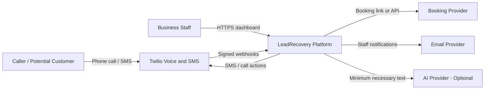
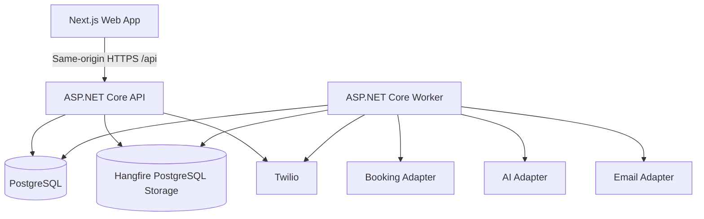
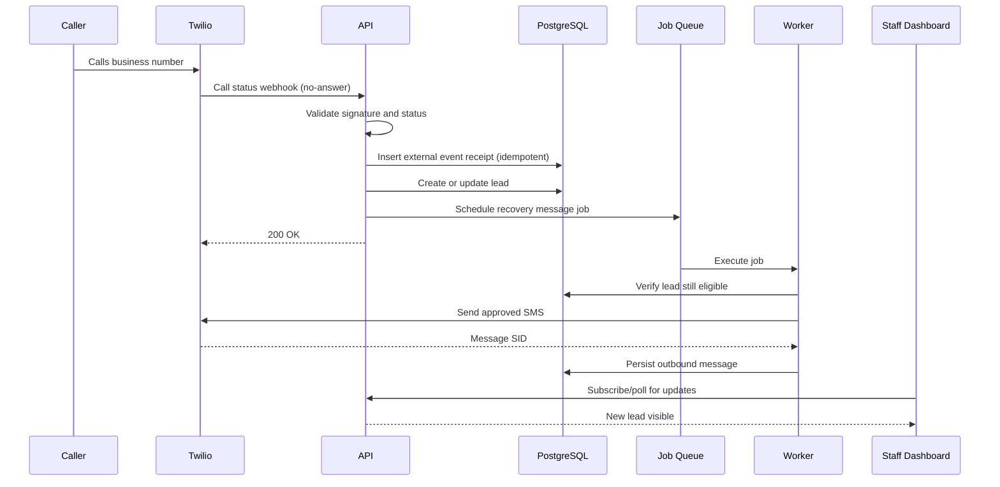
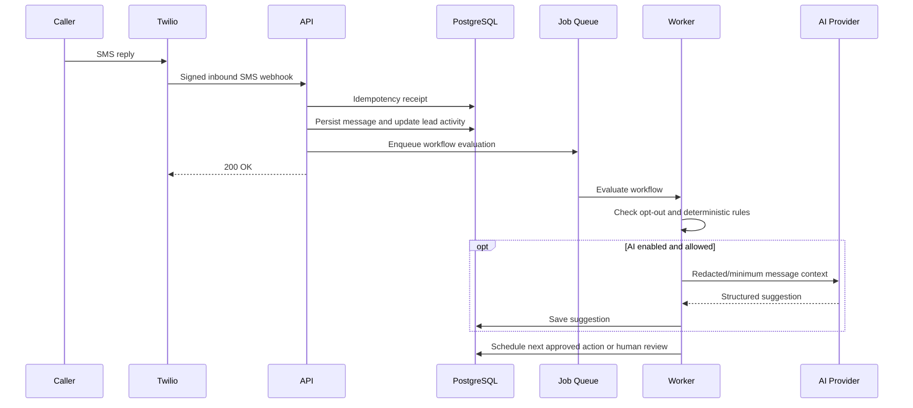
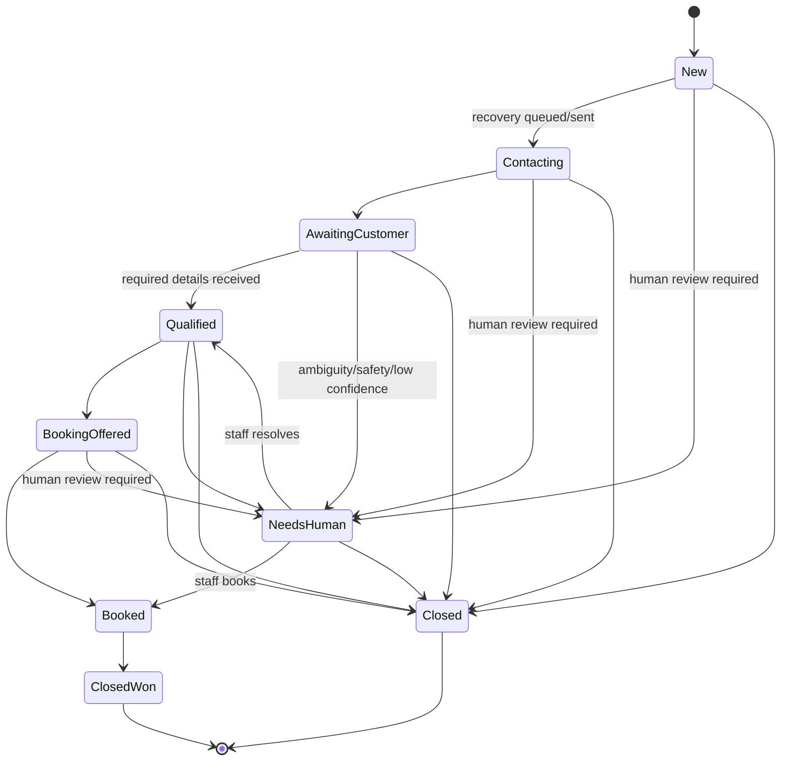
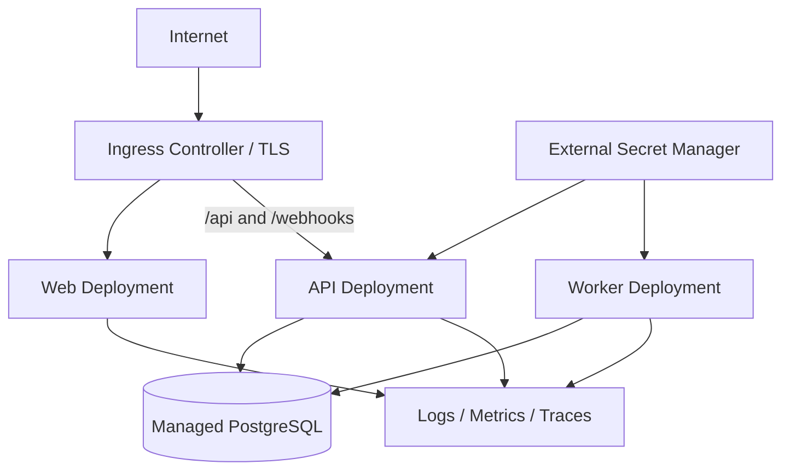

# LeadRecovery - Complete Codex Implementation Specification
> Generated from the modular repository documentation by eng/Sync-MasterSpecification.ps1. Edit the source files, not this file.

---

<!-- SOURCE: README.md -->

# Lead Recovery Platform - Codex Documentation Package

## What this package is

This repository documentation defines a complete, implementation-ready plan for a **C# / ASP.NET Core lead-recovery platform** for Ontario home-service businesses. The first commercial use case is missed-call recovery for plumbing companies, followed by lead qualification, booking, quote follow-up, and staff handoff.

The recommended business strategy is service-first:

1. Build a reliable demonstration.
2. Sell a small fixed-scope pilot.
3. Install the same workflow for several paying clients.
4. Standardize recurring components.
5. Consider a niche micro-SaaS only after repeated paid validation.

The system intentionally uses **C# as the production backend** and includes **Docker and Kubernetes** as real deployment capabilities. Kubernetes is not allowed to block the first working MVP or first pilot.

## Current implementation status

Milestones 0 through 3 are complete. LR-0101 through LR-0103, LR-0201 through
LR-0204, and LR-0301 through LR-0303 are implemented. In addition to the modular-monolith domain and
PostgreSQL foundation, the repository now contains ASP.NET Core Identity users,
tenant memberships and roles, audited same-origin cookie sessions, CSRF and
login-rate-limit controls, tenant-scoped lead queries, opt-in fictional demo
seeding, and a minimal Next.js login and lead-inbox shell. Integration and
Playwright tests cover Owner/Staff login, logout invalidation, role policies,
and cross-tenant denial. Signed Twilio call-status callbacks now resolve a
tenant-owned provider number, persist an idempotency receipt, create or update
a lead, and schedule a pending initial-recovery action with cooldown, audit,
and metrics. Hangfire execution, outbound SMS, inbound SMS, and the operational
dashboard actions remain later milestones.

The currently implemented browser and health contract is:

- `GET /health/live` reports whether the process is running;
- `GET /health/ready` reports whether registered readiness checks pass;
- `GET /api/v1/auth/csrf`, `POST /api/v1/auth/login`,
  `GET /api/v1/auth/me`, and `POST /api/v1/auth/logout` manage the browser
  session;
- `GET /api/v1/leads` and `GET /api/v1/leads/{leadId}` return only leads owned
  by the authenticated session tenant;
- `POST /api/v1/webhooks/twilio/call-status` accepts only correctly signed
  form callbacks and records recovery intent;
- `POST /api/v1/webhooks/twilio/sms/inbound` and
  `POST /api/v1/webhooks/twilio/sms/status` validate signed callbacks, persist
  inbound activity once, apply opt-out suppression, and update delivery state;
- the worker executes due recovery actions through PostgreSQL-backed Hangfire,
  using the deterministic fake SMS provider unless real delivery is explicitly
  enabled.

## Pinned foundation versions

| Component | Version | Current use |
|---|---:|---|
| .NET SDK | 10.0.301 | Builds all backend projects |
| ASP.NET Core shared framework | 10.0.9 | API and worker runtime baseline |
| C# | 14.0 | Backend language version |
| PostgreSQL | 18.4 | Local database container |
| Entity Framework Core and tools | 10.0.9 | Persistence and migrations |
| Npgsql EF Core provider | 10.0.2 | PostgreSQL EF Core provider |
| libphonenumber-csharp | 9.0.34 | E.164 phone parsing and validation adapter |
| Twilio .NET SDK | 7.14.9 | Webhook signature validation and gated outbound adapter |
| Hangfire ASP.NET Core | 1.8.23 | Worker server and retry policy |
| Hangfire PostgreSQL | 1.21.1 | Durable background-job storage |
| Testcontainers PostgreSQL | 4.13.0 | Isolated PostgreSQL integration tests |
| xUnit v3 Microsoft Testing Platform package | 3.2.2 | Backend test runner |
| Node.js | 24.17.0 | Frontend and Playwright runtime |
| pnpm | 11.10.0 | Locked frontend workspace package manager |
| Next.js | 16.2.10 | Same-origin browser shell |
| React | 19.2.7 | Browser UI runtime |
| TypeScript | 6.0.3 | Strict frontend type checking |
| Playwright | 1.61.1 | Browser acceptance tests |

## Local development

Prerequisites are Git, Docker Desktop with Compose, the .NET SDK selected by
`global.json`, Node.js from `.node-version`, and pnpm from `package.json`.

Create a local environment file and replace the example database password:

```powershell
Copy-Item templates/.env.example .env
$env:ConnectionStrings__Database = 'Host=localhost;Port=5432;Database=leadrecovery;Username=leadrecovery;Password=<same-local-password>'
```

If Docker Desktop is running but the default Windows Docker context still
points at the inactive `docker_engine` pipe, select its Linux context for the
current shell with `$env:DOCKER_CONTEXT = 'desktop-linux'`.
Testcontainers also accepts that Docker context. Docker 24 supports API 1.43;
the integration fixture uses 1.43 when no `DOCKER_API_VERSION` override exists,
which remains backward-compatible with newer daemons.

Start PostgreSQL and verify the backend foundation:

```powershell
docker compose up -d postgres
dotnet tool restore
dotnet restore LeadRecovery.sln --locked-mode
dotnet ef database update --project src/LeadRecovery.Infrastructure --startup-project src/LeadRecovery.Api
dotnet format LeadRecovery.sln --verify-no-changes --no-restore
dotnet build LeadRecovery.sln --configuration Release --no-restore
dotnet test LeadRecovery.sln --configuration Release --no-build
dotnet run --project src/LeadRecovery.Api
```

For the authenticated demo, fill the `DemoSeed__*` values documented in
`templates/.env.example`, enable the demo seed only in a disposable local
database, and start the frontend in a second shell:

```powershell
corepack enable
pnpm install --frozen-lockfile
$env:API_BASE_URL = 'http://localhost:8080'
pnpm frontend:dev
```

The browser uses the Next.js `/api` rewrite so the session and antiforgery
cookies remain same-origin. Do not expose the API under a separate browser
origin or let the client supply `TenantId`.

To exercise the Twilio webhook endpoints, set `TWILIO_AUTH_TOKEN` and the
exact public application base in `TWILIO_WEBHOOK_BASE_URL`. The latter is used
to reconstruct the signed public URL behind a trusted proxy. Leave both unset
when the webhooks are not enabled; the endpoints then fail closed with `503`.

The worker is safe by default: `SMS_PROVIDER=fake` produces a deterministic
provider SID without network access. A live Twilio request is possible only
when `SMS_PROVIDER=twilio` and `ALLOW_REAL_SMS=true` are both set and the
Twilio account SID/auth token are present. Keep the fake defaults for automated
tests and local workflow development.

With the API running, check `http://localhost:8080/health/live` and
`http://localhost:8080/health/ready`. Start the worker separately after setting
the same database connection and webhook base URL:

```powershell
$env:SMS_PROVIDER = 'fake'
$env:ALLOW_REAL_SMS = 'false'
dotnet run --project src/LeadRecovery.Worker
```

Stop local services without deleting data:

```powershell
docker compose down
```

To intentionally reset the local database, use `docker compose down --volumes`.
That command permanently removes the Compose-managed local PostgreSQL volume.
For a disposable development database, the EF migration can instead be rolled
back with:

```powershell
dotnet ef database update 0 --project src/LeadRecovery.Infrastructure --startup-project src/LeadRecovery.Api
```

Do not use either reset procedure on a database containing data that must be
retained.

## Start here

For Codex or another coding agent:

1. Place this package at the root of the implementation repository.
2. Ensure `AGENTS.md` remains at the repository root.
3. Give the agent `CODEX_START_HERE.md` as its first task context.
4. Ask it to execute only one milestone or issue at a time.
5. Require tests, documentation updates, and a summary after every task.

For a single-file upload, use:

- `CODEX_MASTER_IMPLEMENTATION_SPEC.md`

For repository-based work, use the modular files under `docs/`.

## Core product

**Working name:** LeadRecovery

**Initial customer:** Ontario plumbing companies with approximately 3-20 employees.

**Initial outcome:** When a business misses a call, the caller receives a prompt SMS, can provide job details, receives a booking or callback path, and appears as a structured lead in the staff dashboard.

**Commercial promise:** Fewer missed opportunities, faster response time, less office administration.

## Documentation map

| File | Purpose |
|---|---|
| `AGENTS.md` | Permanent instructions for Codex and coding agents |
| `CODEX_START_HERE.md` | First prompt and execution protocol |
| `CODEX_MASTER_IMPLEMENTATION_SPEC.md` | Complete combined specification |
| `CODEX_PROMPT_SEQUENCE.md` | Ready-to-use prompts for each build phase |
| `docs/01_PRODUCT_REQUIREMENTS.md` | Scope, users, workflows, requirements |
| `docs/02_SYSTEM_ARCHITECTURE.md` | Architecture, components, patterns, decisions |
| `docs/03_DOMAIN_AND_DATABASE.md` | Entities, states, constraints, schema |
| `docs/04_API_AND_INTEGRATIONS.md` | API, Twilio, booking, AI contracts |
| `docs/05_FRONTEND_UX.md` | Dashboard screens, behavior, accessibility |
| `docs/06_AI_GUARDRAILS.md` | Safe AI use, structured outputs, fallbacks |
| `docs/07_SECURITY_PRIVACY.md` | Security controls, privacy, tenant isolation |
| `docs/08_TESTING_QUALITY.md` | Test pyramid, scenarios, release gates |
| `docs/09_DEVOPS_KUBERNETES.md` | Docker, Kubernetes, CI/CD, environments |
| `docs/10_OBSERVABILITY_OPERATIONS.md` | Logs, metrics, alerts, support runbooks |
| `docs/11_TIMELINE_AND_MILESTONES.md` | Detailed implementation timeline |
| `docs/12_BACKLOG_AND_ACCEPTANCE.md` | Epics, stories, acceptance criteria |
| `docs/13_PILOT_AND_VALIDATION.md` | Demo, pilot onboarding, market validation |
| `docs/14_SAAS_EVOLUTION.md` | Productization and later SaaS roadmap |
| `docs/decisions/` | Accepted architecture decision records |
| `api/openapi.yaml` | Initial API contract skeleton |
| `database/schema.sql` | Reference relational schema |
| `CHANGELOG.md` | User-visible and repository-level changes |
| `templates/.env.example` | Required environment variables |
| `templates/definition-of-done.md` | Completion checklist |
| `templates/pull-request-template.md` | Pull request quality template |

## Baseline delivery timeline

The baseline assumes **20-25 focused hours per week for 10 weeks**. A full-time developer can compress it, but the order of work should remain the same.

- Weeks 1-2: foundation, domain, persistence, authentication
- Weeks 3-4: Twilio calls/SMS, leads, background jobs
- Weeks 5-6: dashboard, booking, follow-ups, AI summaries
- Weeks 7-8: security, testing, observability, deployment
- Week 9: Kubernetes and CI/CD demonstration
- Week 10: pilot readiness, documentation, sales demo

## Non-negotiable product principles

- Business outcomes before technical novelty.
- Modular monolith before microservices.
- Deterministic workflows before autonomous agents.
- Human override for every automation.
- No secrets in source control.
- Every external webhook is authenticated and idempotent.
- Every tenant query is tenant-scoped.
- No production release without automated tests and a rollback path.
- Kubernetes is a deployment option, not the product.

---

<!-- SOURCE: AGENTS.md -->

# AGENTS.md - Repository Instructions for Codex

## Mission

Build and maintain the LeadRecovery platform according to the specifications in this repository. The product helps home-service businesses recover missed callers, qualify leads, schedule follow-up, and give staff a reliable dashboard.

## Required reading order

Before changing code, read:

1. `README.md`
2. `docs/01_PRODUCT_REQUIREMENTS.md`
3. `docs/02_SYSTEM_ARCHITECTURE.md`
4. The document relevant to the assigned task
5. `templates/definition-of-done.md`

When requirements conflict, stop and report the conflict. Do not silently choose a new product direction.

## Architecture rules

- Start as a **modular monolith**, not microservices.
- Backend: C# and ASP.NET Core on the latest supported .NET LTS chosen at repository initialization.
- Persistence: PostgreSQL through Entity Framework Core migrations.
- Frontend: React/Next.js with TypeScript.
- Background work: Hangfire with PostgreSQL-backed storage unless an approved architecture decision changes it.
- Integrations: Twilio, booking provider, email provider, and optional OpenAI analysis.
- Local orchestration: Docker Compose.
- Portfolio/cloud deployment: Kubernetes manifests or Helm after the Docker deployment works.
- Shared database multi-tenancy with mandatory `TenantId` scoping.

## Coding rules

- Use nullable reference types.
- Treat compiler warnings as errors in CI.
- Use asynchronous I/O and pass `CancellationToken` through application boundaries.
- Keep controllers thin. Business logic belongs in application services or domain policies.
- Validate all external input.
- Use idempotency for webhook processing.
- Never log secrets, access tokens, full authentication cookies, or unnecessary message content.
- No hard-coded credentials, phone numbers, tenant IDs, URLs, or pricing.
- Prefer explicit types and readable code over clever abstractions.
- Do not introduce a dependency without explaining why it is needed.
- Do not add a microservice, message broker, service mesh, Redis, or event-sourcing framework unless a documented requirement justifies it.

## Testing rules

For every behavior change:

1. Add or update unit tests.
2. Add integration tests when persistence, authentication, webhooks, or external adapters are involved.
3. Run formatting, build, and all relevant tests.
4. Report the exact commands and outcomes.

Critical flows require end-to-end coverage:

- missed call -> lead creation -> automatic SMS
- inbound SMS -> message persisted -> lead updated
- staff closes or books lead -> scheduled follow-ups stop
- opt-out -> no further automated messages
- duplicate webhook -> no duplicate lead or message
- cross-tenant access -> denied

## Security rules

- Validate Twilio signatures.
- Require HTTPS outside local development.
- Store secrets in environment variables or a secret manager.
- Use secure, HttpOnly cookies for browser sessions when practical.
- Protect state-changing browser requests against CSRF.
- Enforce tenant authorization in both application logic and data access.
- Redact sensitive values in logs.
- Apply least privilege to Kubernetes service accounts and cloud identities.

## AI rules

AI is an optional assistant, not the workflow controller.

- Use structured JSON output with a versioned schema.
- AI may categorize, summarize, and draft.
- AI may not promise prices, diagnose trade problems, guarantee arrival times, or close a lead without business rules or staff action.
- Low-confidence or safety-sensitive results must be routed to human review.
- The deterministic workflow must continue if the AI provider is unavailable.

## Task execution protocol

For each assigned task:

1. Restate the task and identify affected components.
2. List assumptions and open questions.
3. Propose a small implementation plan.
4. Make the smallest coherent change.
5. Add tests.
6. Run validation commands.
7. Update relevant documentation and changelog.
8. Return a concise summary, files changed, tests run, risks, and next recommended issue.

Do not implement future milestones unless explicitly asked.

## Definition of done

A task is complete only when it meets `templates/definition-of-done.md` and its acceptance criteria in `docs/12_BACKLOG_AND_ACCEPTANCE.md`.

---

<!-- SOURCE: CODEX_START_HERE.md -->

# Codex Start Here

You are implementing the LeadRecovery platform. Treat the repository documentation as the source of truth.

## First assignment

Do not write product features immediately. Begin with a repository assessment and implementation plan.

### Step 1 - Read

Read:

- `AGENTS.md`
- `README.md`
- `docs/01_PRODUCT_REQUIREMENTS.md`
- `docs/02_SYSTEM_ARCHITECTURE.md`
- `docs/11_TIMELINE_AND_MILESTONES.md`
- `docs/12_BACKLOG_AND_ACCEPTANCE.md`

### Step 2 - Report

Return:

1. Your understanding of the product in no more than 12 bullets.
2. The proposed repository structure.
3. The technology versions you propose to pin and why.
4. Any contradictions or missing decisions.
5. A phase-by-phase implementation plan.
6. The exact scope of Milestone 0 and Milestone 1.
7. Commands you expect to use for build, tests, local infrastructure, and formatting.

### Step 3 - Wait

Do not generate the entire application in one response. Wait for approval to begin Milestone 0.

## Standard task prompt

For later work, use this form:

> Implement issue `[ID]` from `docs/12_BACKLOG_AND_ACCEPTANCE.md`. Read all linked requirements first. Provide a short plan, implement only that issue, add tests, run all required validation, update documentation if needed, and report files changed plus remaining risks. Do not begin the next issue.

## Required quality

Every implementation must be reviewable by a human developer. Fast generation is not more important than correctness, security, testability, or clear documentation.

---

<!-- SOURCE: docs/01_PRODUCT_REQUIREMENTS.md -->

# 01 - Product Requirements

## 1. Product summary

LeadRecovery is a business workflow platform for home-service companies. Its first purpose is to recover callers who would otherwise be lost when staff cannot answer the phone.

The initial release is not a general CRM and not an autonomous AI receptionist. It is a narrow, reliable workflow:

1. A potential customer calls the business.
2. The call is not answered or is marked busy/failed.
3. The system creates or updates a lead.
4. The system sends a pre-approved SMS.
5. The caller replies with job details.
6. The system records the conversation and optionally categorizes it.
7. The caller receives a booking link or callback confirmation.
8. Staff see the lead, take over, assign it, book it, or close it.
9. Follow-ups stop when the lead is booked, closed, or opted out.

## 2. Product goals

### MVP goals

- Demonstrate missed-call recovery end to end.
- Reduce the time from missed call to first response to less than one minute in normal operation.
- Give office staff one view of leads and message history.
- Support manual takeover at any point.
- Prevent duplicate processing from repeated webhooks.
- Operate without AI if the AI provider is unavailable.
- Be deployable locally with Docker Compose.
- Be deployable to Kubernetes for portfolio and scaling demonstration.
- Be sufficiently configurable to pilot with a real Ontario plumbing company.

### Business goals

- Create a two-minute sales demonstration.
- Support a fixed-scope paid pilot.
- Make the core workflow reusable across several businesses.
- Gather evidence for later productization.

## 3. Non-goals for MVP

The MVP must not become:

- a full CRM replacement;
- a field-service dispatch platform;
- an invoicing or payment processor;
- a fully autonomous voice agent;
- a native mobile application;
- a multi-region enterprise platform;
- a custom machine-learning training project;
- a marketplace for contractors;
- an advanced analytics product;
- a generic chatbot builder.

## 4. Primary users

### 4.1 Business owner

Needs to know whether missed leads are being recovered and whether the service creates booked work.

Key actions:

- view lead pipeline;
- review response-time metrics;
- configure business hours, messages, and booking URL;
- review audit history;
- manage staff access.

### 4.2 Office manager or dispatcher

The main daily user.

Key actions:

- view new and urgent leads;
- read call/SMS history;
- assign leads;
- send a manual response;
- stop automation;
- mark booked, won, lost, or spam;
- correct AI-generated categorization or summary.

### 4.3 Technician or limited staff user

May receive assigned-lead notifications and view only relevant information.

### 4.4 Platform administrator

Manages tenant onboarding and support. This role is internal and must not have unrestricted access without explicit support authorization and audit logging.

### 4.5 Caller/customer

Does not create an account. Interacts through phone, SMS, and booking link. Must be able to stop messages.

## 5. Initial customer profile

The first target is an Ontario plumbing company with:

- 3-20 employees;
- an existing business phone number or willingness to use/forward through Twilio;
- regular inbound calls;
- no internal software-development team;
- a website and basic booking or callback process;
- a clear cost when leads receive slow responses.

## 6. Core use cases

### UC-01 Recover a missed call

**Trigger:** Twilio reports a call as no-answer, busy, failed, or another configured recoverable status.

**Success:** One lead is created or updated and one initial recovery message is queued/sent within the configured delay.

**Rules:**

- Duplicate status callbacks must not create duplicate leads or SMS messages.
- A caller who has opted out must not receive an automated SMS.
- A configurable cooldown prevents repeated recovery texts for repeated calls in a short period.
- Staff can disable automation globally or per lead.

### UC-02 Receive and process an SMS reply

**Trigger:** Twilio sends an inbound SMS webhook.

**Success:** The message is persisted, associated with the correct tenant/lead, visible in the dashboard, and the workflow advances.

**Rules:**

- STOP and equivalent opt-out keywords immediately suppress future automated messages.
- Unknown numbers may create a lead only if the tenant configuration permits it.
- Media messages are out of MVP scope unless explicitly enabled later.

### UC-03 Qualify a lead

The system asks a small, pre-approved sequence of questions, for example:

- What service do you need?
- What city or postal area is the property in?
- Is this urgent or actively causing damage?
- Would you like a booking link or a callback?

Question order is deterministic. AI may summarize answers but may not control all branching without rules.

### UC-04 Book or request callback

The system sends a tenant-configured booking URL or records a callback request. Booking confirmation may be manual in MVP unless a calendar integration is configured.

### UC-05 Staff takeover

A staff user may pause automation, send a manual message, assign the lead, and set the next action.

### UC-06 Follow up

If the customer has not replied or booked, scheduled messages may be sent according to a tenant-approved cadence.

Default pilot cadence:

- initial text: within 30-60 seconds after confirmed missed call;
- follow-up 1: after 2 hours during permitted hours;
- follow-up 2: next business morning;
- then stop unless tenant policy explicitly allows another step.

### UC-07 Close a lead

`Booked` and `ClosedWon` are explicit lead statuses, not close reasons. Booking
stops automated follow-ups, while a later staff-confirmed win may transition a
booked lead to `ClosedWon`.

Reasons for transitioning a lead to `Closed`:

- Lost - no response
- Lost - out of area
- Lost - unavailable service
- Duplicate
- Spam
- Opted out

Closure cancels pending automated follow-ups.

## 7. Functional requirements

### FR-001 Tenant configuration

Each tenant must have:

- business name;
- timezone;
- business hours;
- phone/SMS configuration;
- booking URL;
- approved message templates;
- follow-up cadence;
- allowed service categories;
- permitted service area;
- notification recipients;
- retention settings;
- automation enable/disable control.

### FR-002 Lead management

The system must support:

- lead list with filters;
- lead detail view;
- assignment;
- status transitions;
- urgency;
- category;
- conversation timeline;
- internal notes;
- automation state;
- audit history.

### FR-003 Messaging

- outbound templated SMS;
- inbound SMS processing;
- delivery status callbacks;
- retry policy for temporary failures;
- explicit failure state for permanent errors;
- manual staff message;
- opt-out handling;
- business-hours restrictions.

### FR-004 Authentication and authorization

- tenant users authenticate securely;
- roles: Owner, Manager, Staff, ReadOnly, PlatformAdmin;
- users can access only their tenant unless a support workflow explicitly grants temporary access;
- sensitive administration actions are audited.

### FR-005 Background jobs

- initial recovery job;
- follow-up jobs;
- notification jobs;
- stale-lead checks;
- cleanup/retention jobs;
- retries with bounded backoff;
- cancellation when workflow state changes.

### FR-006 AI assistance

Optional features:

- category suggestion;
- urgency suggestion;
- conversation summary;
- suggested staff response;
- extraction of city/postal area and requested service.

All AI output must be structured, versioned, confidence-scored, and editable by staff.

### FR-007 Reporting

MVP metrics:

- missed calls detected;
- recovery SMS sent;
- customer reply rate;
- average first-response time;
- leads booked;
- leads closed;
- automation failures;
- opt-out rate.

Metrics must be clearly labeled as operational indicators, not guaranteed revenue attribution.

### FR-008 Audit trail

Audit events include:

- lead status changes;
- assignment changes;
- manual messages;
- automation pause/resume;
- template/configuration changes;
- user/role changes;
- support access;
- AI suggestion accepted or edited.

## 8. Non-functional requirements

### Reliability

- Webhook acknowledgement target: under 2 seconds, with work queued when needed.
- Duplicate external events must be safely ignored.
- Core workflow must continue when AI is down.
- Failed outbound messages must be visible and retryable when appropriate.

### Performance

- Dashboard lead list p95 response target: under 500 ms for pilot-scale data.
- Lead detail p95 response target: under 700 ms.
- Staff dashboard should update within 5 seconds after a new inbound message.

### Availability

Pilot target: 99.5% monthly availability excluding scheduled maintenance. This is a target, not an SLA until contracts define it.

### Security

- HTTPS in non-local environments;
- signature validation for Twilio webhooks;
- least-privilege authorization;
- encrypted transport and managed-database encryption at rest;
- secret-manager integration;
- dependency and container scanning;
- tenant isolation tests.

### Privacy

- collect only information needed for lead handling;
- provide configurable retention;
- support deletion/export requests at tenant level;
- do not use customer message content to train models;
- send only the minimum necessary text to an AI provider;
- maintain data-processing documentation for pilots.

### Accessibility

The dashboard should target WCAG 2.2 AA practices:

- keyboard navigation;
- visible focus;
- semantic labels;
- adequate contrast;
- status not conveyed by color alone;
- accessible validation and alerts.

### Cost control

Pilot infrastructure must be supportable at low volume. Every paid external call should be observable by tenant and type.

## 9. Success criteria for the portfolio demo

The demo is complete when it can show:

1. A test call is missed.
2. A lead is created once.
3. An SMS arrives automatically.
4. The caller replies.
5. The reply appears in the dashboard.
6. The lead receives category/urgency suggestions.
7. Staff marks the lead Booked.
8. Scheduled follow-ups are cancelled.
9. A duplicate webhook does not duplicate data.
10. STOP prevents further automated messages.

## 10. Success criteria for the first pilot

- A real tenant is configured without code changes.
- At least one staff user can operate the dashboard.
- Webhook failures and message failures generate an alert.
- A documented rollback or disable switch exists.
- The tenant approves all outbound message templates.
- The pilot has defined measurements and a support contact.

---

<!-- SOURCE: docs/02_SYSTEM_ARCHITECTURE.md -->

# 02 - System Architecture

## 1. Architecture strategy

The first release is a **modular monolith** with separate deployable processes for the API, background worker, and web frontend. This balances simplicity, testability, and realistic cloud-native deployment.

Do not start with independent microservices. The product does not yet have the traffic, team size, or domain stability to justify distributed-system complexity.

## 2. System context



## 3. Logical component architecture



## 4. Deployable units

### 4.1 LeadRecovery.Api

Responsibilities:

- browser API;
- authentication and authorization;
- Twilio webhook endpoints;
- lead, message, configuration, and reporting endpoints;
- health endpoints;
- enqueue background jobs;
- real-time update hub or server-sent events.

Must not contain long-running work.

### 4.2 LeadRecovery.Worker

Responsibilities:

- execute Hangfire jobs;
- send recovery and follow-up messages;
- call AI analysis adapter;
- send staff notifications;
- process retention jobs;
- retry transient failures;
- emit operational metrics.

### 4.3 LeadRecovery.Web

Responsibilities:

- login;
- lead inbox;
- lead detail/conversation;
- configuration;
- users and roles;
- operational metrics;
- accessible error and loading states.

The Milestone 2 shell is a Next.js App Router application deployed on the same
browser origin as `/api`. Next.js rewrites `/api/*` to the ASP.NET Core host;
the browser never receives an API origin or a bearer token. Server components
forward only the incoming session cookie for authenticated rendering. The
current UI implements login, logout, session display, and a read-only seeded
lead inbox; operational lead actions remain Milestone 6 / LR-0501 through
LR-0505.

ASP.NET Core Identity owns passwords, lockout, security stamps, and the
application cookie. A `TenantMembership` joins one user to one tenant role. The
session contains a server-issued tenant claim, but the API revalidates the
user, security stamp, membership, role, and tenant status on every request.
Until tenant switching is designed, login succeeds only when exactly one
Trial/Active membership is available; multiple active memberships fail closed.

Milestone 3 maps the anonymous Twilio call-status endpoint through an API
adapter into a provider-neutral application event. The adapter validates the
signature against a configured canonical public URL before parsing business
fields. The application then uses a trusted server-derived tenant execution
scope, while Infrastructure commits the receipt, lead, pending scheduled
action, and audit event in one serializable PostgreSQL transaction. No outbound
provider call or background execution occurs in the API request.

Milestone 4 keeps that API/worker separation. The Worker polls durable due
actions, enqueues only opaque identifiers into PostgreSQL-backed Hangfire, and
executes provider calls after a second eligibility transaction. Signed inbound
and status webhooks remain in the API and commit receipts plus business state
before returning. The default sender is an in-process fake; live Twilio access
requires two explicit configuration gates.

### 4.4 PostgreSQL

Primary system of record for:

- tenants and users;
- leads and conversations;
- external event receipts;
- jobs metadata when using Hangfire PostgreSQL storage;
- audit logs;
- configuration;
- AI analysis results.

Use a managed database in production. Do not place production PostgreSQL inside Kubernetes for the initial release.

## 5. Solution/project structure

```text
LeadRecovery.sln
global.json
Directory.Build.props
Directory.Packages.props
dotnet-tools.json
compose.yaml
.github/
  workflows/
    ci.yml
src/
  LeadRecovery.Api/
  LeadRecovery.Worker/
  LeadRecovery.Domain/
    Common/
    Tenancy/
    Leads/
    Conversations/
    Automations/
  LeadRecovery.Application/
  LeadRecovery.Infrastructure/
  LeadRecovery.Contracts/
  LeadRecovery.Web/       # reserved in M0; Next.js is initialized in M2
tests/
  LeadRecovery.Domain.Tests/
  LeadRecovery.Application.Tests/
  LeadRecovery.IntegrationTests/
  LeadRecovery.ArchitectureTests/
  LeadRecovery.E2E/
deploy/
  docker/
  kubernetes/
    base/
    overlays/
      local/
      staging/
      production/
  helm/              # optional after base manifests work
docs/
  decisions/
eng/
```

The business modules remain folders inside the layered projects. They are not
independent deployables or separate databases. Project dependencies are:

- Domain references no other project;
- Application references Domain;
- Contracts does not reference Domain or Infrastructure;
- Infrastructure references Application and Domain;
- API references Application, Infrastructure, and Contracts;
- Worker references Application and Infrastructure;
- Web communicates through HTTP contracts only.

## 6. Layer responsibilities

### Domain

Contains:

- entities;
- value objects;
- enums;
- domain policies;
- state-transition rules;
- domain events that remain in-process initially.

Must not reference Entity Framework, Twilio, OpenAI, HTTP, or UI packages.

### Application

Contains:

- commands and queries;
- use-case services;
- validation;
- interfaces for persistence and external systems;
- authorization policies independent of transport;
- transaction boundaries.

### Infrastructure

Contains:

- EF Core DbContext and mappings;
- repository/query implementations;
- Twilio adapter;
- email adapter;
- booking adapter;
- AI adapter;
- clock and ID implementations;
- Hangfire configuration;
- observability exporters.

### Contracts

Contains stable request/response DTOs and versioned integration schemas. Domain entities must not be returned directly over the API.

### API

Contains controllers/minimal endpoints, authentication wiring, middleware, health endpoints, and webhook translation.

## 7. Key architecture decisions

Accepted, authoritative decisions are recorded under `docs/decisions/`:

- ADR-0001: modular monolith and project dependency boundaries;
- ADR-0002: pinned technology baseline;
- ADR-0003: tenant isolation and database-enforced tenant relationships;
- ADR-0004: transactional scheduled actions and background dispatch;
- ADR-0005: API contract and optimistic concurrency;
- ADR-0006: lead lifecycle, close reasons, and webhook event identity;
- ADR-0007: tenant context and tenant configuration concurrency;
- ADR-0008: customer phone normalization and tenant-scoped identity;
- ADR-0009: conversation and message lifecycle, identity, and limits;
- ADR-0010: scheduled actions, durable cancellation, and external receipts;
- ADR-0011: Identity, tenant memberships, and same-origin browser sessions.

The platform also uses same-origin browser deployment where practical,
deterministic workflow rules with AI limited to assistance, and application
interfaces around Twilio, AI, booking, and email providers.

## 8. Modules

Suggested modules inside the monolith:

- Identity
- Tenancy
- Leads
- Conversations
- Automations
- Integrations
- Notifications
- Reporting
- Audit
- Administration

Each module should expose application-level services rather than allowing arbitrary cross-module DbContext access.

## 9. Missed-call sequence



## 10. Inbound-message sequence



## 11. Lead state machine



State transitions must be validated in the domain layer. Direct arbitrary
status updates are prohibited. Every pre-booking active state may route to
`NeedsHuman` or close unsuccessfully with a documented reason. `Closed` and
`ClosedWon` are terminal in LR-0201; reopening is deferred until an application
use case can require and persist its audit event.

## 12. Transaction and consistency model

- Accept webhook quickly.
- Within one database transaction, record the external event receipt,
  create/update the lead, and persist a `ScheduledAction` when future work is
  required.
- `ScheduledAction` is the durable application intent. Hangfire is notified
  only after commit, and a dispatcher reconciles pending actions so a failed
  enqueue cannot lose work.
- Hangfire jobs carry the scheduled-action ID. The worker reloads the action and
  lead, checks eligibility and idempotency, and only then performs an external
  side effect.
- External sends are at-least-once attempts; idempotency keys prevent duplicate business effects.
- Do not assume exactly-once delivery from Twilio, Kubernetes, or job runners.

LR-0204 implements the durable `ScheduledAction` record and the
`ExternalEventReceipt` system ledger without dispatching work or calling a
provider. Booking uses the same scoped EF context to persist the Lead transition
and cancel only its pending actions in one transaction. Hangfire notification,
reconciliation, leasing, and external execution remain later issues.

## 13. Caching

Do not add distributed caching in MVP. Optimize indexed database queries first. Short-lived in-memory caching may be used only for non-sensitive, non-tenant-confusing reference data.

## 14. Real-time updates

Preferred order:

1. Simple polling every 5-10 seconds for earliest MVP.
2. SignalR when core flow is stable.

Do not let real-time infrastructure delay the demo.

## 15. Scaling approach

Initial scale target:

- up to 50 tenants;
- up to 20 staff users per tenant;
- up to 10,000 leads per tenant per year;
- burst of 20 webhook requests per second;
- background-job concurrency configurable per environment.

Scale API and worker replicas independently. PostgreSQL remains the likely first bottleneck and must use appropriate indexes and connection pooling.

---

<!-- SOURCE: docs/03_DOMAIN_AND_DATABASE.md -->

# 03 - Domain Model and Database

## 1. Domain principles

- Every tenant-owned record carries `TenantId`.
- External identifiers are stored with provider name and are unique within the correct scope.
- All timestamps are stored in UTC.
- Display and scheduling use the tenant timezone.
- Customer phone numbers are validated and normalized to canonical E.164 before
  persistence. Invalid or unknown numbers are rejected explicitly.
- State changes are explicit and auditable.
- Soft deletion is used only where business or retention rules require it; otherwise archive/close states are preferred.

## 2. Core entities

### Tenant

Represents one business customer.

Key fields:

- `Id`
- `Name`
- `Slug`
- `TimezoneId`
- `Status` - Trial, Active, Suspended, Closed
- `AutomationEnabled`
- `Version` application-managed `bigint` concurrency token
- `CreatedAtUtc`
- `UpdatedAtUtc`

### TenantPhoneNumber

Maps a Twilio number or verified business number to a tenant.

- `Id`
- `TenantId`
- `Provider`
- `PhoneNumberE164`
- `ProviderNumberSid`
- `InboundSmsEnabled`
- `MissedCallRecoveryEnabled`
- `IsPrimary`
- `RecoverableCallStatuses` non-empty normalized provider status set
- `InitialDelaySeconds` from 0 through 3,600
- `RecoveryCooldownSeconds` from 1 through 86,400

Unique: `(Provider, ProviderNumberSid)`, `(Provider, PhoneNumberE164)`, and
`(TenantId, PhoneNumberE164)`. Global provider/phone uniqueness guarantees that
one destination cannot route to multiple tenants. In Milestone 3 this entity is
the narrow tenant-specific recovery-policy boundary; a later settings milestone
may move timing and status configuration into a versioned workflow definition.

### User

Implemented with ASP.NET Core Identity using a `Guid` primary key.

- `Id`
- `DisplayName`
- normalized username and email fields managed by Identity
- password hash, security stamp, lockout, and other Identity security fields
- `IsActive`
- `CreatedAtUtc`

### TenantMembership

- `Id`
- `TenantId`
- `UserId`
- `Role` - Owner, Manager, Staff, ReadOnly
- `CreatedAtUtc`

Unique: `(TenantId, UserId)`. A membership row is the grant; removing it
revokes that tenant grant. User-wide disablement uses `User.IsActive`, while
tenant-wide suspension uses `Tenant.Status`. The cookie validator checks all
three on every request. Milestone 2 supports exactly one Trial/Active membership
per login and fails closed when a user has zero or multiple active memberships;
tenant switching requires a later explicit design.

### Lead

- `Id`
- `TenantId`
- `CustomerId` nullable
- `PrimaryPhoneE164`
- `DisplayName` nullable
- `Source` - MissedCall, InboundSms, WebForm, Manual, Import
- `Status`
- `Urgency`
- `ServiceCategoryId` nullable
- `AssignedUserId` nullable
- `AutomationState` - Active, Paused, Completed, Suppressed
- `LastCustomerActivityAtUtc`
- `LastBusinessActivityAtUtc`
- `BookedAtUtc` nullable
- `ClosedAtUtc` nullable
- `CloseReason` nullable
- `Version` application-managed `bigint` concurrency token, exposed through APIs
  as an opaque base64 value
- audit timestamps

LR-0201 implements this aggregate and its lifecycle policy in the domain layer.
LR-0203 adds Lead persistence as the required tenant-owned parent for
Conversation and Message. Lead uses the same server-derived tenant read/write
guards as those child records and an application-managed concurrency version.
When `AssignedUserId` is present, `(TenantId, AssignedUserId)` must reference a
membership in the same tenant.

Indexes:

- `(TenantId, Status, CreatedAtUtc desc)`
- `(TenantId, PrimaryPhoneE164, CreatedAtUtc desc)`
- `(TenantId, AssignedUserId, Status)`
- `(TenantId, Urgency, Status)`

### Customer

Optional normalized contact record.

- `Id`
- `TenantId`
- `PhoneE164` required, maximum 16 characters
- `Name` nullable, maximum 200 characters
- `Email` nullable, maximum 320 characters
- `City` nullable, maximum 100 characters
- `PostalCode` nullable, maximum 20 characters
- `SmsConsentBasis` nullable, maximum 100 characters
- `OptedOutAtUtc` nullable
- `CreatedAtUtc`

Unique: `(TenantId, PhoneE164)`.

LR-0202 implements Customer persistence and a creation use case that derives
`TenantId` from the active server context. The application depends on a phone
normalization interface; Infrastructure implements it with
`libphonenumber-csharp` and stores only canonical E.164 values. Customer reads
use an EF tenant query filter, and writes reject missing or mismatched tenant
context. LR-0203 and LR-0204 apply equivalent persistence controls to the other
tenant-owned Milestone 1 entities. LR-0102 still owns endpoint-level proof that
browser input cannot override server-derived TenantId when feature APIs arrive.

### CallEvent

- `Id`
- `TenantId`
- `LeadId` nullable until linked
- `Provider`
- `ProviderCallSid`
- `FromPhoneE164`
- `ToPhoneE164`
- `Status`
- `Direction`
- `StartedAtUtc`
- `EndedAtUtc` nullable
- `DurationSeconds` nullable
- `RawPayloadHash`
- `ReceivedAtUtc`

Unique: `(Provider, ProviderCallSid, Status, ReceivedAtUtc bucket)` or a provider-event key. The exact idempotency strategy must account for Twilio sending multiple legitimate status updates for one call.

### Conversation

- `Id`
- `TenantId`
- `LeadId`
- `Channel` - Sms
- `Status` - Open, Closed
- `CreatedAtUtc`
- `ClosedAtUtc` nullable

Conversations start `Open`, may transition once to `Closed`, and cannot reopen
without a future explicit audited use case.

### Message

- `Id`
- `TenantId`
- `LeadId`
- `ConversationId`
- `Direction` - Inbound, Outbound
- `Kind` - Automated, Manual, System
- `Provider` maximum 50 characters
- `ProviderMessageSid` nullable until sent, maximum 100 characters
- `ClientIdempotencyKey` required, maximum 200 characters
- `Body` required, maximum 1,600 characters
- `Status` - Queued, Sent, Delivered, Failed, Received, Suppressed
- `FailureCode` nullable, maximum 100 characters
- `FailureDescription` nullable, maximum 500 characters
- `SentByUserId` nullable
- `TemplateId` nullable
- `CreatedAtUtc`
- `SentAtUtc` nullable
- `DeliveredAtUtc` nullable

Unique: `(Provider, ProviderMessageSid)` when not null; `(TenantId, ClientIdempotencyKey)`.

Inbound messages begin in terminal `Received`. Outbound messages begin
`Queued`; allowed transitions are `Queued -> Sent -> Delivered`,
`Queued/Sent -> Failed`, and `Queued -> Suppressed`. `Delivered`, `Failed`, and
`Suppressed` are terminal. A client idempotency key is required for every
message; inbound adapters derive an opaque server-controlled key rather than
trusting tenant or provider input as authority. Message bodies preserve their
content but reject empty input and content longer than the provider-supported
1,600-character ceiling.

LR-0203 persists inbound and outbound records without calling a provider. Lead,
Conversation, and Message reads are tenant-filtered; their writes reject missing
or mismatched tenant context; and compound foreign keys prevent cross-tenant
relationships. Provider calls and idempotent callback handlers remain in later
Twilio and worker issues.

### MessageTemplate

- `Id`
- `TenantId`
- `Name`
- `Purpose`
- `Body`
- `Version`
- `IsApproved`
- `IsActive`
- `CreatedByUserId`
- `ApprovedByUserId` nullable
- `CreatedAtUtc`
- `ApprovedAtUtc` nullable

Templates are immutable after approval; edits create a new version.

LR-0402 persists this aggregate with tenant read/write guards, a compound
tenant identity used by Message, and a filtered unique index that permits only
one active template per `(TenantId, Purpose)`. Activation is rejected until the
template is approved. Initial recovery execution requires the active approved
`InitialMissedCallRecovery` purpose and stores its ID on the outbound Message.

### WorkflowDefinition

MVP can use configuration rather than a general visual workflow engine.

- `Id`
- `TenantId`
- `Name`
- `Version`
- `IsActive`
- `InitialDelaySeconds`
- `FollowUpPolicyJson`
- `BusinessHoursPolicyJson`
- `QualificationPolicyJson`

### ScheduledAction

- `Id`
- `TenantId`
- `LeadId`
- `ActionType` maximum 100 characters
- `ScheduledForUtc`
- `Status` - Pending, Running, Completed, Cancelled, Failed
- `AttemptCount`
- `IdempotencyKey` maximum 200 characters
- `PayloadJson` required JSON object, maximum 16,384 characters
- `LastError` nullable, maximum 1,000 characters
- audit timestamps

Unique: `(TenantId, IdempotencyKey)`.

Actions start `Pending`. Allowed transitions are `Pending -> Running`,
`Pending -> Cancelled`, `Running -> Completed`, `Running -> Failed`, and
`Running -> Pending` for a retry with a new due time at or after the retry
decision. Starting an attempt increments `AttemptCount`. Completed, Failed, and
Cancelled are terminal. The due-work index is `(Status, ScheduledForUtc)`; a
separate `(TenantId, LeadId, Status)` index supports deterministic cancellation.

LR-0204 persists durable workflow intent without executing it. The booking use
case and its PostgreSQL adapter use one scoped DbContext save to persist the
booked Lead and cancel only that lead's Pending actions. Running or terminal
actions are not rewritten, and no Hangfire or provider call occurs in this
issue.

### ExternalEventReceipt

The integration/system idempotency ledger. It is not ordinary tenant-owned
business data because a receipt may need to be recorded before a tenant can be
resolved. When an event maps to a tenant, `TenantId` is recorded and remains
immutable. This entity is never exposed through tenant browser APIs.

- `Id`
- `TenantId` nullable
- `Provider` maximum 50 characters
- `EventType` maximum 100 characters
- `ExternalEventId` maximum 200 characters
- `PayloadHash` maximum 128 characters
- `ReceivedAtUtc`
- `ProcessedAtUtc` nullable
- `ProcessingResult` nullable, maximum 500 characters

Unique: `(Provider, EventType, ExternalEventId)`.

`ExternalEventId` is an opaque adapter-generated value. Provider adapters must
distinguish legitimate status progressions from duplicate delivery; a provider
SID by itself is not necessarily sufficient.

LR-0204 permits unresolved receipts to be saved without a request tenant
context. A non-empty TenantId may be assigned once after resolution and cannot
then be cleared or changed. Processing may be recorded once at or after receipt.
The ledger has no tenant query filter and is not exposed through browser APIs;
later integration handlers must authorize its system-level access explicitly.

### AiAnalysis

- `Id`
- `TenantId`
- `LeadId`
- `SchemaVersion`
- `Provider`
- `ModelReference`
- `InputHash`
- `CategorySuggestion`
- `UrgencySuggestion`
- `Summary`
- `Confidence`
- `RequiresHumanReview`
- `ReasonCodesJson`
- `RawStructuredOutputJson`
- `AcceptedByUserId` nullable
- `AcceptedAtUtc` nullable
- `CreatedAtUtc`

Do not store hidden chain-of-thought or unnecessary provider metadata.

### AuditEvent

- `Id`
- `TenantId` nullable for platform-level events
- `ActorType` - User, System, Integration, Support
- `ActorId`
- `Action`
- `EntityType`
- `EntityId`
- `BeforeJson` nullable, redacted
- `AfterJson` nullable, redacted
- `CorrelationId`
- `CreatedAtUtc`

Milestone 2 persists this append-oriented foundation and records successful
login and logout events with correlation IDs. It is not exposed through tenant
browser APIs. Redacted before/after JSON is available for later audited domain
changes; secrets and session material are prohibited.

Milestone 3 records redacted call-status outcomes and scheduled-recovery
decisions. It never stores the Twilio auth token, request signature, raw form
payload, or phone number in audit JSON.

### Notification

- `Id`
- `TenantId`
- `UserId` nullable
- `LeadId` nullable
- `Channel`
- `Type`
- `Status`
- `DestinationMasked`
- `CreatedAtUtc`
- `SentAtUtc` nullable

## 3. Enums

### LeadStatus

```text
New
Contacting
AwaitingCustomer
Qualified
BookingOffered
NeedsHuman
Booked
Closed
ClosedWon
```

### LeadUrgency

```text
Unknown
Low
Normal
High
CriticalReview
```

`CriticalReview` means urgent human attention. It does not authorize the system to provide technical emergency instructions.

### AutomationState

```text
Active
PausedByUser
PausedBySystem
Completed
SuppressedOptOut
SuppressedPolicy
```

## 4. State-transition rules

Examples:

- `New -> Contacting` only when a recovery action is queued or sent.
- `AwaitingCustomer -> Qualified` only when minimum required fields are present or staff overrides with a reason.
- Any pre-booking active state may move to `NeedsHuman`.
- Any pre-booking active state, including `NeedsHuman`, may move to `Closed`
  with a documented close reason.
- `Booked` cancels pending follow-ups and sets automation to completed.
- `Booked -> ClosedWon` records a later staff-confirmed win.
- `Closed` requires one of the documented loss, duplicate, spam, or opt-out
  reasons. `Booked` and `Won` are statuses and are not close reasons.
- `SuppressedOptOut` prevents all non-essential automated SMS.
- `Closed` and `ClosedWon` are terminal for LR-0201. Reopening is deferred until
  an application use case can require and persist an audit event.
- Message delivery states follow the LR-0203 policy: only queued outbound
  messages can be sent or suppressed; sent messages can be delivered; queued or
  sent messages can fail; final and inbound-received states cannot transition.
- Scheduled actions follow the LR-0204 transition graph; only Pending actions
  can start or cancel, only Running actions can retry, complete, or fail, and
  terminal states cannot transition.

## 5. Tenant isolation

Required implementation controls:

1. Resolve tenant context from authenticated membership, not request body.
2. Resolve webhook tenant from the destination provider number mapping.
3. Apply global query filters to tenant-owned EF entities.
4. For administrative background jobs, pass and validate TenantId explicitly.
5. Use compound `(TenantId, Id)` keys and foreign keys for relationships between
   tenant-owned entities so the database also rejects cross-tenant links.
6. Run integration tests that attempt cross-tenant access for every sensitive endpoint family.

The implemented browser lead queries derive TenantId from the validated session
membership, apply the EF tenant filter, ignore client tenant headers, and map a
cross-tenant lead identifier to not-found without revealing that it exists.

## 6. Concurrency

- Use application-managed `bigint Version` concurrency tokens on `Lead` and
  `Tenant`. Increment the token whenever the corresponding aggregate is
  updated.
- Return HTTP 409 when a staff update conflicts.
- Make webhook handlers and job handlers idempotent.
- Use database transactions for state transition plus scheduled-action cancellation.

## 7. Retention

Suggested pilot defaults, configurable by contract:

- operational lead/message data: 12 months;
- audit data: 24 months;
- failed webhook payload metadata: 90 days;
- raw payload body: avoid storing unless needed for troubleshooting, and then redact and expire quickly;
- application logs: 30-90 days depending on environment.

Retention must be implemented through scheduled jobs with dry-run reporting before deletion.

## 8. Migration strategy

- EF Core migrations are committed to source control.
- Production migrations run as an explicit deployment job, not automatically from every API replica.
- Every destructive migration requires backup and rollback planning.
- Backward-compatible expand/migrate/contract patterns are preferred after real clients exist.

---

<!-- SOURCE: docs/04_API_AND_INTEGRATIONS.md -->

# 04 - API and Integration Contracts

## 1. API conventions

Base path: `/api/v1`

- JSON request/response bodies.
- Problem Details for errors.
- Correlation ID returned in `X-Correlation-ID`.
- UTC ISO-8601 timestamps.
- Pagination with `pageSize` and opaque `cursor` for growing lists; offset pagination is acceptable for the first pilot if documented.
- Idempotency key supported for manual outbound-message requests.
- Browser API uses secure session authentication.
- Webhooks use provider-specific signature validation, not browser authentication.

## 2. Error shape

```json
{
  "type": "https://docs.example.com/errors/validation",
  "title": "Validation failed",
  "status": 400,
  "detail": "One or more fields are invalid.",
  "instance": "/api/v1/leads/123",
  "correlationId": "01J...",
  "errors": {
    "status": ["Transition from ClosedWon to AwaitingCustomer is not allowed."]
  }
}
```

## 3. Authentication endpoints

- `GET /api/v1/auth/csrf` issues an antiforgery request token and stores the
  paired HttpOnly SameSite=Strict cookie;
- `POST /api/v1/auth/login` requires `X-CSRF-TOKEN`, applies generic credential
  failure responses, Identity lockout, and an IP fixed-window rate limit;
- `GET /api/v1/auth/me` returns the validated user, tenant, and role session;
- `POST /api/v1/auth/logout` requires `X-CSRF-TOKEN`, rotates the Identity
  security stamp, clears the cookie, and invalidates replay of all previously
  issued cookies for that user.

The browser uses a non-persistent, HttpOnly, SameSite=Strict application cookie
with an eight-hour sliding lifetime. It is always Secure outside Development;
production defaults to a `__Host-` cookie and persists data-protection keys from
configured storage. The browser and `/api` share one origin through the Next.js
rewrite. TenantId is never accepted from request bodies, query strings, or
headers as authority. Password reset, refresh, tenant switching, and
PlatformAdmin support grants are deferred and are not advertised by the
implemented OpenAPI contract.

## 4. Lead endpoints

### List leads

`GET /api/v1/leads?pageSize=25&cursor=...`

The Milestone 2 endpoint returns tenant-scoped summary fields only, ordered by
creation time and ID descending. `pageSize` is 1 through 100 and `cursor` is an
opaque encoded offset. Status, urgency, and assignment filters remain LR-0501.

### Get lead

`GET /api/v1/leads/{leadId}`

The Milestone 2 endpoint returns the same lead summary shape used by the inbox.
It returns `404` for an unknown ID and for an ID owned by another tenant. The
full detail, conversation timeline, pending actions, AI suggestion, and
role-appropriate audit summary remain LR-0502.

The remaining write endpoints in this section describe future dashboard
milestones and are not yet implemented or included in `api/openapi.yaml`.

### Update lead status

`POST /api/v1/leads/{leadId}/transitions`

```json
{
  "targetStatus": "Booked",
  "reason": "Customer selected 2:00 PM appointment",
  "expectedRowVersion": "base64-version"
}
```

`expectedRowVersion` is an opaque base64 representation of the
application-managed `bigint` concurrency version. Do not expose arbitrary
patching of domain status.

### Assign lead

`POST /api/v1/leads/{leadId}/assignment`

### Pause automation

`POST /api/v1/leads/{leadId}/automation/pause`

### Resume automation

`POST /api/v1/leads/{leadId}/automation/resume`

### Add internal note

`POST /api/v1/leads/{leadId}/notes`

## 5. Message endpoints

- `GET /api/v1/leads/{leadId}/messages`
- `POST /api/v1/leads/{leadId}/messages`
- `GET /api/v1/messages/{messageId}/status`

Manual send request:

```json
{
  "body": "Thanks. A team member will call you shortly.",
  "idempotencyKey": "ui-01J..."
}
```

Server rules:

- verify user permission;
- verify tenant ownership;
- verify customer not opted out unless message is legally/operationally permitted;
- apply length and content validation;
- persist queued record before provider call;
- update delivery state asynchronously.

## 6. Tenant configuration endpoints

- `GET /api/v1/settings/business`
- `PUT /api/v1/settings/business`
- `GET /api/v1/settings/messages`
- `POST /api/v1/settings/messages`
- `POST /api/v1/settings/messages/{id}/approve`
- `GET /api/v1/settings/automation`
- `PUT /api/v1/settings/automation`
- `GET /api/v1/settings/integrations`

Only Owner/Manager roles may edit configuration. Approval may require Owner depending on pilot contract.

## 7. Reporting endpoints

- `GET /api/v1/reports/overview?from=...&to=...`
- `GET /api/v1/reports/funnel?from=...&to=...`
- `GET /api/v1/reports/failures?from=...&to=...`

## 8. Twilio integration

### 8.1 Webhook endpoints

- `POST /api/v1/webhooks/twilio/voice`
- `POST /api/v1/webhooks/twilio/call-status`
- `POST /api/v1/webhooks/twilio/sms/inbound`
- `POST /api/v1/webhooks/twilio/sms/status`

Milestone 3 implements
`POST /api/v1/webhooks/twilio/call-status`. It accepts
`application/x-www-form-urlencoded` callbacks containing `CallSid`,
`CallStatus`, `From`, and `To` (with `Caller`/`Called` compatibility). A valid
callback returns `204` after durable processing; duplicate, unknown,
non-recoverable, cooldown, and inactive-tenant outcomes are also acknowledged
with `204`. Malformed signed input returns `400`, an invalid or missing
signature returns `403`, and missing validator/canonical-URL configuration
returns `503`.

Milestone 4 implements `POST /api/v1/webhooks/twilio/sms/inbound` and
`POST /api/v1/webhooks/twilio/sms/status` with the same signature and canonical
URL rules. Inbound events require `MessageSid`, `From`, `To`, and a non-empty
body of at most 1,600 characters. Delivery events require `MessageSid` and
`MessageStatus`, with optional `ErrorCode`. Accepted, duplicate, unknown, and
non-actionable signed callbacks return `204`; malformed, unsigned, and
unconfigured outcomes remain `400`, `403`, and `503` respectively.

### 8.2 Required controls

- Validate Twilio signature against the exact public URL and form values.
- Support proxy/ingress forwarded headers safely so signature validation uses the canonical URL.
- Reject invalid signatures with 403.
- Return 2xx quickly after durable receipt.
- Use provider SID plus event type for idempotency.
- Never trust tenant ID from webhook form fields.
- Resolve tenant through the called/messaged Twilio number.

The implemented canonical URL is built from the operator-controlled
`TWILIO_WEBHOOK_BASE_URL` plus the request path and query. Arbitrary forwarded
headers are not trusted. The base must use HTTPS outside Development. Unknown
destinations create only a system receipt and redacted audit event for replay
control; they create no tenant lead or scheduled action.

### 8.3 Recoverable call statuses

Tenant-configurable set, initially:

- no-answer
- busy
- failed

`completed` is not automatically recoverable without additional rules because a completed call may have been answered.

### 8.4 Initial recovery template

Example only; tenant must approve final copy:

> Hi, this is {{BusinessName}}. Sorry we missed your call. What service do you need help with? Reply STOP to stop messages.

### 8.5 Inbound opt-out

Normalize and detect provider-supported opt-out words. Set customer and lead suppression state immediately. Cancel pending SMS jobs. Record audit event.

The implemented STOP family is `STOP`, `STOPALL`, `UNSUBSCRIBE`, `CANCEL`,
`END`, and `QUIT`, matched case-insensitively after trimming. The inbound
message, customer opt-out, lead suppression, pending-action cancellation,
receipt, and redacted dashboard audit activity commit atomically.

### 8.6 Delivery callbacks

Update message state for queued, sent, delivered, undelivered, or failed. Permanent failures are not retried blindly.

The worker persists a queued message before the provider call and re-checks the
tenant, phone route, lead state, customer opt-out, and approved active template
inside a serializable transaction. Transient provider/network failures return
the action to Pending and are retried by Hangfire; provider rejections are
terminal and visible on the Message. Duplicate jobs reuse the tenant-scoped
message idempotency key. An expired Running lease is returned to Pending after
five minutes so a worker restart does not strand work.

## 9. Booking integration

MVP level 1:

- tenant-configured booking URL sent by SMS;
- staff manually marks Booked.

Level 2:

- webhook from Calendly/Cal.com or provider adapter;
- match booking to lead using a signed correlation token or phone/email;
- transition to Booked and cancel follow-ups.

Never place sensitive lead data directly in an unsigned query string.

## 10. Email integration

Use for staff notifications, not customer marketing in MVP.

Notification types:

- urgent/needs-human lead;
- automation failure;
- integration disconnected;
- daily operational summary.

## 11. AI provider integration

Application interface:

```csharp
public interface ILeadAnalysisService
{
    Task<LeadAnalysisResult> AnalyzeAsync(
        LeadAnalysisRequest request,
        CancellationToken cancellationToken);
}
```

Input should include only:

- approved service categories;
- tenant service area rules where needed;
- recent relevant customer messages;
- deterministic safety instructions;
- schema version.

Output must conform to the schema in `docs/06_AI_GUARDRAILS.md`.

## 12. Webhook idempotency algorithm

1. Validate signature.
2. Derive an opaque external event key that distinguishes legitimate provider
   status progressions from duplicate delivery; a provider SID alone may be
   insufficient.
3. Begin transaction.
4. Insert `ExternalEventReceipt` with unique key.
5. If unique conflict, return 200 because event was already accepted.
6. Translate payload into internal command.
7. Apply state changes and write outbox/scheduled action.
8. Commit.
9. Return 200.
10. Process external side effects asynchronously.

For call-status callbacks, `ExternalEventId` is a SHA-256 identity over Call SID
plus normalized status and `PayloadHash` covers deterministically ordered form
fields. One serializable transaction contains receipt insertion, route outcome,
lead update/creation, pending action, and audit. `SendInitialRecoverySms` remains
durable intent until Milestone 4 adds worker execution.

## 13. Rate limiting

Apply separate policies:

- browser login endpoints;
- manual message sends;
- public webhook endpoints, with enough burst tolerance for provider retries;
- platform-admin endpoints.

Rate limiting must not cause silent data loss. Provider retries should receive appropriate status codes.

## 14. OpenAPI

The initial skeleton is in `api/openapi.yaml`. Codex must keep it aligned with implementation or generate it from annotated endpoints and commit a verified export.

---

<!-- SOURCE: docs/05_FRONTEND_UX.md -->

# 05 - Frontend and UX Specification

## 1. UX objective

The dashboard must help a busy office manager answer three questions immediately:

1. Which leads need attention now?
2. What has already been said or sent?
3. What action should I take next?

The product should feel like an operational inbox, not a complex CRM.

## 2. Information architecture

Primary navigation:

- Inbox
- All Leads
- Reports
- Settings
- Users
- System Status (Owner/Manager)

## 3. Core screens

### 3.1 Login

Requirements:

- email and password;
- forgot password;
- clear error messages without revealing account existence unnecessarily;
- accessible labels and focus order;
- rate-limit feedback.

Milestone 2 implements the email/password form with accessible labels, disabled
submitting state, generic credential errors, explicit rate-limit feedback, and
same-origin CSRF initialization. Forgot/reset password is intentionally deferred
with its API workflow; no dead control is shown.

### 3.2 Lead inbox

Default filters:

- Needs Human
- New
- Urgent
- Unassigned

Columns/cards:

- customer name or phone;
- service category;
- urgency;
- source;
- status;
- assigned user;
- age since last customer activity;
- automation indicator;
- unread indicator.

Actions:

- open lead;
- assign to self;
- mark spam;
- bulk actions are out of MVP scope except safe assignment/filter operations.

The Milestone 2 shell is a narrower read-only acceptance slice: tenant name,
current user/role, lead name or phone, source, status, age, summary counts,
empty/error states, and secure logout. It server-renders authenticated data and
redirects an expired session to login. Filters, assignment, lead navigation,
automation controls, unread state, and performance acceptance remain LR-0501
through LR-0505 and must not be inferred complete from this shell.

### 3.3 Lead detail

Desktop layout:

```text
+--------------------------------------------------------------+
| Customer / Status / Urgency / Assignment / Automation        |
+-------------------------------+------------------------------+
| Conversation timeline         | Lead details                 |
| SMS bubbles, call events,      | service, location, source,   |
| system events                  | booking, summary, notes      |
|                               |                              |
| Message composer              | Next actions                 |
+-------------------------------+------------------------------+
```

Required controls:

- send manual SMS;
- pause/resume automation;
- assign;
- transition status;
- edit category and urgency;
- accept/edit AI summary;
- add note;
- copy phone number;
- open booking link;
- view pending follow-ups and cancel them.

### 3.4 Settings - Business

- business name;
- timezone;
- business hours;
- service area;
- booking URL;
- notification recipients.

### 3.5 Settings - Message templates

- list versions;
- preview substitutions;
- create draft;
- approve/activate;
- test-send to an authorized test number;
- character/segment estimate;
- required opt-out language warning.

### 3.6 Settings - Automation

- global enable/disable;
- recoverable call statuses;
- cooldown period;
- initial delay;
- follow-up schedule;
- after-hours behavior;
- qualification questions;
- AI feature toggles.

### 3.7 Reports

MVP cards:

- missed calls;
- recovery messages;
- reply rate;
- median response time;
- booked leads;
- needs-human backlog;
- failed messages.

Include date range and timezone note.

## 4. Visual priority

- Urgent human-review leads appear first.
- Red is reserved for failures or critical attention, not ordinary status.
- Automation state must include text/icon, not color only.
- Failed outbound messages display a clear reason and safe retry option.

## 5. Responsive behavior

The dashboard must work on laptop and tablet. Mobile web should support lead viewing and essential actions but need not provide full configuration editing in MVP.

## 6. Accessibility requirements

- semantic HTML;
- keyboard-accessible navigation and dialogs;
- focus returns correctly after modal close;
- ARIA live region for new-message/update notification where appropriate;
- no inaccessible custom select controls;
- form errors linked to fields;
- minimum 44x44 CSS pixel touch targets for primary actions;
- timestamps readable by screen readers;
- charts have text summaries.

## 7. Loading and error states

Every screen must define:

- initial loading;
- empty state;
- permission denied;
- recoverable network error;
- stale update/concurrency conflict;
- partial integration failure.

Example concurrency message:

> This lead changed while you were viewing it. Review the latest status before trying again.

## 8. Frontend technical approach

- Next.js with TypeScript.
- Server/client boundaries chosen deliberately; do not expose secrets to browser bundles.
- API client generated from OpenAPI or strongly typed manually.
- TanStack Query or equivalent for server state.
- React Hook Form plus schema validation for forms.
- Component library allowed, but accessibility must be verified.
- Use a small design-token set rather than ad hoc styles.

## 9. Real-time strategy

MVP may poll lead counts and open conversations every 5-10 seconds. SignalR can replace polling after core flows are stable.

When a new message arrives:

- inbox count updates;
- open lead timeline updates;
- staff typing must not be silently overwritten;
- provide a visible "new activity" indicator if auto-scroll would be disruptive.

## 10. Demo mode

Provide a safe demo seed mode with fictional data. It must never send real SMS unless a specific environment flag and approved test number are configured.

Demo data should show:

- one urgent plumbing lead;
- one normal booking request;
- one opted-out contact;
- one failed message;
- one booked lead;
- one duplicate webhook handled successfully.

---

<!-- SOURCE: docs/06_AI_GUARDRAILS.md -->

# 06 - AI Design and Guardrails

## 1. Principle

AI improves staff efficiency but does not own the workflow. The system must remain useful and safe when AI is disabled, delayed, unavailable, or wrong.

## 2. Allowed AI functions

- classify a requested service into the tenant's approved categories;
- suggest urgency based on explicit tenant-approved criteria;
- summarize conversation content for staff;
- extract structured fields such as city, postal prefix, and preferred callback time;
- draft a staff response for human review;
- flag ambiguity or possible safety-sensitive language.

## 3. Prohibited autonomous actions

AI must not independently:

- quote or promise prices;
- diagnose plumbing, electrical, HVAC, or other technical problems;
- instruct a caller to perform dangerous repairs;
- guarantee arrival or completion times;
- accept contractual terms;
- reject a lead solely from model output;
- send unrestricted free-form messages;
- change tenant configuration;
- delete data;
- close a lead as won/lost without rules or staff action.

## 4. Structured output schema

```json
{
  "schemaVersion": "1.0",
  "serviceCategory": "LeakRepair",
  "urgency": "High",
  "summary": "Customer reports an active leak in the basement and requests a callback.",
  "extracted": {
    "city": "Mississauga",
    "postalCode": null,
    "preferredCallbackWindow": "As soon as possible"
  },
  "confidence": 0.87,
  "requiresHumanReview": true,
  "reasonCodes": ["ACTIVE_PROPERTY_DAMAGE", "TIME_SENSITIVE"],
  "suggestedReply": "Thanks for the details. A team member will review this and contact you shortly."
}
```

The API must validate this schema. Invalid output is discarded and logged as a provider failure, not passed through.

## 5. Confidence policy

Suggested baseline:

- `>= 0.85` and no safety reason: display suggestion normally;
- `0.65-0.84`: display with review badge;
- `< 0.65`: do not automatically apply category/urgency;
- any safety-sensitive reason code: require human review regardless of confidence.

Model confidence is not statistically guaranteed. Treat it as an operational hint and monitor correction rates.

## 6. Prompt design

System prompt requirements:

- state that the model is an internal classification assistant;
- list allowed categories;
- define urgency labels;
- forbid diagnosis and promises;
- require structured output only;
- instruct model to choose `Unknown` when evidence is insufficient;
- require `requiresHumanReview=true` for ambiguous or safety-sensitive content;
- prohibit adding facts not present in messages.

## 7. Data minimization

Before sending to AI:

- remove unrelated historical messages;
- avoid sending full names where not needed;
- mask phone numbers and email addresses;
- omit internal notes unless specifically required;
- omit authentication, payment, and secret data;
- include only the minimum recent conversation context.

## 8. Model/provider abstraction

The application stores a logical capability configuration, not provider-specific business logic.

```csharp
public sealed record LeadAnalysisRequest(
    Guid TenantId,
    IReadOnlyList<string> AllowedCategories,
    IReadOnlyList<ConversationTurn> Turns,
    string SchemaVersion);
```

Provider-specific adapters translate the request and response.

## 9. Fallback behavior

If AI fails:

- the inbound message is still stored;
- lead activity is updated;
- deterministic qualification continues;
- the lead can be flagged `NeedsHuman`;
- no customer-facing error mentions AI;
- retry only transient failures with bounded attempts;
- avoid duplicate analysis using input hash and schema version.

## 10. Human review

The UI must allow staff to:

- accept suggestion;
- edit category, urgency, summary;
- reject suggestion;
- see that content was AI-generated;
- optionally provide a correction reason.

Corrections are used for product evaluation, not model training unless a separate consented process is created.

## 11. Evaluation set

Create a fictional test set with at least 100 messages covering:

- routine leak;
- clogged drain;
- no hot water;
- out-of-area request;
- unclear request;
- price-only question;
- spam;
- opt-out;
- urgent property damage language;
- messages in informal English;
- typographical errors;
- multiple issues in one message.

Measure:

- category agreement with human label;
- urgency agreement;
- false safe/unsafe rates;
- unsupported facts in summary;
- JSON schema failure rate;
- latency and cost.

No AI feature is production-ready until the evaluation and fallback tests pass agreed thresholds.

## 12. Customer-facing generation

For MVP, customer-facing automated messages should come from approved templates with bounded substitutions. AI-generated customer replies may be introduced later only with human approval or a strict retrieval/template framework.

---

<!-- SOURCE: docs/07_SECURITY_PRIVACY.md -->

# 07 - Security, Privacy, and Compliance Design

## 1. Security objectives

Protect:

- tenant isolation;
- staff accounts;
- customer contact information and message content;
- Twilio, AI, email, and database credentials;
- integrity of automated messages;
- availability of the missed-call workflow;
- auditability of staff and support actions.

## 2. Threat model summary

Primary threats:

- forged webhooks;
- account takeover;
- cross-tenant data access;
- secret leakage;
- SMS abuse or unauthorized sends;
- injection through message content;
- prompt injection into AI analysis;
- duplicate/replayed webhooks;
- vulnerable dependencies or container images;
- excessive platform-admin access;
- data retained longer than necessary.

## 3. Authentication

- Use ASP.NET Core Identity or a well-supported identity provider.
- Passwords use platform-standard adaptive hashing.
- Require verified email before production access.
- Support MFA for Owners and PlatformAdmins before pilot expansion.
- Secure cookies: HttpOnly, Secure, SameSite appropriate to same-origin architecture.
- Session revocation on password reset and role removal.
- Login rate limiting and lockout controls.

## 4. Authorization

Roles:

- Owner
- Manager
- Staff
- ReadOnly
- PlatformAdmin

Owner, Manager, Staff, and ReadOnly are tenant membership roles. PlatformAdmin
is deliberately not a tenant role and is not implemented in Milestone 2; later
support access requires a separate time-bounded, audited grant model.

Authorization must check:

1. authenticated user;
2. active tenant membership;
3. required role/policy;
4. entity TenantId;
5. any special support-access grant.

Never rely only on UI hiding.

Milestone 2 uses ASP.NET Core Identity password hashing, unique normalized
emails, a 12-character complexity baseline, five-attempt/15-minute lockout,
generic authentication failures, and a separate five-attempt-per-minute IP
rate limit by default. Browser sessions are non-persistent HttpOnly
SameSite=Strict cookies. Production requires HTTPS and Secure `__Host-` cookies,
and data-protection keys must be persisted to protected shared storage.
Security stamps, users, exact membership roles, and Trial/Active tenant status
are revalidated for every request. Logout rotates the security stamp before
clearing the cookie, so replayed cookies are rejected immediately.

Login and logout require an antiforgery token returned by the same-origin CSRF
endpoint and sent in `X-CSRF-TOKEN`. The token cookie is HttpOnly,
SameSite=Strict, and Secure outside Development. Authentication redirects are
disabled for APIs: missing authentication returns `401`, insufficient role
returns `403`, and a cross-tenant entity lookup returns `404` without revealing
existence.

## 5. Tenant isolation controls

- active TenantId is server-derived;
- EF query filters plus explicit authorization checks;
- tenant-scoped unique keys;
- no mass assignment of TenantId;
- cross-tenant tests in CI;
- reports aggregate only within tenant unless a separate platform metric pipeline uses de-identified data.

LR-0202 applies these controls to Customer persistence: the server-derived
tenant context supplies ownership, EF filters reads, the save pipeline rejects
missing or mismatched tenant authority, and PostgreSQL enforces canonical-phone
uniqueness within each tenant. Equivalent guards must be added for each later
tenant-owned mapping under LR-0102.

LR-0203 extends the same controls to Lead, Conversation, and Message. Compound
tenant foreign keys reject cross-tenant relationships, client idempotency keys
are unique only within their tenant, and provider message identity is unique in
provider scope. Message bodies are never included in informational logs by this
slice.

LR-0204 extends tenant filters, write guards, compound Lead ownership, and
tenant-scoped idempotency to ScheduledAction. ExternalEventReceipt is a
system-level integration ledger instead: it may be written before tenant
resolution, is never exposed through tenant browser APIs, and permits TenantId
to move only from null to one resolved non-empty value. PostgreSQL uniqueness on
the full opaque provider-event identity prevents exact replay without
collapsing legitimate provider status progressions.

LR-0103 resolves browser tenant authority from the validated membership stored
in the session. Client-supplied tenant headers are ignored, lead list/detail
queries execute under the EF tenant filter, and integration plus Playwright
tests exercise cross-tenant denial in CI.

## 6. Webhook security

- validate Twilio signatures;
- use canonical public URL handling behind ingress;
- reject malformed payloads;
- persist idempotency receipt;
- limit accepted content length;
- acknowledge only after durable receipt;
- record correlation ID and provider SID;
- do not log full payload by default.

Milestone 3 uses the official pinned Twilio request validator and an
operator-configured canonical base URL rather than trusting inbound forwarded
headers. Validation happens before phone normalization or persistence. The auth
token is held only by the validator instance and is never passed to logging;
signatures, raw form values, and unmasked phone numbers are also excluded from
application logs and audit JSON. The public endpoint fails closed when either
the auth token or canonical URL is absent.

Milestone 4 applies the same validation-before-persistence rule to inbound SMS
and delivery callbacks. Message bodies are stored as required product data but
never included in structured logs or audit JSON. A live outbound provider is
disabled unless both the explicit provider selection and `ALLOW_REAL_SMS`
safety gate are enabled; automated tests always use the in-process fake.

## 7. Input and output security

- server-side validation for all requests;
- parameterized queries through EF Core;
- output encoding in frontend;
- sanitize any rich text or avoid it entirely;
- treat SMS content as untrusted input;
- AI output is untrusted and schema-validated;
- prevent CSV formula injection in exports;
- limit file uploads because they are out of MVP scope.

## 8. Secrets management

Local development:

- `.env` or user-secrets, excluded from Git.

Staging/production:

- cloud secret manager or sealed external secret integration;
- Kubernetes Secrets only as delivery objects, encrypted at rest where supported;
- rotate credentials;
- separate credentials by environment;
- no secret values in Helm values committed to Git.

## 9. Encryption

- TLS for all external traffic;
- managed PostgreSQL encryption at rest;
- encrypted backups;
- optional application-level encryption for especially sensitive configuration values;
- do not create custom cryptography.

## 10. Logging and privacy

Never log:

- passwords;
- session cookies;
- bearer tokens;
- Twilio auth token;
- AI API key;
- full database connection strings;
- full message bodies at info level;
- unmasked phone numbers unless a restricted diagnostic mode is explicitly enabled.

Use structured fields such as:

- tenant ID;
- lead ID;
- message ID;
- provider SID hash or masked form;
- outcome;
- duration;
- correlation ID.

## 11. SMS consent and opt-out design

The initial use case is a response to a caller who contacted the business. The system must still:

- use tenant-approved wording;
- identify the business;
- include opt-out handling;
- suppress future automated messages after opt-out;
- log the contact source and consent basis;
- separate operational recovery messages from marketing campaigns;
- avoid importing marketing lists in MVP.

Legal requirements can vary. Pilot contracts should require the tenant to approve messaging practices and obtain appropriate legal advice.

## 12. Privacy design

- privacy notice identifies the business and service providers;
- collect minimal lead data;
- provide configurable retention;
- support tenant export/deletion requests;
- use data-processing agreements with providers where required;
- document where data is stored;
- do not use customer content for unrelated analytics or model training;
- minimize AI-provider input.

## 13. Support access

Platform support access must be:

- disabled by default;
- granted for a reason and limited period;
- least privilege;
- visible to tenant Owner where appropriate;
- fully audited;
- revocable immediately.

## 14. Dependency and supply-chain security

CI must include:

- NuGet vulnerability audit;
- npm audit or equivalent;
- dependency update automation;
- secret scanning;
- static analysis;
- container image scanning;
- software bill of materials for release images when practical;
- pinned base-image tags or digests for production.

## 15. Kubernetes security baseline

- non-root containers;
- read-only root filesystem where practical;
- drop unnecessary Linux capabilities;
- resource requests and limits;
- separate service accounts;
- no default service-account token mounting unless needed;
- NetworkPolicies in staging/production when supported;
- PodDisruptionBudget for multiple replicas;
- restricted ingress;
- namespace separation by environment;
- no public database service.

## 16. Incident response basics

Maintain runbooks for:

- leaked provider credential;
- unauthorized login;
- suspected cross-tenant exposure;
- unintended SMS broadcast;
- webhook outage;
- database restore;
- AI provider sending invalid output.

Every incident record includes time, scope, containment, remediation, customer communication decision, and preventive action.

---

<!-- SOURCE: docs/08_TESTING_QUALITY.md -->

# 08 - Testing and Quality Strategy

## 1. Quality principle

The product controls customer communication and stores personal information. A visually working demo is not enough. Critical behavior must be repeatable, observable, and testable.

## 2. Test pyramid

### Unit tests

Focus on:

- lead state transitions;
- follow-up eligibility;
- business-hours calculation;
- cooldown rules;
- opt-out detection;
- phone normalization;
- conversation closure and message delivery-state transitions;
- message body limits and identifier invariants;
- scheduled-action transition matrix, retry timing, and terminal states;
- external-receipt tenant assignment and processing invariants;
- template rendering;
- AI-result validation;
- authorization policies;
- retry classification.

### Application tests

Test use cases with fakes:

- process missed call;
- process inbound SMS;
- queue/send recovery message;
- pause and resume automation;
- book/close lead;
- apply AI suggestion;
- cancel pending actions.

### Integration tests

Use real PostgreSQL through Testcontainers.

Test:

- EF mappings and migrations;
- tenant filters;
- transactions;
- unique/idempotency constraints;
- compound tenant foreign keys and tenant-owned write guards;
- scheduled-action tenant filtering, due/idempotency indexes, booking
  cancellation, and external-receipt identity/tenant immutability;
- Hangfire persistence where practical;
- authentication and cookies;
- API endpoints;
- webhook signature validation.

LR-0103 integration coverage uses the real PostgreSQL migration and API host to
verify Owner/Staff login, HttpOnly/SameSite/Secure cookie attributes, required
CSRF for login/logout, immediate logout-cookie replay rejection, audit rows,
generic invalid/suspended login failure, `401` for anonymous access, Owner-only
policy behavior, ignored tenant-header spoofing, and list/detail cross-tenant
denial.

LR-0301 through LR-0303 coverage uses an official-shaped Twilio form fixture,
independently computes the provider signature, and signs the configured public
URL while the test client uses its internal host. PostgreSQL integration tests
verify valid recovery creation, invalid-signature `403` with no receipt,
duplicate replay, cooldown, unknown-number acknowledgement without tenant
business data, and suspended-tenant suppression. Unit tests cover tenant-phone
policy normalization, lead activity updates, use-case scheduling, cooldown,
audit, metrics, and duplicate short-circuiting. No test uses a live provider or
sends SMS.

LR-0401 through LR-0405 add unit coverage for template approval, customer
opt-out, provider payload coordination, and transient retry signaling. The
PostgreSQL suite independently signs inbound and delivery forms and verifies
approved-template sending, duplicate-job suppression, STOP cancellation and
future-send blocking, permanent delivery failure visibility, callback
idempotency, and invalid-signature rejection. One integration test starts a
real Hangfire server with PostgreSQL storage and proves the queued worker job
reaches Completed. Every automated path uses the deterministic fake sender.

### Contract tests

- Twilio form payload fixtures;
- AI structured JSON fixtures;
- booking webhook fixtures;
- OpenAPI schema checks.

### End-to-end tests

Use Playwright for browser flows and a fake Twilio adapter by default.

Critical E2E scenarios:

1. Missed call creates one lead and one outbound message.
2. Duplicate missed-call callback creates no duplicate.
3. Inbound reply appears in timeline.
4. Staff pauses automation.
5. Staff sends a manual message.
6. Staff books lead and pending follow-ups are cancelled.
7. STOP suppresses automation.
8. User from Tenant A cannot view Tenant B lead.
9. Failed provider send appears in UI.
10. AI outage does not stop deterministic workflow.

The Milestone 2 Playwright slice signs into a seeded second tenant, captures a
lead identifier, signs out, signs into the first tenant, verifies the visible
lead sets, and confirms the second tenant's identifier returns `404`. CI builds
the production frontend, applies all migrations to isolated PostgreSQL, starts
the real API and Next.js shell, and runs this test in Chromium. Later prompts
add the remaining critical E2E scenarios as their provider and workflow
features become available.

## 3. Test environments

### Local

- Docker Compose PostgreSQL;
- fake providers or provider test credentials;
- seeded fictional data;
- no real sends by default.

The integration fixture starts Testcontainers by default. Environments where
Docker is unavailable may point
`LEADRECOVERY_TEST_DATABASE_CONNECTION_STRING` at a fresh disposable PostgreSQL
database; the fixture still applies migrations and runs the identical suite.
Never point this override at a shared or persistent database.

Safe Milestone 4 local validation keeps real delivery disabled:

```powershell
$env:SMS_PROVIDER = 'fake'
$env:ALLOW_REAL_SMS = 'false'
dotnet test tests/LeadRecovery.Domain.Tests --no-build
dotnet test tests/LeadRecovery.Application.Tests --no-build
dotnet test tests/LeadRecovery.ArchitectureTests --no-build
dotnet test tests/LeadRecovery.IntegrationTests --no-build
```

The integration project may use its default disposable Testcontainer or the
documented fresh `LEADRECOVERY_TEST_DATABASE_CONNECTION_STRING` override. It
must never run against a shared or persistent database.

### CI

- isolated PostgreSQL container;
- fake external adapters;
- deterministic clock;
- no production secrets;
- parallel test safety.

### Staging

- dedicated Twilio test number/account configuration;
- allowlist of test destination numbers;
- realistic ingress and TLS;
- managed database;
- AI enabled only if test-data policy permits.

## 4. Test data

Use fictional names and numbers reserved for testing. Never copy real pilot messages into public fixtures.

Seed tenants:

- Alpha Plumbing - normal configuration;
- Beta HVAC - separate tenant for isolation tests;
- Suspended Tenant - access denial tests.

## 5. Time testing

Inject `TimeProvider` or an application clock. Test:

- tenant timezones;
- daylight-saving changes;
- after-hours scheduling;
- next-business-day follow-up;
- jobs delayed across midnight;
- cancellation before execution.

## 6. Idempotency tests

For each webhook type:

- same payload twice;
- same provider SID with different legitimate status;
- out-of-order status callbacks;
- replay after job completed;
- concurrent duplicate delivery.

Expected result: no duplicate business action.

## 7. Security tests

- invalid Twilio signature -> 403;
- missing CSRF token on protected browser mutation -> rejected;
- unauthorized role -> 403;
- cross-tenant ID enumeration -> 404/403 without data leak;
- SQL/script payload in SMS -> safely displayed as text;
- expired session -> reauthentication;
- secret patterns absent from logs;
- rate limits function without data loss.

## 8. Performance tests

Before pilot:

- 20 webhook requests/second for 2 minutes;
- 100 concurrent dashboard reads;
- 10,000 leads in one tenant;
- background worker processing 1,000 scheduled actions in a controlled test.

Measure:

- p50/p95/p99 latency;
- error rate;
- DB connections;
- job lag;
- CPU/memory;
- duplicate rate.

## 9. Resilience tests

- Twilio adapter temporary timeout;
- permanent invalid-number error;
- database restart;
- worker restart mid-job;
- API replica restart;
- AI timeout/invalid JSON;
- email provider outage;
- booking webhook duplicate.

## 10. Code-quality gates

CI blocks merge when:

- formatting fails;
- build fails;
- tests fail;
- coverage drops below agreed thresholds for core projects;
- vulnerability scan finds unapproved high/critical issue;
- secret scanner finds a credential;
- OpenAPI breaking change is unreviewed;
- architecture test detects forbidden dependency.

Suggested initial coverage goals:

- Domain: 90% lines/branches for state rules;
- Application: 80% meaningful coverage;
- Overall backend: 70% minimum, with critical flows fully covered.

Coverage is not a substitute for scenario quality.

## 11. Manual release checklist

- run demo flow end to end;
- verify test number allowlist in staging;
- verify message templates;
- verify opt-out;
- inspect health dashboard;
- verify migration plan and backup;
- verify rollback image/tag;
- confirm no debug logging or test bypasses;
- confirm environment banner;
- obtain approval for production send.

## 12. Definition of done

Use `templates/definition-of-done.md` for every issue and milestone.

---

<!-- SOURCE: docs/09_DEVOPS_KUBERNETES.md -->

# 09 - DevOps, Docker, Kubernetes, and CI/CD

## 1. Deployment principle

The business workflow must work before Kubernetes is introduced. Development order:

1. Run application directly.
2. Run dependencies with Docker Compose.
3. Containerize API, worker, and frontend.
4. Deploy to a simple staging environment.
5. Add Kubernetes deployment as a production/portfolio capability.

Kubernetes is not a reason to split the modular monolith into microservices.

## 2. Environments

### Local

- API and worker from IDE or containers;
- frontend dev server;
- PostgreSQL in Docker;
- fake external providers by default;
- optional tunnel for verified Twilio testing.

### CI

- ephemeral build/test environment;
- PostgreSQL Testcontainer;
- no live provider calls.

### Staging

- public HTTPS;
- dedicated provider test credentials;
- fictional/test data;
- managed PostgreSQL;
- one or two replicas;
- full observability.

### Production/Pilot

- isolated namespace/project;
- managed PostgreSQL;
- secret manager;
- backups;
- alerting;
- approved real provider credentials;
- rollback process.

## 3. Container images

Images:

- `leadrecovery-api`
- `leadrecovery-worker`
- `leadrecovery-web`

Requirements:

- multi-stage builds;
- non-root runtime user;
- minimal supported base image;
- no SDK in runtime image;
- health endpoint;
- reproducible version label;
- image scan;
- immutable release tag plus commit SHA.

## 4. Docker Compose

Local services:

```yaml
services:
  postgres:
    image: postgres
    environment:
      POSTGRES_DB: leadrecovery
      POSTGRES_USER: leadrecovery
      POSTGRES_PASSWORD: local-only-password
    ports:
      - "5432:5432"
    volumes:
      - pgdata:/var/lib/postgresql/data

  api:
    build:
      context: .
      dockerfile: deploy/docker/api.Dockerfile
    environment:
      ASPNETCORE_ENVIRONMENT: Development
    depends_on:
      postgres:
        condition: service_healthy

  worker:
    build:
      context: .
      dockerfile: deploy/docker/worker.Dockerfile
    depends_on:
      postgres:
        condition: service_healthy

  web:
    build:
      context: .
      dockerfile: deploy/docker/web.Dockerfile

volumes:
  pgdata:
```

The committed file must use environment substitution and must not contain real secrets.

## 5. Kubernetes architecture



## 6. Kubernetes resources

Required base manifests:

- Namespace
- ConfigMap
- Secret references
- API Deployment and Service
- Worker Deployment
- Web Deployment and Service
- Ingress
- ServiceAccounts
- NetworkPolicies where supported
- PodDisruptionBudget for API/web when replicas >1
- HorizontalPodAutoscaler for API after metrics are available
- migration Job

### API probes

- `/health/live` - process is alive; no expensive dependency checks.
- `/health/ready` - database and required startup dependencies are ready.

### Worker health

Expose an internal health endpoint or use process/liveness plus a job-heartbeat metric. Readiness should indicate it can access job storage/database.

## 7. Resource baseline

Initial staging values, to be load-tested:

API:

- request: 100m CPU, 256Mi memory;
- limit: 500m CPU, 512Mi memory;
- replicas: 2 in production, 1 in staging.

Worker:

- request: 100m CPU, 256Mi memory;
- limit: 750m CPU, 768Mi memory;
- replicas: 1 initially, scale by job lag.

Web:

- request: 50m CPU, 128Mi memory;
- limit: 300m CPU, 384Mi memory.

These are starting points, not guarantees.

## 8. Configuration

Non-secret ConfigMap values:

- environment name;
- log level;
- feature flags;
- allowed origins if needed;
- default job concurrency;
- telemetry endpoint names;
- public application URL.

Secrets:

- database connection string;
- cookie/data-protection keys or external key store;
- Twilio credentials;
- AI API key;
- email provider key;
- booking webhook secret.

## 9. Data protection keys

If ASP.NET Core cookie/data-protection keys are used across replicas, persist them in a secure shared store. Do not allow each pod to generate unrelated ephemeral keys.

## 10. Migrations

Use a Kubernetes Job or deployment pipeline step:

1. backup/confirm recovery point;
2. run migration image/command once;
3. verify migration;
4. deploy compatible application version.

Do not run migrations automatically from every API pod.

## 11. CI pipeline

On pull request:

1. restore dependencies;
2. format/lint;
3. compile with warnings as errors;
4. run unit tests;
5. run integration tests;
6. validate OpenAPI;
7. scan secrets/dependencies;
8. build containers without pushing;
9. scan images.

## 12. CD pipeline

On approved merge/tag:

1. create version;
2. build images;
3. push immutable tags;
4. generate SBOM where supported;
5. deploy to staging;
6. run smoke/E2E tests;
7. require manual approval for pilot production;
8. run migration job;
9. deploy with rolling update;
10. verify health and key metrics;
11. retain rollback version.

## 13. GitHub Actions conceptual workflow

```text
pull_request
  -> dotnet format check
  -> dotnet build
  -> dotnet test
  -> frontend lint/test/build
  -> integration tests
  -> container build and scan

release tag
  -> build/push images
  -> deploy staging
  -> smoke tests
  -> approval
  -> migrate production
  -> deploy production
  -> verify and notify
```

## 14. Rollback

Application rollback:

- redeploy previous immutable image tag;
- confirm database migration compatibility.

Feature rollback:

- disable automation or AI through feature flag/config;
- keep manual lead dashboard available.

Integration rollback:

- disable outbound sends;
- revert Twilio webhook routing if necessary;
- notify tenant.

## 15. Kubernetes portfolio demonstration

The portfolio demo should show:

- three deployable workloads;
- ingress path routing;
- health probes;
- two API replicas;
- rolling update;
- pod restart recovery;
- secrets not stored in Git;
- migration job;
- logs and traces;
- HPA configuration or documented scaling test.

Do not claim production scale without load-test evidence.

---

<!-- SOURCE: docs/10_OBSERVABILITY_OPERATIONS.md -->

# 10 - Observability and Operations

## 1. Objectives

Operators must be able to answer:

- Did we receive the provider webhook?
- Did it create/update the correct lead once?
- Was a recovery message queued, sent, and delivered?
- Are jobs delayed or failing?
- Is one tenant affected or the whole platform?
- Can automation be disabled safely?

## 2. Telemetry

Use OpenTelemetry-compatible instrumentation for:

- HTTP requests;
- EF Core/database calls;
- background jobs;
- external provider calls;
- custom workflow spans;
- trace propagation through queued work.

## 3. Structured logging

Common fields:

- timestamp;
- severity;
- service name and version;
- environment;
- correlation ID;
- trace/span ID;
- tenant ID;
- lead ID;
- job ID;
- provider event ID masked/hashed;
- outcome;
- duration.

Do not log full message content by default.

## 4. Metrics

### Platform

- API request count/error/latency;
- webhook request count/invalid signature rate;
- database latency and pool usage;
- job queue depth and oldest-job age;
- job success/failure/retry count;
- provider request latency/failure;
- pod CPU/memory/restarts.

### Business workflow

- missed calls detected;
- recovery messages queued/sent/delivered;
- inbound replies;
- opt-outs;
- leads needing human review;
- booked leads;
- average time to first response;
- automation suppressed count.

Business metrics must be tenant-scoped and access-controlled.

Milestone 4 emits fixed-cardinality counters from the
`LeadRecovery.Messaging.Sms` meter for outbound, inbound, and delivery outcomes.
Worker logs carry TenantId, ScheduledActionId, CorrelationId, and outcome in a
structured scope; they exclude phone numbers and message bodies. Durable audit
events provide the tenant dashboard activity source until the Milestone 5 live
timeline transport is added.

## 5. Alerts

Initial alerts:

- invalid webhook signatures spike;
- no webhooks received for an active tenant during expected high-volume period (informational, not always outage);
- message failure rate above threshold;
- job lag over 5 minutes;
- API 5xx rate above threshold;
- database unavailable;
- production pod crash loop;
- AI invalid-output rate above threshold;
- opt-out handling job failure;
- backup failure.

## 6. Dashboards

### Operations dashboard

- service health;
- traffic/error/latency;
- job health;
- provider failures;
- deployment version;
- tenant-impact breakdown.

### Tenant dashboard

- operational lead funnel;
- response time;
- messages and failures;
- needs-human backlog.

## 7. Runbooks

### Runbook A - Outbound SMS failures

1. Check provider status and error codes.
2. Confirm credentials and account balance/configuration.
3. Check whether failures are tenant-specific or global.
4. Pause retry storm if permanent failure.
5. Keep leads visible for manual callback.
6. Notify affected tenant if impact is material.
7. Record incident and root cause.

### Runbook B - Webhook signature failures

1. Check canonical URL and forwarded-header configuration.
2. Confirm secret rotation.
3. Compare ingress public URL with provider configuration.
4. Reject invalid requests; do not temporarily bypass validation in production.

### Runbook C - Worker backlog

1. Inspect oldest job and common error.
2. Scale worker if work is healthy but capacity-limited.
3. Pause problematic job type if poison messages exist.
4. Preserve ordering/idempotency.
5. Verify recovery after change.

### Runbook D - Disable automation

1. Activate global or tenant kill switch.
2. Cancel pending automated-message actions.
3. Keep inbound message capture and dashboard available.
4. Confirm no sends for a test lead.
5. Inform tenant and record reason.

### Runbook E - Suspected tenant data exposure

1. Disable affected access paths.
2. Preserve logs and evidence.
3. Identify records/users/time window.
4. Rotate credentials if needed.
5. Escalate to incident owner and legal/privacy process.
6. Do not delete evidence.

## 8. Backups and recovery

- automated managed-database backups;
- point-in-time recovery where available;
- quarterly restore test before multiple paying tenants;
- documented RPO/RTO targets;
- encrypted backup storage;
- backup monitoring alert.

Initial pilot targets:

- RPO: 24 hours maximum, preferably lower with managed PITR;
- RTO: 8 hours for pilot, to be improved before SLA commitments.

## 9. Support model

Pilot support should define:

- support hours;
- urgent issue channel;
- severity definitions;
- response targets;
- planned maintenance process;
- client responsibility for business message approval and phone routing.

## 10. Cost observability

Track by environment and, where possible, tenant:

- SMS segments;
- phone numbers;
- AI requests/tokens;
- email sends;
- database/storage;
- compute;
- log ingestion.

Set budget alerts before production pilot.

---

<!-- SOURCE: docs/11_TIMELINE_AND_MILESTONES.md -->

# 11 - Implementation Timeline and Milestones

## 1. Planning assumptions

Baseline:

- one developer;
- 20-25 focused hours per week;
- reasonable familiarity with C#, TypeScript, Git, and APIs;
- new learning required for ASP.NET Core production patterns, Twilio, Docker/Kubernetes, and deployment;
- 10-week portfolio/pilot-ready schedule.

Do not compress by deleting testing, security, or documentation. Compress by reducing features.

## 2. Milestones

### Milestone 0 - Repository and decisions (2-3 days)

Deliverables:

- solution/repository structure;
- pinned toolchain versions;
- architecture decision log;
- formatting and analyzers;
- CI skeleton;
- Docker Compose PostgreSQL;
- health endpoint skeleton;
- documentation links;
- reserved `LeadRecovery.Web` path without initializing the Next.js application.

Exit criteria:

- clean checkout builds;
- tests run;
- local database starts;
- no feature code beyond skeleton.

### Milestone 1 - Domain, database, and tenant context (Week 1)

Deliverables:

- Tenant, Lead, Customer, Conversation, Message, ScheduledAction, and
  ExternalEventReceipt models;
- EF mappings and initial migration;
- tenant context abstraction;
- lead state-transition policies;
- unit and integration tests;
- seed data.

Authentication, ASP.NET Core Identity, tenant membership, roles, and the actual
Next.js application remain Milestone 2 scope.

Exit criteria:

- migration applies to empty PostgreSQL;
- domain state tests pass;
- cross-tenant query test passes.

### Milestone 2 - Authentication and dashboard shell (Week 2)

Deliverables:

- user authentication;
- tenant membership and roles;
- same-origin frontend/API setup;
- login and lead-list shell;
- authorization policies;
- audit-event foundation.

Exit criteria:

- Owner and Staff test users can log in;
- Tenant A cannot view Tenant B;
- frontend shows seeded leads.

Implementation status (2026-07-14): complete for the Prompt 3 acceptance
slice. Identity, tenant membership roles, audited secure sessions,
authorization policies, tenant-scoped lead reads, opt-in fictional seed data,
the Next.js login/inbox shell, PostgreSQL integration tests, and Playwright
cross-tenant coverage are present. The shell does not complete LR-0501 or
LR-0502: filters, assignments, full lead detail/timeline, messaging, and other
dashboard operations remain Milestone 6.

### Milestone 3 - Twilio missed-call ingestion (Week 3)

Deliverables:

- Twilio adapter and signature validation;
- call-status webhook;
- provider-number to tenant mapping;
- idempotent event receipt;
- lead creation/update;
- recovery scheduled action;
- webhook fixtures/tests.

Exit criteria:

- valid simulated missed call creates one lead/action;
- invalid signature rejected;
- duplicate callback creates no duplicate.

Implementation status (2026-07-15): complete for LR-0301 through LR-0303.
The signed call-status adapter, canonical proxy URL handling, globally unique
provider-number routing, tenant-specific recovery policy, serializable receipt
and business transaction, cooldown, audit, metrics, migration, and fixture-led
PostgreSQL tests are implemented. Pending actions are not executed and no live
SMS is sent; those remain Milestone 4.

### Milestone 4 - SMS and background worker (Week 4)

Deliverables:

- Hangfire storage and worker;
- outbound recovery SMS;
- inbound SMS webhook;
- message persistence;
- delivery status handling;
- opt-out suppression;
- retry classification;
- provider fake for tests.

Exit criteria:

- demo number receives SMS;
- reply appears in database/UI;
- STOP cancels actions;
- worker restart does not duplicate send.

Implementation status (2026-07-15): complete for LR-0401 through LR-0405.
PostgreSQL-backed Hangfire execution, deterministic fake and explicitly gated
Twilio providers, approved-template sending, execution-time eligibility,
signed inbound/status callbacks, STOP-family suppression, delivery-state
mapping, stale-running recovery, audits, metrics, and duplicate-safe
PostgreSQL integration coverage are implemented. The dashboard UI that renders
the durable inbound activity remains Milestone 5.

### Milestone 5 - Operational dashboard (Week 5)

Deliverables:

- inbox filters;
- lead detail timeline;
- manual message;
- assignment;
- status transitions;
- pause/resume automation;
- pending-action display;
- concurrency handling.

Exit criteria:

- office workflow can be completed entirely through UI;
- accessibility smoke test passes;
- E2E happy path passes.

### Milestone 6 - Qualification, booking, and follow-up (Week 6)

Deliverables:

- deterministic qualification questions;
- booking URL flow;
- follow-up cadence;
- business-hours scheduler;
- cancellation on booked/closed;
- staff notifications.

Exit criteria:

- qualification flow works without AI;
- no follow-up sent outside configured hours;
- booking transition cancels remaining jobs.

### Milestone 7 - AI assistance and safety (Week 7)

Deliverables:

- provider abstraction;
- structured analysis schema;
- category/urgency/summary suggestions;
- human review UI;
- evaluation fixtures;
- timeout/fallback behavior.

Exit criteria:

- invalid JSON never reaches UI as trusted data;
- AI outage leaves core workflow working;
- low-confidence output requires review.

### Milestone 8 - Production hardening (Week 8)

Deliverables:

- observability;
- rate limiting;
- security headers;
- data retention job;
- performance tests;
- dependency/image scanning;
- runbooks;
- backup/restore documentation.

Exit criteria:

- release checklist passes;
- critical alerts configured in staging;
- security test suite passes.

### Milestone 9 - Docker, Kubernetes, and CI/CD (Week 9)

Deliverables:

- production container images;
- Kubernetes base and overlays;
- ingress and TLS configuration;
- health probes;
- migration job;
- GitHub Actions CI/CD;
- rolling-update demonstration;
- rollback test.

Exit criteria:

- staging deployment from clean pipeline;
- pod restart does not lose workflow state;
- secrets absent from repository;
- previous version can be restored.

### Milestone 10 - Pilot package and sales demo (Week 10)

Deliverables:

- fictional demo tenant;
- two-minute demo script/video plan;
- onboarding checklist;
- tenant configuration guide;
- pilot measurement plan;
- support and disable procedures;
- GitHub case-study README;
- architecture diagram and screenshots.

Exit criteria:

- another person can run the demo from documentation;
- pilot tenant can be configured without code changes;
- all known limitations documented.

## 3. First 14 days - daily plan

### Day 1

- create repository and solution;
- add `global.json`, editorconfig, analyzers;
- create projects and references;
- add basic CI build.

### Day 2

- Docker Compose PostgreSQL;
- configuration pattern;
- health endpoints;
- first architecture tests.

### Day 3

- implement Tenant and tenant context;
- create EF DbContext and base entity conventions.

### Day 4

- implement Lead entity and state transitions;
- write domain tests.

### Day 5

- implement Customer, Conversation, Message;
- add mappings and indexes.

### Day 6

- implement ScheduledAction and ExternalEventReceipt;
- initial migration;
- Testcontainers integration test.

### Day 7

- seed fictional tenants;
- review/refactor;
- update decisions and docs;
- milestone demonstration.

### Day 8

- configure Identity and TenantUser;
- create Owner/Staff roles;
- implement login endpoint/session.

### Day 9

- tenant authorization policies;
- cross-tenant endpoint tests;
- audit-event writer.

### Day 10

- initialize Next.js frontend;
- login screen;
- authenticated app shell.

### Day 11

- lead-list endpoint and typed frontend client;
- lead inbox UI with seed data.

### Day 12

- lead-detail endpoint;
- basic timeline UI.

### Day 13

- CSRF/session/security review;
- error/loading/permission states;
- E2E login and tenant-isolation tests.

### Day 14

- milestone review;
- fix defects;
- record short internal demo;
- prepare Twilio milestone.

## 4. Weekly time allocation

Suggested:

- 50% feature implementation;
- 20% automated testing;
- 10% architecture/documentation;
- 10% deployment/operations;
- 10% demo/customer validation.

During Weeks 1-4, do not spend more than 10% of build time on Kubernetes.

## 5. Scope-cut order if behind schedule

Cut in this order:

1. advanced reports;
2. SignalR, retain polling;
3. booking API integration, retain booking URL;
4. AI-generated reply drafts;
5. AI entirely, retain deterministic workflow;
6. multi-role refinements, retain Owner/Staff;
7. Helm, retain plain Kubernetes manifests.

Never cut:

- signature validation;
- idempotency;
- opt-out;
- tenant isolation;
- manual override;
- core tests;
- logs and kill switch.

---

<!-- SOURCE: docs/12_BACKLOG_AND_ACCEPTANCE.md -->

# 12 - Backlog, User Stories, and Acceptance Criteria

## How to use this backlog

Codex should implement one issue at a time. Each issue must meet its acceptance criteria and the repository definition of done.

## Epic E0 - Foundation

### LR-0001 Create solution structure

**Story:** As a developer, I need a clean solution structure so modules remain testable and dependencies are controlled.

**Acceptance:**

- solution contains Domain, Application, Infrastructure, Contracts, Api, Worker,
  and test projects;
- `src/LeadRecovery.Web` is reserved with documentation only; Next.js is not
  initialized before Milestone 2;
- project references follow architecture rules;
- architecture test prevents Domain from referencing Infrastructure/API;
- clean build succeeds.

### LR-0002 Configure code quality

**Acceptance:**

- nullable enabled;
- warnings as errors in CI;
- editorconfig committed;
- formatter command documented;
- analyzers enabled;
- CI runs format/build/test.

### LR-0003 Local PostgreSQL

**Acceptance:**

- Docker Compose starts PostgreSQL;
- health check exists;
- secrets come from local environment;
- README includes start/stop/reset commands.

## Epic E1 - Tenancy and identity

### LR-0101 Tenant entity and context

**Acceptance:**

- Tenant entity persisted;
- active tenant context server-derived;
- missing tenant fails closed;
- tenant configuration uses an application-managed concurrency version;
- unit/integration tests included.

### LR-0102 Tenant-scoped data access

**Acceptance:**

- tenant-owned entities include TenantId;
- query filter or equivalent applied;
- cross-tenant read/write tests fail safely;
- browser cannot override TenantId.

### LR-0103 Authentication and roles

**Acceptance:**

- Owner and Staff users can authenticate;
- secure cookie/session configuration;
- logout invalidates session;
- unauthorized access returns proper status;
- role policies tested.

Implemented in Prompt 3 with ASP.NET Core Identity, explicit
`TenantMembership`, Owner/Manager/Staff/ReadOnly tenant roles, per-request user
and membership validation, same-origin HttpOnly cookie sessions, CSRF,
lockout/rate limiting, security-stamp logout invalidation, and audit events.
Owner and Staff authentication plus Owner-only policy behavior are tested.
PlatformAdmin and tenant switching are intentionally deferred; login fails
closed if there is not exactly one Trial/Active membership.

## Epic E2 - Lead domain

### LR-0201 Lead aggregate

**Acceptance:**

- required fields and enums implemented;
- allowed transitions enforced;
- closure requires reason;
- Booked and ClosedWon are statuses, not close reasons;
- booking cancels automation through application use case;
- domain tests cover all transitions.

For LR-0201, every pre-booking active status may route to `NeedsHuman` or
`Closed`; closure requires a documented reason. `Closed` and `ClosedWon` remain
terminal until a later audited reopening use case is implemented. LR-0204 now
connects durable scheduled-action cancellation behind the booking use case.

### LR-0202 Customer and phone normalization

**Acceptance:**

- E.164 normalization adapter;
- tenant-scoped customer uniqueness;
- invalid/unknown numbers handled explicitly;
- no duplicate customer from equivalent formatting.

LR-0202 stores canonical E.164 phone identity behind an application interface,
derives customer ownership from server tenant context, and enforces
`(TenantId, PhoneE164)` uniqueness in PostgreSQL. Its Customer-specific query
and write guards do not complete LR-0102, which remains open for the other
tenant-owned Milestone 1 entities.

### LR-0203 Conversation and message model

**Acceptance:**

- inbound/outbound messages persisted;
- provider SID and client idempotency key constraints;
- delivery-state transitions validated;
- message body length policy enforced.

LR-0203 persists Lead as the required parent plus tenant-owned Conversation and
Message records. Inbound messages start `Received`; outbound messages follow
`Queued -> Sent -> Delivered`, may fail while queued or sent, and may be
suppressed while queued. Final states are terminal. The database enforces global
provider identity within a provider and tenant-scoped client idempotency, while
the domain enforces a 1,600-character body ceiling. No Twilio calls, webhook
handlers, Hangfire execution, authentication, or feature API endpoints are part
of this issue.

### LR-0204 Scheduled action and external receipt persistence

**Acceptance:**

- scheduled actions are tenant-scoped and uniquely idempotent within a tenant;
- due-action indexes and validated action status transitions are included;
- external event receipts enforce a unique opaque provider event key;
- a receipt may have a nullable immutable TenantId because tenant resolution can
  fail or occur after durable receipt;
- legitimate provider status progressions are not collapsed as duplicates;
- mappings, migrations, and PostgreSQL integration tests are included;
- no Twilio calls, Hangfire execution, or other external side effects are added.

LR-0204 stores tenant-owned ScheduledAction intent with explicit state
transitions, tenant-key uniqueness, due and cancellation indexes, and compound
Lead ownership. Booking now persists the Lead transition and cancels only its
Pending actions through one scoped EF transaction. ExternalEventReceipt is a
system ledger with a unique opaque `(Provider, EventType, ExternalEventId)` key;
TenantId is nullable until resolved and immutable afterward. Unit tests cover
the transition and receipt policies, and PostgreSQL tests cover migration,
tenant denial, uniqueness, status progression, and durable cancellation. This
issue does not dispatch scheduled work or call an external provider.

## Epic E3 - Twilio calls

### LR-0301 Twilio signature validator

**Acceptance:**

- valid fixture accepted;
- invalid fixture rejected 403;
- canonical URL works behind configured proxy;
- secret never logged.

### LR-0302 Provider number mapping

**Acceptance:**

- destination number resolves exactly one active tenant;
- unknown number rejected/acknowledged according to policy without creating data;
- suspended tenant cannot trigger sends.

### LR-0303 Process missed call

**Acceptance:**

- configured status creates/updates lead;
- scheduled recovery action created;
- duplicate event has no duplicate effect;
- cooldown prevents repeated texts;
- audit and metrics emitted.

Implementation status (2026-07-15): LR-0301, LR-0302, and LR-0303 are
complete. Signature validation uses the pinned official Twilio SDK and a
configured canonical public base URL. Provider destinations are globally unique
and tenant-owned; Trial/Active tenants require both global and number-level
automation enablement. Valid events are handled in one serializable transaction
with opaque receipt identity, lead create/update, pending recovery action,
redacted audit, and fixed-cardinality metrics. Duplicate, cooldown, unknown,
non-recoverable, and suspended outcomes are safely acknowledged without a
duplicate or prohibited business action. No outbound provider call or Hangfire
execution is included.

## Epic E4 - SMS and jobs

### LR-0401 Background job infrastructure

**Acceptance:**

- Hangfire uses PostgreSQL storage;
- worker processes job;
- retry policy distinguishes transient/permanent failure;
- job correlation fields logged;
- duplicate execution is safe.

### LR-0402 Send recovery SMS

**Acceptance:**

- uses approved active template;
- re-checks eligibility at execution time;
- opt-out/paused/booked lead suppresses send;
- message record persisted;
- provider response mapped;
- test adapter verifies payload.

### LR-0403 Process inbound SMS

**Acceptance:**

- signature validated;
- inbound message persisted once;
- associated lead updated;
- dashboard activity event emitted;
- unknown number policy tested.

### LR-0404 Opt-out

**Acceptance:**

- recognized opt-out updates customer/lead suppression;
- pending SMS actions cancelled;
- future automated send blocked;
- audit event created;
- E2E test passes.

### LR-0405 Delivery status callbacks

**Acceptance:**

- message status updated idempotently;
- permanent failure visible;
- no blind retry on invalid/unsubscribed number;
- metrics emitted.

Implementation note (2026-07-15): LR-0401 through LR-0405 are complete.
Hangfire 1.8.23 uses PostgreSQL storage through Hangfire.PostgreSql 1.21.1 in
the Worker process. Sends use an approved active tenant template, persist before
the provider call, re-check eligibility, and are duplicate-safe. Signed inbound
SMS and delivery callbacks use opaque receipts; STOP-family input suppresses
the customer/lead and cancels pending recovery work atomically. Provider
failures are classified before retry, outcomes are audited and metered, and a
real Hangfire PostgreSQL integration test proves worker execution.

## Epic E5 - Dashboard

### LR-0501 Lead inbox

**Acceptance:**

- authenticated tenant-scoped list;
- filters for status, urgency, assignment;
- empty/loading/error states;
- keyboard accessible;
- performance target with 10,000 seeded leads.

Prompt 3 provides only the minimum read-only authenticated shell needed to
prove LR-0103: a tenant-scoped paged lead endpoint, seeded lead display,
empty/error handling, and accessible login/logout. LR-0501 remains open until
status/urgency/assignment filters, loading behavior, and the 10,000-lead
performance acceptance are implemented in Prompt 6.

### LR-0502 Lead detail and timeline

**Acceptance:**

- call, SMS, system, and note events ordered consistently;
- no raw HTML execution;
- pending actions visible;
- latest data refresh behavior documented.

### LR-0503 Assignment and transitions

**Acceptance:**

- assign self/other authorized user;
- transition endpoint uses domain rules;
- optimistic concurrency conflict shown;
- audit event stored.

### LR-0504 Manual message

**Acceptance:**

- authorized staff only;
- opt-out and policy checked;
- idempotency key used;
- send/failure shown in timeline;
- manual messages labeled.

### LR-0505 Pause/resume automation

**Acceptance:**

- pause cancels/suppresses pending actions;
- resume creates only valid future actions;
- action is audited;
- UI state is obvious.

## Epic E6 - Qualification and booking

### LR-0601 Deterministic qualification

**Acceptance:**

- tenant-configured questions;
- answer collection updates structured fields;
- unknown/ambiguous response routes to human;
- no AI dependency.

### LR-0602 Business-hours scheduler

**Acceptance:**

- tenant timezone honored;
- DST tests pass;
- after-hours action moved to next permitted window;
- urgent human notification can follow separate policy.

### LR-0603 Booking link

**Acceptance:**

- approved URL only;
- link sent once per configured stage;
- staff can mark booked;
- booking cancels follow-ups.

### LR-0604 Follow-up cadence

**Acceptance:**

- actions scheduled from tenant policy;
- eligibility rechecked at execution;
- maximum number enforced;
- all actions visible/cancellable;
- no sends after closure/opt-out.

## Epic E7 - AI assistance

### LR-0701 Structured analysis adapter

**Acceptance:**

- provider interface implemented;
- strict schema validation;
- timeout and retry bounded;
- minimum data sent;
- invalid output creates failure, not trusted suggestion.

### LR-0702 Human review UI

**Acceptance:**

- AI label shown;
- accept/edit/reject;
- correction audited;
- low confidence clearly marked;
- customer-facing action not automatic.

### LR-0703 AI fallback

**Acceptance:**

- provider unavailable scenario tested;
- deterministic workflow continues;
- lead can be flagged NeedsHuman;
- no repeated costly retry storm.

## Epic E8 - Operations and security

### LR-0801 Observability

**Acceptance:**

- structured logs and correlation IDs;
- traces across webhook -> job -> provider;
- core metrics exported;
- PII redaction test.

### LR-0802 Kill switch

**Acceptance:**

- global and tenant automation disable;
- queued sends suppressed/cancelled;
- inbound capture/dashboard remain available;
- runbook tested.

### LR-0803 Retention job

**Acceptance:**

- dry-run mode;
- tenant policy applied;
- deletion archived/audited as required;
- no deletion across wrong tenant;
- restore/backup warning documented.

### LR-0804 Rate limiting/security headers

**Acceptance:**

- policies configured;
- tests for login/manual send;
- secure headers verified;
- provider webhooks not accidentally blocked under normal retry burst.

## Epic E9 - Deployment

### LR-0901 Production Docker images

**Acceptance:**

- multi-stage;
- non-root;
- health probes;
- image metadata/version;
- scan passes or exceptions documented.

### LR-0902 Kubernetes base

**Acceptance:**

- API, worker, web deployments;
- services and ingress;
- config/secret references;
- probes and resources;
- migration job;
- deployment works in local/staging cluster.

### LR-0903 CI/CD

**Acceptance:**

- PR pipeline quality gates;
- release images immutable;
- staging deploy and smoke test;
- production approval gate;
- rollback documented and tested.

## Epic E10 - Pilot readiness

### LR-1001 Tenant onboarding flow

**Acceptance:**

- configure business, phone, hours, templates, booking, users without code changes;
- validation prevents incomplete activation;
- onboarding checklist completed.

### LR-1002 Demo tenant and script

**Acceptance:**

- fictional data only;
- two-minute missed-call flow reproducible;
- duplicate and opt-out proof available;
- screenshots/README prepared.

### LR-1003 Pilot measurement

**Acceptance:**

- baseline fields defined;
- dashboard/report export available;
- success criteria agreed;
- no unsupported revenue claim.

---

<!-- SOURCE: docs/13_PILOT_AND_VALIDATION.md -->

# 13 - Pilot, Demo, and Market Validation Plan

## 1. Commercial positioning

Do not sell “AI software.” Sell a concrete operational result:

> We help plumbing businesses respond to missed callers automatically, collect the basic job details, and direct qualified customers to booking or a callback.

## 2. Initial offer

### Workflow audit

Deliverables:

- 30-minute workflow review;
- map of current call and follow-up process;
- list of lost-lead risks;
- one recommended pilot workflow;
- short recorded summary.

Suggested early price: C$149-C$249.

### Starter pilot

Deliverables:

- one phone number/workflow;
- missed-call SMS;
- up to three qualification questions;
- booking/callback path;
- lead dashboard;
- staff notifications;
- logs and manual override;
- 14-30 days of support;
- final results review.

Suggested first-client price: C$750-C$1,250 plus usage costs.

## 3. Two-minute demo script

1. Show fictional plumbing company dashboard with no active lead.
2. Call test Twilio number and do not answer.
3. Show automatic SMS received.
4. Reply: “There is water leaking under my kitchen sink in Mississauga.”
5. Show lead appear with category and urgency suggestion.
6. Show staff send or approve callback/booking message.
7. Mark lead Booked.
8. Show pending follow-up cancelled.
9. Briefly show audit trail and Kubernetes deployment diagram.

The demo should emphasize outcome and reliability, not YAML or model hype.

## 4. Validation before custom build

Ask prospects:

- How many calls are missed in a normal week?
- What happens after a missed call?
- How quickly does someone usually respond?
- How are quote follow-ups handled?
- Which tools already manage calls, CRM, and booking?
- What would one additional booked job per week be worth?
- What messaging would customers expect?
- What would make the business distrust automation?
- Who must approve messages and workflow changes?

## 5. Seven-day validation sprint

Day 1: choose plumbing as the niche and missed-call recovery as the only offer.

Day 2: prepare landing page and demo architecture.

Day 3: build/record a clickable or functional demo.

Day 4: create a list of 50 Ontario plumbing companies and 20 digital agencies/MSPs serving trades.

Day 5: send 30 targeted messages.

Day 6: send 30 more messages, five agency partnership messages, and three narrow freelance proposals.

Day 7: review replies and objections.

Pass signal after roughly 100 targeted contacts:

- 8-12 replies;
- 4-6 substantive conversations;
- at least one paid audit or clear pilot commitment.

If interest exists but nobody pays, narrow scope or lower risk rather than adding features.

## 6. Pilot onboarding checklist

- signed scope and responsibilities;
- tenant business details;
- approved users and roles;
- phone-routing design;
- test/production Twilio configuration;
- approved SMS templates;
- service categories and area;
- business hours and follow-up policy;
- booking/callback process;
- opt-out and consent process;
- support contacts;
- measurement baseline;
- launch date and rollback plan.

## 7. Pilot launch stages

### Stage A - Internal test

- test number only;
- fictional/test data;
- owner and office manager verify wording.

### Stage B - Limited live

- one number or time window;
- close monitoring;
- daily review;
- manual override ready.

### Stage C - Full pilot

- agreed hours and call flows;
- weekly results review;
- defects and requested changes logged separately.

## 8. Pilot metrics

Measure:

- total recoverable missed calls;
- recovery SMS sent/delivered;
- replies;
- qualified leads;
- booking/callback requests;
- booked leads where staff confirms attribution;
- median response time;
- manual interventions;
- failures;
- opt-outs;
- staff time saved estimate with method stated.

Do not claim all bookings were caused by the system without a reasonable attribution method.

## 9. Pilot exit review

Questions:

- Did customers reply?
- Did staff use the dashboard?
- Which questions caused confusion?
- Which integrations were actually required?
- What failed or needed manual work?
- Did the business want to keep paying?
- Which features repeated across prospects?

## 10. Case-study structure

- customer type, anonymized if needed;
- initial workflow and measurable problem;
- scope of pilot;
- architecture at a high level;
- safeguards;
- before/after operational metrics;
- limitations;
- testimonial with permission;
- next phase.

## 11. Agency white-label path

Target:

- web agencies;
- marketing firms serving trades;
- MSPs;
- CRM consultants;
- call-answering providers.

Offer:

- implementation under their brand;
- fixed technical scope;
- clear handoff and support boundaries;
- no direct solicitation of their client;
- reusable monthly capacity package after trust is established.

---

<!-- SOURCE: docs/14_SAAS_EVOLUTION.md -->

# 14 - Productization and SaaS Evolution

## 1. When not to build SaaS

Do not build a public self-service SaaS merely because the demo works. Continue service-led delivery until repeated paid evidence exists.

Minimum signals before SaaS investment:

- at least 3 paying clients with the same core problem;
- preferably 5 similar installations;
- repeated use of the same workflow and configuration;
- customers willing to pay recurring fees;
- known onboarding steps;
- known support burden;
- stable provider integration pattern;
- evidence that customization can be bounded.

## 2. Productization stages

### Stage 1 - Custom pilot

- one tenant;
- manual onboarding;
- configuration may require administrator action;
- narrow workflow.

### Stage 2 - Productized service

- reusable tenant configuration;
- standard packages;
- repeatable deployment;
- template library;
- monthly monitoring;
- onboarding checklist;
- limited supported integrations.

### Stage 3 - Managed multi-tenant platform

- self-service user invitations;
- tenant admin settings;
- usage metering;
- billing handled manually or through a simple subscription integration;
- standardized support.

### Stage 4 - Niche SaaS

- self-service trial/onboarding where economically justified;
- guided Twilio/phone connection;
- subscription billing;
- standard dashboards;
- documented integration marketplace strategy;
- stronger SLOs and support automation.

## 3. Feature gates for later phases

Potential later features:

- quote follow-up sequences;
- review requests;
- dormant-customer reactivation;
- web-form lead ingestion;
- CRM integrations;
- calendar booking webhooks;
- call transcription where consent and value justify it;
- multi-location support;
- agency partner dashboard;
- white-label branding;
- usage billing;
- template marketplace.

Each feature requires paid validation or strong operational evidence.

## 4. Architecture evolution triggers

### Add Redis when

- PostgreSQL-backed job/caching load becomes measurable bottleneck;
- real-time fan-out requires it;
- load tests justify operational complexity.

### Split a service when

- independent scaling or reliability is proven;
- deployment coupling causes material incidents;
- a separate team owns it;
- data boundaries are stable.

Possible future extraction order:

1. messaging/notification service;
2. integration webhook gateway;
3. reporting pipeline.

Do not split core lead workflow early.

### Add event streaming when

- durable event consumers multiply;
- analytics/reporting cannot be served safely from transactional DB;
- replay and independent processing provide real value.

## 5. Billing design later

Possible model:

- setup fee;
- monthly platform fee;
- included message allowance;
- usage overage;
- agency plan.

Before automated billing, understand provider pass-through costs, support time, and gross margin.

## 6. SaaS readiness checklist

- tenant isolation independently reviewed;
- onboarding can be completed without developer intervention;
- standard support documentation;
- automated backup/restore testing;
- incident response process;
- privacy terms and provider agreements;
- subscription lifecycle;
- usage metering accuracy;
- abuse prevention;
- cancellation/export/deletion flow;
- reliable migration process;
- product analytics separated from customer content.

## 7. Long-term portfolio narrative

The project demonstrates a credible progression:

1. Identify a measurable business problem.
2. Build a C# webhook-driven workflow.
3. Add reliable background processing and human control.
4. Containerize and deploy through Kubernetes.
5. Validate with real service businesses.
6. Extract a repeatable niche product only after evidence.

This is stronger than presenting Kubernetes or AI as disconnected technical exercises.

---

<!-- SOURCE: docs/decisions/README.md -->

# Architecture decision records

These records capture decisions that resolve ambiguity across the product,
architecture, API, database, and milestone documents. An accepted ADR takes
precedence over older explanatory text; the modular specifications must be
updated in the same change so they remain aligned.

| ADR | Decision | Status |
|---|---|---|
| [0001](0001-modular-monolith-and-project-boundaries.md) | Modular monolith and project boundaries | Accepted |
| [0002](0002-pinned-technology-baseline.md) | Pinned technology baseline | Accepted |
| [0003](0003-tenant-isolation.md) | Tenant isolation | Accepted |
| [0004](0004-transactional-background-work.md) | Transactional background work | Accepted |
| [0005](0005-api-contract-and-concurrency.md) | API contract and concurrency | Accepted |
| [0006](0006-lead-lifecycle-and-webhook-identity.md) | Lead lifecycle and webhook identity | Accepted |
| [0007](0007-tenant-context-and-concurrency.md) | Tenant context and concurrency | Accepted |
| [0008](0008-customer-phone-normalization.md) | Customer phone normalization and identity | Accepted |
| [0009](0009-conversation-and-message-lifecycle.md) | Conversation and message lifecycle | Accepted |
| [0010](0010-scheduled-actions-and-external-receipts.md) | Scheduled actions and external receipts | Accepted |
| [0011](0011-identity-membership-and-browser-session.md) | Identity, tenant membership, and browser session | Accepted |
| [0012](0012-twilio-call-status-ingestion.md) | Twilio call-status ingestion and recovery routing | Accepted |
| [0013](0013-sms-worker-and-webhook-lifecycle.md) | SMS worker and webhook lifecycle | Accepted |

Use the next sequential number for a new decision. Do not rewrite the outcome
of an accepted ADR; supersede it with a new record and link both records.

---

<!-- SOURCE: docs/decisions/0001-modular-monolith-and-project-boundaries.md -->

# ADR-0001: Modular monolith and project boundaries

- Status: Accepted
- Date: 2026-07-13

## Context

The product needs independently runnable API, worker, and browser processes,
but its business domains are not mature enough to justify network boundaries,
independent databases, or distributed transactions.

## Decision

Build one modular-monolith solution and one PostgreSQL database. Business
modules remain folders inside layered projects. The approved direct references
are:

```text
Domain <- Application <- Infrastructure
                  ^             ^
                  |             |
             API and Worker hosts
Contracts <------- API
```

More precisely:

- Domain and Contracts reference no source project;
- Application references Domain;
- Infrastructure references Application and Domain;
- API references Application, Infrastructure, and Contracts;
- Worker references Application and Infrastructure;
- Web uses HTTP contracts and does not reference backend projects.

Architecture tests inspect project references and fail when this graph changes
without an explicit architecture decision.

## Consequences

The API and worker can scale independently while sharing business and
persistence code. Cross-module operations can use database transactions. A
module is split into a service only after production evidence shows independent
scale, release, ownership, or reliability needs.

---

<!-- SOURCE: docs/decisions/0002-pinned-technology-baseline.md -->

# ADR-0002: Pinned technology baseline

- Status: Accepted
- Date: 2026-07-13

## Context

The specifications selected technology families but did not pin a reproducible
initial toolchain. Floating versions would make local and CI behavior diverge.

## Decision

Use this foundation baseline:

| Component | Pinned version |
|---|---:|
| .NET SDK | 10.0.301 |
| Target framework | net10.0 |
| ASP.NET Core and Microsoft extension packages | 10.0.9 |
| C# | 14.0 |
| PostgreSQL container | postgres:18.4-bookworm |
| Entity Framework Core and dotnet-ef | 10.0.9 |
| Npgsql Entity Framework Core provider | 10.0.2 |
| libphonenumber-csharp | 9.0.34 |
| Testcontainers.PostgreSql | 4.13.0 |
| xUnit v3 Microsoft Testing Platform package | 3.2.2 |
| Node.js | 24.17.0 |
| pnpm | 11.10.0 |
| Next.js | 16.2.10 |
| React and React DOM | 19.2.7 |
| TypeScript | 6.0.3 |

`global.json`, central package management, lock files, `.node-version`, and the
future frontend lock file enforce the applicable versions. The Node.js and
frontend versions are reserved in Milestone 0; Next.js packages are not
installed until Milestone 2.

LR-0101 introduces and centrally pins EF Core, its design-time tooling, the
Npgsql provider, and PostgreSQL Testcontainers. LR-0202 introduces
`libphonenumber-csharp` behind an Infrastructure adapter so domain and
application code do not depend on a third-party phone API. Hangfire and its
PostgreSQL provider are selected and pinned only when job execution is
introduced in Milestone 3. Deferring unused dependencies avoids speculative
packages.

## Consequences

Local development and CI use the same SDK and package graph. Changing a major
runtime, database, or framework version requires an ADR and full validation.
Patch updates may use a normal dependency change with passing quality gates.

---

<!-- SOURCE: docs/decisions/0003-tenant-isolation.md -->

# ADR-0003: Tenant isolation

- Status: Accepted
- Date: 2026-07-13

## Context

Shared-database multi-tenancy requires more than application query filters. A
globally valid primary key can still be paired with the wrong tenant unless the
database constrains the relationship.

Some provider webhooks arrive before their tenant can be resolved, so the
integration receipt ledger cannot always satisfy the same ownership rule as
business data.

## Decision

Every tenant-owned row has a non-null `TenantId`. Tenant-owned parent tables
expose a unique `(TenantId, Id)` key and tenant-owned relationships use compound
foreign keys over `(TenantId, ParentId)`. EF Core query filters are a defensive
default, not the only isolation control. Critical queries include explicit
tenant predicates and cross-tenant denial is covered by integration tests.

Browser requests never select authority by supplying a tenant ID. The active
tenant comes from the authenticated membership. Webhooks resolve tenancy from
verified provider configuration such as the destination number.

Before authentication is introduced, the HTTP tenant context recognizes only
the trusted tenant claim that the future authentication middleware will issue.
Headers, query values, route values, and request bodies are never tenant
authority. A missing, malformed, or empty claim throws and fails closed.

`ExternalEventReceipt` is an integration/system ledger rather than a browser-
visible tenant entity. Its `TenantId` is nullable until resolution and is
immutable once assigned. No tenant browser API exposes this ledger.

## Consequences

Accidental cross-tenant entity relationships are rejected by PostgreSQL.
Mappings and tests are slightly more verbose. System-ledger processing must
handle an unresolved tenant explicitly and fail closed before touching tenant
business data.

---

<!-- SOURCE: docs/decisions/0004-transactional-background-work.md -->

# ADR-0004: Transactional background work

- Status: Accepted
- Date: 2026-07-13

## Context

A PostgreSQL business transaction cannot safely promise atomic completion with
a separate Hangfire enqueue operation. Direct enqueue after a commit can fail,
while enqueue before commit can expose work whose business state later rolls
back.

## Decision

`ScheduledAction` is the durable application intent for deferred business work.
The transaction that changes a lead also creates or updates the corresponding
scheduled action. After commit, the application may notify Hangfire. A recurring
dispatcher also discovers pending due actions, so a notification failure cannot
lose work.

A Hangfire job carries only the scheduled-action ID and tenant context. Before
any external side effect, the worker reloads current state and verifies:

- the action is still pending and due;
- the lead remains eligible;
- automation and opt-out policies allow the action;
- the idempotency key has not already produced the business effect.

Status transitions and attempt records are persisted. External effects remain
at-least-once attempts and adapters use provider-supported idempotency where
available.

## Consequences

PostgreSQL remains the source of truth and Hangfire provides execution and
retry mechanics. No message broker, Redis, or distributed transaction is
required. Milestone 1 persists scheduled actions without running them;
Hangfire execution begins only in its assigned milestone.

---

<!-- SOURCE: docs/decisions/0005-api-contract-and-concurrency.md -->

# ADR-0005: API contract and optimistic concurrency

- Status: Accepted
- Date: 2026-07-13

## Context

The design package includes a hand-maintained OpenAPI skeleton, while the future
ASP.NET Core implementation can generate an exact description. The domain
documentation also used database-specific row-version wording that does not
match PostgreSQL.

## Decision

`api/openapi.yaml` is the design contract until an endpoint is implemented.
Annotated ASP.NET Core endpoints become the implementation source for those
operations, and CI compares a committed generated export with the application.
An intentional contract change updates endpoint annotations, the committed
export, affected clients, and documentation together.

Lead optimistic concurrency uses an application-managed `bigint Version` that
is configured as an EF Core concurrency token and incremented on each update.
API requests and responses represent the value as an opaque base64 token named
`expectedRowVersion` or `rowVersion`. Clients compare and return the token; they
do not interpret its numeric value. A mismatch returns HTTP 409 Problem Details
with the current representation or a refetch instruction.

## Consequences

The contract cannot silently drift from implemented endpoints. Concurrency is
portable and explicit on PostgreSQL while preserving an opaque HTTP contract.
Milestone 0 keeps only the design skeleton because feature endpoints have not
been implemented.

---

<!-- SOURCE: docs/decisions/0006-lead-lifecycle-and-webhook-identity.md -->

# ADR-0006: Lead lifecycle and webhook identity

- Status: Accepted
- Date: 2026-07-13

## Context

The initial requirements mixed successful lifecycle states with reasons for
closing an unsuccessful lead. They also described provider IDs as idempotency
keys even though one provider object can legitimately emit several status
events.

## Decision

`Booked` and `ClosedWon` are lead statuses. They are not close reasons.
`Closed` is the terminal unsuccessful state and requires a documented reason in
the lost, duplicate, spam, or opt-out families. Booking stops pending follow-ups
and completes automation. A later staff-confirmed outcome moves `Booked` to
`ClosedWon`.

Every pre-booking active status may move to `NeedsHuman` when human review is
required, or to `Closed` with a documented unsuccessful close reason. `Closed`
and `ClosedWon` are terminal for LR-0201. Reopening is deferred until an
application use case can require and persist an audit event. Booking invokes a
pending-automation cancellation port in the application layer; LR-0204 provides
the durable ScheduledAction implementation behind that port.

`ExternalEventReceipt.ExternalEventId` is an opaque value created by the
provider adapter. The unique key is `(Provider, EventType, ExternalEventId)`.
The adapter must include enough event identity to distinguish legitimate state
progression from redelivery; a call SID or message SID alone is insufficient
when the provider emits multiple event states for that object.

## Consequences

Reporting separates recovered/booked/won leads from lost leads without
overloading close reasons. Duplicate delivery has no duplicate business effect,
while legitimate provider status updates are not incorrectly discarded.

---

<!-- SOURCE: docs/decisions/0007-tenant-context-and-concurrency.md -->

# ADR-0007: Tenant context and concurrency

- Status: Accepted
- Date: 2026-07-13

## Context

The domain specification requires optimistic concurrency for tenant
configuration, but the original Tenant field list and reference schema omitted
a concurrency value. Authentication is deliberately deferred to Milestone 2,
while LR-0101 still requires a server-derived tenant context that fails closed.

## Decision

`Tenant.Version` is an application-managed PostgreSQL `bigint` concurrency
token. It starts at zero and is incremented by the persistence layer whenever a
tenant update is saved. EF Core includes the original value in update
predicates, so stale writes raise a concurrency exception. A future tenant
configuration API will expose this value as the same opaque base64 token pattern
defined for leads in ADR-0005.

The HTTP tenant context reads only the trusted `leadrecovery:tenant_id` claim.
Authentication middleware will issue that claim from validated tenant
membership in Milestone 2. Until then, any tenant-dependent operation without a
valid claim throws `TenantContextUnavailableException`. Request headers, query
strings, route values, and bodies do not initialize tenant authority.

## Consequences

Concurrent tenant configuration updates cannot silently overwrite each other.
The tenant context can be wired and tested before authentication without
introducing an insecure development bypass. Authentication and membership
remain outside LR-0101.

---

<!-- SOURCE: docs/decisions/0008-customer-phone-normalization.md -->

# ADR-0008: Customer phone normalization and identity

- Status: Accepted
- Date: 2026-07-13

## Context

LR-0202 requires equivalent phone formats to resolve to one customer within a
tenant while invalid or unknown numbers fail explicitly. Hand-written parsing
rules are incomplete and age poorly as numbering plans change. Phone numbers
also identify tenant-owned personal records, so request-supplied tenant IDs and
global uniqueness are both unsafe.

## Decision

Application code depends on `IPhoneNumberNormalizer`, which returns either a
canonical E.164 value or a typed failure. Infrastructure implements the port
with the centrally pinned `libphonenumber-csharp` package. International input
may omit a default region; national input requires a supported region. The
adapter rejects parse failures, impossible numbers, and invalid numbers before
persistence.

Customer creation derives `TenantId` only from the active server context. The
database stores canonical `PhoneE164` values and enforces a unique
`(TenantId, PhoneE164)` index, so equivalent formatting cannot create duplicate
customers inside one tenant while the same person may contact multiple tenant
businesses independently. Customer reads use a tenant query filter and the save
pipeline rejects missing, mismatched, or changed tenant ownership.

No raw phone input is logged by this workflow. The normalization dependency is
kept out of Domain and Application so it can be upgraded or replaced without
changing business policies.

## Consequences

Customer identity is deterministic within each tenant and invalid phone input
has an explicit application result. Callers must provide a default region for
national-format input. Numbering-plan behavior follows the pinned metadata and
requires normal dependency updates over time. LR-0102 remains open to extend
the same tenant query/write protections to the other tenant-owned entities as
their persistence is implemented.

---

<!-- SOURCE: docs/decisions/0009-conversation-and-message-lifecycle.md -->

# ADR-0009: Conversation and message lifecycle

- Status: Accepted
- Date: 2026-07-14

## Context

LR-0203 requires inbound and outbound persistence, delivery-state validation,
provider and client idempotency constraints, and a body-length policy. The
earlier specification listed fields and statuses but did not define the exact
transition graph or length. Conversation and Message also require a persisted
Lead parent so PostgreSQL can enforce tenant-safe relationships.

## Decision

Conversations start `Open`, may transition once to `Closed`, and do not reopen
without a future explicit audited use case.

Inbound messages start and remain `Received`. Outbound messages start `Queued`.
The allowed outbound transitions are `Queued -> Sent -> Delivered`,
`Queued/Sent -> Failed`, and `Queued -> Suppressed`. `Received`, `Delivered`,
`Failed`, and `Suppressed` are terminal. Future callback handlers make repeated
events idempotent by comparing the persisted state and event identity before
invoking a transition; the aggregate rejects impossible regressions.

Every message has a required opaque `ClientIdempotencyKey`, unique within its
tenant. An inbound adapter derives this server-side; browser or webhook fields
never select tenant authority. `(Provider, ProviderMessageSid)` is globally
unique when the SID is present because the provider defines that identity
scope. Provider SIDs remain nullable for outbound messages until accepted by a
provider.

Message bodies preserve their exact content, reject whitespace-only values, and
are limited to 1,600 UTF-16 code units as a conservative application check for
the supported 1,600-character ceiling on incoming and outgoing Twilio
Programmable Messaging bodies. Shorter product copy remains preferable, and
provider encoding may impose additional segment costs.

LR-0203 adds Lead EF persistence as the minimum required parent for Conversation
and Message. Lead, Conversation, and Message use server-derived tenant query and
write guards. PostgreSQL uses compound tenant foreign keys so a child cannot be
linked to a parent from another tenant. This issue does not introduce provider
calls, webhook handlers, feature API endpoints, authentication, or background
execution.

## Consequences

Delivery state cannot regress silently, duplicate client actions cannot create
multiple messages within a tenant, and provider callbacks cannot attach one
provider identity to multiple records. The model is ready for later Twilio and
worker use cases without performing external side effects in Milestone 1.

---

<!-- SOURCE: docs/decisions/0010-scheduled-actions-and-external-receipts.md -->

# ADR-0010: Scheduled actions and external receipts

- Status: Accepted
- Date: 2026-07-14

## Context

LR-0204 requires durable scheduled work, validated execution state, cancellation
when a lead is booked, and provider-event deduplication. Earlier documentation
did not define the exact action transition graph, retry accounting, transaction
boundary for booking cancellation, or how a receipt can exist before its tenant
is known.

## Decision

`ScheduledAction` is tenant-owned durable application intent. It begins
`Pending`. The allowed transitions are `Pending -> Running`,
`Pending -> Cancelled`, `Running -> Completed`, `Running -> Failed`, and
`Running -> Pending` for a retry whose new due time is not before the retry
decision. Starting increments `AttemptCount`; Completed, Failed, and Cancelled
are terminal. `(TenantId, IdempotencyKey)` is unique, compound tenant foreign
keys protect Lead ownership, and indexes support due-work selection and
lead-specific cancellation.

The LR-0201 booking port is implemented by a PostgreSQL adapter that uses the
same scoped EF DbContext as the tracked Lead. Its single save persists the
Booked transition and cancels only Pending actions for that tenant and lead.
Running and terminal actions remain unchanged. LR-0204 does not lease, dispatch,
or execute scheduled work and does not call Hangfire or any provider.

`ExternalEventReceipt` is a system integration ledger, not an ordinary
tenant-browser entity. It may be inserted with no TenantId before routing is
known. A non-empty TenantId may be assigned once and is immutable thereafter.
The ledger therefore has no tenant query filter and must not be exposed through
tenant browser APIs.

Receipt identity is the unique opaque tuple
`(Provider, EventType, ExternalEventId)`. An adapter-generated ExternalEventId
must distinguish legitimate provider status progressions; a provider object SID
alone is not necessarily an event identity. Processing may be recorded once,
at or after the receipt timestamp.

## Consequences

Booked leads and pending follow-ups cannot diverge because they are persisted
through one database transaction. Scheduled work has deterministic state and
idempotency before execution infrastructure is introduced. Exact provider-event
replays are rejected while legitimate progression remains representable.
System-ledger access requires explicit integration authorization in later
handlers because tenant query filtering is intentionally inapplicable.

---

<!-- SOURCE: docs/decisions/0011-identity-membership-and-browser-session.md -->

# ADR-0011: Identity, tenant membership, and browser session

- Status: Accepted
- Date: 2026-07-14

## Context

LR-0103 requires Owner and Staff authentication, tenant roles, secure session
cookies, logout invalidation, and authorization tests. The product documents
prefer same-origin browser sessions but did not define the Identity storage
model, tenant selection, cookie revalidation, CSRF boundary, or how a tenant
role differs from future platform support access.

## Decision

ASP.NET Core Identity stores `ApplicationUser` records with `Guid` keys and
owns password hashing, lockout, and security stamps. `TenantMembership` is an
explicit tenant-owned grant from a user to exactly one of Owner, Manager,
Staff, or ReadOnly. PlatformAdmin is not a tenant role; later support access
requires a separate time-bounded, audited grant.

Milestone 2 issues a non-persistent Identity application cookie only when the
user is active and has exactly one membership whose tenant is Trial or Active.
Zero or multiple eligible memberships fail closed until an explicit tenant
switcher is designed. The cookie contains the selected tenant and role, but
every request revalidates the user, security stamp, exact membership/role, and
tenant status against PostgreSQL. Browser requests cannot select or override
TenantId.

Next.js and the ASP.NET Core API share a browser origin through an `/api`
rewrite. The browser receives no bearer token. Session and antiforgery cookies
are HttpOnly and SameSite=Strict; production cookies are Secure and default to
`__Host-` names. Login and logout require the antiforgery request token, while
login also uses Identity lockout, generic failure text, and an IP fixed-window
rate limit. API authentication/authorization failures return `401`/`403`
instead of redirects.

Logout writes an audit event, rotates the user's security stamp, and clears the
cookie. Rotation invalidates every previously issued cookie for that user,
including replay of the just-cleared session. Successful login and logout are
recorded with correlation IDs and no secrets. Production deployments persist
data-protection keys in configured protected shared storage.

## Consequences

Tenant authority is deterministic and server-derived, and membership or tenant
revocation takes effect on the next request. Logout has a wider blast radius
than one browser because all user sessions are invalidated; this is an accepted
security-first Milestone 2 tradeoff. Multi-tenant account switching,
fine-grained support grants, password recovery, and persistent login require
separate later designs. All browser mutations must continue using antiforgery
validation, and every tenant endpoint must retain entity-level tenant scoping
even when a role policy has already passed.

---

<!-- SOURCE: docs/decisions/0012-twilio-call-status-ingestion.md -->

# ADR-0012: Twilio call-status ingestion and recovery routing

- Status: Accepted
- Date: 2026-07-15
- Owners: LeadRecovery engineering

## Context

Milestone 3 needs to authenticate Twilio callbacks, resolve a tenant without
trusting request-supplied tenant data, distinguish callback progression from
duplicate delivery, and create durable recovery intent without sending SMS.
The product documents also require tenant-configurable recoverable statuses,
delay, and cooldown, but the general workflow-settings feature is not yet
implemented. `ExternalEventReceipt` is intentionally allowed to exist before
tenant resolution, while LR-0302 says unknown numbers must not create data.

## Decision

1. Add tenant-owned `TenantPhoneNumber` persistence as the narrow Milestone 3
   routing and recovery-policy boundary. It stores the recoverable status set,
   initial delay, and cooldown for the mapped number. A future settings feature
   may move these values into a versioned workflow definition.
2. Require global uniqueness for `(Provider, PhoneNumberE164)` as well as
   provider SID and tenant-phone uniqueness. A destination can therefore map to
   at most one tenant.
3. Treat Trial and Active tenants as operational only when tenant automation and
   number-level missed-call recovery are enabled. Suspended and Closed tenants
   are acknowledged without creating leads or scheduled actions.
4. Validate `X-Twilio-Signature` with the pinned official `Twilio` 7.14.9 SDK against a
   canonical public URL built from `TWILIO_WEBHOOK_BASE_URL` plus the request
   path/query. The configured base may include a trusted proxy path prefix. It
   must use HTTPS outside Development. Missing validator configuration fails
   closed with `503`; an invalid signature returns `403`.
5. Derive the opaque event identity from the Call SID and normalized status, so
   replay of one status is idempotent while legitimate status progression is
   retained. The payload hash covers sorted form fields.
6. Insert the receipt with `ON CONFLICT DO NOTHING`, resolve routing, update or
   create the lead, create a `SendInitialRecoverySms` scheduled action, and add
   a redacted audit event in one serializable PostgreSQL transaction. The
   trusted server-derived tenant scope remains active through commit.
7. A valid callback for an unknown destination creates only a system receipt
   and redacted integration audit event, then returns `204`. “Without creating
   data” in LR-0302 means no tenant business data: no lead or scheduled action.
8. Emit fixed-cardinality `System.Diagnostics.Metrics` counters for validation
   rejection and processing outcomes. Do not log the auth token, signature,
   payload, or phone numbers.
9. Milestone 3 persists pending recovery intent only. It does not execute
   Hangfire work or call Twilio's outbound API.

## Consequences

- Callback validation remains correct behind a configured reverse proxy without
  trusting arbitrary forwarded headers.
- Database uniqueness and a serializable transaction close duplicate and
  short-window cooldown races; a serialization failure is safe for provider
  retry because the receipt and business writes roll back together.
- Unknown valid callbacks leave a minimal system trace for replay control and
  operations while creating no tenant lead/message/action.
- Operators must configure both `TWILIO_AUTH_TOKEN` and
  `TWILIO_WEBHOOK_BASE_URL` before enabling the webhook.
- Outbound SMS, Hangfire execution, opt-out ingestion, and delivery callbacks
  remain Milestone 4.

---

<!-- SOURCE: docs/decisions/0013-sms-worker-and-webhook-lifecycle.md -->

# ADR-0013: SMS worker and webhook lifecycle

- Status: Accepted
- Date: 2026-07-15
- Owners: LeadRecovery engineering

## Context

Milestone 4 must turn durable scheduled intent into an outbound SMS, ingest
customer replies and provider delivery state, honor opt-out immediately, and
remain safe under duplicate webhooks, job retries, and worker restarts. It must
also make local and automated execution incapable of accidentally sending a
real message.

## Decision

1. Run Hangfire servers only in `LeadRecovery.Worker`, with Hangfire 1.8.23 and
   Hangfire.PostgreSql 1.21.1 sharing the application PostgreSQL instance in a
   separate `hangfire` schema. API webhooks persist work but never host workers.
2. Dispatch only `SendInitialRecoverySms` actions. The job payload contains the
   server-derived tenant ID, action ID, and correlation ID; it contains no phone
   number or message body.
3. Lock the ScheduledAction in a serializable transaction, re-check tenant,
   route, lead, automation, booking, opt-out, and template eligibility, then
   persist the Customer association, open SMS Conversation, queued Message, and
   Running action before calling the provider.
4. Use `scheduled-action:{ActionId}` as the tenant-scoped message idempotency
   key. Duplicate job executions observe terminal action/message state and do
   not call the provider again. Work left Running for five minutes is returned
   to Pending for restart recovery.
5. Treat network, timeout, 429, and provider 5xx failures as transient. Return
   the action to Pending and let Hangfire retry after 30, 120, and 300 seconds.
   Treat other provider rejections as permanent, fail the Message and action,
   and do not create a blind retry from delivery callbacks.
6. Use a deterministic in-process fake sender by default. The Twilio sender is
   constructed only when `SMS_PROVIDER=twilio`, `ALLOW_REAL_SMS=true`, and both
   account credentials are configured.
7. Require an approved active `InitialMissedCallRecovery` template. Template
   body/version are immutable; one active template per tenant/purpose is
   enforced by PostgreSQL.
8. Validate inbound and delivery callback signatures against the configured
   canonical public URL before parsing business fields. Derive opaque receipt
   identities from Message SID for inbound and from Message SID, normalized
   status, and error code for delivery progression.
9. Recognize trimmed, case-insensitive `STOP`, `STOPALL`, `UNSUBSCRIBE`,
   `CANCEL`, `END`, and `QUIT`. Persist the inbound message, customer opt-out,
   lead suppression, pending-action cancellation, receipt, and redacted audit
   in one serializable transaction.
10. Emit structured worker logs and fixed-cardinality SMS outcome counters;
    never log phone numbers, credentials, signatures, or message bodies.

## Consequences

- The workflow is at-least-once. Database idempotency prevents normal duplicate
  execution, but a process crash after Twilio accepts a request and before the
  database records the SID remains the narrow external side-effect window.
  Operators reconcile that case using provider logs and the action correlation
  ID rather than automatically sending again without review.
- A worker restart cannot strand an action indefinitely, and permanent provider
  failures remain visible for staff follow-up.
- Inbound dashboard activity is durable in Message and AuditEvent records; the
  Milestone 5 UI/live notification transport may consume those records without
  changing webhook semantics.
- Operators must configure the two independent live-send gates deliberately.

---

<!-- SOURCE: CODEX_PROMPT_SEQUENCE.md -->

# Codex Prompt Sequence

Use one prompt at a time. Do not ask Codex to build the entire system in one task.

## Prompt 0 - Repository assessment

Read `AGENTS.md`, `README.md`, and all files under `docs/`. Do not write code yet. Return a repository plan, pinned technology choices, identified ambiguities, and a proposed issue order mapped to `docs/12_BACKLOG_AND_ACCEPTANCE.md`.

## Prompt 1 - Foundation

Implement LR-0001, LR-0002, and LR-0003 only. Create the solution structure, architecture tests, code-quality configuration, CI skeleton, and local PostgreSQL setup. Reserve `src/LeadRecovery.Web` with documentation only; do not initialize Next.js yet. Add documentation for local commands. Run all validation and stop.

## Prompt 2 - Domain and persistence

Implement LR-0101, LR-0102, LR-0201, LR-0202, LR-0203, and LR-0204. Use EF Core with PostgreSQL, add migrations, Testcontainers integration tests, tenant isolation tests, and lead state-transition tests. Implement tenant context only; authentication and tenant membership remain Milestone 2. Do not implement Twilio, Hangfire execution, or UI.

## Prompt 3 - Authentication and frontend shell

Implement LR-0103 plus the minimum authenticated frontend shell needed to display seeded tenant-scoped leads. Use secure same-origin session design. Include E2E login and cross-tenant denial tests.

## Prompt 4 - Twilio call ingestion

Implement LR-0301, LR-0302, and LR-0303. Use a provider adapter and fixtures. Validate signatures, resolve tenant from destination number, write idempotency receipt, create/update lead, and schedule recovery action. Do not send live SMS yet.

## Prompt 5 - Worker and SMS

Implement LR-0401 through LR-0405. Use Hangfire with PostgreSQL storage, a fake adapter for automated tests, and a real adapter behind configuration. Include opt-out and duplicate-job tests. Provide a safe local test procedure.

Implementation status (2026-07-15): complete. Continue with Prompt 6.

## Prompt 6 - Dashboard operations

Implement LR-0501 through LR-0505. Build lead inbox/detail, assignment, allowed transitions, manual messaging, pause/resume, pending actions, loading/error/concurrency states, and accessibility checks.

## Prompt 7 - Qualification and booking

Implement LR-0601 through LR-0604. Keep rules deterministic. Add business-hours and DST tests. Booking may be a tenant-configured link; do not add unnecessary calendar integrations.

## Prompt 8 - AI assistance

Implement LR-0701 through LR-0703. Use strict structured output, minimum data, human review, confidence handling, and fallback. No autonomous customer-facing generation.

## Prompt 9 - Hardening

Implement LR-0801 through LR-0804. Add telemetry, kill switch, retention dry-run, rate limiting, security headers, alerts/runbooks, and PII-safe logs.

## Prompt 10 - Containers and Kubernetes

Implement LR-0901 and LR-0902. First prove Docker Compose works, then add Kubernetes base/overlays, probes, resources, migration job, ingress, and secret references. Demonstrate a rolling update and pod restart recovery.

## Prompt 11 - CI/CD

Implement LR-0903. Add PR gates, image build/scan, staging deployment, smoke test, approval gate, production deployment, and rollback documentation. Never place credentials in workflow files.

## Prompt 12 - Pilot readiness

Implement LR-1001 through LR-1003. Create fictional demo seed data, onboarding checklist, demo instructions, operational metrics, case-study README, and a two-minute demo flow.

## Prompt format for defect fixes

Investigate defect `[description]`. Reproduce it with an automated failing test before fixing it. Identify root cause, make the smallest safe correction, run relevant and full regression tests, update documentation if behavior changes, and report any remaining risk.

## Prompt format for architecture review

Review the implementation against `docs/02_SYSTEM_ARCHITECTURE.md`, `docs/07_SECURITY_PRIVACY.md`, and `AGENTS.md`. Do not refactor automatically. Return violations ranked by severity, evidence with file paths, and a staged correction plan.

---

<!-- SOURCE: templates/definition-of-done.md -->

# Definition of Done

A task is done only when all applicable items are complete.

## Requirements

- [ ] Acceptance criteria satisfied.
- [ ] No unrelated scope added.
- [ ] Assumptions documented.
- [ ] API/schema behavior documented if changed.

## Code

- [ ] Readable names and structure.
- [ ] No secrets or hard-coded tenant/provider data.
- [ ] Cancellation tokens and async I/O used appropriately.
- [ ] Tenant isolation preserved.
- [ ] Errors handled explicitly.
- [ ] Logs are structured and PII-safe.

## Tests

- [ ] Unit tests added/updated.
- [ ] Integration tests added where needed.
- [ ] Critical path E2E updated where needed.
- [ ] Duplicate/retry behavior tested for integrations.
- [ ] Security/authorization tests added where needed.
- [ ] All relevant tests pass.

## Quality

- [ ] Formatting/lint passes.
- [ ] Build passes with required warning policy.
- [ ] Dependency/security scan reviewed.
- [ ] No debug bypass or disabled validation remains.

## Operations

- [ ] Health/telemetry impact considered.
- [ ] Configuration documented.
- [ ] Migration and rollback considered.
- [ ] Feature can be disabled safely when applicable.

## Documentation

- [ ] Relevant docs updated.
- [ ] Changelog/decision record updated if needed.
- [ ] Commands and test results included in task report.

---
