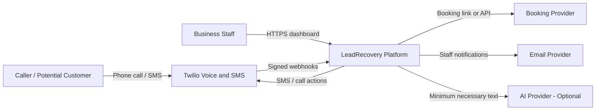
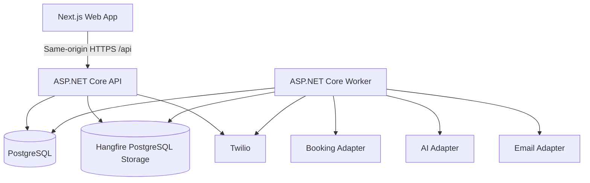
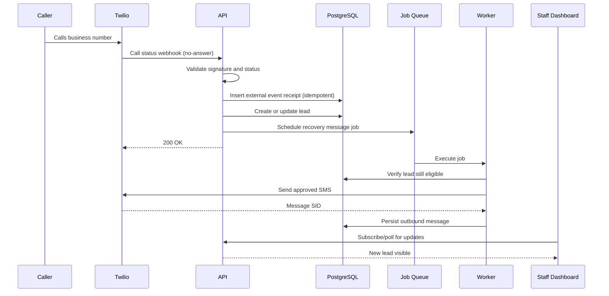
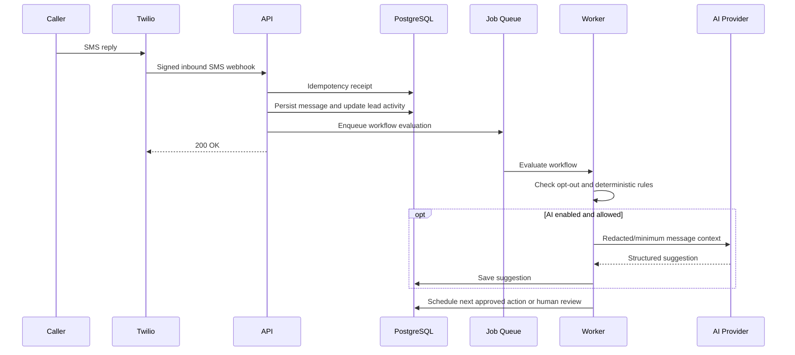
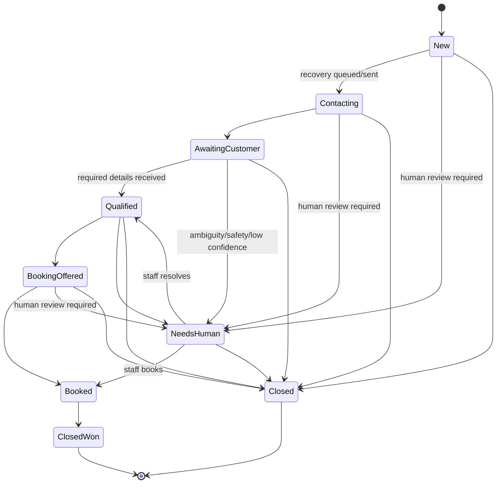

# 02 - System Architecture

## 1. Architecture strategy

The first release is a **modular monolith** with separate deployable processes for the API, background worker, and web frontend. This balances simplicity, testability, and realistic cloud-native deployment.

Do not start with independent microservices. The product does not yet have the traffic, team size, or domain stability to justify distributed-system complexity.

## 2. System context



## 3. Logical component architecture



## 4. Deployable units

### 4.1 LeadRecovery.Api

Responsibilities:

- browser API;
- authentication and authorization;
- Twilio webhook endpoints;
- lead, message, configuration, and reporting endpoints;
- health endpoints;
- enqueue background jobs;
- real-time update hub or server-sent events.

Must not contain long-running work.

### 4.2 LeadRecovery.Worker

Responsibilities:

- execute Hangfire jobs;
- send recovery and follow-up messages;
- call AI analysis adapter;
- send staff notifications;
- process retention jobs;
- retry transient failures;
- emit operational metrics.

### 4.3 LeadRecovery.Web

Responsibilities:

- login;
- lead inbox;
- lead detail/conversation;
- configuration;
- users and roles;
- operational metrics;
- accessible error and loading states.

The Milestone 2 shell is a Next.js App Router application deployed on the same
browser origin as `/api`. Next.js rewrites `/api/*` to the ASP.NET Core host;
the browser never receives an API origin or a bearer token. Server components
forward only the incoming session cookie for authenticated rendering. The
current UI implements login, logout, session display, and a read-only seeded
lead inbox; operational lead actions remain Milestone 6 / LR-0501 through
LR-0505.

ASP.NET Core Identity owns passwords, lockout, security stamps, and the
application cookie. A `TenantMembership` joins one user to one tenant role. The
session contains a server-issued tenant claim, but the API revalidates the
user, security stamp, membership, role, and tenant status on every request.
Until tenant switching is designed, login succeeds only when exactly one
Trial/Active membership is available; multiple active memberships fail closed.

Milestone 3 maps the anonymous Twilio call-status endpoint through an API
adapter into a provider-neutral application event. The adapter validates the
signature against a configured canonical public URL before parsing business
fields. The application then uses a trusted server-derived tenant execution
scope, while Infrastructure commits the receipt, lead, pending scheduled
action, and audit event in one serializable PostgreSQL transaction. No outbound
provider call or background execution occurs in the API request.

### 4.4 PostgreSQL

Primary system of record for:

- tenants and users;
- leads and conversations;
- external event receipts;
- jobs metadata when using Hangfire PostgreSQL storage;
- audit logs;
- configuration;
- AI analysis results.

Use a managed database in production. Do not place production PostgreSQL inside Kubernetes for the initial release.

## 5. Solution/project structure

```text
LeadRecovery.sln
global.json
Directory.Build.props
Directory.Packages.props
dotnet-tools.json
compose.yaml
.github/
  workflows/
    ci.yml
src/
  LeadRecovery.Api/
  LeadRecovery.Worker/
  LeadRecovery.Domain/
    Common/
    Tenancy/
    Leads/
    Conversations/
    Automations/
  LeadRecovery.Application/
  LeadRecovery.Infrastructure/
  LeadRecovery.Contracts/
  LeadRecovery.Web/       # reserved in M0; Next.js is initialized in M2
tests/
  LeadRecovery.Domain.Tests/
  LeadRecovery.Application.Tests/
  LeadRecovery.IntegrationTests/
  LeadRecovery.ArchitectureTests/
  LeadRecovery.E2E/
deploy/
  docker/
  kubernetes/
    base/
    overlays/
      local/
      staging/
      production/
  helm/              # optional after base manifests work
docs/
  decisions/
eng/
```

The business modules remain folders inside the layered projects. They are not
independent deployables or separate databases. Project dependencies are:

- Domain references no other project;
- Application references Domain;
- Contracts does not reference Domain or Infrastructure;
- Infrastructure references Application and Domain;
- API references Application, Infrastructure, and Contracts;
- Worker references Application and Infrastructure;
- Web communicates through HTTP contracts only.

## 6. Layer responsibilities

### Domain

Contains:

- entities;
- value objects;
- enums;
- domain policies;
- state-transition rules;
- domain events that remain in-process initially.

Must not reference Entity Framework, Twilio, OpenAI, HTTP, or UI packages.

### Application

Contains:

- commands and queries;
- use-case services;
- validation;
- interfaces for persistence and external systems;
- authorization policies independent of transport;
- transaction boundaries.

### Infrastructure

Contains:

- EF Core DbContext and mappings;
- repository/query implementations;
- Twilio adapter;
- email adapter;
- booking adapter;
- AI adapter;
- clock and ID implementations;
- Hangfire configuration;
- observability exporters.

### Contracts

Contains stable request/response DTOs and versioned integration schemas. Domain entities must not be returned directly over the API.

### API

Contains controllers/minimal endpoints, authentication wiring, middleware, health endpoints, and webhook translation.

## 7. Key architecture decisions

Accepted, authoritative decisions are recorded under `docs/decisions/`:

- ADR-0001: modular monolith and project dependency boundaries;
- ADR-0002: pinned technology baseline;
- ADR-0003: tenant isolation and database-enforced tenant relationships;
- ADR-0004: transactional scheduled actions and background dispatch;
- ADR-0005: API contract and optimistic concurrency;
- ADR-0006: lead lifecycle, close reasons, and webhook event identity;
- ADR-0007: tenant context and tenant configuration concurrency;
- ADR-0008: customer phone normalization and tenant-scoped identity;
- ADR-0009: conversation and message lifecycle, identity, and limits;
- ADR-0010: scheduled actions, durable cancellation, and external receipts;
- ADR-0011: Identity, tenant memberships, and same-origin browser sessions.

The platform also uses same-origin browser deployment where practical,
deterministic workflow rules with AI limited to assistance, and application
interfaces around Twilio, AI, booking, and email providers.

## 8. Modules

Suggested modules inside the monolith:

- Identity
- Tenancy
- Leads
- Conversations
- Automations
- Integrations
- Notifications
- Reporting
- Audit
- Administration

Each module should expose application-level services rather than allowing arbitrary cross-module DbContext access.

## 9. Missed-call sequence



## 10. Inbound-message sequence



## 11. Lead state machine



State transitions must be validated in the domain layer. Direct arbitrary
status updates are prohibited. Every pre-booking active state may route to
`NeedsHuman` or close unsuccessfully with a documented reason. `Closed` and
`ClosedWon` are terminal in LR-0201; reopening is deferred until an application
use case can require and persist its audit event.

## 12. Transaction and consistency model

- Accept webhook quickly.
- Within one database transaction, record the external event receipt,
  create/update the lead, and persist a `ScheduledAction` when future work is
  required.
- `ScheduledAction` is the durable application intent. Hangfire is notified
  only after commit, and a dispatcher reconciles pending actions so a failed
  enqueue cannot lose work.
- Hangfire jobs carry the scheduled-action ID. The worker reloads the action and
  lead, checks eligibility and idempotency, and only then performs an external
  side effect.
- External sends are at-least-once attempts; idempotency keys prevent duplicate business effects.
- Do not assume exactly-once delivery from Twilio, Kubernetes, or job runners.

LR-0204 implements the durable `ScheduledAction` record and the
`ExternalEventReceipt` system ledger without dispatching work or calling a
provider. Booking uses the same scoped EF context to persist the Lead transition
and cancel only its pending actions in one transaction. Hangfire notification,
reconciliation, leasing, and external execution remain later issues.

## 13. Caching

Do not add distributed caching in MVP. Optimize indexed database queries first. Short-lived in-memory caching may be used only for non-sensitive, non-tenant-confusing reference data.

## 14. Real-time updates

Preferred order:

1. Simple polling every 5-10 seconds for earliest MVP.
2. SignalR when core flow is stable.

Do not let real-time infrastructure delay the demo.

## 15. Scaling approach

Initial scale target:

- up to 50 tenants;
- up to 20 staff users per tenant;
- up to 10,000 leads per tenant per year;
- burst of 20 webhook requests per second;
- background-job concurrency configurable per environment.

Scale API and worker replicas independently. PostgreSQL remains the likely first bottleneck and must use appropriate indexes and connection pooling.
