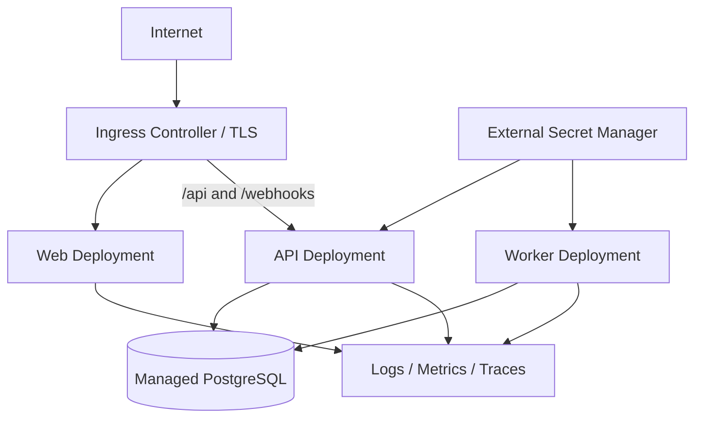

# 09 - DevOps, Docker, Kubernetes, and CI/CD

## 1. Deployment principle

The business workflow must work before Kubernetes is introduced. Development order:

1. Run application directly.
2. Run dependencies with Docker Compose.
3. Containerize API, worker, and frontend.
4. Deploy to a simple staging environment.
5. Add Kubernetes deployment as a production/portfolio capability.

Kubernetes is not a reason to split the modular monolith into microservices.

## 2. Environments

### Local

- API and worker from IDE or containers;
- frontend dev server;
- PostgreSQL in Docker;
- fake external providers by default;
- optional tunnel for verified Twilio testing.

### CI

- ephemeral build/test environment;
- PostgreSQL Testcontainer;
- no live provider calls.

### Staging

- public HTTPS;
- dedicated provider test credentials;
- fictional/test data;
- managed PostgreSQL;
- one or two replicas;
- full observability.

### Production/Pilot

- isolated namespace/project;
- managed PostgreSQL;
- secret manager;
- backups;
- alerting;
- approved real provider credentials;
- rollback process.

## 3. Container images

Images:

- `leadrecovery-api`
- `leadrecovery-worker`
- `leadrecovery-web`

Requirements:

- multi-stage builds;
- non-root runtime user;
- minimal supported base image;
- no SDK in runtime image;
- health endpoint;
- reproducible version label;
- image scan;
- immutable release tag plus commit SHA.

## 4. Docker Compose

Local services:

```yaml
services:
  postgres:
    image: postgres
    environment:
      POSTGRES_DB: leadrecovery
      POSTGRES_USER: leadrecovery
      POSTGRES_PASSWORD: local-only-password
    ports:
      - "5432:5432"
    volumes:
      - pgdata:/var/lib/postgresql/data

  api:
    build:
      context: .
      dockerfile: deploy/docker/api.Dockerfile
    environment:
      ASPNETCORE_ENVIRONMENT: Development
    depends_on:
      postgres:
        condition: service_healthy

  worker:
    build:
      context: .
      dockerfile: deploy/docker/worker.Dockerfile
    depends_on:
      postgres:
        condition: service_healthy

  web:
    build:
      context: .
      dockerfile: deploy/docker/web.Dockerfile

volumes:
  pgdata:
```

The committed file must use environment substitution and must not contain real secrets.

## 5. Kubernetes architecture



## 6. Kubernetes resources

Required base manifests:

- Namespace
- ConfigMap
- Secret references
- API Deployment and Service
- Worker Deployment
- Web Deployment and Service
- Ingress
- ServiceAccounts
- NetworkPolicies where supported
- PodDisruptionBudget for API/web when replicas >1
- HorizontalPodAutoscaler for API after metrics are available
- migration Job

### API probes

- `/health/live` - process is alive; no expensive dependency checks.
- `/health/ready` - database and required startup dependencies are ready.

### Worker health

Expose an internal health endpoint or use process/liveness plus a job-heartbeat metric. Readiness should indicate it can access job storage/database.

## 7. Resource baseline

Initial staging values, to be load-tested:

API:

- request: 100m CPU, 256Mi memory;
- limit: 500m CPU, 512Mi memory;
- replicas: 2 in production, 1 in staging.

Worker:

- request: 100m CPU, 256Mi memory;
- limit: 750m CPU, 768Mi memory;
- replicas: 1 initially, scale by job lag.

Web:

- request: 50m CPU, 128Mi memory;
- limit: 300m CPU, 384Mi memory.

These are starting points, not guarantees.

## 8. Configuration

Non-secret ConfigMap values:

- environment name;
- log level;
- feature flags;
- allowed origins if needed;
- default job concurrency;
- telemetry endpoint names;
- public application URL.
- AI enable/provider/model selection and bounded timeout/retry/output settings.
- login/manual-message/provider-webhook rate-limit capacities;
- retention enabled/mode/batch/UTC cron and explicit backup acknowledgement.

Secrets:

- database connection string;
- cookie/data-protection keys or external key store;
- Twilio credentials;
- AI API key;
- email provider key;
- booking webhook secret.

## 9. Data protection keys

If ASP.NET Core cookie/data-protection keys are used across replicas, persist them in a secure shared store. Do not allow each pod to generate unrelated ephemeral keys.

## 10. Migrations

Use a Kubernetes Job or deployment pipeline step:

1. backup/confirm recovery point;
2. run migration image/command once;
3. verify migration;
4. deploy compatible application version.

Do not run migrations automatically from every API pod.

## 11. CI pipeline

On pull request:

1. restore dependencies;
2. format/lint;
3. compile with warnings as errors;
4. run unit tests;
5. run integration tests;
6. validate OpenAPI;
7. scan secrets/dependencies;
8. build containers without pushing;
9. scan images.

## 12. CD pipeline

On approved merge/tag:

1. create version;
2. build images;
3. push immutable tags;
4. generate SBOM where supported;
5. deploy to staging;
6. run smoke/E2E tests;
7. require manual approval for pilot production;
8. run migration job;
9. deploy with rolling update;
10. verify health and key metrics;
11. retain rollback version.

## 13. GitHub Actions conceptual workflow

```text
pull_request
  -> dotnet format check
  -> dotnet build
  -> dotnet test
  -> frontend lint/test/build
  -> integration tests
  -> container build and scan

release tag
  -> build/push images
  -> deploy staging
  -> smoke tests
  -> approval
  -> migrate production
  -> deploy production
  -> verify and notify
```

## 14. Rollback

Application rollback:

- redeploy previous immutable image tag;
- confirm database migration compatibility.

Feature rollback:

- disable automation or AI through feature flag/config;
- keep manual lead dashboard available.

Integration rollback:

- disable outbound sends;
- revert Twilio webhook routing if necessary;
- notify tenant.

## 15. Kubernetes portfolio demonstration

The portfolio demo should show:

- three deployable workloads;
- ingress path routing;
- health probes;
- two API replicas;
- rolling update;
- pod restart recovery;
- secrets not stored in Git;
- migration job;
- logs and traces;
- HPA configuration or documented scaling test.

Do not claim production scale without load-test evidence.

## 16. Implemented LR-0901/LR-0902 baseline

The committed implementation is under `deploy/docker` and
`deploy/kubernetes`; their READMEs are the operational source of truth.

- API, worker, and standalone Next.js images are multi-stage, digest-pinned,
  non-root, health-checked, and labeled with build version/revision/time.
- Root Compose runs PostgreSQL, a one-shot migration container, API, worker,
  and web in dependency-safe order with fake/disabled provider defaults.
- The API image accepts `--migrate`; regular replicas never apply migrations.
- API and worker expose separate live and database-ready checks.
- Kustomize provides reusable foundation/workload bases, separate migration
  bases, and local/staging/production overlays.
- Workloads use read-only roots, dropped capabilities, no privilege escalation,
  dedicated tokenless ServiceAccounts, probes, resources, and restricted pod
  security. Ingress and NetworkPolicies limit inbound application paths.
- Local/staging use one API replica and portable RWO key storage. Production
  uses two API/web replicas, PDBs, API HPA, and requires an environment-provided
  RWX `shared-rwx` StorageClass for shared cookie keys.
- PostgreSQL and all secrets remain external. The manifests contain only
  ConfigMap values and Secret key references.

On 2026-07-28 the Compose stack and an isolated Kubernetes 1.28 cluster passed
migration, readiness, pod-restart, and rolling-update validation. All environment
and migration overlays also passed server-side schema validation. The image
scan is a documented LR-0901 exception because the installed Docker Scout
client required a separate account login; LR-0903 must complete an authenticated
High/Critical image gate before any production release.
