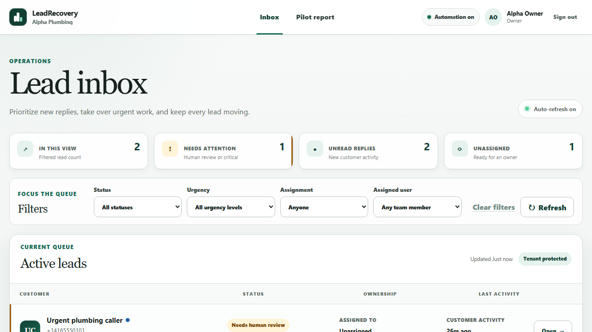
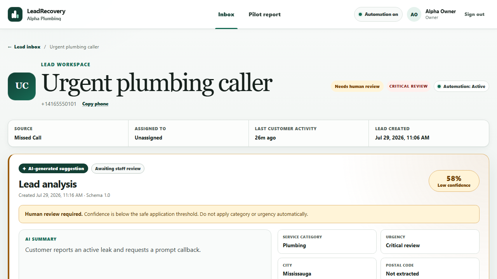
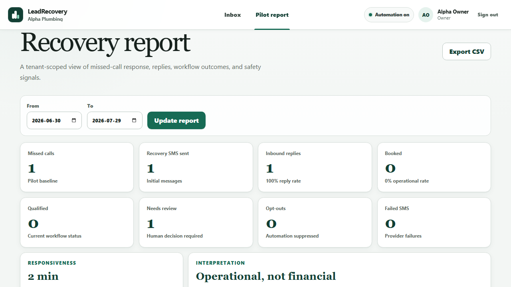

# LeadRecovery fictional pilot case study

LeadRecovery gives a home-service team one place to recover a missed caller, see the conversation, review safety-sensitive assistance, act on the lead, and measure the workflow. This case study uses the fictional **Alpha Plumbing** tenant; every business, person, phone number, message, and outcome in the media is test data.

[Watch the 57-second captioned product tour](assets/leadrecovery-demo.mp4)

## The operational problem

A missed caller may never leave voicemail or call again. The first pilot workflow records an eligible missed-call callback once, sends an approved SMS, stores the reply, and makes the next staff action explicit. Duplicate provider callbacks are idempotent, STOP immediately suppresses automation, and a human remains responsible for safety-sensitive review and booking confirmation.

## What the demonstration proves

- a signed missed-call event can create recovery intent without sending duplicate work;
- an approved initial message and customer reply share the Lead timeline;
- low-confidence analysis is visibly advisory and routed to staff;
- the deterministic workflow continues when AI is unavailable;
- a tenant member can export operational pilot metrics as CSV;
- duplicate callback and opt-out behavior are reproducible automated proofs.

## Safeguards and limitations

The demo uses the fake SMS adapter and seeded records; it does not prove carrier delivery, external booking-provider behavior, market demand, saved staff time, additional revenue, or that LeadRecovery caused a booking. The first production pilot still requires real-number routing tests, approved consent wording, a measurement baseline, staff training, support ownership, and a rollback rehearsal. Platform-admin browser screens are deferred; a trusted operator uses the validated onboarding command documented in [ONBOARDING.md](ONBOARDING.md).

See [DEMO.md](DEMO.md) for the reproducible walkthrough and media capture, and [MEASUREMENT.md](MEASUREMENT.md) for metric definitions and success criteria.
